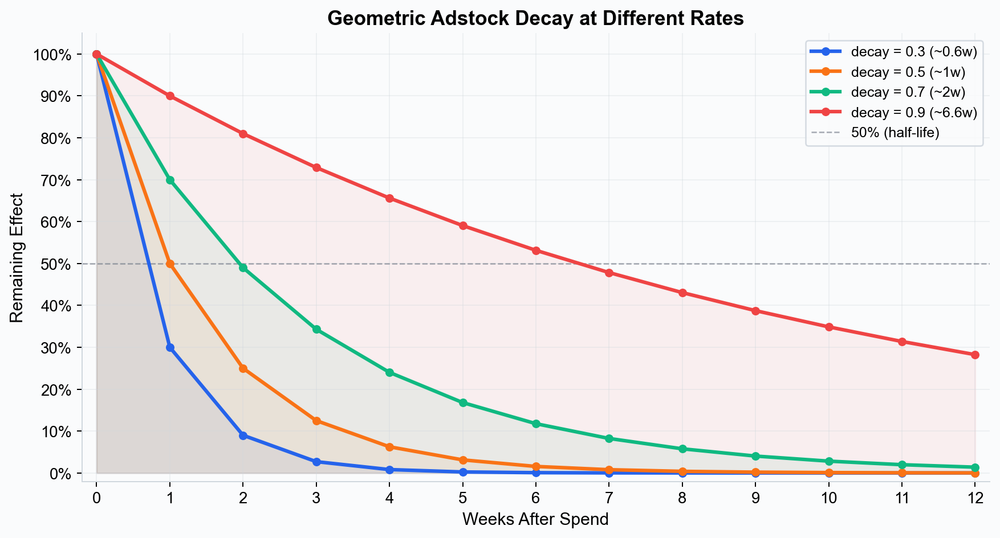
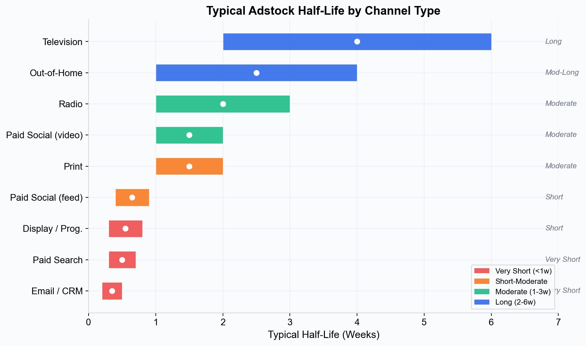
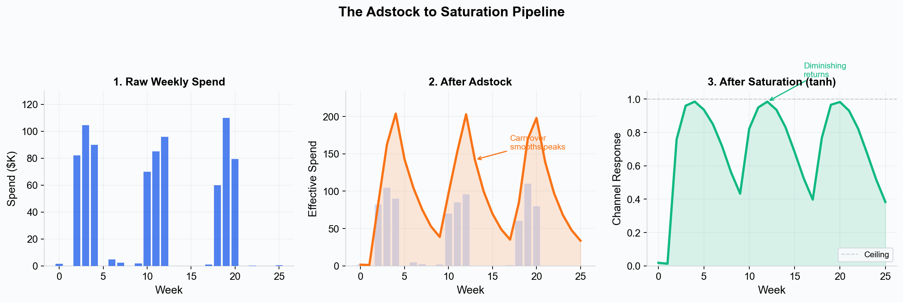
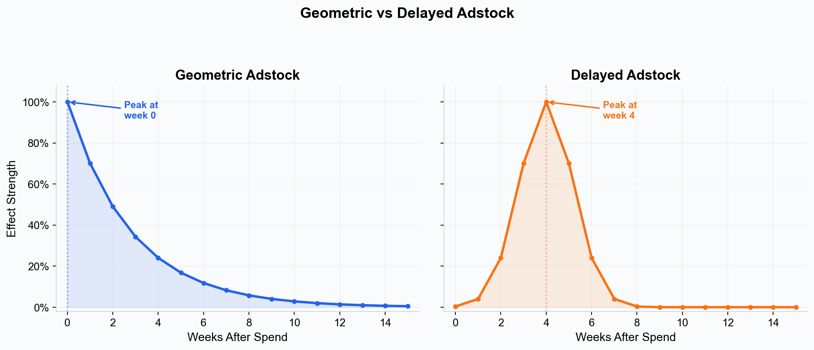

# Adstock Effects --- How Advertising Impact Carries Over Time

A television commercial that airs on Monday does not stop influencing consumers on Tuesday. A billboard seen during a morning commute may drive a purchase days later. This lagged, decaying influence of advertising is called **adstock** (also known as carryover or decay), and modeling it correctly is essential for accurate marketing measurement.

---

## What Is Adstock?

Adstock is the phenomenon where the effect of an advertisement extends beyond the moment of exposure. When a consumer sees an ad, it creates a memory trace that decays over time. That memory can influence purchasing behavior for days, weeks, or even months after the original exposure.

The concept was introduced by Simon Broadbent in 1979 and has become a foundational element of Marketing Mix Modeling. Without adstock, a model would assume that all of a channel's impact occurs in the same period as the spend --- which is clearly wrong for most media types.

### Why Adstock Matters

Ignoring carryover effects leads to two major problems:

1. **Underestimating channel effectiveness.** If TV spend occurs in Week 1 but conversions trickle in over Weeks 1 through 4, a model without adstock will only see the Week 1 conversions and undercount TV's total contribution.
2. **Misattributing effects across channels.** Conversions in Week 2 that were actually caused by Week 1's TV campaign might be incorrectly attributed to whatever digital channels were active in Week 2.

---

## Memory Decay Curves

Adstock is modeled as a **decay function** that transforms raw weekly spend into a time-distributed "effective" spend that spreads across multiple periods. The most common approach is geometric decay:

> adstocked_spend(t) = spend(t) + decay_rate * adstocked_spend(t-1)

Where **decay_rate** (often denoted as lambda) is a value between 0 and 1 that controls how quickly the effect fades:

- **Decay rate close to 0** --- The effect fades almost immediately. Nearly all impact occurs in the same week as the spend.
- **Decay rate close to 1** --- The effect persists for a long time. Spend in Week 1 still has meaningful influence many weeks later.

*How different decay rates affect the persistence of advertising impact. Higher decay rates mean longer-lasting effects.*

### Half-Life

A more intuitive way to think about decay is through the **half-life** --- the number of periods it takes for the carryover effect to drop to 50% of its initial value. For geometric decay:

- A decay rate of 0.5 corresponds to a half-life of about 1 week.
- A decay rate of 0.7 corresponds to a half-life of about 2 weeks.
- A decay rate of 0.85 corresponds to a half-life of about 4 to 5 weeks.
- A decay rate of 0.9 corresponds to a half-life of about 6 to 7 weeks.

Simba displays both the decay rate and the implied half-life so you can interpret the parameter in whichever framing is most intuitive.

---

## How Different Media Have Different Decay Rates

One of the most important insights from adstock modeling is that different media types have fundamentally different carryover profiles. Here are typical patterns:

### Television

TV advertising tends to have **long decay** (high decay rate, multi-week half-life). A brand campaign that airs over several weeks builds cumulative awareness that persists well beyond the flight. Half-lives of 2 to 6 weeks are common for TV, depending on the creative, category, and audience.

### Paid Search

Paid search has **very short decay** (low decay rate, near-zero half-life). Someone searching for your product and clicking an ad is typically in an active purchase mindset. The effect is almost entirely contemporaneous --- if you pause search ads, the traffic impact is immediate.

### Social Media (Paid)

Paid social falls somewhere in between. Video-based social campaigns (e.g., YouTube pre-roll, TikTok) tend to have longer decay than click-based feed ads. Typical half-lives range from a few days to 1 to 2 weeks.

### Out-of-Home (OOH)

OOH advertising (billboards, transit ads, digital signage) often has **moderate to long decay**. Repeated daily exposure builds cumulative awareness, and the effect persists after the placement ends. Half-lives of 1 to 4 weeks are typical.

### Display and Programmatic

Banner and programmatic display ads typically have **short decay**, similar to paid search. The effect is largely driven by immediate clicks and view-through conversions, with limited lasting awareness impact.

### Email and CRM

Email campaigns have **very short decay** --- the effect is concentrated in the hours and days immediately following the send. A half-life measured in days rather than weeks is typical.

### Summary Table

| Channel | Typical Half-Life | Decay Profile |
|---|---|---|
| Television | 2--6 weeks | Long |
| Paid Search | < 1 week | Very short |
| Paid Social (video) | 1--2 weeks | Moderate |
| Paid Social (feed) | < 1 week | Short |
| Out-of-Home | 1--4 weeks | Moderate to long |
| Display / Programmatic | < 1 week | Short |
| Email / CRM | < 1 week | Very short |
| Radio | 1--3 weeks | Moderate |
| Print | 1--2 weeks | Moderate |

These are general guidelines. Your specific results will depend on your brand, creative, audience, and market conditions.

---

## Configuring Decay Parameters in Simba

Simba provides flexible controls for adstock configuration through its no-code UI.

### Smart Defaults

For each channel type, Simba provides smart default priors on the decay rate parameter based on the media type you select. These defaults reflect the typical decay profiles described above and are appropriate for most use cases.

### Manual Prior Adjustment

If you have domain knowledge about a channel's carryover behavior, you can adjust the prior on the decay rate parameter:

- **Narrowing the prior** around a specific value if you are confident about the decay rate (e.g., from a previous model or industry benchmark).
- **Widening the prior** if you are uncertain and want the data to drive the estimate.
- **Shifting the prior** if you believe the channel's decay is longer or shorter than the default suggests.

For example, if you ran a blackout test (pausing a channel for several weeks) and observed that conversions took three weeks to return to baseline, you could set an informative prior centered on a half-life of approximately 3 weeks.

See [Priors and Distributions](./priors-and-distributions.md) for a detailed guide on configuring priors in the UI.

### Visualizing the Decay Curve

Before fitting the model, Simba displays the implied decay curve for each channel based on your prior settings. This shows you how the model expects spend to carry over across weeks, letting you confirm that the configuration matches your intuition.

After fitting, Simba shows the **posterior decay curve** --- the estimated carryover based on your data --- alongside the prior. If the data strongly informs the decay rate, the posterior will be narrower than the prior. If the data is ambiguous, the posterior will stay close to the prior.

---

## Interaction with Saturation

Adstock and [saturation](./saturation-curves.md) are applied sequentially in Simba's model:

1. **Adstock first**: Raw weekly spend is spread across multiple weeks using the decay function.
2. **Saturation second**: The adstocked (time-distributed) spend is passed through the saturation function to model diminishing returns.

*Raw spend is first smoothed by adstock carryover, then passed through the tanh saturation function to model diminishing returns.*

This ordering matters. Heavy spend concentrated in a single week would hit the saturation ceiling hard if saturation were applied first. By distributing the spend across weeks via adstock before applying saturation, the model captures the reality that carryover effectively smooths out spend spikes, which can increase total channel effectiveness.

---

## Real-World Examples

### Example: TV Campaign with Long Carryover

A consumer electronics brand runs a four-week TV campaign during back-to-school season. Simba's model estimates a decay rate of 0.8 (half-life of about 3 weeks). The contribution analysis shows that only 40% of TV's total incremental effect occurred during the four campaign weeks. The remaining 60% accrued over the six weeks following the campaign as the awareness built during the flight continued to drive purchase consideration.

Without adstock modeling, the brand would have attributed those post-campaign conversions to the digital channels that were running concurrently, overestimating digital and underestimating TV.

### Example: Paid Search with Near-Zero Decay

A direct-to-consumer retailer runs always-on paid search campaigns. Simba estimates a decay rate of 0.15 (half-life of less than one week). This confirms that search operates as a demand-capture channel: the effect is almost entirely contemporaneous. When the brand pauses search ads for a test period, conversions drop immediately and recover within days of restarting.

### Example: OOH with Cumulative Build

A quick-service restaurant chain runs a three-month billboard campaign across a metro area. Simba estimates a decay rate of 0.75 (half-life of about 2.5 weeks). The model shows that OOH effectiveness increased over the campaign period as repeated exposure built cumulative awareness, with the peak contribution occurring in the final month even though spend was constant throughout.

---

## Key Takeaways

- Adstock captures the reality that advertising effects persist beyond the moment of exposure, decaying over time.
- Different media types have fundamentally different decay profiles, from near-instant (paid search) to multi-week (TV, OOH).
- Ignoring adstock leads to underestimating long-decay channels and misattributing their effects to short-decay channels.
- Simba provides smart defaults and visual tools for configuring and inspecting decay parameters.
- Adstock and saturation work together: adstock distributes spend over time, saturation models diminishing returns on the distributed spend.

---

## Next Steps

- [Saturation Curves](./saturation-curves.md) --- Understand how diminishing returns interact with carryover.
- [Priors and Distributions](./priors-and-distributions.md) --- Configure priors on decay parameters.
- [Marketing Mix Modeling](./marketing-mix-modeling.md) --- See how adstock fits into the full MMM framework.

---

## Adstock Types in Simba

Simba supports two adstock formulations. The choice of adstock type is made per channel in the Prior Builder during model setup.

### Geometric Adstock (Default)

The most common formulation, described in the sections above. Impact peaks immediately upon exposure and decays geometrically each period.

> adstocked_spend(t) = spend(t) + decay_rate * adstocked_spend(t-1)

- **Peak timing**: Instantaneous --- the strongest effect occurs in the same period as the spend.
- **Decay shape**: Exponential decline. Each period retains a fixed fraction of the previous period effect.
- **Best for**: Channels where impact is strongest at the time of exposure and fades steadily: paid search, paid social (feed), email, display.

### Delayed Adstock

Models a delayed peak effect --- the maximum impact does not occur immediately but builds to a peak over several periods before decaying. The decay weights follow an alpha^((t - theta)^2) pattern, producing a bell-shaped response centered on the theta parameter.

- **Peak timing**: Delayed by one or more periods. The **theta** parameter controls how many periods after spend the peak effect occurs.
- **Decay shape**: Bell-shaped. The effect ramps up, peaks at theta, then decays. The **alpha** parameter controls how quickly the effect fades after the peak.
- **Best for**: Channels where the impact takes time to materialize: brand-building TV campaigns (awareness builds over repeated exposures before driving action), sponsorships, content marketing, and PR where the purchase decision has a natural lag.

*Geometric adstock peaks immediately and decays; delayed adstock builds to a peak before decaying.*

### Choosing the Right Adstock Type

| Adstock Type | Peak Timing | Best Channels | When to Use |
|---|---|---|---|
| Geometric | Immediate | Search, social, email, display | Default choice for most channels |
| Delayed | After delay | Brand TV, sponsorships, PR, content | When impact builds before converting |

For most models, **geometric adstock with smart defaults** is the recommended starting point. Switch to delayed adstock when you have domain knowledge suggesting that the standard geometric decay does not capture the channel behavior --- for example, when a channel impact is known to build over time before converting.

The adstock type is selected per channel in the Prior Builder during model setup. When you switch from geometric to delayed, Simba automatically adjusts the default parameter ranges to include the theta (peak delay) parameter.
