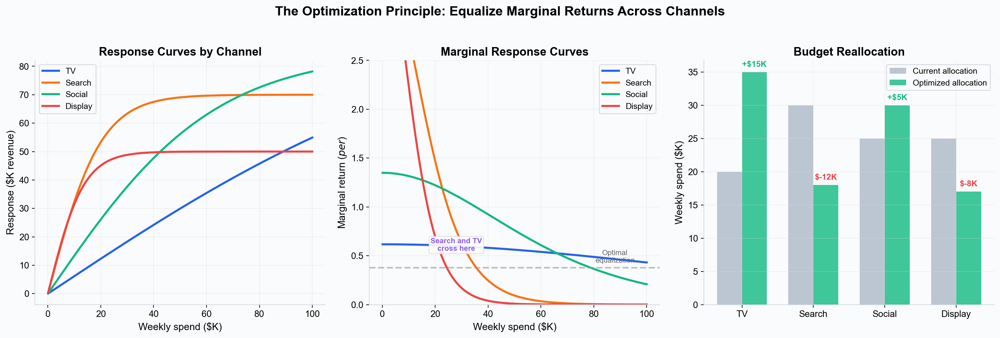
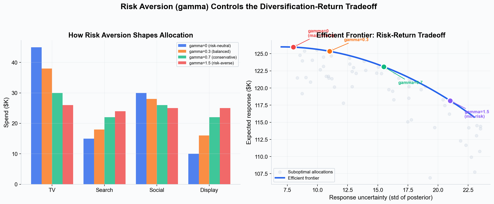
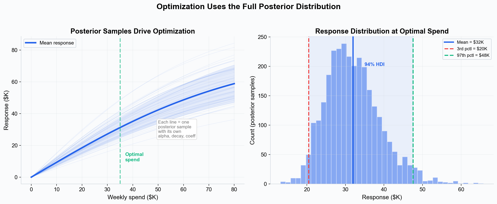

# Budget Optimization --- Maximizing Return from Your Media Mix

Budget optimization answers the question every marketer faces: **"Given a fixed budget, how should I allocate spend across channels to maximize total return?"**

The answer depends entirely on the shape of each channel's response curve. A channel that is under-saturated (operating in the steep part of its curve) will generate more incremental return per dollar than a channel that is already saturated. The optimizer finds the allocation where no dollar can be moved from one channel to another to improve total return.

---

## The Core Principle: Equalize Marginal Returns

The fundamental insight behind budget optimization is simple: **at the optimal allocation, the marginal return per dollar should be equal across all channels.**

If TV's marginal return is $1.50 per dollar and social's is $0.80, you should move budget from social to TV. As you do, TV's marginal return falls (diminishing returns) and social's rises (less saturation). The optimal point is where they meet.

*Left: each channel has a different response curve shape, determined by its [saturation parameters](./saturation-curves.md). Center: the marginal response curves (derivatives of the response curves) show diminishing returns --- the optimizer finds the spend level where all channels intersect the same marginal return line. Right: the resulting reallocation shifts budget from over-saturated channels to under-saturated ones.*

### Why This Requires Saturation Curves

Without [saturation curves](./saturation-curves.md), there is no concept of diminishing returns. A linear model would say "put everything in the highest-ROI channel" --- which is wrong because ROI declines as you increase spend. The tanh saturation function (`tanh(adstocked_spend / (scalar x alpha))`) is what makes optimization possible: it tells the optimizer how much each additional dollar is worth at every spend level.

---

## How the Optimizer Works

Simba's optimizer solves a constrained optimization problem using the full posterior distribution from the fitted Bayesian model.

### The Objective Function

The optimizer maximizes:

> **maximize( mean_response - gamma x std_response )**

Where:

- **mean_response** is the expected total revenue across all channels, averaged over all posterior samples (~3,000 samples by default).
- **std_response** is the standard deviation of the response distribution across posterior samples --- a measure of how uncertain the predicted return is.
- **gamma** is the risk aversion parameter that controls the tradeoff between maximizing return and minimizing uncertainty.

This is a **mean-variance optimization** framework, similar in spirit to Markowitz portfolio theory in finance. The optimizer does not just chase the highest expected return; it also considers how confident the model is in that return.

### Risk Aversion (Gamma)

The gamma parameter lets you choose where you want to sit on the risk-return tradeoff:

*Left: as gamma increases, the allocation becomes more diversified --- spreading budget more evenly across channels. Right: the efficient frontier shows the tradeoff. Each gamma value corresponds to a point on the frontier --- higher gamma trades expected return for lower uncertainty.*

### The Theory Behind Gamma

The mean-variance framework comes from **Modern Portfolio Theory** (Markowitz, 1952), originally developed for financial portfolio allocation. The core insight transfers directly to media budgets: just as a financial investor balances expected return against portfolio volatility, a media planner balances expected revenue against the uncertainty in the model's predictions.

The objective `maximize(mean - gamma x std)` is equivalent to finding the point on the **efficient frontier** where the slope equals `1/gamma`. The efficient frontier is the set of allocations where no reallocation can increase expected return without also increasing uncertainty (or vice versa). Every point below the frontier is suboptimal --- there exists a frontier allocation with the same risk but higher return.

Gamma controls where you land on this frontier:

| Gamma | Behavior | What It Means |
|---|---|---|
| **0** | Risk-neutral | Maximize expected return only. Concentrates budget in the channels with highest estimated ROI, regardless of how uncertain those estimates are. Best when you trust the model and want maximum upside. |
| **0.3** | Balanced | Good default. Moderately penalizes uncertain channels, producing a diversified but not timid allocation. |
| **0.7** | Conservative | Noticeably shifts budget toward channels with tighter posterior intervals. Use when some channels have wide uncertainty (e.g., new channels with limited data). |
| **> 1.0** | Risk-averse | Strong diversification. Approaches equal allocation across channels. Use when model uncertainty is high overall or when you need predictable quarter-over-quarter performance. |

### Why Uncertainty Matters for Budget Decisions

Without gamma, the optimizer would put disproportionate budget into a channel whose coefficient happens to have a high posterior mean --- even if that mean comes with a huge credible interval (e.g., coefficient = 0.3 with 94% HDI of [0.01, 0.8]). That channel might actually be mediocre; the high mean could be driven by a few noisy data points.

With gamma > 0, the optimizer sees the full posterior distribution and naturally avoids over-investing in channels where the model is unsure. This produces allocations that perform well across the range of plausible parameter values, not just at the posterior mean.

---

## Posterior-Aware Optimization

A critical difference between Simba's optimizer and simpler approaches is that it uses the **full posterior distribution**, not just point estimates.

*Left: each thin line is a response curve from one posterior sample --- with its own alpha, decay rate, and coefficient. The optimizer evaluates all ~3,000 samples simultaneously to account for parameter uncertainty. Right: at the optimal spend level, the distribution of possible responses is shown with its 94% HDI.*

For each candidate allocation, the optimizer:

1. Takes the proposed spend per channel.
2. Distributes it across time periods using the laydown weights.
3. Applies [adstock](./adstock-effects.md) convolution (geometric or delayed decay).
4. Applies [tanh saturation](./saturation-curves.md): `tanh(adstocked / (alpha x scalar))`.
5. Multiplies by the channel coefficient and scaling factors.
6. Sums across all channels and periods to get total response.
7. Repeats steps 2--6 for **every posterior sample** to build the response distribution.
8. Computes mean and standard deviation of the response distribution.

The optimizer then searches for the allocation that maximizes `mean - gamma x std`, using SLSQP (Sequential Least Squares Programming) with analytically computed gradients for efficiency.

This means the optimizer respects uncertainty end-to-end: a channel with a high expected coefficient but wide uncertainty will be penalized when gamma > 0, because the optimizer can see that the return is unreliable.

---

## Constraints

The optimizer enforces two types of constraints:

### Budget Constraint

Total spend must exactly equal your specified budget. This is a hard constraint --- the optimizer will not recommend spending less or more than the budget you set.

### Per-Channel Bounds

You can set minimum and maximum spend limits per channel:

- **Minimum spend** --- Channels with contractual commitments or always-on requirements.
- **Maximum spend** --- Channels with inventory limits or where you want to cap exposure.

These bounds are set as percentages of total budget in the optimizer wizard. The optimizer validates that the bounds are feasible (sum of minimums does not exceed budget, sum of maximums is not less than budget) before running.

---

## Multi-Period Optimization

When optimizing across multiple time periods (e.g., a 12-week campaign), the optimizer uses **laydown weights** to distribute each channel's total spend across periods. This accounts for the fact that:

- Spend is not always evenly distributed --- you may front-load a launch or pulse spend in certain weeks.
- [Adstock effects](./adstock-effects.md) mean that the timing of spend matters, not just the total amount.
- Seasonal patterns may make certain periods more or less effective.

You configure the laydown weights in the optimizer wizard, specifying how much of each channel's budget goes to each period.

---

## Portfolio Optimization

For brands that operate across multiple markets or product lines, Simba supports **portfolio-level optimization** --- allocating budget across brands and channels simultaneously.

Portfolio optimization handles a complexity that single-brand optimization cannot: **trademark and shared channels**. A corporate campaign or brand search campaign may affect multiple brands simultaneously. The portfolio optimizer accounts for this by summing the response across all affected brands when evaluating spend on shared channels, ensuring the total cross-brand impact is captured in the allocation decision.

---

## What the Optimizer Outputs

The optimizer produces a results table with per-channel detail:

- **Optimal spend** --- The recommended budget for each channel.
- **Expected response** --- Mean predicted revenue from full Bayesian prediction at the optimal spend level.
- **94% HDI** --- The 3rd to 97th percentile credible interval on the response, reflecting posterior uncertainty.
- **ROI** --- Response divided by spend for each channel.
- **Spend share** --- Each channel's percentage of total budget.
- **Saturation level** --- How saturated each channel is at the optimal spend (0--1 scale).
- **Period-level detail** --- Spend and response broken down by time period.

The response estimates are computed via a full Bayesian prediction at the optimal allocation (not from the optimization objective itself), ensuring they are consistent with the fitted model.

---

## Optimization vs. Scenario Planning

| | Budget Optimizer | Scenario Planner |
|---|---|---|
| **Purpose** | Find the best allocation automatically | Explore "what-if" scenarios manually |
| **Input** | Total budget + constraints | Specific spend per channel |
| **Output** | Optimal allocation with expected return | Predicted outcome for your scenario |
| **Algorithm** | SLSQP constrained optimization | Forward prediction through the model |
| **When to use** | "What's the best way to spend $1M?" | "What happens if I double TV and cut search?" |

Both use the same underlying model and response curves. The optimizer finds the mathematical optimum; the scenario planner lets you explore the space around it.

---

## Key Takeaways

- Budget optimization finds the allocation where **marginal returns are equalized** across all channels --- no dollar can be moved to improve total return.
- The optimizer maximizes **mean response minus gamma x standard deviation**, balancing expected return against uncertainty.
- It uses the **full posterior distribution** (~3,000 samples), not point estimates, ensuring uncertainty is respected in every allocation decision.
- **Saturation curves** are what make optimization possible --- without diminishing returns, the optimizer would trivially put everything in one channel.
- **Risk aversion (gamma)** controls diversification: higher gamma spreads budget more evenly across channels with reliable estimates.
- Constraints support fixed total budgets and per-channel min/max bounds.
- Portfolio optimization handles multi-brand allocation with shared trademark channels.

---

## Next Steps

- [Saturation Curves](./saturation-curves.md) --- The response curves that drive optimization.
- [Incrementality](./incrementality.md) --- What the optimizer is maximizing.
- [Adstock Effects](./adstock-effects.md) --- How timing affects optimal allocation.
- [Priors and Distributions](./priors-and-distributions.md) --- How model uncertainty shapes optimization results.
