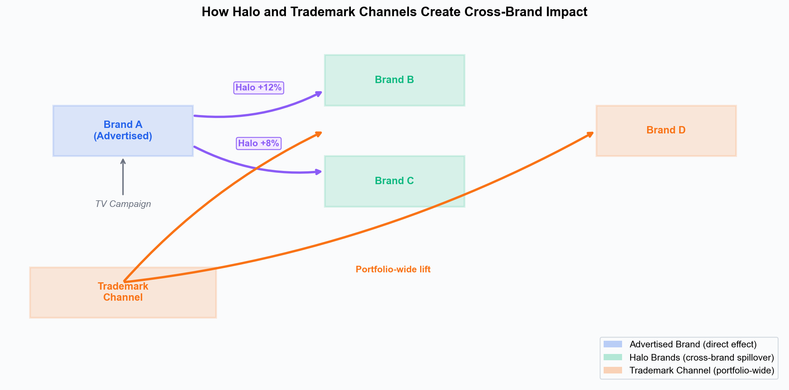
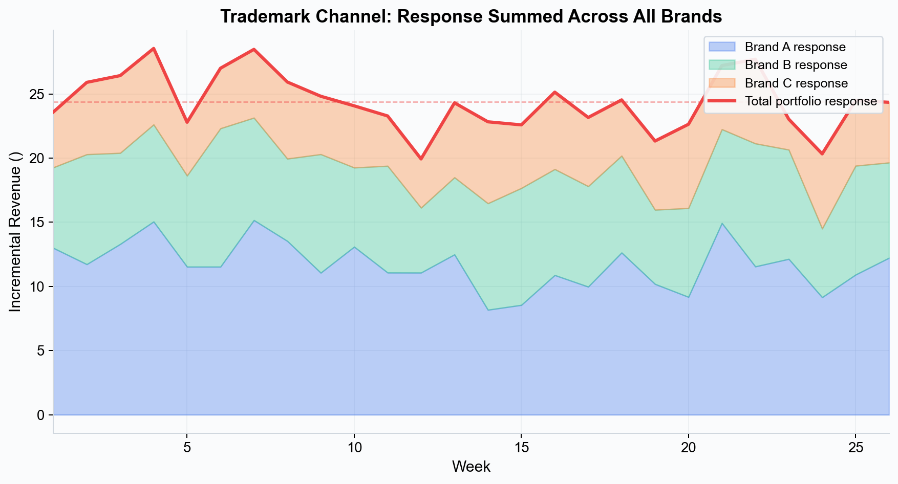
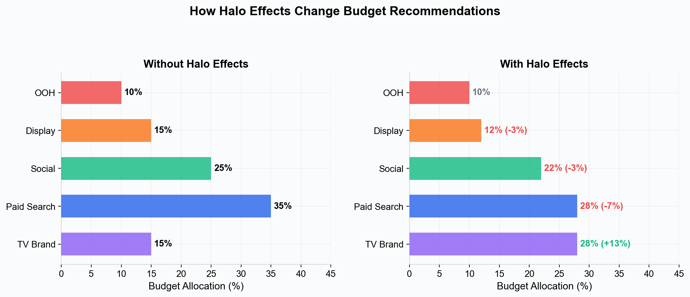

# Halo Effects --- Cross-Brand Marketing Impact

In a multi-brand portfolio, advertising for one brand can lift sales of related brands. This cross-brand spillover is called a **halo effect**, and modeling it correctly is essential for accurate portfolio-level budget optimization.

---

## What Are Halo Effects?

A halo effect occurs when marketing activity for one brand or product generates incremental lift for other brands or products in the same portfolio. The "halo" extends beyond the advertised brand, benefiting siblings, sub-brands, or the parent brand.

### Common Examples

- **Masterbrand campaigns**: A corporate TV campaign for the parent brand (e.g., "Unilever") lifts sales across all sub-brands.
- **Flagship products**: Advertising a flagship product (e.g., iPhone) increases awareness and sales of the entire product line (iPad, Mac, Apple Watch).
- **Category association**: Advertising one cereal brand in a portfolio lifts the entire cereal category shelf presence and drives incremental sales of sister brands.
- **Retail foot traffic**: A promoted brand drives store visits, and shoppers buy other brands from the same company while in-store.

---

## Why Halo Effects Matter for MMM

Without modeling halo effects, cross-brand impact is invisible to the measurement system:

- **Undervalued channels**: A TV campaign that lifts three brands gets credit only for the one brand it directly advertised. Its true portfolio ROI is underestimated, potentially leading to budget cuts on a highly effective channel.
- **Misattributed growth**: The sales lift in non-advertised brands is attributed to whatever other marketing those brands were running at the time, inflating their apparent effectiveness.
- **Suboptimal allocation**: Portfolio-level budget decisions made without halo effects will under-invest in cross-brand channels and over-invest in brand-specific ones.

*Halo channels create spillover from an advertised brand to related brands. Trademark channels generate portfolio-wide lift across all brands simultaneously.*

---

## How Simba Models Halo Effects

Simba captures cross-brand impact through two distinct channel types, each handled differently in both the model and the optimizer.

### Halo Channels

A **halo channel** is a media channel whose spend for one brand generates incremental lift for other brands in the portfolio. In Simba's implementation:

- **Excluded from auto-prior calculation**: When smart priors are calculated, halo channels are excluded from the cost-share-based coefficient estimation. Instead, they receive a fixed small coefficient (mean = 0.005) with higher uncertainty (sigma = 0.1) to let the data determine their actual impact.
- **Excluded from optimization**: In the portfolio optimizer, halo channels are held at fixed spend levels rather than being optimized. This is because their cross-brand effect is already captured in other brands' models --- optimizing them directly would risk double-counting.
- **Tagged in the Prior Builder**: Halo channels appear with a purple sparkle icon in the Prior Builder grid, making them visually distinct from standard media channels.
- **Separate grouping in results**: On the Active Model page, halo channels are grouped separately in the Contribution Chart and Channel Color Customizer under a "Halo Channels" section.

### Trademark Channels

A **trademark channel** represents masterbrand, portfolio-level, or corporate advertising that benefits multiple brands simultaneously. Unlike halo channels (which are brand-specific spillover), trademark channels are portfolio-wide investments.

In Simba's implementation:

- **Reduced priors**: Smart priors for trademark channels are set to 25% (one-quarter) of the standard calculated coefficient and sigma. This reflects the expectation that any single brand captures only a fraction of the total trademark impact.
- **Shared optimization**: In the portfolio optimizer, trademark channels are deduplicated into "virtual" channels (e.g., `trademark_tv_brand`). The optimizer allocates one shared budget that benefits all brands in the portfolio.
- **Response aggregation**: The optimizer calculates the response curve for each brand independently, then **sums the responses across all brands** to determine the total portfolio impact of the trademark spend. This is the key mechanism --- one investment, multiple returns.
- **Tagged in the Prior Builder**: Trademark channels appear with an orange award icon in the Prior Builder grid.
- **Separate grouping in results**: On the Active Model page, trademark channels are grouped under "Trademark / Portfolio Channels" in the Contribution Chart.

*A trademark channel generates incremental response in every brand in the portfolio. The optimizer sums these responses to calculate the true portfolio-wide return on investment.*

---

## Halo vs Trademark: Key Differences

| Aspect | Halo Channels | Trademark Channels |
|---|---|---|
| **Direction** | One brand's spend spills over to specific other brands | One spend benefits all brands equally |
| **Smart prior coefficient** | Fixed small (0.005) | 25% of standard calculated coefficient |
| **Optimization** | Excluded (fixed spend) | Included as shared virtual channel |
| **Response calculation** | Not optimized --- effect captured in other brands | Summed across all brands in portfolio |
| **UI indicator** | Purple sparkle | Orange award |
| **Typical channels** | Brand-specific TV that spills over, flagship product ads | Corporate campaigns, masterbrand TV, portfolio sponsorships |

---

## Configuration in Simba

Halo and trademark channels are configured during model setup in the **Model Details** step:

1. **Select your media channels** in the Variable Selection step as usual.
2. **In Model Details**, designate which channels are halo channels and which are trademark channels. These selections are stored in the model configuration as `halo_channels` and `trademark_channels` arrays.
3. **Smart priors auto-adjust**: When you run smart priors in the Prior Builder, halo and trademark channels automatically receive their special prior treatments (fixed small coefficient for halos, 25% reduction for trademarks).
4. **Build the model**: The `halo_channels` and `trademark_channels` lists are passed to the core Bayesian model, which excludes halos from the auto-prior coefficient calculation while still fitting their response curves.

You can adjust the auto-generated priors manually if you have stronger domain knowledge about a channel's cross-brand impact.

---

## Impact on Portfolio Optimization

When the portfolio optimizer accounts for halo and trademark effects, budget recommendations change meaningfully:

*Recognizing halo effects shifts budget toward channels with cross-brand impact (like brand TV) and away from channels whose contribution is limited to a single brand.*

### How the Optimizer Handles Each Type

**Halo channels** are held at fixed spend. The optimizer uses `halo_fixed_spend` to lock their budget, then subtracts this from the total available budget before optimizing the remaining channels. This prevents double-counting while still accounting for their contribution in the overall portfolio response.

**Trademark channels** are optimized as shared investments:
1. The optimizer creates virtual channel names (e.g., `trademark_tv_brand`) that represent the deduplicated spend.
2. For each virtual trademark channel, it stores per-brand response data (posterior samples, scalars, effective coefficients).
3. The objective function sums the response across all brands for each trademark channel, meaning a dollar of trademark spend is evaluated against its **total portfolio return**, not just one brand's return.
4. The result is allocated back to each brand proportionally.

### What This Means in Practice

- **Halo channels** may appear to have low single-brand ROI, but their true value is captured through the spillover effects modeled in other brands. Cutting halo spend reduces revenue across multiple brands.
- **Trademark channels** receive higher recommended spend than a single-brand analysis would suggest, because the optimizer credits them for their full cross-portfolio impact.
- **Budget diversification** increases naturally, as cross-brand channels create value that brand-specific channels cannot replicate.

---

## Interpreting Results with Halo and Trademark Channels

On the **Active Model** page, the Contribution Chart separates channels into three groups:

1. **Standard Media Channels**: Regular brand-specific channels with direct attribution.
2. **Halo Channels**: Shown separately with aggregated "Halos" sum in the stacked contribution chart.
3. **Trademark / Portfolio Channels**: Shown separately with aggregated "Trademarks" sum.

This grouping is visible in:
- The **Contribution Chart** (stacked area / waterfall views)
- The **Channel Color Customizer** (separate sections for each type)
- The **Channel Performance Summary** (flagged with `is_halo` and `is_trademark` indicators)
- The **Revenue Curves**, **Decay Curves**, and **Marginal Revenue Curves** panels

When reviewing results, keep in mind:
- A halo channel's coefficient in one brand's model represents only the **spillover** effect on that brand, not the total cross-brand impact.
- A trademark channel's coefficient in one brand's model represents approximately **25% of the standard coefficient** because each brand captures only a fraction of the portfolio-wide effect.
- The **portfolio optimizer** is where the full cross-brand value is realized --- it aggregates all brand-level effects to calculate total portfolio ROI.

---

## Tier Availability

Portfolio features, including halo and trademark channel modeling, are available on **Pro tier and above**:

| Tier | Portfolio / Halo Support |
|---|---|
| Trial | No |
| Analyst | No |
| Pro | 1 portfolio |
| Scale | 2 portfolios |
| Enterprise | Unlimited |

---

## Key Takeaways

- **Halo channels** create cross-brand spillover. Simba excludes them from auto-prior calculation (fixed small coefficient) and from optimization (fixed spend) to prevent double-counting.
- **Trademark channels** are portfolio-wide investments. Simba reduces their per-brand priors to 25% and optimizes them as shared virtual channels with response summed across all brands.
- Without halo/trademark modeling, cross-brand channels are systematically undervalued, leading to suboptimal portfolio allocation.
- Configuration happens in the **Model Details** step, with visual indicators in the Prior Builder.
- The full portfolio impact is realized in the **Portfolio Optimizer**, which aggregates brand-level effects for trademark channels and holds halo channels at fixed spend.

---

## Next Steps

- [Halo and Trademark Channels](../platform-guide/halo-trademark-channels.md) --- Step-by-step configuration guide
- [Portfolio Analysis](../platform-guide/portfolio-analysis.md) --- Cross-brand comparison and optimization
- [Budget Optimization](../platform-guide/budget-optimization.md) --- How the optimizer uses halo effects
- [Smart Defaults](../platform-guide/smart-defaults.md) --- How priors are auto-generated for special channel types
