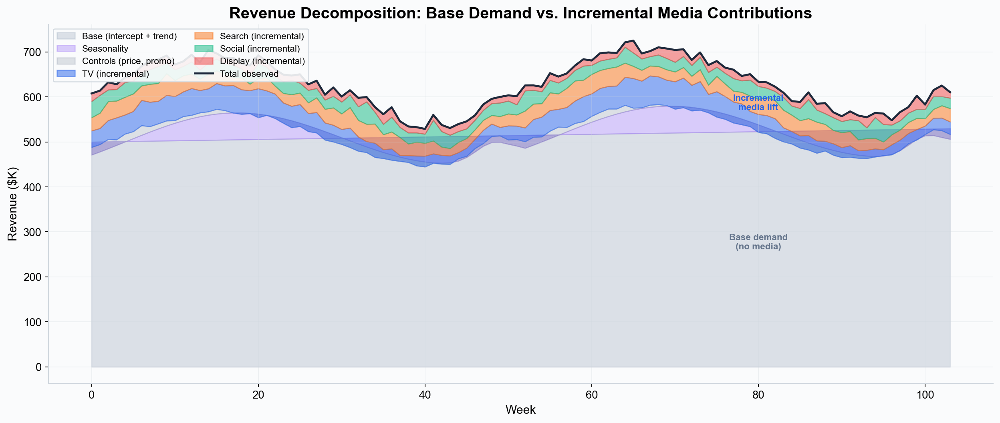
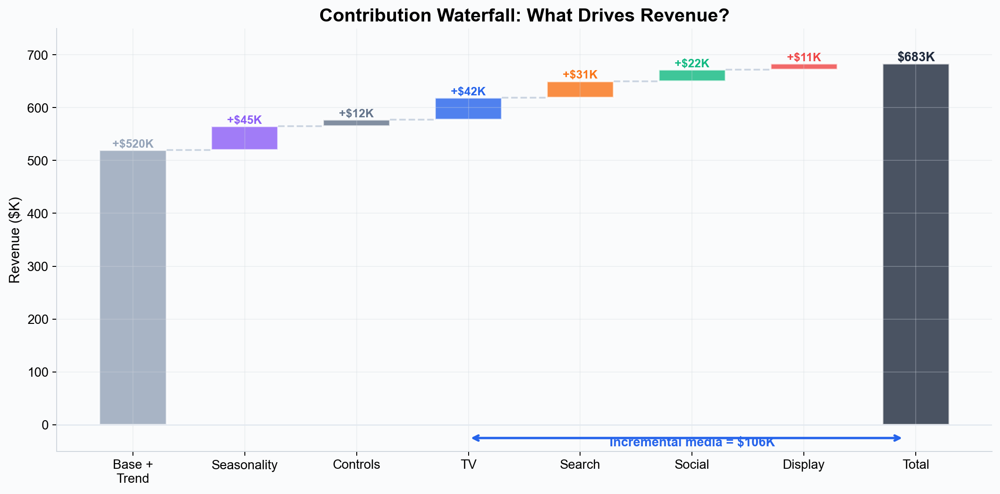
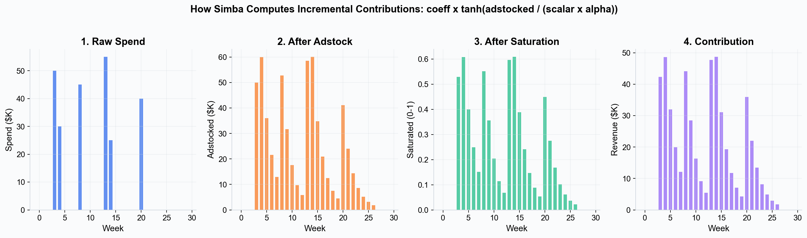
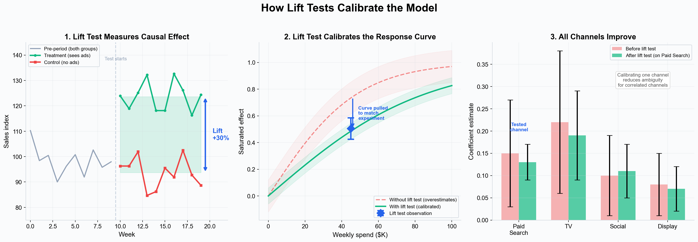

# Incrementality --- Measuring the True Causal Impact of Marketing

> **In brief:** Incrementality measures what revenue would NOT have happened without your marketing — the true causal lift above baseline demand. In Simba, the model separates organic demand from media-driven revenue, and lift tests sharpen those estimates.

Not every sale that follows an ad was caused by that ad. Incrementality measurement answers the most important question in marketing analytics: **"How many conversions would I have lost if I had not spent on this channel?"**

Simba's Bayesian MMM isolates incremental impact by decomposing your outcome variable into its constituent parts --- base demand, seasonal patterns, control variable effects, and the incremental contribution of each media channel.

---

## What Is Incrementality?

Incrementality is the difference between what happened and what **would have happened** in the absence of a marketing activity. It is the causal effect of your spend.

Consider this scenario: your company generated $683K in revenue last week while spending across four media channels. How much of that revenue was caused by the media, and how much would have occurred anyway --- from brand equity, repeat purchasing, seasonal demand, or pricing?

The revenue that would have happened regardless is your **base demand**. The revenue above that baseline, caused by your marketing activities, is the **incremental lift**. Incrementality measurement is the process of estimating this lift for each channel.

---

## The Decomposition

Simba decomposes every observation into additive components, each estimated simultaneously in a single Bayesian model:

*Stacked area showing how total observed revenue breaks down into base demand (intercept + trend), seasonality, control variable effects, and incremental media contributions from each channel. The media layers at the top represent the causal lift from marketing.*

The components are:

- **Base demand (intercept + trend)** --- The level of outcome you would expect with zero media spend. This captures brand equity, repeat purchase behavior, distribution, and other non-media factors. When the dynamic baseline (trend) is enabled, base = intercept + trend. When disabled, base = intercept alone.
- **Seasonality** --- Predictable time-based patterns modeled via [Fourier features](./seasonality.md). Separated explicitly so that holiday spikes are not mistakenly attributed to media channels that ramp up at the same time.
- **Control variables** --- External factors included in the model (pricing, promotions, distribution changes). These can have positive or negative effects.
- **Incremental media contributions** --- The causal lift from each marketing channel, after accounting for [saturation](./saturation-curves.md) and [adstock](./adstock-effects.md) effects. These are the incremental effects.

*Waterfall chart showing how each component adds up to total revenue. The bracket at the bottom highlights the total incremental media contribution across all channels.*

---

## How Contributions Are Calculated

Each media channel's incremental contribution is computed directly from the fitted model parameters:

> **contribution(t) = coefficient x tanh( adstocked_spend(t) / (scalar x alpha) )**

This is the channel's [saturation-transformed](./saturation-curves.md), [adstock-adjusted](./adstock-effects.md) spend multiplied by the estimated coefficient. The contribution is computed at every time period, giving a full time series of incremental lift.

*The four-step pipeline: raw spend is smoothed by adstock (carryover), compressed by tanh saturation (diminishing returns), then scaled by the posterior coefficient to produce the channel's incremental revenue contribution per period.*

Key details:

- **Adstock** spreads each period's spend across subsequent periods (geometric or delayed decay), reflecting the fact that advertising effects persist beyond the week of exposure.
- **Saturation** (tanh) compresses spend into the 0--1 range, capturing diminishing returns --- the first dollar is more effective than the hundred-thousandth.
- **Coefficient** scales the saturated effect into revenue units. It is estimated from the posterior distribution, reflecting both the data and any prior information.
- **Contributions are posterior means** --- averaged across all posterior samples from the MCMC chains. Coefficient-level uncertainty is captured via the 94% HDI (3rd to 97th percentile) on the coefficient summaries.

---

## Causal Attribution vs. Correlational Attribution

A key strength of MMM-based incrementality is that it attributes outcomes **causally** rather than by association:

- **Correlational attribution** (e.g., last-click): "The user clicked a paid search ad before converting, so paid search gets credit." This ignores the possibility that the user would have converted anyway --- perhaps driven by a TV ad they saw earlier that week.
- **Causal attribution** (MMM): "Controlling for all other channels, seasonality, and baseline demand, the observed variation in paid search spend is associated with X additional conversions." This isolates the effect of the channel from confounding factors.

Simba achieves causal attribution by modeling all channels simultaneously. When the model estimates the effect of TV spend, it holds paid search, social, display, and every other channel constant. This controls for the fact that channels often scale up and down together (e.g., during a product launch) and prevents double-counting.

### Handling Correlated Channels

In practice, many channels are correlated --- brands often increase TV and digital spend during the same campaign flights. This multicollinearity makes it difficult for any model to perfectly separate channel effects. Bayesian MMM handles this better than frequentist alternatives:

1. **Priors regularize the solution.** [Smart priors](./priors-and-distributions.md) based on industry benchmarks and channel characteristics keep coefficient estimates within plausible ranges, even when channels are correlated.
2. **Lift test calibration constrains the model.** If a lift test shows paid search ROAS is between 2x and 4x, this [likelihood observation](./priors-and-distributions.md) constrains the model so it will not attribute all of the correlated effect to TV.
3. **Uncertainty reflects ambiguity.** When two channels are highly correlated, the posterior distributions will be wider, honestly reflecting the difficulty of separating their effects. This prevents overconfident attribution.

---

## Lift Test Integration

Lift tests (also called incrementality tests, geo tests, or holdout experiments) are randomized experiments that measure the causal effect of a single channel by comparing a treatment group (exposed to ads) with a control group (not exposed).

While lift tests are the gold standard for single-channel causal measurement, they have practical limitations --- you can only test one or two channels at a time, and running them continuously is impractical.

Simba bridges this gap by letting you **calibrate the model with lift test results**. When you add a lift test result in the Model Details step, it enters the model as an additional likelihood term (not a prior). The model then combines this experimental evidence with the observational time-series data, producing posterior estimates that are consistent with both.

*Left: a lift test produces a measured lift (e.g., +15% with a confidence interval). Center: this enters the Bayesian model as a likelihood observation alongside the time-series data, constraining the response curve for that channel. Right: the resulting posterior is calibrated to be consistent with both the experiment and the observational data --- improving estimates for all channels.*

This creates a virtuous cycle:

1. Run a lift test on a high-priority channel.
2. Add the result as a calibration observation in the Model Details step.
3. The model uses this likelihood constraint to improve estimates for all channels (because a better-calibrated response curve for one channel reduces ambiguity for correlated channels).
4. Use model output to prioritize the next lift test.

---

## Practical Considerations

### Media Contributions Are Non-Negative

In Simba's model, media channel coefficients use priors that enforce non-negative values (InverseGamma or positive-bounded distributions). This means media contributions are always zero or positive --- the model will not estimate that spending on a channel actively hurts revenue.

This is a deliberate modeling choice: if a channel truly has zero incremental value, its coefficient will be estimated near zero (with the contribution shrinking accordingly). If you believe a channel may have a genuinely negative effect, this would need to be investigated outside the standard MMM framework.

Control variables (pricing, promotions, competitor activity) can have negative coefficients and contributions, reflecting that a price increase may reduce sales or a competitor's campaign may draw away customers.

### Incrementality Changes Over Time

A channel's incremental contribution is not static. As spend levels change, competitors adjust, and audiences evolve, incrementality shifts. The contribution formula makes this clear: at higher spend levels, saturation compresses the effect, reducing the incremental value of each additional dollar. Regular model refreshes keep estimates current.

### What "Incremental" Does Not Mean

Incrementality is not the same as last-touch attribution, first-touch attribution, or any rule-based model. It is a **counterfactual** concept: what would have happened if you had not spent? This is a fundamentally different question than "which touchpoint did the user interact with last?"

---

## Key Takeaways

- Incrementality measures the causal impact of marketing --- the revenue that would not have occurred without media spend.
- Simba decomposes outcomes into base demand (intercept + trend), seasonality, control variables, and incremental media contributions.
- Each channel's contribution is computed as `coefficient x tanh(adstocked_spend / (scalar x alpha))` --- the full adstock + saturation + coefficient pipeline.
- Media contributions are always non-negative (positive-bounded priors). Control variables can have negative effects.
- Lift test results enter the model as likelihood observations, calibrating the response curves and reducing ambiguity between correlated channels.
- Coefficient estimates include 94% HDI uncertainty bands. Contributions are reported as posterior means.

---

> **See this in action:** [Start your free 28-day trial](https://getsimba.ai) — no credit card required.

---

## Next Steps

- [Saturation Curves](./saturation-curves.md) --- Learn how diminishing returns affect incrementality.
- [Adstock Effects](./adstock-effects.md) --- Understand how carryover impacts the timing of incremental lift.
- [Priors and Distributions](./priors-and-distributions.md) --- How priors and lift tests shape contribution estimates.
- [Bayesian Modeling](./bayesian-modeling.md) --- The statistical foundation.
