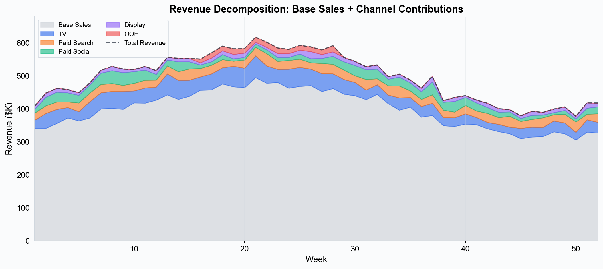
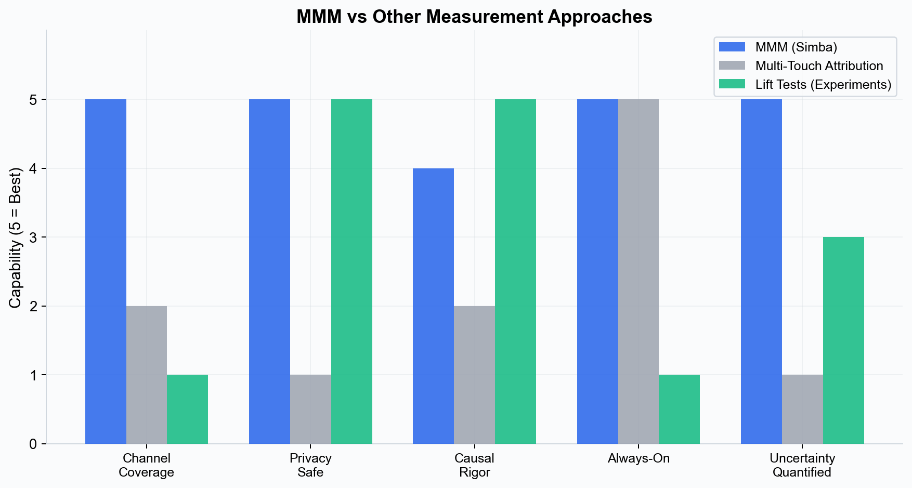
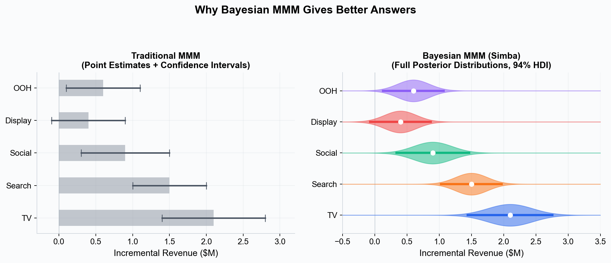
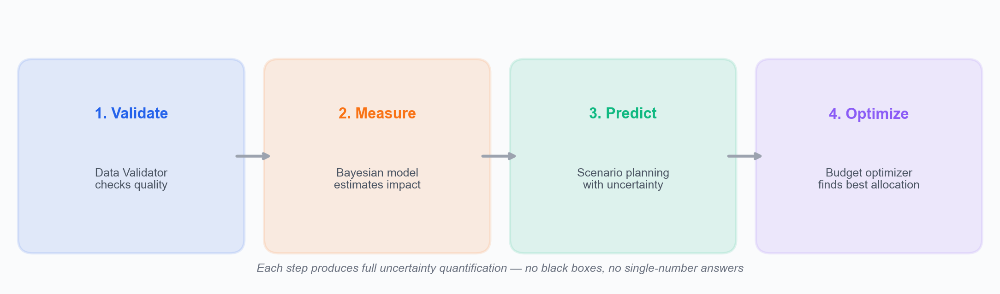

# Marketing Mix Modeling (MMM) --- What It Is and Why It Matters

Marketing Mix Modeling is a statistical technique that quantifies the impact of marketing activities on business outcomes such as revenue, conversions, or customer acquisition. By analyzing historical data across all channels simultaneously, MMM answers the question every marketing leader asks: **"Where should I spend my next dollar?"**

---

## What Is Marketing Mix Modeling?

At its core, MMM is a regression-based framework that decomposes an outcome variable (typically sales or revenue) into the contributions of individual marketing channels, baseline demand, and external factors. The model ingests time-series data --- weekly or daily observations of spend, impressions, or GRPs alongside the outcome --- and estimates the effect of each input while controlling for everything else.

The output is a set of **channel-level contribution estimates**: how much of your total outcome can be attributed to TV, paid search, social media, out-of-home, email, or any other channel in your mix.

*MMM decomposes total revenue into base sales (organic demand) and the incremental contribution of each marketing channel.*

### A Brief History

MMM originated in the consumer packaged goods (CPG) industry in the 1960s and 1970s. Brands like Procter & Gamble and Unilever used econometric models to measure the effectiveness of television and print advertising. For decades, these models were the province of large enterprises with dedicated analytics teams and expensive consulting engagements.

Two forces have driven MMM's modern renaissance:

1. **Privacy regulation and signal loss.** The deprecation of third-party cookies, Apple's App Tracking Transparency, and regulations like GDPR and CCPA have eroded the accuracy of digital attribution. Multi-touch attribution (MTA) systems that depend on user-level tracking are losing the data they need to function.

2. **Open-source tooling.** Libraries like PyMC-Marketing have democratized Bayesian MMM, making it possible for teams of any size to build rigorous models without seven-figure consulting budgets. Simba builds on this foundation to deliver a no-code experience.

---

## How MMM Differs from Other Measurement Approaches

### MMM vs. Multi-Touch Attribution (MTA)

| Dimension | MMM | MTA |
|---|---|---|
| **Data requirement** | Aggregate time-series (spend, impressions, sales) | User-level event logs (clicks, views, conversions) |
| **Privacy dependence** | None --- uses only aggregate data | High --- requires cross-site tracking |
| **Channel coverage** | All channels including offline (TV, OOH, radio) | Digital channels only |
| **Time horizon** | Weeks to years | Real-time to days |
| **Causal rigor** | Controls for confounders statistically | Relies on last-click or heuristic rules |

MTA tells you which touchpoints a converting user encountered. MMM tells you how much each channel **caused** conversions to increase. These are fundamentally different questions, and for budget allocation the causal question is the one that matters.

### MMM vs. Experiments (Lift Tests, Geo Tests)

Randomized experiments are the gold standard for causal inference on a single channel. If you can run a geo-based holdout test for paid search, the result is a clean estimate of incremental lift.

The limitation is scale: you cannot run simultaneous experiments on every channel every quarter. MMM fills the gap by providing **always-on, cross-channel measurement**. Simba also lets you integrate lift test results as calibration data, combining the rigor of experiments with the breadth of modeling. See [Incrementality](./incrementality.md) for details.

---

## What Business Questions Does MMM Answer?

- **Channel effectiveness.** Which channels drive the most incremental outcome per dollar spent?
- **Budget allocation.** How should I redistribute my budget across channels to maximize ROI?
- **Diminishing returns.** At what point does additional spend on a channel stop generating meaningful returns? (See [Saturation Curves](./saturation-curves.md).)
- **Carryover effects.** How long does a TV campaign continue to generate conversions after it stops airing? (See [Adstock Effects](./adstock-effects.md).)
- **Baseline decomposition.** How much of my revenue is organic demand versus media-driven?
- **Scenario planning.** If I increase social spend by 20% and cut display by 10%, what happens to total revenue next quarter?

---

## Why Bayesian MMM Is Superior to Traditional Regression-Based MMM

Traditional MMM uses ordinary least squares (OLS) or similar frequentist regression techniques. These approaches produce point estimates --- single "best guess" numbers --- with no natural way to express uncertainty or incorporate prior knowledge.

Bayesian MMM, the approach Simba uses, improves on traditional MMM in several critical ways:

### 1. Full Uncertainty Quantification

Every parameter estimate comes with a **credible interval** --- a range of plausible values given the data. Instead of "TV drives $2.1M in incremental revenue," you get "TV drives between $1.6M and $2.7M with 94% probability." This lets you make risk-aware decisions. Learn more in [Bayesian Modeling](./bayesian-modeling.md).

### 2. Prior Knowledge Integration

Have industry benchmarks or expert intuition about a channel likely effectiveness? Bayesian MMM lets you encode this knowledge as **priors** that the model combines with observed data. Lift test results are integrated separately as likelihood observations that calibrate the model. This is especially valuable when data is sparse --- for example, a channel that was only active for a few weeks. See [Priors and Distributions](./priors-and-distributions.md).

### 3. Regularization Without Arbitrary Penalties

Frequentist models often require ad-hoc regularization (L1, L2 penalties) to prevent overfitting. In Bayesian MMM, priors serve as principled regularization, shrinking implausible estimates toward sensible defaults while letting the data speak when evidence is strong.

### 4. Better Small-Sample Performance

Marketing datasets are often short --- one to three years of weekly data means 52 to 156 observations. Bayesian methods handle small samples more gracefully than frequentist regression because priors stabilize estimation when data is limited.

### 5. Coherent Probabilistic Predictions

*Traditional MMM gives point estimates with error bars. Bayesian MMM (Simba) provides full posterior distributions showing the complete range of plausible values for each channel, with 94% HDI intervals.*

Bayesian MMM produces full predictive distributions, not just point forecasts. When Simba's optimizer recommends a budget allocation, it can quantify the probability that the recommendation will outperform the status quo.

---

## How Simba Implements MMM

Simba is a no-code Bayesian MMM platform built on **PyMC-Marketing**, the leading open-source library for marketing science. Here is how the platform brings MMM to life:

### The Four-Step Workflow

1. **Audit** --- Upload your data and Simba validates it automatically: checking for missing values, date gaps, outliers, and structural issues. The platform surfaces potential problems before you build a model.

2. **Measure** --- Configure your model through the UI. Select your target variable, choose channels, set [priors](./priors-and-distributions.md), and define [saturation](./saturation-curves.md) and [adstock](./adstock-effects.md) structures. Simba fits a full Bayesian model and returns posterior distributions over every parameter.

3. **Predict** --- Use the fitted model to forecast outcomes under hypothetical spend scenarios. Simba propagates uncertainty through every prediction so you see the range of likely outcomes, not just a single number.

4. **Optimize** --- Simba's budget optimizer finds the spend allocation that maximizes your expected incremental outcome, subject to constraints you define (minimum spend floors, maximum caps, total budget).

### Fully Transparent

Simba is not a black box. Every prior, every parameter estimate, and every model diagnostic is visible and inspectable in the UI. You can see the [saturation curves](./saturation-curves.md), examine the [adstock decay](./adstock-effects.md), review convergence diagnostics, and export the full posterior for offline analysis. This transparency is essential for building trust with stakeholders and for scientific rigor.

### No-Code Configuration

You do not need to write Python, Stan, or any code to build a production-grade Bayesian MMM in Simba. The UI exposes all the configuration options --- channel selection, prior specification, saturation function choice, seasonality controls --- through intuitive forms and visual feedback. Data scientists who want deeper control can inspect the underlying PyMC model specification at any time.

---

## Key Takeaways

- MMM measures the causal contribution of each marketing channel to business outcomes using aggregate, privacy-safe data.
- It complements (and in many cases replaces) multi-touch attribution and fills the gaps between experiments.
- Bayesian MMM --- the approach Simba uses --- provides uncertainty quantification, prior knowledge integration, and superior small-sample performance compared to traditional regression.
- Simba operationalizes Bayesian MMM through a four-step workflow (Audit, Measure, Predict, Optimize) with full transparency and no-code configuration.

---

> **See this in action:** [Start your free 28-day trial](https://getsimba.ai) — no credit card required.

---

## Next Steps

- [Bayesian Modeling](./bayesian-modeling.md) --- Understand the statistical foundation in depth.
- [Incrementality](./incrementality.md) --- Learn how Simba isolates causal impact.
- [Saturation Curves](./saturation-curves.md) --- Explore diminishing returns modeling.
