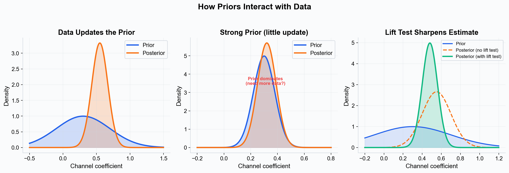
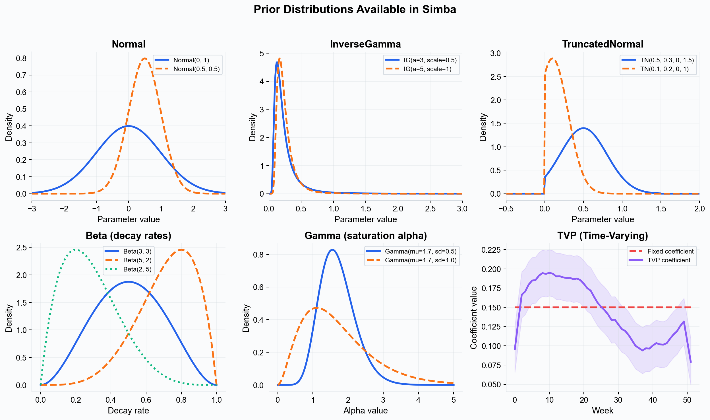
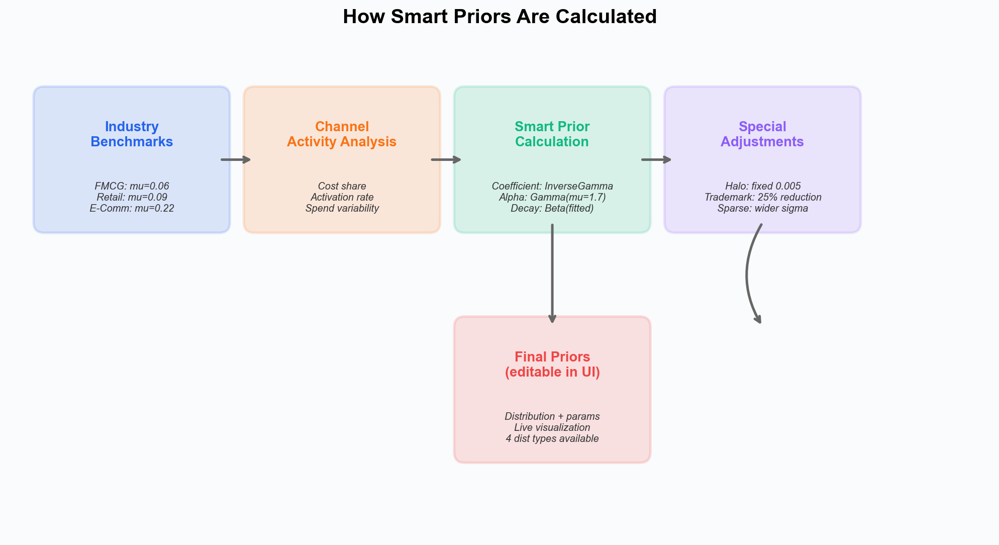
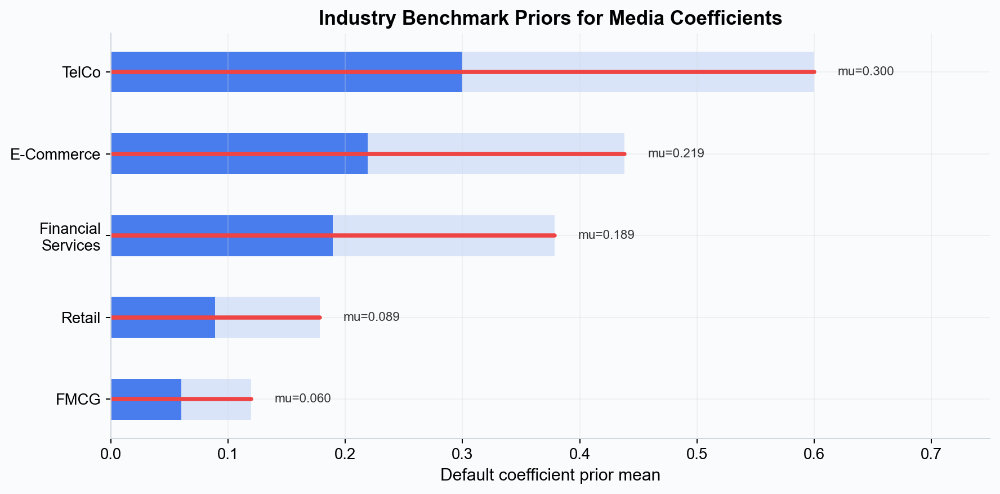

# Priors and Distributions --- Configuring Bayesian Priors in Simba

Priors are one of the most powerful features of Bayesian modeling. They let you tell the model what you already know --- or believe --- about a parameter before it sees any data. In Simba, priors are fully configurable through the UI, giving you control over every aspect of the model while providing sensible defaults that work out of the box.

---

## What Are Priors and Why Do They Matter?

In [Bayesian modeling](./bayesian-modeling.md), every parameter starts with a **prior distribution** --- a probability distribution that represents your beliefs about the parameter before observing data. The model then combines this prior with the observed data (via the likelihood) to produce the **posterior distribution** --- your updated beliefs.

*Left: a weakly informative prior shifts substantially when data arrives. Center: a strong prior barely moves --- a signal that either the prior is very confident or more data is needed. Right: adding a lift test as a likelihood observation produces a sharper, better-calibrated posterior.*

Priors matter for several reasons:

### 1. Encoding Domain Knowledge

If a lift test showed that paid search ROAS is between 2x and 4x, you can add this as a calibration observation in the Model Details step. The model will use this experimental evidence as additional likelihood data alongside the time-series data, producing more accurate and stable estimates.

### 2. Regularization

Priors prevent the model from arriving at implausible parameter values. For example, a prior that constrains a channel's effect to be positive prevents the model from estimating that spending more on a profitable channel decreases sales --- a result that sometimes occurs in frequentist regression due to multicollinearity or noise.

### 3. Handling Sparse Data

When a channel was only active for a few weeks, the data alone may not be sufficient to estimate its effect reliably. A prior provides a starting point that keeps the estimate reasonable until more data accumulates.

### 4. Transparency

Because Simba is a fully transparent platform, every prior is visible and inspectable. Stakeholders can review the assumptions encoded in the model and challenge them if needed. This is far more transparent than the implicit assumptions buried in frequentist model specifications.

---

## Types of Distributions in Simba

Simba's prior builder UI exposes four distribution types that you can select directly. The model also uses additional distributions internally for specific parameter types (decay rates, saturation shape). All distributions are backed by [PyMC](https://www.pymc.io/).

*Top row: the three user-selectable continuous distributions. Bottom row: Beta and Gamma are used internally for decay rates and saturation shape; TVP allows coefficients to vary smoothly over time.*

### Normal

The **Normal** (Gaussian) distribution is defined on the entire real line. It is symmetric and bell-shaped.

**When Simba uses Normal:**
- Control variable coefficients and other unconstrained parameters
- Parameters where both positive and negative values are plausible

**Key parameters:**
- **mu (mean)** --- The center of the distribution, representing your best guess for the parameter value.
- **sigma (standard deviation)** --- How uncertain you are. Larger sigma means a wider, more uncertain prior.

### InverseGamma

The **InverseGamma** distribution is defined on positive real numbers and has a right-skewed shape. In Simba, this is the **default distribution for media channel coefficients** because it naturally constrains effects to be positive while allowing for a long right tail.

**When Simba uses InverseGamma:**
- **Default prior for all media channel coefficients** (smart priors assign InverseGamma automatically)
- Any parameter that must be positive and could plausibly take a wide range of values

**Key parameters (in Simba's parameterization):**
- **mu (mean)** --- The expected value of the coefficient, derived from industry benchmarks and channel activity.
- **sigma (standard deviation)** --- How uncertain you are about the coefficient.

**Practical interpretation:** An InverseGamma prior on a media coefficient says "I expect this channel's effect to be around this magnitude, but I am open to it being somewhat larger. It cannot be negative."

### TruncatedNormal

The **TruncatedNormal** distribution is a normal (bell-curve) distribution that is cut off at specified lower and/or upper bounds. This is useful when you want a roughly bell-shaped prior but need to enforce hard constraints.

**When Simba uses TruncatedNormal:**
- An alternative choice for channel coefficients when you want to set explicit bounds
- Control variables where you know the direction of effect

**Key parameters:**
- **mu (mean)** --- The center of the distribution, representing your best guess for the parameter value.
- **sigma (standard deviation)** --- How uncertain you are. Larger sigma means a wider, more uncertain prior.
- **lower** --- The minimum allowed value (e.g., 0 for a parameter that must be positive).
- **upper** --- The maximum allowed value.

**Practical interpretation:** A TruncatedNormal(mu=0.5, sigma=0.2, lower=0, upper=1) prior on a decay rate says "I expect the decay rate to be around 0.5 (half-life of about 1 week), but it could reasonably be anywhere from 0.2 to 0.8. It cannot be negative or exceed 1."

### TVP (Time-Varying Parameter)

The **TVP** distribution allows a parameter to change smoothly over time rather than remaining fixed for the entire modeling period. It uses a Hilbert Space Gaussian Process (HSGP) basis internally.

**When TVP is useful:**
- A channel's effectiveness has changed over the modeling period (e.g., creative fatigue, market saturation, or a major strategy shift)
- Seasonally varying effects that are not captured by explicit seasonality controls
- Long modeling windows (2+ years) where assuming a fixed coefficient is unrealistic

**Key parameters:**
- **mean** --- The baseline value around which the coefficient varies.
- **sigma** --- The amplitude of variation over time.
- **lower / upper** --- Bounds that the time-varying coefficient cannot exceed.

**Important:** TVP adds model complexity and requires more data to estimate reliably. Use it only when you have strong reason to believe the effect is genuinely time-varying.

### Internal Distributions (Not Directly Selectable)

These distributions are used internally by the model for specific parameter types. You control them indirectly through the UI's adstock and saturation settings.

#### Beta (Decay Rates)

The **Beta** distribution is defined on the interval (0, 1), making it a natural choice for adstock decay rates. Simba fits a constrained Beta prior based on the decay lower and upper bounds you set in the UI, concentrating 70% of the probability mass within your specified range.

#### Gamma (Saturation Alpha and Theta)

The **Gamma** distribution is used for:
- **Saturation alpha (shape):** Controls the curvature of the [tanh saturation function](./saturation-curves.md). Simba uses a Gamma prior with a **fixed mean of 1.7** across all channels; the spread is controlled by the `alpha_sd` parameter you set in the UI (labeled "Diminishing Return" in the prior table).
- **Theta (peak delay):** For channels using [delayed adstock](./adstock-effects.md), the theta parameter follows a Gamma prior with a default mean of 2.0 and standard deviation of 1.0.

---

## How Smart Priors Work

When you configure a model, Simba calculates smart default priors for every media channel. These are not arbitrary --- they are derived from a multi-step process that incorporates industry knowledge and your specific data.

*Smart priors flow from industry benchmarks through channel-level analysis to produce calibrated defaults. Special adjustments handle halo and trademark channels.*

### Industry Benchmarks

Smart priors start with baseline coefficient expectations calibrated to your industry vertical:

*Default prior means vary by industry, reflecting differences in typical media effectiveness. The red bars show the uncertainty range (one standard deviation).*

| Industry | Default Mean (mu) | Default Sigma |
|---|---|---|
| FMCG | 0.060 | 0.120 |
| Retail | 0.089 | 0.178 |
| Financial Services | 0.189 | 0.379 |
| E-Commerce | 0.219 | 0.438 |
| TelCo | 0.300 | 0.600 |

### Channel-Level Adjustments

The industry baseline is then adjusted for each channel based on:

- **Cost share** --- Channels with a larger share of total spend tend to have smaller per-unit effects.
- **Activation rate** --- How many weeks the channel was active. Sparse channels (low activation) receive wider priors to reflect greater uncertainty.
- **Spend variability** --- Channels with more variation in spend levels provide more signal for the model to learn from.

### Saturation and Decay Defaults

- **Saturation alpha:** Always assigned a Gamma(mu=1.7, sigma=alpha_sd) prior. The alpha_sd is scaled based on channel activity: sparse channels get wider alpha_sd to allow more flexibility.
- **Decay rate:** Assigned a Beta prior fitted to your specified lower and upper bounds.
- **Effect period:** Defaults to 6 weeks (6 periods for weekly data, 45 periods for daily data).

### Special Channel Types

#### Halo Channels

Channels marked as halo effects (indirect brand lift from another channel) receive a **fixed small coefficient** with mean = 0.005 and sigma = 0.1. This reflects the expectation that halo effects are real but much smaller than direct media effects. See [Halo Effects](./halo-effects.md) for details.

#### Trademark / Portfolio Channels

Channels marked as trademark or portfolio effects receive a **75% reduction** in their calculated coefficient prior (multiplied by 0.25). This accounts for the fact that brand search and trademark terms are largely driven by existing demand rather than incremental media impact.

---

## How to Set Priors in Simba's UI

Simba's model configuration screen exposes prior settings for every parameter in the model. Here is the workflow:

### Step 1: Review the Defaults

When you add a channel or configure a model component, Simba automatically assigns smart default priors. The prior table displays each parameter with its distribution type, mean, sigma, and (for media channels) adstock and saturation settings.

### Step 2: Decide Whether to Customize

For most users and most channels, the smart defaults are appropriate. Consider customizing priors when:

- You have **lift test results** or **experimental data** for a channel (add these in the Model Details step as calibration observations --- see below).
- You have **strong domain expertise** about a channel's behavior (e.g., you know from years of experience that TV has a long carryover in your category).
- A channel has **very limited data** and you want to stabilize the estimate.
- You want to **test sensitivity** by running the model with different priors to see how much the results change.

### Step 3: Adjust Parameters

For any parameter, you can modify the distribution type and its parameters directly in the prior table. The UI provides:

- **Distribution selector** with four options: Normal, TruncatedNormal, InverseGamma, and TVP.
- **Numeric inputs** for each distribution parameter (mu, sigma, and bounds for TruncatedNormal/TVP).
- **Media-specific controls** including saturation scalar, diminishing return (alpha_sd), effect period, decay bounds, adstock type (geometric or delayed), and theta parameters for delayed adstock.
- **Transform selector** with options: N (none), DM (divide by mean), STA (standardize), DDM (double divide by mean).

### Step 4: Validate Visually

Before fitting the model, review the prior summary. Simba shows a live visualization of each prior distribution that updates as you change values, so you can see the shape and range at a glance. Look for:

- Priors that are unexpectedly wide or narrow
- Channels where the distribution type may not match the expected behavior
- Halo (purple sparkle icon) and trademark (orange award icon) channels with their special adjustments applied

---

## Smart Defaults vs. Manual Configuration

### When Smart Defaults Are Sufficient

Smart defaults work well when:

- You are building your first model and do not have strong priors.
- Your dataset is reasonably large (1+ years of weekly data).
- You want a quick initial model to establish a baseline.
- You trust the model to learn from the data without much guidance.

### When Manual Configuration Adds Value

Manual configuration is worth the effort when:

- **Lift test calibration.** You have experimental results that should anchor the model. Adding lift test results as calibration observations in the Model Details step is one of the highest-value actions you can take. The lift test data enters the model as **additional likelihood terms** (not priors) that constrain the channel response curve. See the section below for details.
- **Known channel behavior.** If your media team has deep experience with a channel and can articulate expectations about decay rates or saturation points, encoding that knowledge improves accuracy.
- **Sparse channels.** A channel that was only active for 4 to 6 weeks will have a poorly identified effect from data alone. A reasonable prior keeps the estimate sensible.
- **Sensitivity analysis.** Running the model with different priors helps you understand which results are driven by data and which are driven by assumptions.

---

## Lift Tests: Likelihood Observations, Not Priors

A common misconception is that lift test results should be encoded as priors. In Simba, lift tests are integrated as **additional likelihood observations** --- they enter the model as data, not as prior beliefs.

When you add a lift test in the Model Details step, Simba:

1. Takes the experimental result (the change in spend and the observed change in outcome).
2. Computes the expected lift from the model's current response curve for that channel.
3. Adds a Normal likelihood term that penalizes the model if its response curve is inconsistent with the experimental result.

This approach is more principled than encoding lift tests as priors because:

- The model can weigh the lift test evidence against the time-series data, finding the best coefficient values that satisfy both.
- Multiple lift tests can be added for the same channel, and the model will integrate all the evidence.
- The experimental uncertainty (sigma) is preserved, so a precise lift test has more influence than an imprecise one.

---

## When to Adjust Priors: Practical Guidance

### Scenario: You Have a Lift Test Result

Suppose a geo-based lift test for paid social showed a 15% incremental lift with a confidence interval of 10% to 20%.

**Action:** Add the lift test result as a calibration observation in the Model Details step (Step 5 of the wizard). Simba integrates it as a likelihood term that constrains the paid social response curve to be consistent with the experimental result. This is more effective than manually adjusting priors because it lets the model determine the best coefficient values that satisfy both the time-series data and the experimental evidence.

### Scenario: A Channel Has Limited History

You launched a new CTV (Connected TV) channel three months ago, giving you only 12 weekly observations.

**Action:** Use a moderately informative prior on the CTV coefficient, perhaps based on industry benchmarks for CTV effectiveness or on your TV channel's estimated effect (since CTV is a similar medium). Without this guidance, 12 data points may not be enough for the model to estimate the effect reliably.

### Scenario: A Channel's Effect Seems Implausible

After fitting the model, you notice that email marketing has a suspiciously high coefficient --- higher than all other channels despite modest spend.

**Action:** Check the prior. If it is very wide (weakly informative), the model may have latched onto a spurious correlation. Consider tightening the prior based on your expectations for email's effectiveness, then refit. If the posterior still shows a high effect, the data is strongly supporting it. If it moderates, the original estimate was likely noise-driven.

### Scenario: You Want to Test Sensitivity

You are presenting results to stakeholders and want to show that the conclusions are robust.

**Action:** Run the model with two or three different prior specifications --- for example, the default priors, tighter priors, and wider priors. If the key conclusions (channel rankings, budget allocation recommendations) are stable across prior choices, you can present the results with greater confidence.

---

## Fully Transparent Prior Configuration

One of Simba's core design principles is that every assumption is visible. The prior configuration panel is a key expression of this principle:

- Every prior is displayed with its distribution type and parameters.
- The posterior is shown alongside the prior after model fitting, so you can see how much the data updated your initial beliefs. Results use a **94% Highest Density Interval (HDI)** spanning the 3rd to 97th percentiles.
- If a posterior looks nearly identical to its prior, it means the data did not provide enough information to update the assumption --- a signal that you may want to collect more data or reconsider the model structure.

This transparency ensures that no assumption is hidden. Stakeholders can review the priors, challenge them, and understand exactly how they influence the results.

---

## Key Takeaways

- Priors encode your beliefs about model parameters before observing data. They are combined with data to produce posterior distributions.
- Simba's UI offers four selectable distributions: **Normal** (unconstrained parameters), **InverseGamma** (default for media coefficients --- positive, right-skewed), **TruncatedNormal** (bounded parameters), and **TVP** (time-varying coefficients). **Beta** and **Gamma** are used internally for decay rates and saturation shape.
- Smart defaults derive priors from industry benchmarks, channel activity patterns, and special adjustments for halo and trademark channels.
- Lift test results should be added as **calibration observations** (likelihood terms), not encoded as priors.
- Results report a **94% HDI** (3%--97%) for posterior summaries.
- Full transparency means every prior is visible, inspectable, and auditable.

---

## Next Steps

- [Bayesian Modeling](./bayesian-modeling.md) --- Understand the full prior-likelihood-posterior workflow.
- [Saturation Curves](./saturation-curves.md) --- Learn about the parameters that saturation priors control.
- [Adstock Effects](./adstock-effects.md) --- See how priors shape carryover estimation.
- [Halo Effects](./halo-effects.md) --- Understand how indirect brand lift is modeled with fixed priors.
