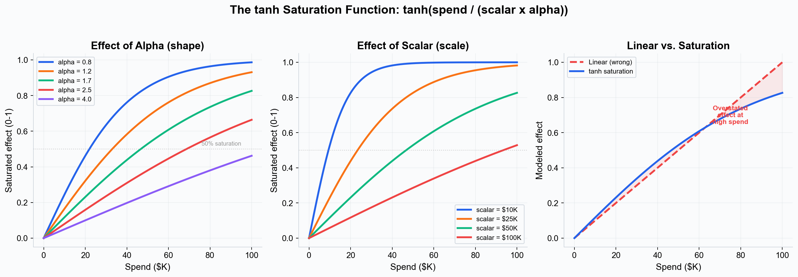
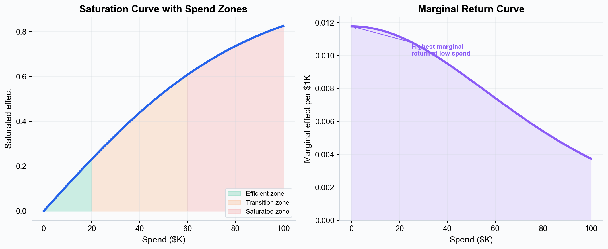
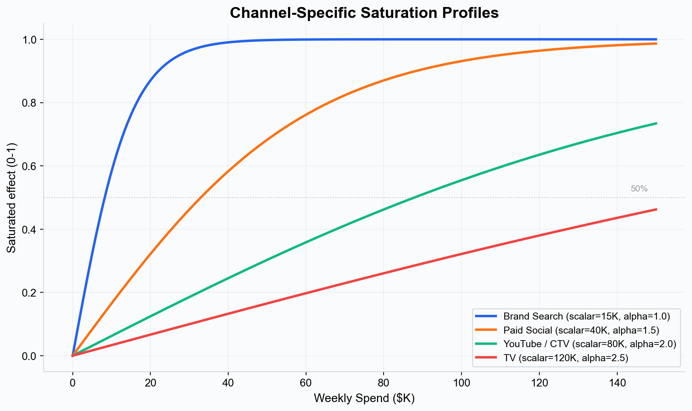
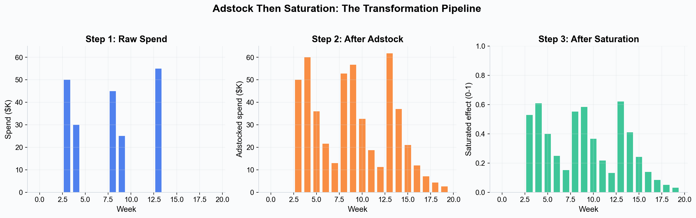

# Saturation Curves --- Understanding Diminishing Returns in Media Spend

Every marketing channel hits a point of diminishing returns. The first thousand dollars you spend on paid search generates more conversions per dollar than the hundred-thousandth dollar. Saturation curves model this relationship mathematically, and they are one of the most important components of any Marketing Mix Model.

---

## The Concept of Diminishing Returns

Diminishing returns is a fundamental economic principle: as you increase investment in a single input while holding everything else constant, each additional unit of investment produces a smaller incremental gain than the previous one.

In marketing, this happens because:

- **Audience exhaustion.** At low spend levels, your ads reach the most receptive audiences first. As spend increases, you reach less interested or less relevant audiences.
- **Frequency saturation.** The first few exposures to an ad drive awareness and intent. Additional exposures to the same audience yield progressively less response.
- **Competitive dynamics.** In auction-based channels (search, social), increasing spend raises your own bid costs, reducing efficiency.
- **Finite demand.** There is a ceiling on how many people want your product in any given period. No amount of advertising can push conversions beyond total addressable demand.

Ignoring diminishing returns leads to dramatically wrong conclusions. A linear model would suggest that doubling your TV spend doubles your TV-driven revenue. In reality, the incremental gain from doubling spend is almost always much less than double.

---

## The tanh Saturation Function

Simba uses the **hyperbolic tangent (tanh)** saturation function to model diminishing returns. The function takes the adstocked spend for a channel and maps it to a value between 0 and 1, representing the fraction of maximum possible effect.

### The Formula

The exact formula implemented in Simba is:

> **effective_spend = tanh( x / (scalar x alpha) )**

Where:

- **x** is the adstocked spend (after carryover effects have been applied --- see [Adstock Effects](./adstock-effects.md)).
- **scalar** is the saturation scale parameter, set to the **maximum observed activity** for the channel in your data. It anchors the curve to your data's scale.
- **alpha** is the saturation shape parameter, which controls how quickly the curve bends. It follows a **Gamma prior with a fixed mean of 1.7** and a standard deviation (alpha_sd) that varies by channel.

The product `scalar x alpha` acts as the effective half-saturation point --- the spend level at which the tanh function reaches approximately 0.76 (tanh(1) = 0.76). Smaller values of this product mean the channel saturates faster; larger values mean it can absorb more spend before flattening.

*Left: varying alpha with a fixed scalar shows how the shape parameter controls curvature. Center: varying scalar shifts the curve along the spend axis. Right: the tanh curve versus a linear assumption --- the shaded area represents overstated effect from ignoring diminishing returns.*

### Numerical Stability

The implementation includes two safeguards for numerical stability:

- A small epsilon (1e-9) is added to the denominator to prevent division by zero.
- The argument to tanh is clipped to the range [-20, 20] before evaluation, preventing floating-point overflow.

These are implementation details that do not affect the mathematical interpretation of the curve.

---

## The Two Saturation Parameters

Unlike simpler formulations that use a single "scale" parameter, Simba's tanh function uses two distinct parameters that serve complementary roles.

### Scalar (Scale)

The **scalar** parameter anchors the saturation curve to the scale of your data. During model fitting, it is set to the **maximum observed value** for each channel. This means:

- A channel with a maximum weekly spend of $100K will have scalar = 100,000.
- A channel with a maximum weekly spend of $5K will have scalar = 5,000.

The scalar is **not estimated** by the model --- it is fixed from your data. In the UI, the "Saturation" column in the prior table displays this value, and you can adjust it if you have reason to believe the channel's potential range extends beyond the historical maximum (for example, if you plan to significantly increase spend).

### Alpha (Shape)

The **alpha** parameter controls the curvature of the saturation function. It determines how quickly the channel transitions from the efficient (steep) region to the saturated (flat) region:

- **Smaller alpha** (e.g., 0.8--1.2) --- The channel saturates quickly. Even moderate spend levels are near maximum effect. Typical of niche channels with small target audiences.
- **Larger alpha** (e.g., 2.0--4.0) --- The channel can absorb more spend before diminishing returns become severe. Typical of broad-reach channels like TV or large digital platforms.

Alpha is **estimated by the model** using a Gamma prior:

- **Prior mean:** Fixed at **1.7** across all channels.
- **Prior standard deviation (alpha_sd):** Varies by channel based on smart prior calculations. You can adjust this in the UI's "Diminishing Return" (or "alpha_sd") column.

A wider alpha_sd gives the model more freedom to learn the saturation shape from data. A narrow alpha_sd constrains the model to stay close to the prior mean of 1.7.

---

## Interpreting Saturation Curves

Simba visualizes the fitted saturation curve for each channel, showing the relationship between spend and modeled effect.

*Left: the saturation curve with three spend zones highlighted. Right: the marginal return curve (the derivative of the saturation function) shows the incremental effect of each additional dollar.*

### The Efficient Zone (Low Spend)

The initial steep portion of the curve represents the range where your spend is most efficient. Each additional dollar generates a large incremental effect. If your current spend for a channel falls in this region, there may be opportunity to increase investment profitably.

### The Transition Zone (Moderate Spend)

The middle portion of the curve is where diminishing returns begin to take hold. Spend is still productive but less efficient than at lower levels. Many well-optimized channels operate in this zone.

### The Saturated Zone (High Spend)

When the curve flattens, additional spend produces very little incremental effect. If a channel's current spend falls in this region, the model is suggesting that the budget would generate more return if reallocated to a less-saturated channel.

### Marginal Return Curves

The **marginal return curve** --- the derivative of the saturation function --- shows the incremental effect of one additional dollar at each spend level. This is directly used by Simba's optimizer: it allocates budget such that the marginal return per dollar is equalized across all channels, maximizing total incremental outcome for a given budget.

---

## Channel-Specific Saturation

Different channels saturate at different rates because they have different audience sizes, frequency dynamics, and competitive environments.

*Illustrative saturation profiles for four channel types. Brand search saturates quickly (small scalar, low alpha) while TV has a long runway before diminishing returns (large scalar, high alpha).*

Typical patterns:

- **Paid search (brand terms)** saturates quickly because the audience searching for your brand name is finite and the first few positions capture most clicks.
- **Paid social** has moderate saturation, with creative fatigue and frequency caps limiting reach at higher spend levels.
- **Video (YouTube, CTV)** may have a larger saturation point because the available audience is vast and frequency can build over time before fatigue sets in.
- **TV** often has the largest saturation point because of its massive reach potential, though this varies significantly by market and category.

Simba estimates the saturation parameters from your data, with alpha_sd controlling how much freedom the model has to deviate from the prior mean of 1.7. If you have domain knowledge about a channel's saturation behavior, you can adjust the scalar and alpha_sd in the prior table. See [Priors and Distributions](./priors-and-distributions.md).

---

## The Transformation Pipeline: Adstock Then Saturation

A critical aspect of Simba's model is the **order of operations**. For each media channel, the transformation pipeline is:

1. **Adstock (carryover)** is applied first, spreading each period's spend across subsequent periods according to the channel's decay rate.
2. **Saturation (diminishing returns)** is applied to the adstocked values, mapping them to the 0--1 range via the tanh function.
3. The saturated values are multiplied by the channel **coefficient** to produce the channel's contribution to the outcome.

*Left: raw weekly spend shows concentrated bursts. Center: after geometric adstock (decay=0.6), spend is smoothed across weeks. Right: after tanh saturation, the peaks are compressed --- high-spend weeks produce less incremental effect per dollar than low-spend weeks.*

This ordering matters because adstock smooths out spend spikes before saturation is applied. A heavy spend week is partially spread over subsequent weeks, which moderates the apparent diminishing returns. If saturation were applied first, the heavy spend week would be aggressively capped, and the subsequent carryover would be much smaller.

---

## Configuring Saturation in Model Setup

When setting up a model in Simba, you configure saturation as part of the channel prior specification.

### Smart Defaults

Simba's smart priors automatically calculate saturation parameters for each channel:

- **Scalar** is pre-populated with the **average** non-zero activity level for the channel in the UI (the backend will use the channel's maximum value during model fitting).
- **Alpha_sd** (labeled "Diminishing Return" in the prior table) is calculated based on a scale factor (starting from 1.7, adjusted for cost share and spend variability) multiplied by 0.15, with an activation frequency penalty for sparse channels. It is capped at `scale x 0.25`.

### Manual Prior Configuration

If you have strong domain knowledge about a channel's saturation behavior, you can adjust:

| UI Field | Parameter | Effect |
|---|---|---|
| **Saturation** | scalar | Shifts the curve along the spend axis. Increase if you expect to scale spend well beyond historical levels. |
| **Diminishing Return / alpha_sd** | alpha_sd | Controls how much the model can deviate from the alpha mean of 1.7. Wider values give the model more freedom. |

### Coefficient Adjustment for Saturation

An important detail of smart prior calculation: channel coefficient priors are **pre-adjusted for expected saturation**. Specifically, the coefficient mean is divided by `tanh(avg_spend / (max_spend x scale))`. This means the coefficient reflects the linear-equivalent effect at historical spend levels, so the posterior coefficient is interpretable as the effect per unit of saturated media.

---

## Why Saturation Matters for Optimization

Saturation curves are the single most important input to [budget optimization](../platform-guide/budget-optimization.md). Without them, an optimizer would simply recommend putting all budget into the channel with the highest average ROAS --- which ignores the fact that ROAS declines as spend increases.

Simba's optimizer evaluates the full response curve (adstock + saturation + coefficient) across **all posterior samples** to account for parameter uncertainty. It can:

1. Identify channels that are **under-saturated** (spending in the steep part of the curve) and recommend increasing investment.
2. Identify channels that are **over-saturated** (spending in the flat part of the curve) and recommend shifting budget elsewhere.
3. Find the **optimal allocation** where the marginal return per dollar is equalized across all channels, maximizing total incremental outcome for a given budget.

The optimizer uses the exact same tanh function and posterior parameter samples as the fitted model, so the response curves used for optimization are fully consistent with the model's estimates.

---

## Key Takeaways

- Diminishing returns are a universal feature of marketing spend. Linear models ignore this and produce misleading results.
- Simba uses the **tanh saturation function**: `tanh(x / (scalar x alpha))`, where scalar anchors to data scale and alpha controls curvature.
- **Alpha** follows a Gamma prior with a fixed mean of **1.7** and channel-specific standard deviation (alpha_sd).
- **Scalar** is fixed from data (max observed activity per channel), not estimated.
- Adstock is applied **before** saturation --- this order smooths spend spikes before diminishing returns are applied.
- The **marginal return curve** (derivative of saturation) is what the optimizer uses to equalize returns across channels.
- Saturation curves are fully interpretable: the steep region indicates efficient spend, the flat region indicates waste.

---

> **See this in action:** [Start your free 28-day trial](https://getsimba.ai) — no credit card required.

---

## Next Steps

- [Adstock Effects](./adstock-effects.md) --- Understand how carryover is applied before saturation.
- [Priors and Distributions](./priors-and-distributions.md) --- Learn how to configure alpha_sd and other saturation priors.
- [Incrementality](./incrementality.md) --- See how saturation feeds into incremental contribution estimates.
