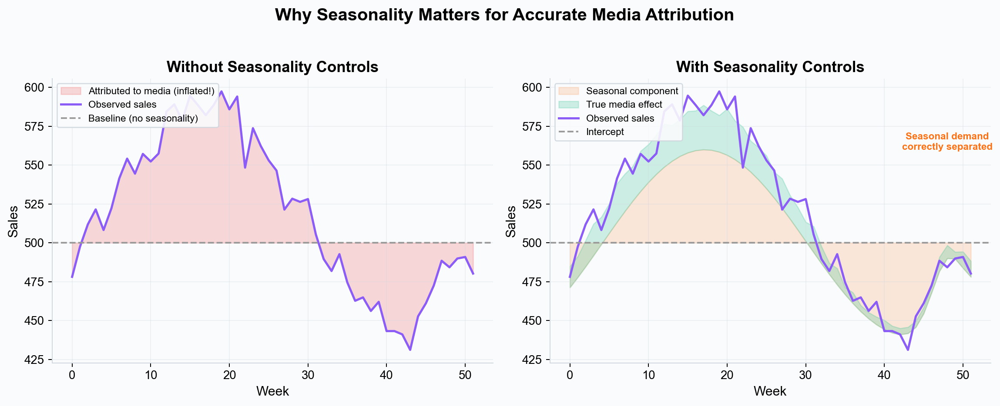
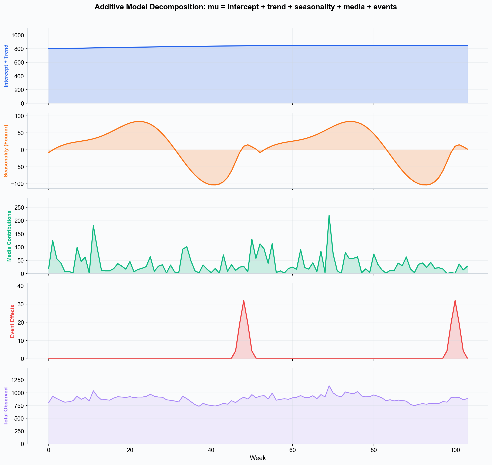
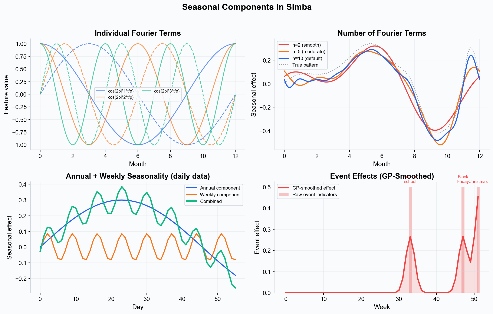
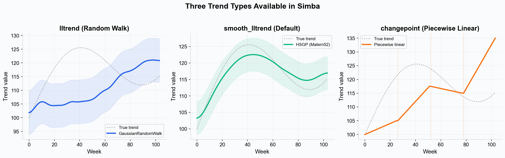

# Seasonality --- Modeling Seasonal Patterns in Marketing Data

> **In brief:** Seasonality separates recurring patterns (holidays, weather, pay cycles) from marketing effects so channel contributions are not inflated by demand that would have happened anyway. In Simba, seasonality is opt-in via Advanced Options with configurable Fourier terms.

Sales do not happen in a vacuum. Retail spikes during the holidays. Ice cream sells more in summer. Tax software peaks in April. These predictable, recurring patterns are **seasonal effects**, and failing to account for them is one of the most common sources of error in marketing measurement.

---

## What Are Seasonal Effects?

Seasonal effects are recurring, time-based patterns in your outcome variable that are driven by factors outside your marketing mix. They can include:

- **Calendar seasonality.** Day-of-week patterns (e.g., more purchases on weekends), monthly cycles (e.g., pay-period effects), or annual patterns (e.g., holiday shopping, summer slowdowns).
- **Holiday effects.** Concentrated spikes around specific dates such as Black Friday, Prime Day, Christmas, Back-to-School, or Valentine's Day.
- **Industry-specific cycles.** Tax filing deadlines for financial services, open enrollment periods for insurance, harvest seasons for agriculture-related products.
- **Weather-driven patterns.** Higher demand for seasonal categories (e.g., sunscreen, snow gear) that correlates with climate cycles.
- **Cultural and sporting events.** Super Bowl, World Cup, awards season, or other events that predictably shift consumer behavior.

These patterns exist independently of your marketing activity. They represent changes in consumer demand that would occur whether or not you ran a single ad.

---

## Why Seasonality Matters for Marketing Measurement

If your model does not account for seasonal effects, it will confuse seasonality with marketing effectiveness.

*Left: without seasonality controls, the holiday sales surge is wrongly attributed to media spend, inflating channel effectiveness. Right: with seasonality properly modeled, seasonal demand is separated and media contributions are accurately measured.*

### Error 1: Inflating Channel Contributions

Suppose your brand increases TV spend during the holiday season (a common strategy). Sales also increase during the holiday season --- but much of that increase is seasonal demand that would have occurred without any advertising. A model without seasonality controls will attribute the seasonal sales lift to TV, dramatically overestimating its effectiveness.

### Error 2: Underestimating Channels That Run in Off-Peak Periods

Conversely, if a channel runs primarily during a slow season (e.g., a summer display campaign), a model without seasonality will see lower-than-average sales during the campaign period and may underestimate or even estimate a negative effect for the channel.

In both cases, the root cause is the same: the model cannot distinguish between "sales went up because we spent more" and "sales went up because it is December." Seasonality controls solve this by giving the model an explicit mechanism to absorb time-based demand patterns.

---

## The Model Equation

To understand how seasonality fits into the full model, here is the additive structure Simba uses:

> **outcome = intercept + trend + seasonality + media_contributions + control_variables + event_effects + noise**

Each component is estimated jointly in a single Bayesian model, meaning they are all identified simultaneously rather than sequentially. This avoids the "residual fitting" problems that arise when components are estimated one at a time.

*The model decomposes observed sales into additive components: baseline (intercept + trend), seasonal patterns (Fourier series), media contributions, and event effects. Each component is estimated jointly.*

---

## Fourier-Based Seasonality

Simba models seasonal patterns using **Fourier features** --- pairs of sine and cosine functions at different frequencies that, when combined, can represent any periodic pattern.

### How Fourier Features Work

The Fourier basis for seasonality generates **2n features from n terms**:

For each term k = 1, 2, ..., n:
- cos(2pi x k x t / p)
- sin(2pi x k x t / p)

Where **t** is the normalized time variable and **p** is the period (365.25 days for annual seasonality, 7 days for weekly seasonality).

Each Fourier coefficient has an independent **Normal(0, 10)** prior, where 10 is the default `seasonality_prior_scale`. This weakly informative prior allows the model to learn the seasonal pattern from data without imposing a specific shape.

*Top left: individual Fourier terms (cosine and sine pairs) at different frequencies. Top right: how the number of terms affects the fitted shape --- n=2 (default) captures broad annual trends, while higher values can fit sharper peaks. Bottom left: annual and weekly seasonality combined for daily data. Bottom right: event effects are GP-smoothed for realistic temporal spread.*

### Annual Seasonality

Annual seasonality captures patterns that repeat on a yearly cycle. Simba uses:

- **Period:** 365.25 days (accounting for leap years), normalized by the training data span.
- **Default terms:** n = 2, producing 4 features (2 cosine + 2 sine).
- **Opt-in:** Seasonality must be enabled via the checkbox in the model configuration. It is not enabled by default.
- **Configurable:** The number of Fourier terms can be adjusted from 1 to 25 in the Advanced Options panel.

The number of terms controls the smoothness:

- **Fewer terms (n=2, the default)** produce smooth curves that capture broad annual trends (e.g., gradual summer increase, winter decrease). This is a deliberately conservative default that avoids overfitting.
- **Moderate terms (n=5--6)** capture sharper seasonal patterns like back-to-school and holiday peaks.
- **More terms (n=8--10)** allow the model to fit very localized effects (e.g., a sharp single-week spike), but risk overfitting to noise.

### Weekly Seasonality

Weekly seasonality captures day-of-week patterns (e.g., higher sales on weekends). It is **only available for daily data** --- weekly or monthly aggregated data cannot identify within-week patterns.

- **Period:** 7 days, normalized by the training data span.
- **Default terms:** n = 3 when enabled (configurable from 1 to 7). Three terms are usually sufficient to capture day-of-week effects.
- **Opt-in:** Disabled by default. Must be explicitly enabled via a separate checkbox that only appears for daily data.
- **Combined:** When both annual and weekly seasonality are enabled, their effects are summed.

---

## Trend Modeling (Dynamic Baseline)

In addition to seasonality, Simba can model long-term trends --- gradual shifts in the baseline that occur over months or years. In the UI, this is called **"Include Dynamic Baseline"** and is enabled via a checkbox in the model configuration.

### Opt-In Behavior

Trend is **disabled by default**. When disabled, the model uses a fixed intercept estimated as a TruncatedNormal centered on the dependent variable mean. When enabled, the intercept is set to zero and the trend component absorbs the baseline level.

### Smooth HSGP Trend

When trend is enabled, Simba uses a **Hilbert Space Gaussian Process** with a Matern52 kernel (`smooth_lltrend`). This is the only trend type available through the UI. It produces smooth, flexible trend curves that can capture gradual growth, plateaus, and gentle reversals without overfitting to noise.

*The smooth HSGP trend (center) is the approach used in the UI. It captures gradual baseline shifts without overfitting. The other trend types (Gaussian Random Walk and piecewise linear) exist in the backend but are not exposed in the UI.*

Key features:
- Includes a learned mean function with optional weak linear trend component.
- Uses sigmoid scaling with a learned baseline share parameter (kappa = 4.0).
- Estimates the empirical slope from data to inform the trend direction.

### Other Trend Types (Backend Only)

The backend supports two additional trend types that are not currently exposed in the UI:

- **Gaussian Random Walk (`lltrend`):** Models the baseline as a random walk passed through a softplus transformation. More flexible but noisier.
- **Piecewise Linear (`changepoint`):** Fits a piecewise linear trend with Laplace-distributed changepoint magnitudes (8 changepoints across the first 80% of data). Best for distinct growth phases.

---

## Event and Holiday Effects

For known events with outsized impact (e.g., Black Friday, Prime Day, Christmas), Simba supports **event indicators** that capture sharp, short-duration effects that Fourier terms alone might smooth over.

### How Events Are Modeled

Events are not simply binary dummy variables. Simba uses a more sophisticated approach:

1. **One-hot encoding:** Each event date is encoded as a one-hot vector aligned to the data's time periods.
2. **Hierarchical weights:** Event effects share a hierarchical prior: each event's weight is drawn from Normal(mu_weight, sigma_weight), where mu_weight ~ Normal(0, 1) and sigma_weight ~ HalfNormal(1). This pools information across events while allowing individual variation.
3. **GP smoothing:** The event effects are convolved with a **Matern32 Gaussian Process kernel** to produce realistic temporal spread --- events affect nearby periods, not just the exact date.

The smoothing length depends on data frequency:
- **Weekly data:** Convolution length of approximately 4 periods (lower=1, upper=3).
- **Daily data:** Convolution length of approximately 28 periods (lower=7, upper=21).
- **Monthly data:** Convolution length of approximately 0.8 periods (lower=0.2, upper=1).

### Configuring Events in the UI

Simba's holiday selector provides:

- **Country-based holiday lookup** using ISO 3166-1 country codes (powered by the `date-holidays` library). Select your country and Simba will populate standard holidays.
- **Custom event dates** that you can add manually for business-specific events (e.g., product launches, sales events).
- **Automatic period alignment** --- holidays are "snapped" to the correct period boundary for your data frequency (daily or weekly).

---

## Periodicity Detection

Simba automatically detects the frequency of your data by analyzing the gaps between consecutive dates:

| Detected Periodicity | Typical Gap | Annual Seasonality | Weekly Seasonality |
|---|---|---|---|
| **Daily** | ~1 day | Yes (default n=2) | Available (default n=3, opt-in) |
| **Weekly** | ~7 days | Yes (default n=2) | No |
| **Monthly** | ~30 days | Yes (default n=2) | No |
| **Irregular** | Variable | Yes (default n=2) | No |

Periodicity also affects default effect periods for media channels (45 for daily, 6 for weekly, 2 for monthly) and event smoothing kernel parameters.

---

## Automatic vs. Manual Seasonality Configuration

### Default Behavior

Both seasonality and trend are **opt-in features** --- they are disabled by default in the UI and must be explicitly enabled via checkboxes. When enabled with default settings, the platform:

1. Detects the frequency of your data (daily, weekly, monthly, or irregular).
2. Uses 2 Fourier terms for annual seasonality (conservative default that captures broad annual patterns).
3. Fits the seasonal component jointly with channel effects, [saturation](./saturation-curves.md), and [adstock](./adstock-effects.md).
4. Uses the smooth HSGP trend if the dynamic baseline checkbox is also enabled.

### Manual Adjustments

These settings are available in the Advanced Options panel:

- **Number of Fourier terms (annual).** Adjustable from 1 to 25. If the fitted seasonal pattern is too smooth (missing known peaks), increase the number of terms. Default is 2.
- **Weekly seasonality.** For daily data only. Enable via checkbox, then configure the number of terms (default 3, range 1--7).
- **Event indicators.** Add specific dates for holidays or events that are important to your business, using the country-based holiday selector or custom date entry.
- **Seasonality prior scale.** Adjust the prior standard deviation (default 10) to control how much the seasonal component can vary. Smaller values produce more conservative seasonal patterns.
- **Dynamic baseline (trend).** Enable via checkbox to model long-term baseline shifts using the smooth HSGP approach.

---

## Interaction with Other Model Components

Seasonality does not operate in isolation. It interacts with other model components in important ways:

### Seasonality and Incrementality

Proper seasonality modeling is essential for accurate [incrementality](./incrementality.md) estimates. If seasonal demand is not absorbed by the seasonal component, it leaks into channel contribution estimates, inflating the apparent incrementality of channels that correlate with seasonal peaks.

### Seasonality and Saturation

Channels that ramp up spend during peak seasons may appear to saturate faster if the model does not account for the seasonal baseline. By modeling seasonality explicitly, Simba ensures that [saturation curves](./saturation-curves.md) reflect true diminishing returns rather than seasonal artifacts.

### Seasonality and Baseline

The seasonal component works together with the trend and intercept to define the full baseline --- the level of outcome you would expect with zero media spend. This baseline is the reference point against which all incremental contributions are measured.

---

## Key Takeaways

- Seasonal effects are recurring, time-based patterns in demand that exist independently of marketing activity.
- Failing to model seasonality leads to inflated channel contributions during peak seasons and underestimated contributions during off-peak periods.
- Simba uses **Fourier-based seasonality** with default n=2 terms (4 features) and Normal(0, 10) priors. Configurable up to 25 terms. Weekly seasonality (default n=3) is available for daily data only.
- Both seasonality and trend are **opt-in** --- disabled by default, enabled via checkboxes in the UI.
- **Trend** uses smooth HSGP (Matern52 kernel) when enabled. Other trend types exist in the backend but are not exposed in the UI.
- **Event effects** are modeled as GP-smoothed one-hot indicators with hierarchical Normal weights, not simple binary dummies.
- The model equation is fully additive: outcome = intercept + trend + seasonality + media + controls + events + noise.
- Manual adjustments are available for the number of Fourier terms, weekly seasonality, event dates, seasonality prior scale, and dynamic baseline.

---

> **See this in action:** [Start your free 28-day trial](https://getsimba.ai) — no credit card required.

---

## Next Steps

- [Incrementality](./incrementality.md) --- See how seasonality separation improves causal attribution.
- [Marketing Mix Modeling](./marketing-mix-modeling.md) --- Understand how seasonality fits into the full model structure.
- [Priors and Distributions](./priors-and-distributions.md) --- Learn how seasonal component priors work.
- [Saturation Curves](./saturation-curves.md) --- See how proper seasonality avoids saturation artifacts.
