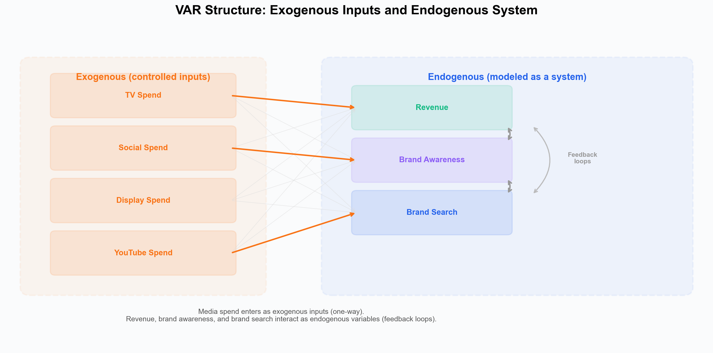
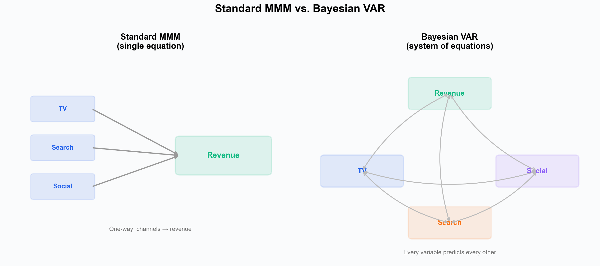
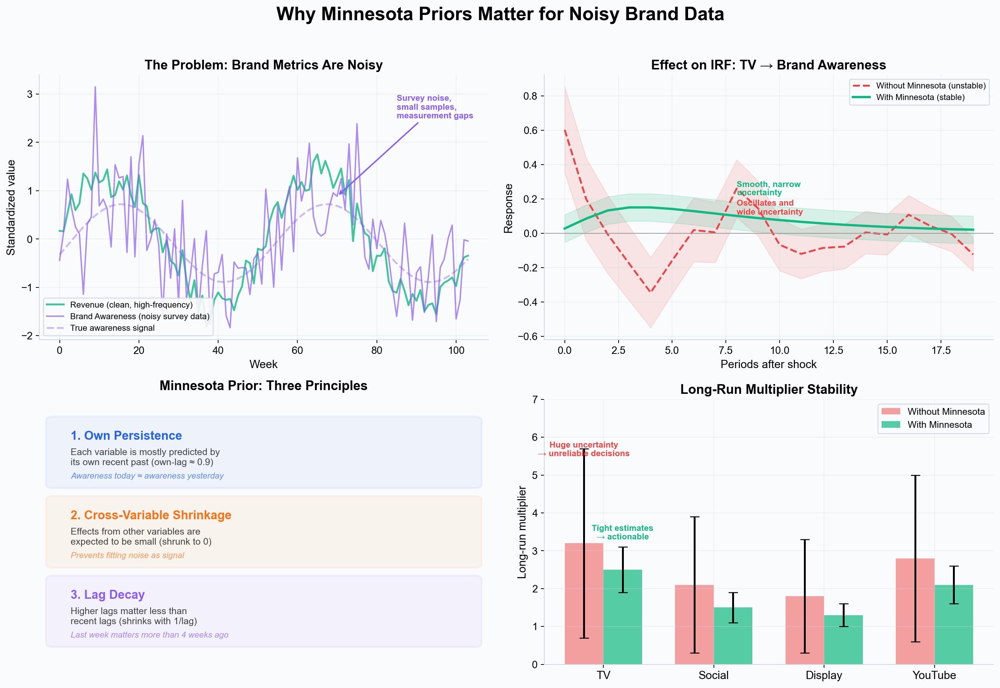
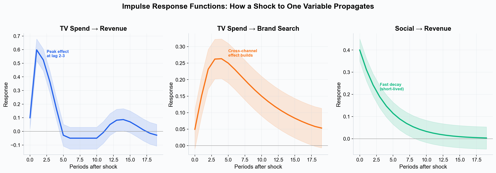
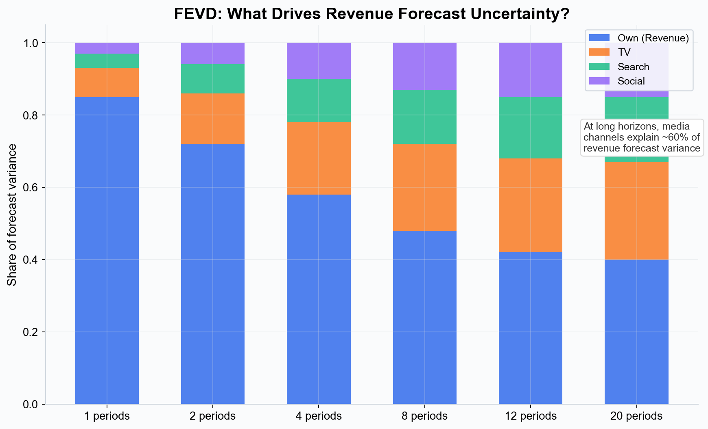
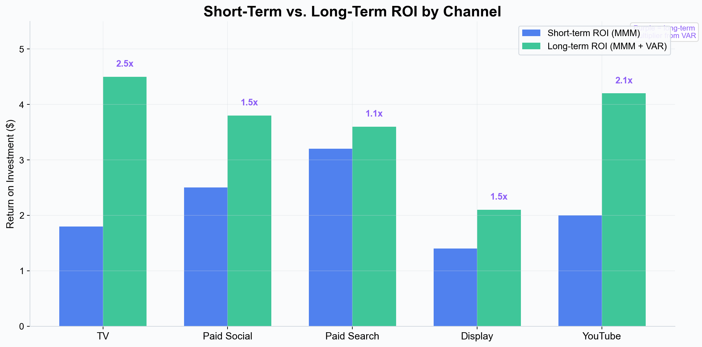
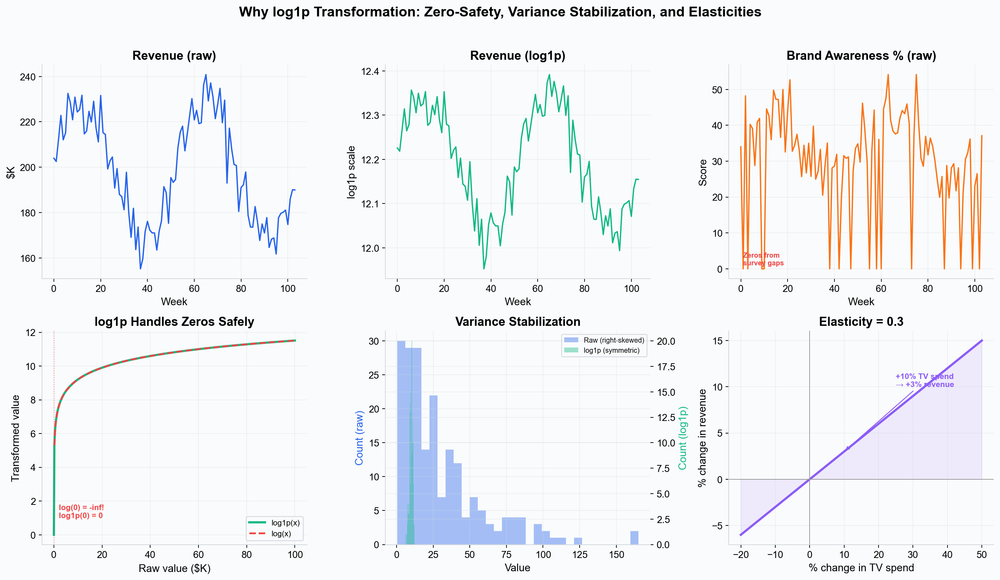
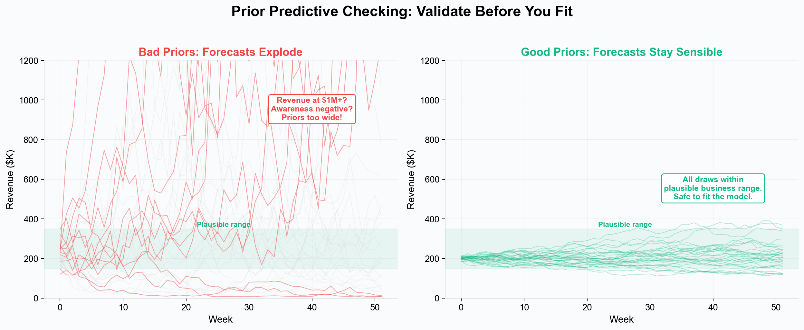

# VAR Modeling --- Bayesian Vector AutoRegression for Marketing

Vector AutoRegression (VAR) is a multi-equation time series model that captures dynamic interactions between business outcomes and brand metrics over time. While a standard Marketing Mix Model estimates one equation (media → revenue), a Bayesian VAR models a system of interacting variables --- revenue, brand awareness, brand search, and other brand equity metrics --- revealing the indirect and long-term pathways through which marketing drives business results.

---

## Why VAR Matters for Marketing

Standard MMM answers: "How much revenue did each media channel drive?" This is valuable for short-term attribution and budget optimization. But it misses a crucial dimension: **the indirect, long-term effects that flow through brand equity**.

Consider TV advertising. A standard MMM might estimate that TV has a modest short-term ROI --- perhaps $1.80 returned per dollar spent. But TV also builds brand awareness, which drives brand search volume, which drives conversions and revenue over weeks and months. These indirect pathways are invisible to a single-equation model.

VAR captures the full picture by modeling the **system** of business outcomes:

> Revenue(t) = f(Revenue(t-1), Awareness(t-1), BrandSearch(t-1), ...) + g(TV_spend, Social_spend, ...)
> Awareness(t) = f(Revenue(t-1), Awareness(t-1), BrandSearch(t-1), ...) + g(TV_spend, Social_spend, ...)
> BrandSearch(t) = f(Revenue(t-1), Awareness(t-1), BrandSearch(t-1), ...) + g(TV_spend, Social_spend, ...)

The endogenous variables (revenue, awareness, brand search) interact through **feedback loops** --- awareness drives search, search drives revenue, revenue sustains the brand. Media spend enters as **exogenous inputs** that shock the system but are not predicted by it.

*Media spend (TV, social, display, YouTube) enters as exogenous one-way inputs. Revenue, brand awareness, and brand search form the endogenous system with feedback loops between them.*

---

## Exogenous vs. Endogenous Variables

A key concept in VAR is the distinction between **exogenous** and **endogenous** variables:

- **Exogenous variables** are controlled inputs that affect the system but are not affected by it. Media spend is the classic example --- you decide how much to spend on TV; the model does not predict your TV budget.
- **Endogenous variables** are outcomes that influence each other through feedback. Revenue, brand awareness, brand search volume, consideration scores, and NPS are typical endogenous variables in a marketing VAR.

The modeling decision of what to include as endogenous is important:

- **Revenue** is almost always endogenous --- it is the ultimate outcome you are trying to explain.
- **Brand awareness** (from surveys or tracking studies) is a natural endogenous variable --- it responds to media and in turn drives other outcomes. Awareness data is often noisy (small sample sizes, survey methodology variation), which makes the regularization from Minnesota priors especially valuable.
- **Brand search volume** is flexible. If branded search responds to media (e.g., TV drives brand search) and also drives revenue, it belongs in the endogenous system. If you treat it purely as a media input, it can be exogenous.
- **Media spend** is typically exogenous --- it is a decision variable you control, not an outcome of the brand ecosystem.

*Left: standard MMM uses one-way arrows from channels to revenue. Right: VAR models the interacting system of business outcomes and brand metrics.*

---

## The Bayesian VAR Model

The VAR model equation is:

> **Y(t) = alpha + A1 Y(t-1) + ... + Ap Y(t-p) + X(t) beta + epsilon(t)**

Where:

- **Y(t)** is the vector of endogenous variables (revenue, awareness, brand search, etc.), log-transformed via log1p.
- **A1, ..., Ap** are lag coefficient matrices --- these capture how each endogenous variable predicts every other endogenous variable at each lag.
- **X(t)** is the vector of exogenous variables (media spend by channel).
- **beta** is the exogenous coefficient matrix --- the direct effect of each media channel on each endogenous variable.
- **epsilon(t)** is multivariate Gaussian noise with covariance Sigma.

The lag order p is user-configured and determines how many past periods the model considers (see [Lag Selection](#lag-selection) below).

---

## Minnesota Priors: Principled Regularization

A VAR with k endogenous variables and p lags has k x k x p lag coefficients plus k x m exogenous coefficients. For a modest system of 3 endogenous variables, 5 media channels, and 3 lags, that is already 42 parameters --- often more than a typical marketing dataset (52--104 weeks) can reliably estimate without regularization.

*Top-left: brand awareness (from surveys) is far noisier than revenue --- small samples, measurement gaps, and survey-to-survey variation. Top-right: without Minnesota priors, this noise produces unstable, oscillating IRFs with wide uncertainty; with Minnesota, the IRF is smooth and actionable. Bottom-left: the three shrinkage principles. Bottom-right: Minnesota priors produce tighter long-run multiplier estimates, turning unreliable ranges into actionable numbers.*

The **Minnesota prior** (originally developed at the Federal Reserve Bank of Minneapolis) provides structured regularization by encoding three intuitive beliefs about time series:

### 1. Own Persistence

Each variable's best predictor is its own recent past. The prior centers **own-lag-1 coefficients near 0.9**, expressing the belief that brand awareness this week is likely close to brand awareness last week. Marketing time series --- revenue, awareness, search volume --- are typically persistent and slow-moving, making this a strong and well-justified default.

### 2. Cross-Variable Shrinkage

The effect of *other* endogenous variables is expected to be small relative to a variable's own history. Cross-variable coefficients are shrunk toward zero with tighter priors (lambda_cross = 0.1, versus lambda_overall = 0.2 for own effects). This prevents the model from overfitting to spurious correlations --- a major risk when endogenous variables are correlated (as brand metrics typically are).

### 3. Lag Decay

Higher-order lags are less informative than recent lags. The Minnesota prior progressively shrinks coefficients at longer lags:

> **sigma(i,j,l) = lambda / l^delta x (sigma_yi / sigma_yj) x cross_tightness**

Where l is the lag order and delta controls the decay rate. The ratio sigma_yi / sigma_yj normalizes for scale differences between variables.

### Why This Matters Especially for Brand Metrics

Brand equity data is often noisier than revenue or spend data. Awareness comes from surveys with limited sample sizes. NPS scores fluctuate week to week. Consideration metrics may have measurement gaps. Without Minnesota priors, a VAR would try to fit all this noise, producing unstable coefficients and unreliable impulse responses.

The Minnesota prior acts as a stabilizer: it says "unless the data strongly insists otherwise, assume each brand metric mostly follows its own recent trajectory, with small influences from other variables." This produces:

- **Stable impulse responses** even when some endogenous variables are noisy.
- **Reliable long-run multipliers** that do not swing wildly based on a few noisy observations.
- **Interpretable results** where genuine cross-variable effects (e.g., TV genuinely drives awareness) emerge clearly above the shrinkage, while spurious correlations are suppressed.

---

## Key VAR Outputs

### Impulse Response Functions (IRFs)

An IRF traces how a shock to one variable propagates through the entire system over time. IRFs can show both:

- **Exogenous → endogenous effects:** "What happens to revenue and brand awareness when I increase TV spend?" These show the direct and indirect impact of media.
- **Endogenous → endogenous feedback:** "What happens to revenue when brand awareness increases?" These reveal the internal dynamics of the brand ecosystem.

*Left: an exogenous TV spend shock produces a revenue response peaking at lag 2-3. Center: the same TV shock builds brand awareness with a slower, sustained curve. Right: an endogenous awareness shock feeds back into revenue --- the indirect pathway that standard MMM misses.*

The combination of these IRFs reveals the **total impact pathway**: TV spend → brand awareness (slow build) → brand search → revenue. The long-term total effect can be substantially larger than the direct short-term effect.

### Forecast Error Variance Decomposition (FEVD)

FEVD decomposes the forecast uncertainty of each endogenous variable into contributions from shocks to all endogenous variables. It answers: "How much of the unpredictability in revenue is driven by shocks to awareness vs. brand search vs. revenue itself?"

*At short horizons, revenue forecast variance is mostly driven by its own shocks. At longer horizons, brand awareness and brand search explain an increasing share --- revealing that brand equity dynamics become the dominant driver of revenue uncertainty over time.*

FEVD is computed from the endogenous system only (not from exogenous media shocks). It reveals which brand metrics are most systemically important --- if awareness shocks explain 30% of long-run revenue variance, that tells you awareness is a critical lever for revenue stability.

### Long-Run Effects

Long-run effects summarize the total cumulative impact after the system has fully absorbed a shock. They are computed analytically:

> **Psi_inf = (I - A_sum)^{-1}**

Where A_sum is the sum of all lag coefficient matrices. This produces percent-per-percent elasticities --- for example, "a 1% sustained increase in TV spend produces a 3% long-run increase in revenue, accounting for all indirect pathways through awareness and brand search."

Long-run effects can also include NPV scenarios and ROI analysis when annual spend and revenue data is provided.

---

## Short-Term vs. Long-Term ROI

The most actionable output of linking VAR to MMM is comparing short-term and long-term channel ROI:

*Illustrative example: channels with strong brand-building effects (TV, YouTube) show the largest long-term multipliers. Paid search, which drives direct conversions but less brand equity, sees a smaller uplift. The purple labels show each channel's long-term multiplier from VAR.*

This comparison reveals a common pattern:

- **Brand-building channels** (TV, video, YouTube) often have modest short-term ROI but large long-term multipliers (2--3x), because they drive awareness and consideration that compounds over time.
- **Performance channels** (paid search, retargeting) tend to have high short-term ROI but small long-term multipliers (1.1--1.5x), because their effects are largely captured in the direct response.
- **This changes budget decisions.** A channel that looks mediocre on short-term ROI may be your most valuable investment when long-term brand effects are included.

---

## Lag Selection

The number of lags (p) is user-configured. The lag order determines how many past periods each endogenous variable uses to predict the current period.

Practical guidance:

- **1--2 lags** for weekly data when the endogenous system responds quickly (e.g., brand search responds to awareness within a week or two).
- **3--4 lags** for weekly data when brand-building dynamics are slower (e.g., awareness takes several weeks to influence consideration and purchase intent).
- **Higher lags** capture longer memory but increase the parameter count. Minnesota priors automatically shrink higher-lag coefficients, managing overfitting risk.

The model requires at least **lags + 10 observations**. In practice, 52+ weeks is recommended for reliable estimates, and 104+ weeks is ideal for stable long-run multipliers.

---

## Data Transformations

Raw marketing data is rarely suitable for direct use in a VAR. Revenue might range from $100K to $500K, awareness from 20% to 50%, and TV spend from $0 to $200K --- wildly different scales with different distributional properties. Transformations address three problems at once.

*Top row: raw revenue and awareness data. Bottom row: the three benefits of log1p --- it handles zeros safely (unlike log), stabilizes variance across scales, and produces coefficients that are directly interpretable as elasticities.*

### Why log1p Is the Default

All endogenous variables are automatically transformed via **log1p(x) = log(1 + x)**. This is the default for good reason:

- **Zero-safe.** Marketing data frequently contains zeros --- a channel had no spend, a survey week was missed, brand search was zero in a low-activity period. Standard log(x) produces negative infinity at zero; log1p(0) = 0, keeping the data clean.
- **Variance stabilization.** Raw revenue might have a standard deviation of $50K while awareness has a standard deviation of 5 points. After log1p, both series have comparable variance, which prevents the VAR from being dominated by whichever variable happens to have the largest absolute scale.
- **Elasticity interpretation.** When both Y and X are log-transformed, the VAR coefficients become **elasticities** --- a coefficient of 0.3 means "a 1% increase in X is associated with a 0.3% change in Y." This is far more interpretable than raw-unit coefficients, and it is the natural language of marketing effectiveness ("a 10% increase in TV spend produces a 3% long-run increase in revenue").

### Available Transforms for Exogenous Variables

Exogenous variables (media spend) default to log1p but support alternative transforms when the data warrants it:

| Transform | Formula | When to Use |
|---|---|---|
| **log1p** (default) | log(1 + x) | Most media spend data --- handles zeros, produces elasticities |
| **asinh** | asinh(x) | Similar to log but handles negative values (e.g., net spend adjustments) |
| **z-score** | (x - mean) / std | When you want standardized units rather than elasticities |
| **min-max** | (x - min) / (max - min) | Scale to 0--1 range |
| **index100** | x / mean x 100 | Index relative to mean (useful for comparing across channels) |
| **per_k** | x / 1000 | Simple rescaling to thousands |

### Back-Transformation for Reporting

All VAR outputs (impulse responses, long-run effects, elasticities) are automatically converted back to **percent-per-percent** terms, accounting for the transformation applied to each variable. This means you always see results in interpretable business units, regardless of which transform was used internally.

---

## Prior Predictive Checking

Prior predictive checking is a validation step that answers a critical question before you commit to a full model fit: **"Do my priors produce forecasts that make business sense?"**

The idea is simple: sample from the prior distributions (without seeing any data) and generate forecasts. If those forecasts look reasonable --- revenue stays within plausible bounds, awareness does not go negative or explode to 100% --- your priors are well-specified. If they produce nonsense, you need to tighten or adjust priors before fitting.

*Left: bad priors produce forecasts that explode or collapse --- revenue at $1M+ or near zero. These priors are too wide and would waste computation or produce unstable posteriors. Right: good priors keep all forecast draws within a plausible business range, confirming the model is safe to fit.*

### Why This Matters for VAR

Prior predictive checking is especially valuable for VAR because:

- **VAR has many parameters.** With k endogenous variables and p lags, there are k x k x p coefficients. If even a few priors are miscalibrated, the system can produce explosive or oscillating forecasts.
- **Feedback loops amplify errors.** In a single-equation model, a bad prior on one coefficient produces a bad estimate for that coefficient. In a VAR, a bad prior on the awareness → revenue coefficient propagates through the entire system, affecting all impulse responses and long-run effects.
- **Brand metrics have unfamiliar scales.** You might have strong intuition about revenue ranges but less about what a "reasonable" awareness coefficient looks like. Prior predictive checking lets you validate the combined effect of all priors without needing to reason about each one individually.

### How to Use It

1. Configure your VAR model (endogenous variables, exogenous media, lags, priors).
2. Run prior predictive checks before fitting.
3. Inspect the forecast draws: are they within plausible business ranges?
4. If not, adjust priors (typically tightening the Minnesota shrinkage or narrowing intercept bounds) and re-check.
5. Once the prior predictive looks sensible, fit the full model.

---

## Availability

VAR modeling is included in the free trial, Pro, and Scale plans (disabled on Analyst). See [getsimba.ai](https://getsimba.ai) for current plans.

---

## References

- [Bayesian Vector Autoregressive Models for Marketing](https://www.sciencedirect.com/science/article/abs/pii/S0167811621000495) --- Foundational reference on Bayesian VAR applications in marketing, covering long-run effects, impulse responses, and the role of Minnesota priors in marketing systems.

---

## Next Steps

- [Marketing Mix Modeling](./marketing-mix-modeling.md) --- The standard MMM approach for channel attribution and optimization.
- [Bayesian Modeling](./bayesian-modeling.md) --- The statistical foundation shared by MMM and VAR.
- [Incrementality](./incrementality.md) --- Causal impact measurement.
