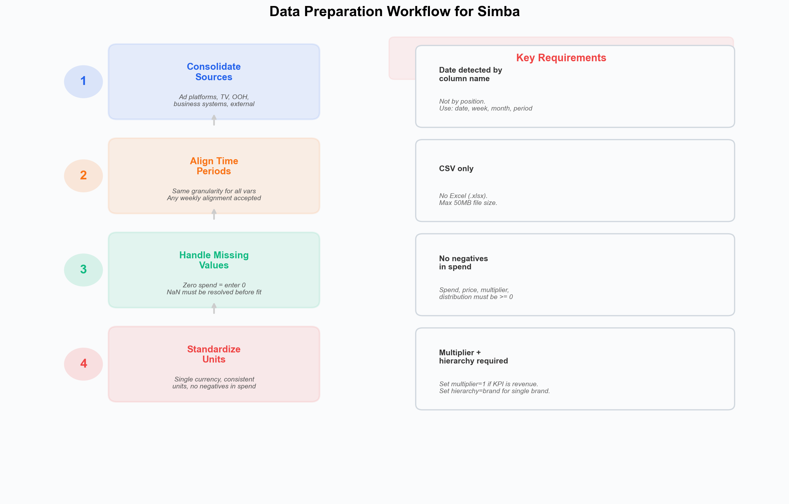
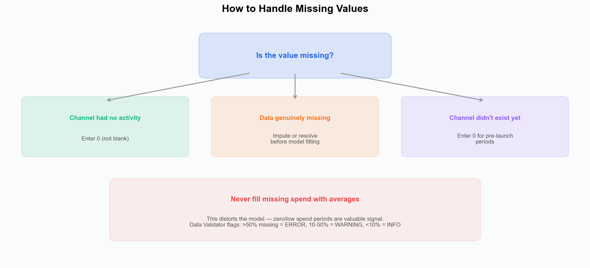

# Data Preparation --- Cleaning and Formatting Best Practices

Good data preparation is the foundation of a reliable marketing mix model. This guide covers best practices for cleaning, formatting, and structuring your data before uploading it to Simba.

*Left: the four preparation steps. Right: key requirements to keep in mind --- date is detected by column name (not position), CSV only, no negatives in spend, and multiplier/hierarchy are always required.*

---

## Before You Start

Simba's [Data Validator](../platform-guide/data-auditor.md) can detect many data quality issues after upload. It is not automatic --- you trigger it by clicking **Start Validator Agent** in the Warehouse configuration screen. However, addressing obvious problems beforehand leads to faster model setup and better results.

---

## Step 1: Consolidate Your Data Sources

Marketing data typically lives across multiple platforms. Gather data from:

- **Ad platforms** --- Google Ads, Meta Ads Manager, TikTok Ads, DV360
- **TV buying systems** --- GRP or spend data from your media agency
- **OOH platforms** --- Out-of-home spend or impression data
- **Business systems** --- Revenue, sales, or conversion data from your CRM, ERP, or analytics platform
- **External data** --- Pricing, weather, economic indicators

Combine everything into a **single CSV file** with consistent time periods. Simba accepts CSV format only (50MB max). Excel (.xlsx) is not supported --- export to CSV before uploading.

---

## Step 2: Align Time Periods

All variables must share the same time granularity:

- If your revenue data is weekly, aggregate all media data to weekly totals.
- Simba auto-detects periodicity (daily, weekly, monthly) from the date column spacing. Any weekly alignment is accepted --- there is no requirement to use Monday-start weeks.
- YYYY-MM-DD format is recommended for dates, but Simba supports 10 date formats and will auto-parse. See [Data Requirements](./data-requirements.md) for the full list.

### Common Pitfalls

- Media platforms may report on different day boundaries (e.g., Facebook uses PST).
- TV data may come in 4-week periods --- convert to weekly.
- Don't mix calendar months with ISO weeks.

---

## Step 3: Handle Missing Values

The model does **not** auto-fill missing values. All NaN/blank cells must be resolved before model fitting. The Data Validator will flag missing data with severity based on percentage: >50% missing = error, 10--50% = warning, <10% = info.

*Zero spend should be entered as 0, not left blank. Genuinely missing data must be imputed or resolved before fitting. Never fill missing spend with averages --- zero/low spend periods are valuable signal.*

| Scenario | Recommended Action |
|---|---|
| Channel had zero spend | Enter **0** (not blank) |
| Data is genuinely missing | Impute using an appropriate method (e.g., median for spend, forward-fill for controls) or remove the affected rows |
| Channel didn't exist yet | Enter **0** for periods before launch |
| Temporary data gap (1--2 periods) | Interpolate if reasonable, or impute |

**Never fill missing values with averages** --- this distorts the model's ability to measure impact during low/zero activity periods. Zero-spend weeks are valuable signal because they show what happens when a channel is "off."

---

## Step 4: Standardize Units and Check for Errors

### Units

- Use a **single currency** for all spend data (convert if needed). Simba does not perform currency conversion --- this is your responsibility.
- Keep impression data in consistent units (thousands, millions, or raw counts --- just be consistent).
- Use the same revenue metric throughout (gross vs net --- pick one).

### Negative Values

Negative values are flagged as errors by the Data Validator in these columns:

- **Media spend** --- cannot be negative
- **Price / distribution** --- cannot be negative
- **Multiplier** --- cannot be negative

If your revenue data includes returns or refunds that produce negative values, consider netting them against gross revenue to produce a non-negative series.

### Required Columns

Remember that **multiplier** and **hierarchy** columns are always required:

- **Multiplier:** If your KPI is already revenue, set the multiplier column to all 1s.
- **Hierarchy:** For single-brand models, use a single repeated value (e.g., your brand name).

See [Data Requirements](./data-requirements.md) for full details.

---

## Step 5: Check for Anomalies

Before uploading, manually inspect your data for:

- **Spikes** --- Unusually high spend or revenue periods (are they real or data errors?). The Data Validator's outlier check uses IQR-based spike detection.
- **Zeros** --- Unexpected zero values that should have data.
- **Duplicates** --- Overlapping time periods.
- **Structural breaks** --- Sudden level shifts in your data that might indicate a data collection change rather than a real business event.

---

## Step 6: Add Context Variables

Enrich your model with non-media variables that explain business outcomes:

- **Promotions** --- Binary flags (0/1) for sale periods or use discount depth.
- **Pricing** --- Price index or actual prices.
- **Distribution changes** --- New store openings, distribution expansions.
- **External shocks** --- Supply chain disruptions, competitor launches.

Note: Holiday and event effects can be configured directly in Simba's model setup using the holiday selector (with country-based lookup), so you do not need to include them as columns in your data. See [Seasonality](../core-concepts/seasonality.md).

---

## Final Checklist

Before uploading to Simba:

- [ ] All data is in a **single CSV file** (not Excel)
- [ ] A date column exists with a recognized name (date, week, month, or period)
- [ ] All columns have clear, descriptive headers (for accurate semantic matching)
- [ ] Multiplier and hierarchy columns are included
- [ ] Time granularity is consistent across all variables
- [ ] Zero spend is entered as 0, not blank
- [ ] No NaN/blank cells remain (impute or resolve)
- [ ] No negative values in spend, price, multiplier, or distribution columns
- [ ] No duplicate time periods
- [ ] Currency and units are consistent throughout
- [ ] File size is under 50MB

---

## What Happens Next

After uploading your data, click **Start Validator Agent** in the Warehouse configuration screen to run the [Data Validator](../platform-guide/data-auditor.md). You can choose between two validation depths:

- **Fast validation** (2--3 min) --- Standard analysis for typical datasets.
- **Deep analysis** (4--6 min) --- Comprehensive analysis for complex datasets.

The Data Validator runs 10 specialized checks covering schema integrity, frequency diagnostics, alignment, multiplier logic, controls, coverage, outlier detection, multicollinearity, leakage, and documentation quality --- then provides categorized findings and actionable recommendations.

---

## Next Steps

- [Data Validation](./data-validation.md) --- Deep dive into the Data Validator results.
- [Data Requirements](./data-requirements.md) --- What data you need and supported formats.
- [Supported Channels](./supported-channels.md) --- Full list of channel types Simba recognizes.
