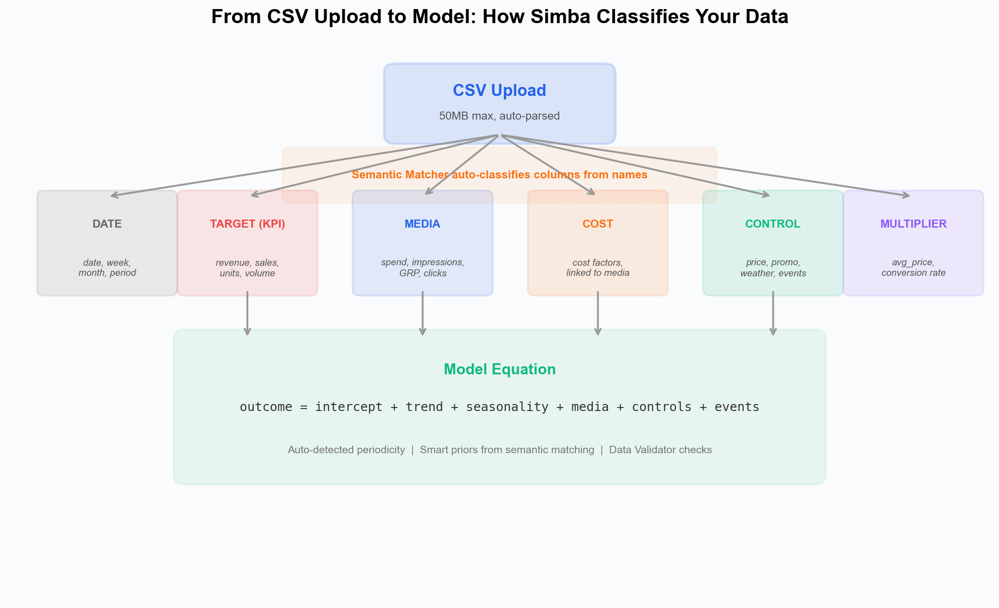
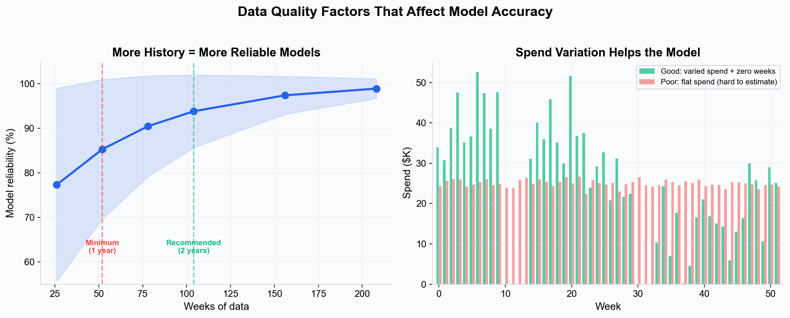
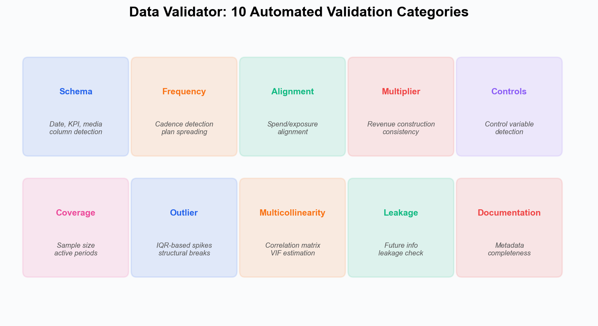

# Data Requirements --- What Data You Need for Marketing Mix Modeling

To build an accurate marketing mix model in Simba, you need structured time-series data that captures your business outcomes and marketing activities. This guide explains exactly what data is required, what formats are supported, and how much history you need.

---

## Overview

Marketing mix modeling works by analyzing the relationship between your marketing inputs (spend, impressions, GRPs) and business outcomes (revenue, conversions, sales) over time. The more complete and accurate your data, the more reliable your model will be.

*Simba's semantic matcher auto-classifies your columns from their names into variable types. Each type feeds into a different part of the model equation.*

---

## Required Data

### 1. Target Variable (Dependent Variable)

Your primary business outcome that you want to measure marketing's impact on:

- **Revenue** --- Total sales revenue per time period
- **Conversions** --- Number of conversions, sign-ups, or transactions
- **Units sold** --- Physical or digital units sold (pair with a multiplier variable for revenue modeling)
- **Leads** --- Number of qualified leads generated

You need **one target variable** per model. If you want to model multiple outcomes, create separate models.

### 2. Media Variables (Independent Variables)

Marketing activity data for each channel you want to measure. Simba's semantic matcher recognizes 13 channel categories automatically from column names:

| Channel Category | Recognized Keywords |
|---|---|
| **TV** | tv, television, ctv, ottv, linear, broadcast, cable, satellite, connected |
| **Digital / Display** | digital, online, programmatic, display, banner, native, dsp |
| **Social** | social, facebook, instagram, tiktok, linkedin, snapchat, pinterest, meta |
| **Search** | search, sem, ppc, google, bing, paid_search, adwords |
| **Video** | video, youtube, streaming, ott, vod, preroll |
| **Radio / Audio** | radio, audio, podcast, spotify, pandora, streaming_audio |
| **Other** | print, ooh, email, influencer, affiliate, direct, mobile, cinema, sponsorship |

For each channel, you can provide any of these metric types:

| Metric Type | Recognized Keywords | Notes |
|---|---|---|
| **Spend** | spend, cost, budget, investment, expense, adspend, mediaspend | Most common input |
| **Impressions** | imps, impressions, views, reach, eyeballs | Good for digital channels |
| **GRP** | grp, trp, rating, ratings | Standard for TV |
| **Clicks** | clicks, click, ctr | Useful for search/display |
| **Engagement** | engagement, interactions | For social channels |

### 3. Control Variables (Optional but Recommended)

Non-marketing factors that influence your target variable:

- **Pricing** --- Product prices, discounts, promotions
- **Distribution** --- Store count, availability, distribution changes
- **Competitors** --- Competitor spend or activity (if available)
- **Economic indicators** --- Consumer confidence, unemployment, GDP
- **Weather** --- Temperature, precipitation (for weather-sensitive products)

### 4. Multiplier Variables (Optional)

If your target variable is units or volume rather than revenue, you can include a **multiplier variable** (e.g., average price) that Simba uses to construct revenue. Recognized keywords: price, avg_price, multiplier, conversion.

### 5. Hierarchy Columns (Optional)

For portfolio modeling across brands, regions, or segments, you can include hierarchy columns. Recognized keywords: brand, market, region, category, segment, geography.

---

## Data Format

### File Format

Simba accepts data in **CSV format** (.csv) only.

- **Maximum file size:** 50MB
- **MIME types accepted:** text/csv, application/csv, text/plain, application/vnd.ms-excel
- Excel (.xlsx) files are **not supported** --- export to CSV before uploading.

### Date Formats

Simba automatically parses dates in any of these formats:

| Format | Example |
|---|---|
| `YYYY-MM-DD` (recommended) | 2023-09-04 |
| `DD-MM-YYYY` | 04-09-2023 |
| `MM/DD/YYYY` | 09/04/2023 |
| `YYYY/MM/DD` | 2023/09/04 |
| `DD-Mon-YY` | 04-Jan-23 |
| `DD-Mon-YYYY` | 04-Jan-2023 |
| `DD/MM/YYYY` | 04/09/2023 |
| `YYYY.MM.DD` | 2023.09.04 |
| `MM-DD-YYYY` | 09-04-2023 |
| `DD Month YYYY` | 04 September 2023 |

If none of these match, Simba falls back to pandas' automatic datetime inference.

### Structure

Your data should be in a **tabular format** with:

- **Rows** representing time periods (e.g., weeks)
- **Columns** representing variables (target, media channels, controls)
- **One column** should contain the date/period identifier

Example structure:

| date | revenue | tv_spend | digital_spend | social_spend | ooh_spend | price_index |
|---|---|---|---|---|---|---|
| 2023-01-02 | 245000 | 50000 | 30000 | 15000 | 10000 | 1.00 |
| 2023-01-09 | 262000 | 50000 | 35000 | 15000 | 10000 | 1.00 |
| 2023-01-16 | 258000 | 45000 | 32000 | 18000 | 10000 | 0.95 |

Column names are flexible --- Simba's semantic matcher identifies variable types from keywords in the names. There are no strict naming requirements, but descriptive names (e.g., `tv_spend`, `social_impressions`) will auto-classify more accurately than generic names (e.g., `col1`, `col2`).

---

## Time Granularity

Simba automatically detects the frequency of your data from the date column spacing:

| Granularity | Detection | Notes |
|---|---|---|
| **Weekly** | ~7-day gaps between rows | Recommended for most use cases |
| **Daily** | ~1-day gaps between rows | More data points but may introduce noise. Best for high-frequency decision-making (e.g., e-commerce, performance marketing). Enables weekly seasonality. |
| **Monthly** | ~30-day gaps between rows | Acceptable but provides fewer data points for modeling |
| **Irregular** | Variable gaps | Supported but may require careful configuration |

All variables must use the **same time granularity**. No manual configuration is needed --- periodicity is auto-detected.

---

## Minimum Data Requirements

*Left: model reliability improves with more historical data, with diminishing returns beyond 2 years. Right: channels with varied spend (including zero-spend periods) give the model more signal to estimate effects accurately.*

| Requirement | Minimum | Recommended |
|---|---|---|
| **Time periods** | 52 weeks (1 year) | 104+ weeks (2+ years) |
| **Media channels** | 1 | 3--10 |
| **Completeness** | No gaps longer than 2 consecutive periods | No gaps at all |
| **Variation** | Some spend variation per channel | Meaningful variation including periods of zero/low spend |

### Why More History Helps

- **Seasonality:** With only 1 year, the model sees each seasonal pattern exactly once and cannot distinguish it from a one-time event. With 2+ years, seasonal patterns are confirmed by repetition.
- **Stability:** More data reduces the influence of any single anomalous period on the results.
- **Channel identification:** Channels that were only active for a few weeks need strong priors to compensate for limited data. See [Priors and Distributions](../core-concepts/priors-and-distributions.md).

### Why Spend Variation Matters

The model learns a channel's effect by observing what happens when spend changes. If spend is flat (the same amount every week), the model cannot distinguish the channel's contribution from the baseline. Periods of zero or low spend are particularly valuable because they show what happens when the channel is "off."

---

## Data Quality Tips

1. **Consistency** --- Use the same units and currency throughout.
2. **Completeness** --- Fill gaps or mark them explicitly. Simba's Data Validator will flag missing values.
3. **Accuracy** --- Double-check that spend data reconciles with your media buying records.
4. **Granularity** --- More granular channel breakdowns (e.g., Facebook vs Instagram vs TikTok rather than "Social") yield better insights.
5. **History** --- More history means better seasonal modeling and more robust estimates.
6. **Descriptive names** --- Use column names that include the channel and metric type (e.g., `tv_spend`, `social_impressions`) so the semantic matcher can auto-classify them correctly.

---

## What Simba's Data Validator Checks

After upload, Simba's **Data Validator** automatically assesses your data across 10 categories:

*The Data Validator runs 10 automated checks covering everything from basic schema validation to advanced multicollinearity and leakage detection.*

| Category | What It Checks |
|---|---|
| **Schema** | Date column, KPI column, media/cost columns detected, naming conventions |
| **Frequency** | Data cadence (daily/weekly/monthly), plan spreading patterns |
| **Alignment** | Spend and exposure alignment, linked metric consistency |
| **Multiplier** | Revenue construction logic, multiplier variable consistency |
| **Controls** | Control variable detection, seasonality indicators |
| **Coverage** | Sample size adequacy, media channel active periods, hierarchy coverage |
| **Outlier** | IQR-based spike detection, structural breaks |
| **Multicollinearity** | Correlation matrix analysis, VIF (Variance Inflation Factor) estimation |
| **Leakage** | Future information leakage detection |
| **Documentation** | Metadata completeness and column documentation |

The Data Validator produces a health score and actionable recommendations for each category, helping you identify and fix data issues before model fitting.

---

## Next Steps

- [Data Preparation](./data-preparation.md) --- How to prepare and clean your data for modeling.
- [Data Validation](./data-validation.md) --- Deep dive into the Data Validator results.
- [Supported Channels](./supported-channels.md) --- Full list of channel types Simba recognizes.

---

*See also: [Priors and Distributions](../core-concepts/priors-and-distributions.md) | [Supported Channels](./supported-channels.md)*
