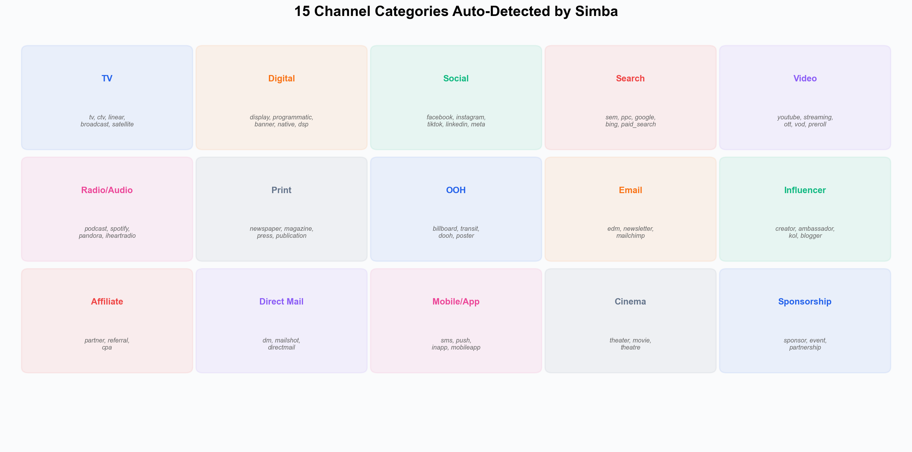
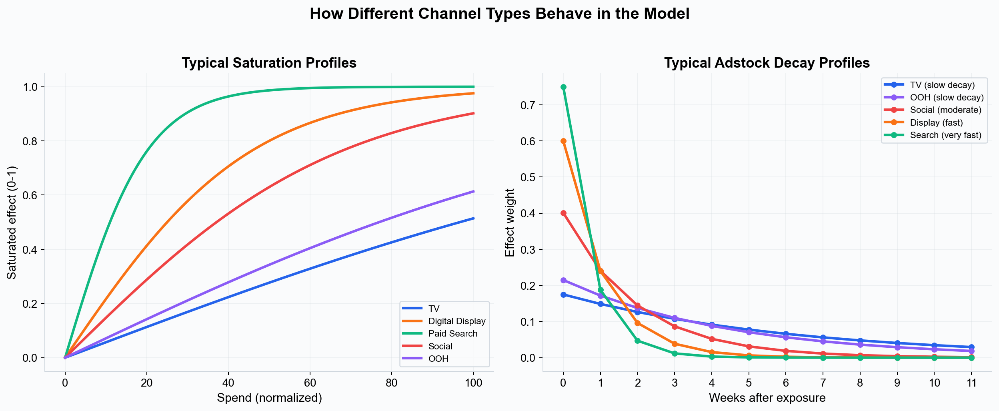

# Supported Channels --- Media Types You Can Model in Simba

Simba can model any marketing channel where you have time-series data on spend or activity. The platform's semantic matcher auto-detects channel types from your column names, and the Bayesian framework handles the unique characteristics of each channel --- different [saturation](../core-concepts/saturation-curves.md) rates, [decay](../core-concepts/adstock-effects.md) patterns, and response curves.

---

## Channel Categories

Simba's semantic matcher recognizes **15 channel categories** from column name keywords. You do not need to manually classify channels --- naming your columns descriptively (e.g., `tv_spend`, `facebook_impressions`) is sufficient.

*Simba's semantic matcher auto-classifies media columns into 15 categories based on keywords in the column name.*

| Category | Recognized Keywords |
|---|---|
| **TV** | tv, television, ctv, ottv, linear, broadcast, cable, satellite, connected |
| **Digital / Display** | digital, online, web, programmatic, display, banner, native, dsp |
| **Social** | social, facebook, fb, instagram, ig, tiktok, linkedin, snapchat, pinterest, meta, whatsapp |
| **Search** | search, sem, ppc, google, bing, paid_search, paidsearch, adwords |
| **Video** | video, youtube, yt, vimeo, streaming, ott, vod, preroll, midroll |
| **Radio / Audio** | radio, audio, podcast, spotify, pandora, streaming_audio, siriusxm, iheartradio |
| **Print** | print, newspaper, magazine, press, publication, periodical |
| **OOH** | ooh, outdoor, billboard, transit, dooh, poster, street, outofhome |
| **Email** | email, edm, newsletter, mailchimp, mail |
| **Influencer** | influencer, creator, ambassador, kol, blogger |
| **Affiliate** | affiliate, partner, referral, cpa |
| **Direct Mail** | direct, dm, direct_mail, mailshot, directmail |
| **Mobile / App** | mobile, app, sms, push, notification, inapp, mobileapp |
| **Cinema** | cinema, theater, movie, theatre |
| **Sponsorship** | sponsor, sponsorship, event, partnership |

---

## Metric Types

Each media channel requires a **media variable** (the activity metric) paired with a **cost variable** (the spend). The media variable metric type affects the default saturation scalar.

Simba's metric type dropdown offers four options:

| Metric Type | Default Scalar | Best For |
|---|---|---|
| **Spend** | 100,000 | When spend is your primary activity metric |
| **Impressions** | 1,000,000 | Digital display, social, video --- where impression counts are available |
| **GRPs** | 300 | Traditional TV and radio --- the industry standard for reach measurement |
| **Clicks** | 100,000,000 | Paid search and display --- where click data is primary |

The metric type **does not change the model structure** --- it only sets the default saturation scalar (which you can override). All metrics flow through the same [adstock + saturation + coefficient](../core-concepts/incrementality.md) pipeline. Smart priors are calculated from cost shares and channel activity patterns, not from the metric type.

**Tip:** Use the most granular metric available. Impressions are generally more informative than spend because they reflect actual media delivery rather than cost, which can fluctuate due to CPM (cost per thousand impressions) changes.

---

## Typical Channel Behavior

Different channel types have characteristic saturation and decay patterns. These are not hard-coded --- the model estimates them from your data --- but they reflect common patterns that smart priors are calibrated around.

*Left: channels like TV and OOH can absorb more spend before saturating (large scalar x alpha), while search saturates quickly (small scalar). Right: TV and OOH effects persist for many weeks (high decay rate), while search and display effects fade quickly.*

### High Saturation, Slow Decay

**TV, OOH, Cinema:** These broad-reach channels can absorb substantial spend before diminishing returns set in. Their effects persist for weeks --- a TV ad seen today may influence a purchase decision two or three weeks later. Typical decay rates: 0.7--0.9.

### Moderate Saturation, Moderate Decay

**Social, Video/YouTube, Radio/Audio, Influencer:** These channels have a moderate capacity for spend and effects that last one to three weeks. Social and video can build frequency over time before fatigue sets in. Typical decay rates: 0.5--0.7.

### Fast Saturation, Fast Decay

**Search, Display, Affiliate, Email:** Performance channels that drive immediate response. They saturate quickly because the available audience at any point in time is limited. Effects are concentrated in the week of exposure with little carryover. Typical decay rates: 0.2--0.5.

---

## Required Data Structure

For each media channel, you need **two columns** in your CSV:

1. **Media variable** --- The activity metric (impressions, GRPs, clicks, or spend-as-activity).
2. **Cost variable** --- The spend in currency for that channel in that period.

These are linked in the variable selection step. A cost variable must pair with a media variable --- two cost columns cannot link together, and two media columns cannot link together.

### Example Column Naming

| Column Name | Auto-Detected As |
|---|---|
| `tv_grps` | TV media variable (GRP metric) |
| `tv_spend` | TV cost variable |
| `facebook_impressions` | Social media variable (Impressions metric) |
| `facebook_spend` | Social cost variable |
| `google_search_clicks` | Search media variable (Clicks metric) |
| `google_search_cost` | Search cost variable |

---

## Control Variables

In addition to media channels, include **control variables** for non-media factors that influence your KPI. These are classified separately from media and use linear effects (not saturation/adstock).

| Variable Type | Examples | Smart Prior Default |
|---|---|---|
| **Pricing** | Price index, discount depth, promotional flags | Negative effect (price up = sales down) |
| **Distribution** | Store count, availability score | Positive effect |
| **Promotions** | Promotion flag (0/1), discount percentage | Positive effect |
| **Competition** | Competitor spend, share of voice (your brand's portion of total category advertising) | Negative effect |
| **Economic** | Consumer confidence, unemployment rate | Varies |
| **Weather** | Temperature, precipitation | Varies |

**Note on holidays and events:** Do not include holiday flags as data columns. Events and holidays are configured directly in Simba's model setup via the Holiday Selector, which provides country-based holiday lookup and GP-smoothed event effects. See [Seasonality](../core-concepts/seasonality.md).

---

## Best Practices

1. **Use granular channel breakdowns** --- "Meta Impressions" and "TikTok Impressions" as separate channels is more useful than a combined "Social Spend." Per-platform breakdowns give you per-platform ROI and optimization insights.
2. **Separate branded from non-branded search** --- Branded search often captures existing demand (driven by other channels like TV) rather than creating new demand. Modeling it separately avoids inflating search attribution.
3. **Include zero-spend periods** --- Weeks where a channel had no activity are valuable signal for the model. Enter them as 0 (not blank). See [Data Preparation](./data-preparation.md).
4. **Be consistent within channel** --- Use the same metric type (impressions or GRPs) for a channel across all time periods.
5. **Pair every media variable with a cost variable** --- Both are required for each channel.

---

## Next Steps

- [Data Requirements](./data-requirements.md) --- Full data format and requirements.
- [Data Preparation](./data-preparation.md) --- Cleaning and formatting best practices.
- [Saturation Curves](../core-concepts/saturation-curves.md) --- How each channel's diminishing returns are modeled.
- [Adstock Effects](../core-concepts/adstock-effects.md) --- How carryover differs by channel type.
