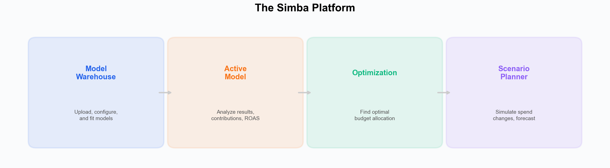

# Getting Started with Simba

Simba is a fully transparent Bayesian Marketing Mix Modeling platform. Every assumption is visible, every prior is configurable, and every result comes with calibrated uncertainty intervals. No code required.

---

## Where to Start

- **New to marketing mix modeling?** Start with [What is Simba?](./what-is-simba.md) to understand the platform and methodology
- **Ready to build your first model?** Try the [hands-on tutorial](./first-model-tutorial.md) with sample data, or jump to the [Quick Start Guide](./quick-start-guide.md) for a step-by-step walkthrough
- **Setting up your team or account?** See [Account Setup](./account-setup.md) for registration, plans, and project configuration
- **Looking for a specific feature?** Browse the [Platform Overview](./platform-overview.md) to find where things are

> **Unfamiliar with a term?** See the [Glossary](../../resources/glossary.md) for definitions.

---

## In This Section

| Guide | Description |
|---|---|
| [What is Simba?](./what-is-simba.md) | What Simba does, who it is for, and how it differs from traditional MMM tools |
| [Your First Model](./first-model-tutorial.md) | Hands-on tutorial with sample data — build a model in under 2 hours |
| [Quick Start Guide](./quick-start-guide.md) | Step-by-step from sign-up to your first optimized budget recommendation |
| [Account Setup](./account-setup.md) | Registration, current plans, and project configuration |
| [Platform Overview](./platform-overview.md) | Navigating the interface --- every tab, wizard step, and feature location |

---

## The Simba Platform

Simba is organized around four main areas:

1. **Model Warehouse** --- Upload your data, run the Data Validator, configure your model through a 5-step wizard, and manage saved models and portfolios.
2. **Active Model** --- Analyze your fitted model: channel contributions, response curves, ROAS, coefficient posteriors with 94% HDI (Highest Density Interval --- the range of most credible values), and diagnostics.
3. **Optimization** --- Find the optimal budget allocation across channels, with risk-adjusted recommendations using the full posterior distribution.
4. **Scenario Planner** --- Simulate "what-if" budget scenarios and forecast their revenue impact.

---

## Need Help?

- [Core Concepts](../core-concepts/) --- Bayesian methodology, saturation, adstock, priors, and more
- [Data Guide](../data/) --- Data requirements, preparation, and validation
- [FAQ](../faq/) --- Common questions answered
- [Open a GitHub issue](https://github.com/nialloulton/simba-mmm/issues) or email **info@pymc-labs.com** | [Book a call](https://calendly.com/niall-oulton)

---

**Next step:** [What is Simba?](./what-is-simba.md) to understand the platform, or [Quick Start Guide](./quick-start-guide.md) to build your first model.
