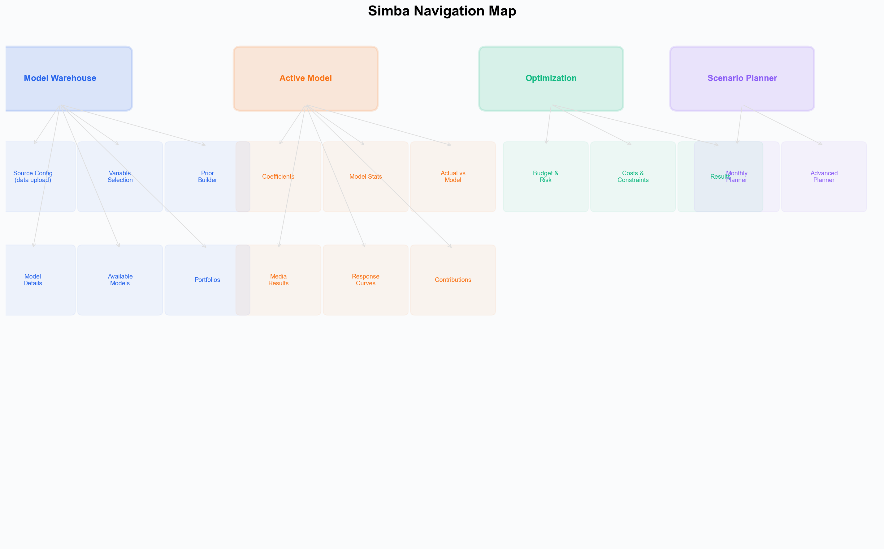

# Platform Overview --- Navigating the Simba Interface

This guide walks you through the Simba interface so you know exactly where to find every feature. Simba is organized around a sidebar navigation with four main sections --- Model Warehouse, Active Model, Optimization, and Scenario Planner --- designed to guide you through the modeling process while giving you the flexibility to jump between stages as needed.

---

## Navigation Structure

*The four main areas and their sub-sections. Model Warehouse contains the 5-step configuration wizard; Active Model shows 7 analysis tabs for MMM models.*

Simba uses a left sidebar for primary navigation. The four main sections are:

1. **Model Warehouse** --- Your entry point and model management hub
2. **Active Model** --- View results for the currently selected model
3. **Optimization** --- Budget Optimizer for finding the best allocation
4. **Scenario Planner** --- Simulate budget changes and forecast outcomes

Active Model, Optimization, and Scenario Planner require a model to be selected in the Model Warehouse first. Until you select a model, a prompt in the sidebar reminds you to do so.

---

## Model Warehouse

**Purpose:** Create, configure, manage, and compare your models.

The Model Warehouse is your landing page and the starting point for all work in Simba. It contains several tabs:

### Data Source Configuration

Upload your dataset and configure how Simba should interpret it. This includes:

- **Data upload** --- Drag-and-drop or file selection for CSV uploads (Excel not supported).
- **Column mapping** --- Assign columns to roles: date, dependent variable (KPI), media channels, spend columns, control variables, and hierarchy columns.
- **Semantic matching** --- Simba automatically detects column types using semantic analysis of variable names, recognizing channel types (TV, digital, social, search, etc.), metric types (cost, impressions, GRPs, clicks), and control variable types (price, promotions, distribution).
- **Data Validator** --- Run the Validator Agent to check data quality. It analyzes your dataset and presents validation results including issue detection, column statistics, and data readiness assessment.

### Model Configuration

This is where you set up how Simba should model your data:

- **Variable Selection** --- Choose which columns to include as media channels, spend variables, and controls. Simba's semantic matcher suggests categorizations automatically.
- **Prior Configuration (Prior Builder)** --- For each media channel, configure:
  - **Prior distributions** for the channel coefficient (effect size). The default distribution is InverseGamma. Use the visual distribution editor to set mean and spread, or accept the smart default.
  - **Adstock parameters** --- Set decay range (lower and upper bounds) and effect period. Smart defaults set these based on semantic channel type detection (e.g., social media gets fast decay, TV gets slow decay).
  - **Saturation scalar** --- Auto-filled with the channel's average value from your data.
- **Control Variable Priors** --- Smart defaults detect control variable types semantically (price, promotion, distribution) and set appropriate distributions and sign constraints.
- **Industry Benchmark Selector** --- Choose your industry (FMCG, Retail, TelCo, Financial Services, E-Commerce, or Other) to calibrate expected total media effect. This drives the smart prior coefficients.
- **Smart Defaults** --- A single click applies data-informed priors to all channels based on cost share analysis, industry benchmarks, and semantic channel detection. See [Smart Defaults](../platform-guide/smart-defaults.md) for details.

Read more: [Model Configuration](../platform-guide/model-configuration.md) | [Smart Defaults](../platform-guide/smart-defaults.md)

### Model Execution

Once configured, click **Build Model** to start the Bayesian inference. The execution interface shows:

- **Progress indicator** --- Real-time status of the MCMC sampling process.
- **Estimated time remaining** --- Based on your dataset size and model complexity.

You can navigate away during execution and return when it completes. Simba will notify you.

### Model Management

Over time, you will build multiple models --- different time periods, different channel sets, different prior configurations. The Warehouse helps you organize and compare them:

- **Model list** --- All models in your project, sortable by date, name, and status.
- **Model comparison** --- Select two or more completed models and compare their results side by side.
- **Clone model** --- Duplicate a model configuration as a starting point for a new run with adjusted settings.

---

## Active Model

**Purpose:** View detailed results for the currently selected model.

When you select a completed model in the Warehouse, the Active Model section becomes available. This is the most information-rich area of Simba:

- **Channel Contribution Chart** --- A stacked area or waterfall chart showing how much each channel contributed to the KPI over the modeled period. Each channel includes 94% HDI (3%-97%) credible intervals.
- **ROAS Summary** --- A table and bar chart showing the return on ad spend for each channel, with posterior medians and 94% HDI credible intervals.
- **Adstock Curves** --- Per-channel visualizations of the estimated carryover effect.
- **Saturation Response Curves** --- Per-channel visualizations showing how the KPI responds to increasing spend, highlighting where diminishing returns begin.
- **Model Fit** --- Actual versus predicted KPI values over time, so you can visually assess how well the model captures your data.
- **Posterior Distributions** --- The full posterior distribution plots for every model parameter.
- **Diagnostics** --- Convergence diagnostics (R-hat, effective sample size), posterior predictive checks, and model comparison metrics.

Read more: [Incremental Measurement](../platform-guide/measurement.md)

---

## Optimization (Budget Optimizer)

**Purpose:** Automatically find the best budget allocation.

The Budget Optimizer moves from manual "what if" analysis to algorithmic optimization:

- **Objective Selector** --- Choose what you want to maximize (e.g., revenue, conversions) or set a target KPI value.
- **Budget Constraint** --- Enter your total available budget.
- **Channel Constraints** --- Optionally set minimum and maximum spend per channel. For example, you might require at least a baseline level of brand advertising or cap spend on an experimental channel.
- **Optimization Results** --- After clicking **Optimize**, Simba displays:
  - The recommended allocation per channel
  - The expected KPI outcome with credible intervals
  - A comparison against your current allocation showing the estimated improvement
  - A visual breakdown of where budget shifted and why

Read more: [Budget Optimization](../platform-guide/budget-optimization.md)

---

## Scenario Planner

**Purpose:** Simulate budget changes and forecast outcomes.

The Scenario Planner lets you create and compare hypothetical budget allocations:

- **Budget Sliders** --- Adjust each channel's spend up or down using sliders or direct numeric input. Changes are expressed as absolute values or percentage shifts from the current allocation.
- **Simulation Output** --- As you adjust budgets, Simba recalculates the predicted KPI using your fitted model. Results include the median prediction and credible intervals.
- **Scenario Comparison** --- Save multiple scenarios and view them side by side in a comparison table or chart. This is useful for presenting options to stakeholders.
- **Scenario Library** --- Previously saved scenarios are stored here for reference and re-use.

Read more: [Scenario Planning](../platform-guide/scenario-planning.md)

---

## Settings

The **Settings** area, accessible from the main navigation menu or the gear icon, contains:

### Project Settings
- Project name and description
- Default currency and date format
- Default KPI selection

### Team Management
- Invite and remove team members
- View team activity

### Billing
- Current plan and usage
- Payment method management
- Invoice history

### Profile
- Update your name, email, and password
- Notification preferences

### Security
- Two-factor authentication setup
- Active session management

For details on security infrastructure, see [Security and Compliance](../security/README.md).

---

## Navigation Reference

Here is a summary of the main navigation structure:

| Sidebar Item | What It Contains |
|---|---|
| **Model Warehouse** | Data upload, model configuration, model list, comparison, and management |
| **Active Model** | Channel contributions, ROAS, response curves, diagnostics |
| **Optimization** | Budget Optimizer and allocation recommendations |
| **Scenario Planner** | Budget simulation, scenario comparison, and forecasting |

Active Model, Optimization, and Scenario Planner require selecting a model in the Warehouse first.

---

## Tips

- The **notification bell** in the top-right corner shows model completion alerts and system messages.
- Most charts support **hover for details** --- hover over any data point to see exact values and credible intervals.
- **Export buttons** are available on charts and tables for downloading results.
- Credible intervals throughout the platform use **94% HDI** (3%-97%) by default.

---

## Next Steps

Now that you know your way around the interface:

- Follow the [Quick Start Guide](quick-start-guide.md) to build your first model using this interface.
- Read about [Data Requirements](../data/data-requirements.md) to prepare your dataset.
- Explore [Smart Defaults](../platform-guide/smart-defaults.md) to understand how Simba auto-generates model configuration.

For questions about navigating the platform, [open a GitHub issue](https://github.com/nialloulton/simba-mmm/issues) or email **info@pymc-labs.com**.

---

## Related Documentation

- [What is Simba?](what-is-simba.md) --- Product overview and positioning
- [Quick Start Guide](quick-start-guide.md) --- Step-by-step first model walkthrough
- [Account Setup](account-setup.md) --- Plans, projects, and team management
- [Data Validator](../platform-guide/data-auditor.md) --- Data validation and quality checks
- [Incremental Measurement](../platform-guide/measurement.md) --- The modeling methodology
- [Scenario Planning](../platform-guide/scenario-planning.md) --- Simulation and forecasting
- [Budget Optimization](../platform-guide/budget-optimization.md) --- Algorithmic budget allocation
