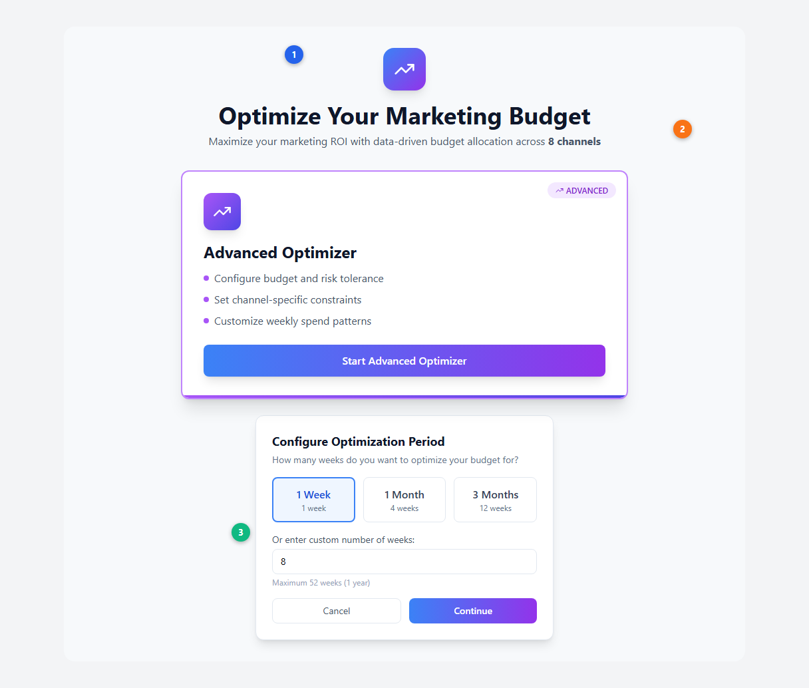
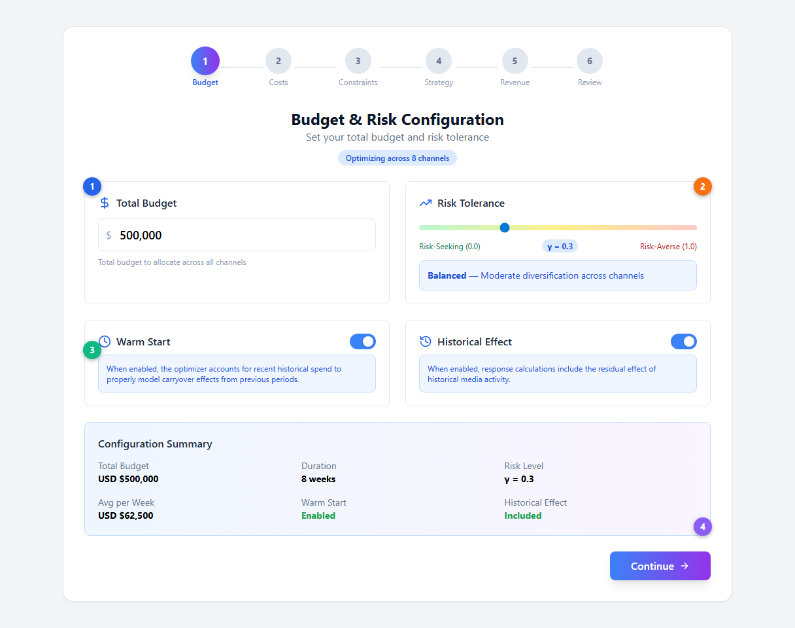
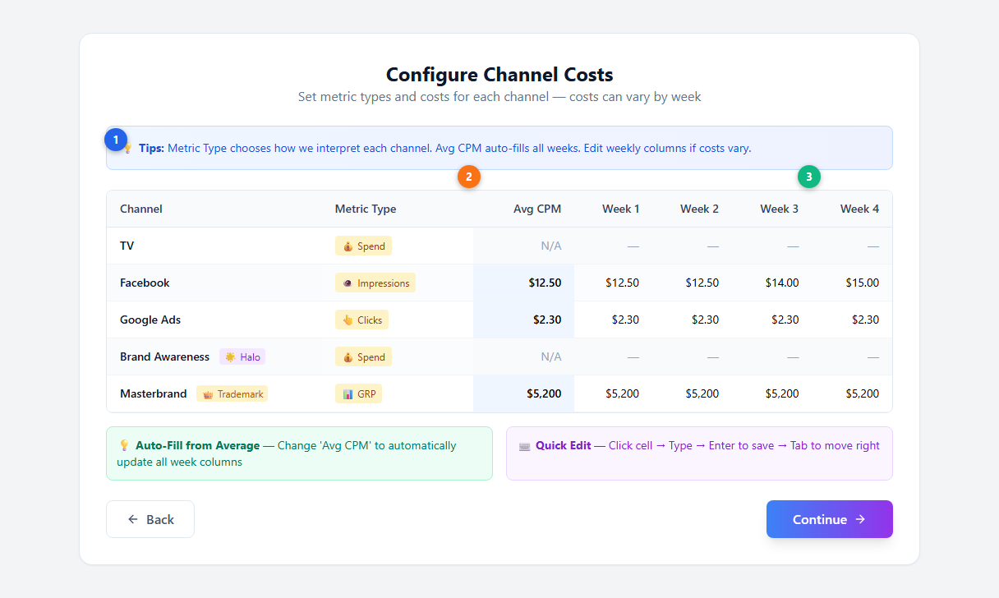
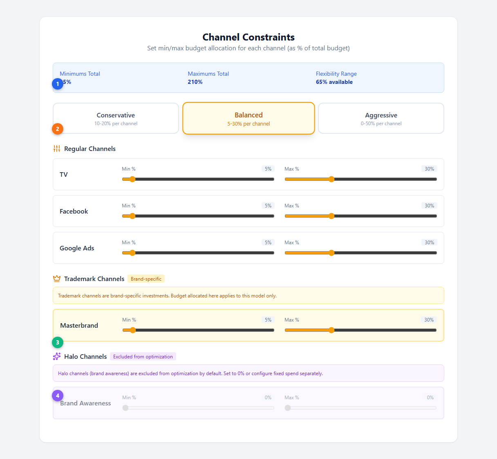
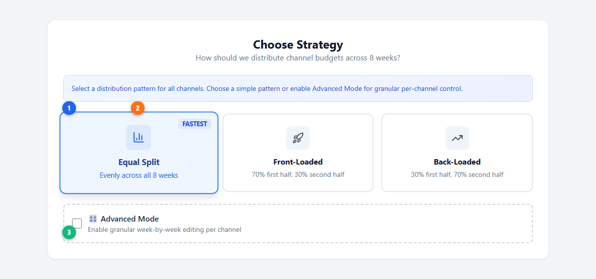
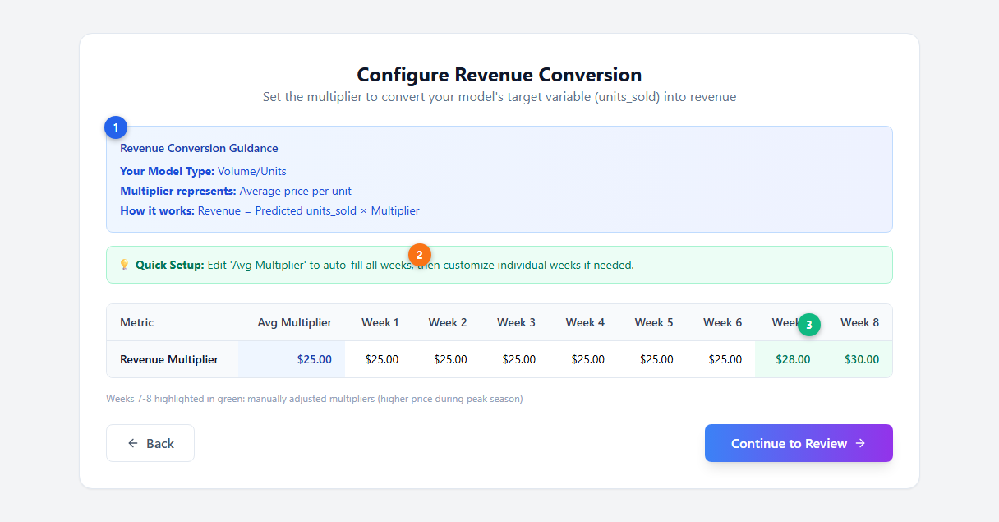
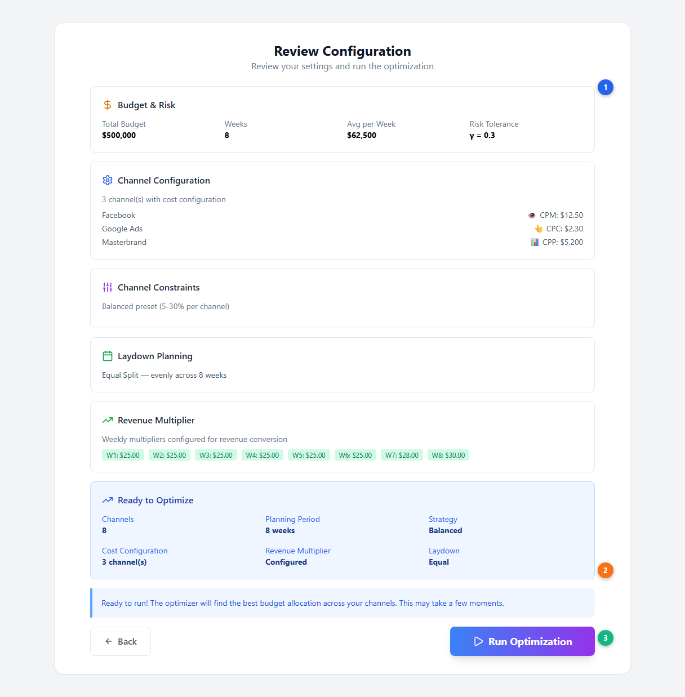
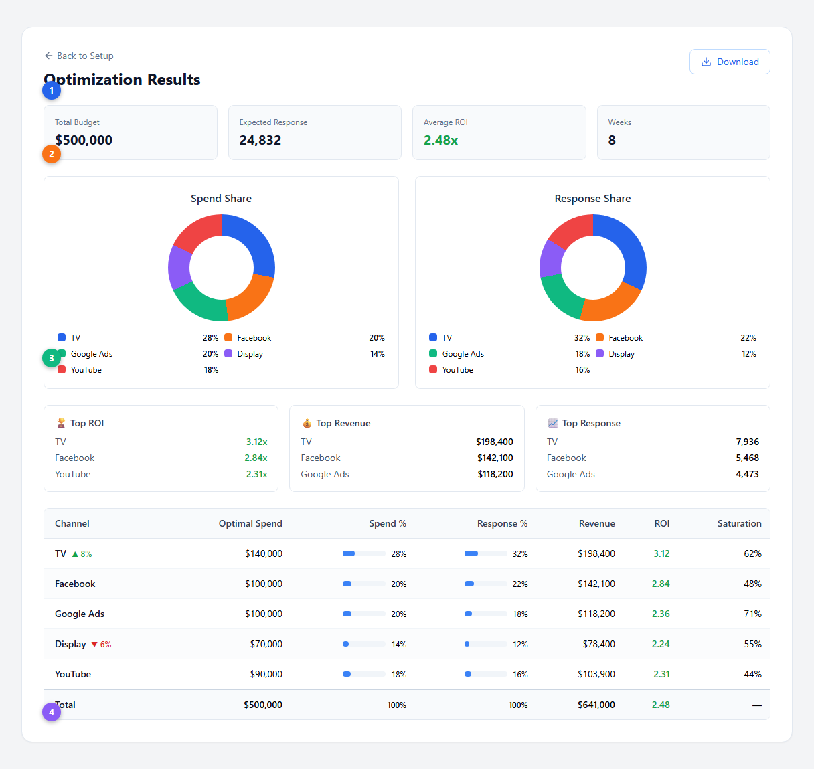

# Budget Optimization --- Risk-Adjusted Spend Allocation

Budget Optimization generates per-channel budget recommendations that maximize expected revenue while respecting your risk tolerance, channel constraints, and spend timing preferences. It uses the full [Bayesian posterior](../core-concepts/bayesian-modeling.md) from your fitted model --- including response curves, [saturation](../core-concepts/saturation-curves.md), [adstock decay](../core-concepts/adstock-effects.md), and parameter uncertainty --- to find the optimal allocation. For the theory behind how optimization works, see [Optimization (Core Concepts)](../core-concepts/budget-optimization.md).

---

## Getting Started

From the Optimization tab, click the **Advanced Optimizer** card and select your planning period.

| # | Element | Description |
|---|---------|-------------|
| 1 | **Hero header** | Shows the gradient icon and channel count from your fitted model |
| 2 | **Optimizer card** | Click to launch the 6-step optimization wizard |
| 3 | **Period selector** | Choose planning horizon: 1 week, 1 month, 3 months, or a custom number of periods (up to 52 weeks / 365 days) |

---

## The Optimization Wizard

The optimizer uses a **6-step wizard** (5 steps if optimizing a single period --- the laydown step is skipped):

1. **Budget & Risk** --- Total budget and risk tolerance
2. **Configure Costs** --- Metric types and cost-per-unit for each channel
3. **Channel Constraints** --- Min/max bounds per channel
4. **Laydown Strategy** --- How to distribute spend across periods *(multi-period only)*
5. **Configure Revenue Conversion** --- Multiplier to convert model output to revenue
6. **Review & Run** --- Confirm settings and launch

---

### Step 1: Budget & Risk Configuration

Set the core optimization parameters.

| # | Element | Description |
|---|---------|-------------|
| 1 | **Total Budget** | The total amount to allocate across all channels for the planning period |
| 2 | **Risk Tolerance (Gamma)** | Slider from 0.0 to 1.0. Controls the tradeoff between maximizing expected return and diversifying to reduce uncertainty. See [how gamma works](../core-concepts/budget-optimization.md#risk-aversion-gamma) |
| 3 | **Warm Start & Historical Effect** | Warm Start accounts for [adstock](../core-concepts/adstock-effects.md) carryover from previous periods. Historical Effect includes residual media effects |
| 4 | **Summary panel** | Live preview of all configuration settings |

**Risk Tolerance in detail:**

The gamma parameter controls how the optimizer balances return against uncertainty:

| Gamma Range | Behaviour | When to Use |
|---|---|---|
| **0.0 --- 0.2** (Risk-Seeking) | Concentrates budget on highest-performing channels regardless of uncertainty | When you trust the model estimates and want maximum expected return |
| **0.3 --- 0.7** (Balanced) | Moderate diversification. Balances expected return with stability | Default for most use cases. Good starting point |
| **0.8 --- 1.0** (Risk-Averse) | Spreads budget to minimize variance. Prioritises reliable channels | When posterior uncertainty is high or you want conservative allocation |

The optimizer maximizes: **E[response] --- gamma x STD[response]** across all posterior samples from your [Bayesian model](../core-concepts/bayesian-modeling.md). This is a mean-variance objective function inspired by [Modern Portfolio Theory](../core-concepts/budget-optimization.md#the-theory-behind-gamma).

> **Technical note:** The UI gamma range (0 --- 1) is scaled internally before optimization. Even small gamma values produce meaningful diversification because the penalty is applied to the standard deviation of the full posterior distribution.

---

### Step 2: Configure Channel Costs

Define how each channel is costed.

| # | Element | Description |
|---|---------|-------------|
| 1 | **Info tips** | Guidance on metric types, average costs, and per-week editing |
| 2 | **Metric Type** | Dropdown per channel: 💰 Spend, 👁️ Impressions, 👆 Clicks, 📊 GRP, 📈 TRP. Halo (🌟) and Trademark (👑) channels are badged |
| 3 | **Avg CPM / per-week columns** | Blue-highlighted average column auto-fills all weeks. Edit individual weeks for seasonal cost variation |

Simba supports five metric types:

| Metric Type | Cost Field | Description |
|---|---|---|
| **Spend** | N/A | Direct spend-based (no conversion needed) |
| **Impressions** | CPM (cost per thousand) | Set per-period CPMs to account for seasonal variation |
| **Clicks** | CPC (cost per click) | For search and display channels |
| **GRP** | CPP (cost per point) | For traditional TV buys |
| **TRP** | CPP (cost per point) | For targeted TV buys |

Per-period cost columns let you account for seasonal CPM variation (e.g., higher costs during Q4). Editing the average cost auto-fills all period columns.

---

### Step 3: Channel Constraints

Set minimum and maximum spend bounds for each channel as percentages of total budget.

| # | Element | Description |
|---|---------|-------------|
| 1 | **Preset buttons** | Quick-apply Conservative (10 --- 20%), Balanced (5 --- 30%), or Aggressive (0 --- 50%) bounds |
| 2 | **Channel sliders** | Set minimum and maximum % of total budget per channel |
| 3 | **Halo channels** | Automatically excluded (0 --- 0% bounds) since they represent brand awareness spillover, not directly optimisable spend. See [Halo Effects](../core-concepts/halo-effects.md) |
| 4 | **Validation summary** | Real-time check that constraints are feasible: minimums total, maximums total, and flexibility range |

**Constraint presets:**

| Preset | Min | Max | Best For |
|---|---|---|---|
| **Conservative** | 10% | 20% | Stable allocation with limited channel swings |
| **Balanced** (default) | 5% | 30% | Good flexibility while preventing extreme concentration |
| **Aggressive** | 0% | 50% | Maximum optimizer freedom. Use when you trust the model |

**Validation rules:**
- If minimums exceed 100%, an error blocks you from continuing (the optimizer cannot satisfy all minimums within budget).
- If maximums are too restrictive, the optimizer may not have enough flexibility to improve on equal allocation.
- A warning appears if minimums exceed 85% of total budget (limited flexibility).

---

### Step 4: Laydown Strategy (Multi-Period Only)

Choose how budget is distributed across the planning periods. This step is **skipped** when optimising a single period.

| # | Element | Description |
|---|---------|-------------|
| 1 | **Strategy cards** | Choose how budget is distributed across planning periods |
| 2 | **Selected strategy** | Blue border, elevated shadow, and scale effect indicate selection |
| 3 | **Advanced Mode** | Enable per-channel, per-week weight editing in a detailed grid |

**Available strategies:**

| Strategy | Distribution | When to Use |
|---|---|---|
| **Equal Split** (Fastest) | Evenly across all periods | Default. Good for sustained activity |
| **Front-Loaded** | 70% first half, 30% second half | Product launches, seasonal ramp-ups |
| **Back-Loaded** | 30% first half, 70% second half | Building toward a peak event (e.g., Black Friday) |

**Advanced Mode** enables granular week-by-week editing per channel in a grid. Each channel's weights must sum to 100%. Edit the "Total" cell to auto-rebalance.

---

### Step 5: Configure Revenue Conversion

Set a multiplier to convert the model's target variable into revenue.

| # | Element | Description |
|---|---------|-------------|
| 1 | **Guidance card** | Shows your model type (Volume/Units, Customers, Revenue) and what the multiplier represents |
| 2 | **Quick Setup tip** | Edit 'Avg Multiplier' to auto-fill all weeks |
| 3 | **Multiplier table** | Blue-highlighted average column. Green-highlighted cells show manually adjusted weeks (e.g., higher prices during peak season) |

| Model Type | Multiplier Represents | Example |
|---|---|---|
| **Volume / Units** | Average price per unit | $25.00 per unit |
| **Customer / Acquisition** | Customer lifetime value (LTV) | $500.00 LTV |
| **Revenue / Sales** | No conversion needed | 1.0 (already in revenue) |

Multipliers can vary by period to account for seasonal pricing or expected conversion rate changes. Editing the average auto-fills all period columns.

---

### Step 6: Review & Run

Review all configuration settings and launch the optimisation.

| # | Element | Description |
|---|---------|-------------|
| 1 | **Configuration summary** | All settings from steps 1 --- 5 displayed in collapsible cards |
| 2 | **Ready panel** | Summary of key parameters at a glance before running |
| 3 | **Run Optimization** | Launches the optimizer with a progress bar showing completion percentage |

After clicking **Run Optimization**, a progress bar shows real-time completion status with descriptive messages.

---

## How the Optimizer Works

The optimizer uses **scipy's constrained optimization** to solve for the budget allocation that maximizes the risk-adjusted objective across all posterior samples from the Bayesian model.

It accounts for:

- **Diminishing returns:** Each additional dollar spent on a channel produces less incremental revenue as the channel approaches [saturation](../core-concepts/saturation-curves.md). The optimizer spreads budget across channels to capture the most efficient marginal returns.
- **Carryover effects:** [Adstock](../core-concepts/adstock-effects.md) decay curves mean that spend in one period continues generating response in subsequent periods. When **Warm Start** is enabled, the optimizer accounts for historical spend bleeding into the planning window.
- **Uncertainty:** The [gamma parameter](../core-concepts/budget-optimization.md#risk-aversion-gamma) controls how much the optimizer penalises channels with wide [posterior distributions](../core-concepts/bayesian-modeling.md) (high uncertainty in their response estimates).
- **Constraints:** Per-channel percentage bounds, total budget constraint, and laydown weights are all enforced simultaneously.

For a deeper explanation of the mathematics behind this --- marginal response curves, the efficient frontier, and the mean-variance framework --- see [Optimization (Core Concepts)](../core-concepts/budget-optimization.md).

---

## Interpreting Optimization Results

After the optimizer completes, the results page shows a comprehensive breakdown.

| # | Element | Description |
|---|---------|-------------|
| 1 | **KPI header cards** | Total budget, expected response, average ROI, and planning weeks at a glance |
| 2 | **Share comparison** | Spend Share vs Response Share donuts. Channels earning more response than their spend share are high-efficiency |
| 3 | **Top Insights** | Top 3 channels by ROI, revenue, and response for a quick executive summary |
| 4 | **Results table** | Full per-channel breakdown with spend, shares, revenue, ROI, and saturation level. Expandable rows show weekly detail |

### Results Table Columns

| Column | Description |
|---|---|
| **Channel** | Channel name (click to expand for weekly detail) |
| **Optimal Spend** | Recommended spend allocation |
| **Spend %** | Percentage of total budget with visual bar |
| **Response %** | Percentage of total expected response with visual bar |
| **Revenue** | Expected revenue (response multiplied by your multiplier) |
| **ROI** | Return on investment. Color-coded: green (>= 1.0), amber (>= 0.5), red (< 0.5) |
| **Saturation** | [Saturation level](../core-concepts/saturation-curves.md) at the recommended spend. Higher % means the channel is closer to its ceiling |

### Reading the Donuts

Compare **Spend Share** with **Response Share** to identify efficiency:
- A channel with 15% spend share but 25% response share is **under-saturated** --- it delivers disproportionate value and may benefit from more budget. This corresponds to operating in the [steep region of the saturation curve](../core-concepts/saturation-curves.md).
- A channel with 25% spend share but 15% response share is **over-saturated** --- budget could be shifted elsewhere for better returns. This corresponds to operating in the [flat region of the saturation curve](../core-concepts/saturation-curves.md).

### Weekly Flighting Chart

Below the table, a **metric toggle** (Response / Revenue) switches the weekly stacking chart view:
- **Weekly Spend** bars show how each channel's budget is distributed across planning periods.
- **Weekly Response** bars show the expected response per period, including **[adstock](../core-concepts/adstock-effects.md) carryover tail** periods beyond the planning window (labeled Tail 1, Tail 2, etc.). This visualises how the effects of spend persist after the campaign ends.

---

## Acting on Recommendations

Optimization results are recommendations, not automatic actions:

1. **Review with your media team.** Check whether the suggested changes are operationally feasible (minimum buys, platform constraints, creative availability).
2. **Apply business constraints.** If there are contractual commitments or strategic mandates, add these as constraints in Step 3 and re-run.
3. **Phase large changes.** If the optimizer recommends a major shift, consider implementing in stages and monitoring actual performance.
4. **Close the loop.** After implementing, feed new performance data back into Simba. Run [Incremental Measurement](./measurement.md) to update attribution, and the cycle continues.

---

## Portfolio Optimization

When optimising at the portfolio level, the optimizer accounts for cross-brand effects:

- **[Halo channels](../core-concepts/halo-effects.md)** generate lift not just for their primary brand but for other brands in the portfolio. The optimizer gives them credit for **total portfolio impact**.
- **[Trademark channels](../core-concepts/halo-effects.md)** (masterbrand, portfolio, corporate) are optimised against total revenue across all brands, not attributed to any single brand.

The optimizer solves for the allocation that maximises **total portfolio revenue**, including direct channel effects, halo spillover, and trademark-level impact.

See [Halo and Trademark Channels](./halo-trademark-channels.md) and [Portfolio Analysis](./portfolio-analysis.md) for configuration details.

---

## Next Steps

**Platform guides:**
- [Scenario Planning](./scenario-planning.md) --- Test budget scenarios before optimising
- [Model Configuration](./model-configuration.md) --- Adjust the underlying model parameters
- [Incremental Measurement](./measurement.md) --- The attribution results that drive optimization
- [Portfolio Analysis](./portfolio-analysis.md) --- Cross-brand optimization

**Core concepts:**
- [Optimization](../core-concepts/budget-optimization.md) --- The theory behind marginal response curves, the efficient frontier, and risk-adjusted allocation
- [Saturation Curves](../core-concepts/saturation-curves.md) --- How diminishing returns shape the optimizer's recommendations
- [Adstock Effects](../core-concepts/adstock-effects.md) --- How carryover dynamics affect multi-period optimization
- [Halo Effects](../core-concepts/halo-effects.md) --- Cross-brand effects in portfolio optimization
