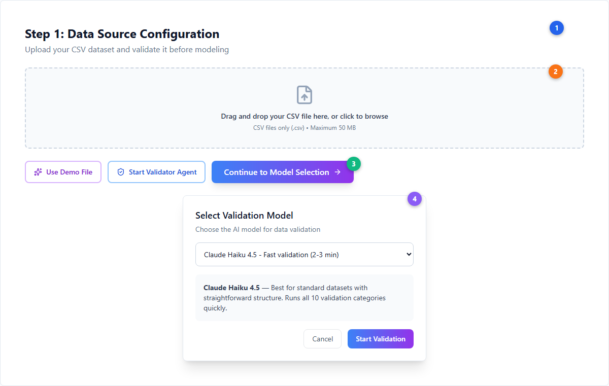
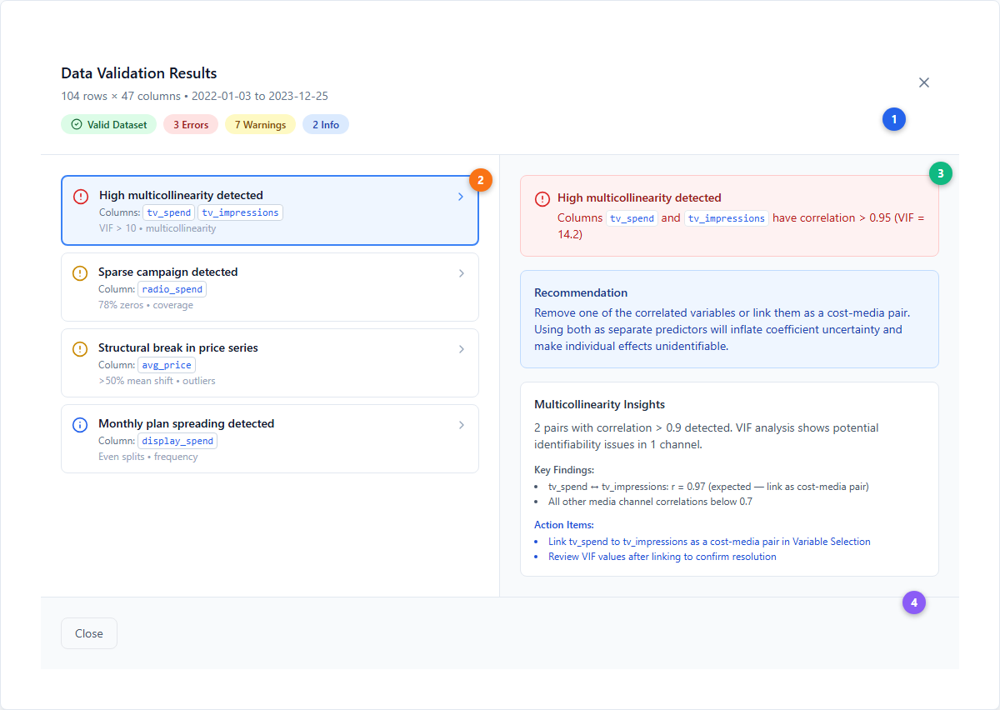
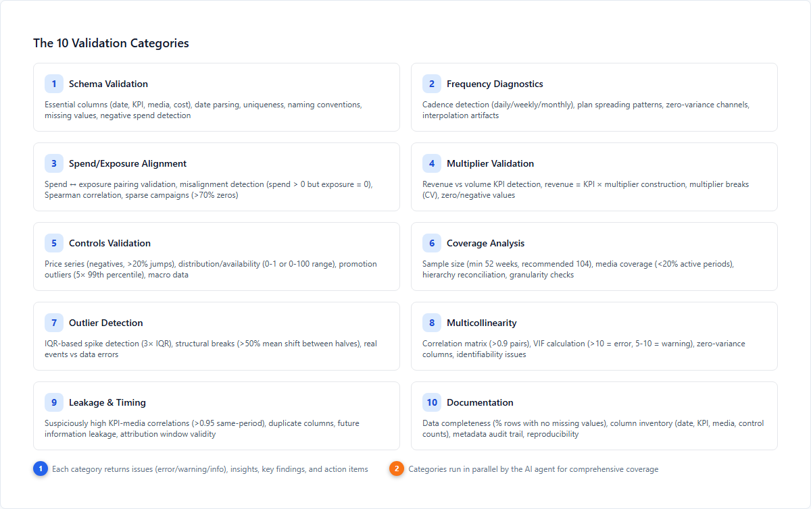

# Data Validator --- AI-Powered Data Quality Checks

The Data Validator is an AI agent that inspects your CSV dataset against the requirements of a [Bayesian Marketing Mix Model](../core-concepts/bayesian-modeling.md). It catches problems that would otherwise surface as poor model fit or unreliable results --- issues like missing spend data for key weeks, multicollinearity between channels, plan spreading artifacts, or data leakage.

> **Note**: The Data Validator is not automatic. You trigger it manually from the Model Warehouse by clicking **Start Validator Agent** after uploading your CSV file.

---

## Triggering Validation

Upload your CSV file (50MB max --- Excel is not supported), then click the **Start Validator Agent** button to open the model selection dialog.

| # | Element | Description |
|---|---------|-------------|
| 1 | **Data Source Configuration header** | Step 1 of the model creation wizard --- upload your dataset here before any modeling |
| 2 | **CSV upload area** | Drag-and-drop or click to browse. Accepts CSV files only (.csv), maximum 50 MB. Excel (.xlsx) is not supported |
| 3 | **Start Validator Agent button** | Opens the model selection dialog below. Disabled until a file is uploaded. The **Use Demo File** button (left) loads a sample dataset for testing |
| 4 | **Model selection dialog** | Choose between two AI models for validation: **Claude Haiku 4.5** (fast validation, 2-3 minutes, best for standard datasets) or **Claude Sonnet 4.5** (deep analysis, 4-6 minutes, best for complex datasets with multiple hierarchies or unusual patterns) |

After clicking **Start Validation**, a progress modal shows live status updates. The full analysis typically takes 3-5 minutes.

---

## Interpreting Results

When validation completes, a split-pane results modal displays all findings organized by severity.

| # | Element | Description |
|---|---------|-------------|
| 1 | **Summary badges** | Top-level status: green "Valid Dataset" or red "Issues Found", plus counts for each severity level (Errors, Warnings, Info) |
| 2 | **Issues list (left pane)** | Scrollable list of all findings. Each issue shows a severity icon, message, affected columns (as code badges), and category tag. Click any issue to see details |
| 3 | **Issue detail (right pane)** | Selected issue expanded: severity-colored alert box, specific recommendation explaining **what** to fix and **why** it matters for MMM, plus category-level insights with key findings and action items |
| 4 | **Footer actions** | Close/Skip button (left) and Apply Transformations button (right, if the Data Transformer has suggestions to apply) |

### Severity Levels

| Level | Icon | Color | Meaning | Examples |
|---|---|---|---|---|
| **Error** | AlertCircle | Red | Critical --- prevents reliable model fitting | Missing date/KPI column, VIF > 10, duplicate columns, negative media spend |
| **Warning** | AlertCircle | Yellow | Quality impact --- model runs but accuracy suffers | High correlation (r > 0.9), plan spreading, sparse campaigns (>70% zeros), structural breaks |
| **Info** | Info | Blue | Informational --- good to know, no immediate action needed | Column inventory, data completeness %, hierarchy detection |

---

## The 10 Validation Categories

The validator runs 10 specialized checks in parallel, each examining a different aspect of data quality for MMM.

| # | Category | What It Checks | Key Thresholds |
|---|----------|---------------|----------------|
| 1 | **Schema** | Date/KPI/media column detection, date parsing, duplicates, naming conventions, missing values, negative spend | Missing date or KPI = ERROR. Missing > 50% = ERROR, > 10% = WARNING |
| 2 | **Frequency** | Cadence detection (daily/weekly/monthly), monthly plan spreading (even weekly splits from monthly budgets), zero-variance columns | Plan spreading (cv < 0.01 in 4-week windows) = WARNING |
| 3 | **Spend/Exposure Alignment** | Spend ↔ exposure pairing, misalignment (spend > 0 but exposure = 0), Spearman correlation, sparse campaigns | Misaligned periods = WARNING, correlation r < 0.3 = WARNING, > 70% zeros = WARNING |
| 4 | **Multiplier** | Revenue vs volume KPI detection, multiplier variance (CV), zero and negative values | CV > 0.5 = WARNING, zeros = ERROR, negatives = ERROR |
| 5 | **Controls** | Price series (negatives, > 20% jumps), distribution range (0-1 or 0-100), promotion outliers | > 20% price jump = WARNING, negatives = ERROR, max > 5× p99 = WARNING |
| 6 | **Coverage** | Sample size, media coverage percentage, hierarchy column detection | < 52 rows = ERROR, < 104 rows = WARNING, < 20% media coverage = WARNING |
| 7 | **Outliers** | IQR-based spike detection (3× IQR bounds), structural breaks between data halves | > 5% outliers = ERROR, < 5% = WARNING, > 50% mean shift = WARNING |
| 8 | **Multicollinearity** | Correlation matrix (> 0.9 pairs), VIF calculation, zero-variance channels | VIF > 10 = ERROR, VIF 5-10 = WARNING, r > 0.9 = WARNING, variance = 0 = ERROR |
| 9 | **Leakage & Timing** | Same-period KPI-media correlation, duplicate columns | r > 0.95 same-period = WARNING, identical columns = ERROR |
| 10 | **Documentation** | Data completeness audit (% rows with no missing values), column inventory by type, metadata trail | Always INFO --- audit trail for reproducibility |

For detailed technical explanations of each category, see [Data Validation (Technical Reference)](../data/data-validation.md).

---

## Common Issues and How to Fix Them

| Issue | Impact on Model | How to Fix |
|---|---|---|
| **Missing date or KPI column** | Model cannot fit at all | Ensure your CSV has a date column and a target KPI column (e.g., revenue, sales, units) |
| **High multicollinearity** (VIF > 10) | Coefficient uncertainty inflated, individual channel effects unidentifiable | Remove one of the correlated variables, or link them as a cost-media pair in Variable Selection |
| **Plan spreading** (even weekly splits) | [Adstock](../core-concepts/adstock-effects.md) and [saturation](../core-concepts/saturation-curves.md) estimates will be biased because there's no real weekly variation | Request actual weekly delivery data from your media agency instead of monthly plans divided by 4 |
| **Sparse campaigns** (> 70% zeros) | Unstable ROI estimates due to insufficient data points | Aggregate to a higher time granularity (monthly), or exclude the channel and add back later with more data |
| **Structural break in KPI** (> 50% shift) | Model may not generalize across the break | Investigate the cause (business event, data error). Consider modeling periods separately or adding a structural break event |
| **Negative media spend** | Violates the assumption that more spend = more outcome | Fix data errors. If these are refunds/credits, net them against positive spend periods |
| **Data leakage** (r > 0.95 same-period) | Model "learns" from the outcome, producing inflated and meaningless ROI | Verify the column isn't derived from the KPI. Remove or lag the variable appropriately |

---

## Data Transformer (Post-Validation)

After reviewing validation results, you can apply automated fixes using the Data Transformer. Click **Apply Transformations** in the results footer to choose a transformation mode:

| Mode | Time | Scope | Best For |
|---|---|---|---|
| **Fix Errors Only** | 2-4 min | ~5-10 transforms | Resolving validation errors and warnings identified by the validator |
| **Comprehensive** (default) | 4-6 min | ~15-30 transforms | Full cleanup: error fixes plus feature engineering, normalization, and model preparation |
| **Enhancements Only** | 3-5 min | ~10-20 transforms | Skip error fixes, apply only feature engineering and advanced transformations |

You can also provide **custom instructions** (e.g., "Create 7-day rolling average for revenue", "Apply log transformation to all spend columns"). After the transformer runs, you review and select which new columns to keep --- original columns are always preserved.

---

## Tips for Clean Validation Results

- **Use consistent date formats** across your file. Mixed formats are the most common cause of schema errors.
- **Include at least 104 weeks (2 years) of data** when possible. The validator flags < 52 weeks as an error and < 104 weeks as a warning because short time series reduce [seasonality](../core-concepts/seasonality.md) detection and model reliability.
- **Ensure spend variation per channel.** Channels with constant spend (zero variance) cannot be identified by any model --- the validator flags these as errors.
- **Pair spend with exposure metrics** (e.g., `tv_spend` with `tv_impressions`). The alignment validator checks for mismatched periods and low correlation between paired columns.
- **Break out platforms individually** (e.g., Facebook and Instagram as separate columns rather than combined "Social") for more granular attribution and to reduce multicollinearity.

---

## Re-Running the Validator

Validation results are displayed in the modal during your session and are not stored permanently. After making changes to your data:

1. Re-upload the corrected CSV file
2. Click **Start Validator Agent** again
3. Confirm all previous errors and warnings are resolved

Iterate until you see the green **Valid Dataset** badge with zero errors.

---

## Next Steps

**Platform guides:**
- [Model Creation Wizard](./model-creation-wizard.md) --- Continue to model setup after validation
- [Model Configuration](./model-configuration.md) --- Configure [priors](../core-concepts/priors-and-distributions.md) and transforms
- [Measurement](./measurement.md) --- Interpreting model results

**Core concepts:**
- [Bayesian Modeling](../core-concepts/bayesian-modeling.md) --- Why Bayesian models need clean data
- [Priors & Distributions](../core-concepts/priors-and-distributions.md) --- How validation informs prior choices
- [Saturation Curves](../core-concepts/saturation-curves.md) --- Why spend/exposure alignment matters
- [Adstock Effects](../core-concepts/adstock-effects.md) --- Why plan spreading distorts carryover estimates

**Data reference:**
- [Data Validation (Technical)](../data/data-validation.md) --- Deep dive on each validation category
- [Data Requirements](../data/data-requirements.md) --- What data you need
- [Data Preparation](../data/data-preparation.md) --- Cleaning and formatting best practices
