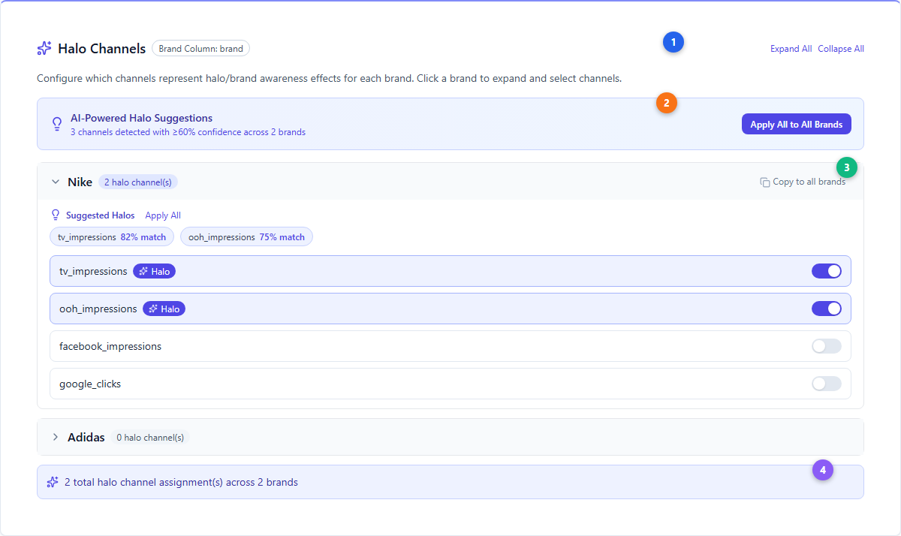
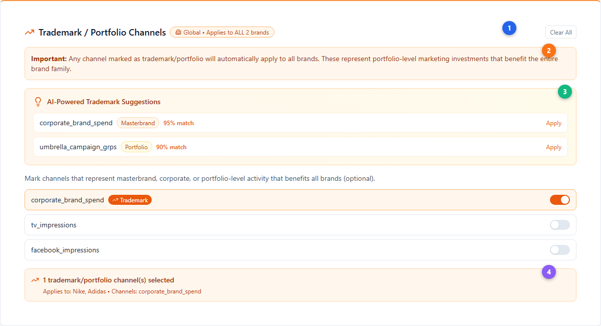
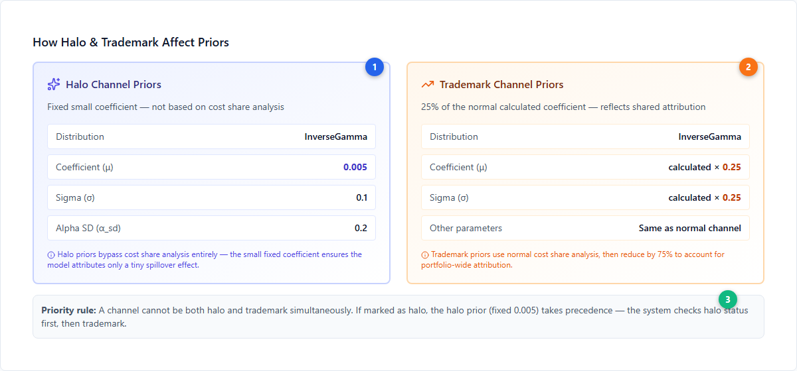
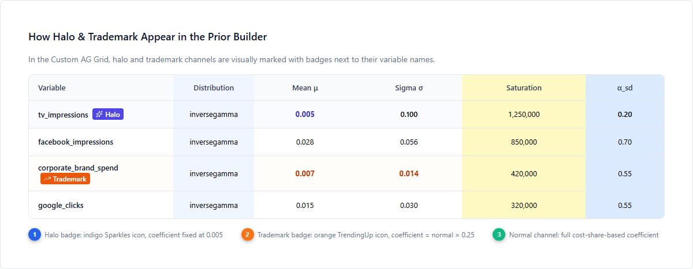

# Halo and Trademark Channels — Configuring Cross-Brand Effects

This guide explains how to configure halo and trademark channels in Simba for multi-brand portfolio analysis. These features are configured during the Variable Selection step of the [Model Creation Wizard](./model-creation-wizard.md) and directly affect how [smart defaults](./smart-defaults.md) calculate [prior distributions](../core-concepts/priors-and-distributions.md). For the conceptual background, see [Halo Effects](../core-concepts/halo-effects.md).

---

## When to Use Halo and Trademark Channels

Configure these channels when:

- You have a **multi-brand portfolio** (hierarchy column selected) and suspect advertising for one brand influences sales of other brands
- You run **masterbrand or corporate campaigns** that are not specific to a single brand
- You want the [optimizer](./budget-optimization.md) to account for **cross-brand spillover** when allocating budget

> **Requirement**: Both halo and trademark channels only appear when you have a hierarchy/brand column selected with linked media variables. Without a multi-brand setup, these sections are hidden.

---

## Configuring Halo Channels

Halo channels represent brand awareness activities (TV, OOH, sponsorships) whose effects spill over to other brands in a portfolio. Configuration is **per-brand** — you choose which channels are halo for each brand independently.

| # | Element | Description |
|---|---------|-------------|
| 1 | **Halo Channels header** | Sparkles icon (indigo). Shows the hierarchy column name as a badge. Expand All / Collapse All buttons for multi-brand views. |
| 2 | **AI-Powered Suggestions** | Indigo gradient banner showing AI-detected halo candidates with ≥60% confidence. "Apply All to All Brands" applies suggestions across the entire portfolio at once. |
| 3 | **Per-brand configuration** | Each brand expands to show its channels. Toggle switches (indigo) mark individual channels as halo. Suggested channels show confidence scores (e.g., "82% match"). "Copy to all brands" replicates one brand's halo configuration across all others. |
| 4 | **Summary** | Shows total halo channel assignments across all brands |

### Semantic Detection

Simba's AI analyzes variable names to suggest likely halo channels:

- **Halo keywords** (increase confidence): awareness, brand, branding, tv, television, video, youtube, social, display, sponsorship, pr, influence, ooh, outdoor
- **Performance keywords** (decrease confidence): search, sem, ppc, performance, conversion, retargeting, remarketing, affiliate, direct
- Suggestions appear when confidence ≥ 60% (keyword match score × 5, capped at 85%)

### Validation Rules

- At least one brand must have **non-halo channels** — you cannot mark every channel as halo for every brand
- An "All Halos!" warning (orange badge) appears if all channels for a brand are marked as halo

---

## Configuring Trademark Channels

Trademark channels represent portfolio-wide advertising (masterbrand, corporate, umbrella campaigns). Unlike halo channels, trademark channels are **always global** — they apply to all brands equally.

| # | Element | Description |
|---|---------|-------------|
| 1 | **Trademark header** | TrendingUp icon (orange). Global badge with Building2 icon confirms the "Applies to ALL brands" scope. Clear All button resets selection. |
| 2 | **Global notice** | Orange info box emphasizing that trademark channels automatically apply to all brands in the portfolio |
| 3 | **AI-Powered Suggestions** | Orange gradient banner with detected trademark candidates. Each suggestion shows a type badge — Masterbrand (orange), Portfolio (amber), or Corporate (yellow) — plus confidence score. |
| 4 | **Summary** | Shows count of selected trademark channels and lists affected brands and channel names |

### Trademark Type Detection

The semantic matcher identifies three trademark types:

| Type | Badge Color | Keywords | Confidence |
|---|---|---|---|
| **Masterbrand** | Orange | master, corporate, umbrella, parent, main | 95% |
| **Portfolio** | Amber | portfolio, trademark, brand_portfolio, multi_brand, cross_brand | 95% |
| **Corporate** | Yellow | corporate, company, group, organization | 90% |

### Key Difference: Halo vs Trademark

| Feature | Halo | Trademark |
|---|---|---|
| **Scope** | Per-brand (different channels per brand) | Global (same channels for all brands) |
| **Icon** | Sparkles (indigo) | TrendingUp (orange) |
| **Purpose** | Brand-specific awareness spillover | Portfolio-wide umbrella campaigns |
| **Validation** | Must have non-halo channels per brand | No restrictions |
| **Data structure** | `Record<string, string[]>` (brand → channels) | `string[]` (flat list) |

---

## How Halo & Trademark Affect [Priors](../core-concepts/priors-and-distributions.md)

When [smart defaults](./smart-defaults.md) calculate prior distributions, halo and trademark channels receive different treatment than normal media channels.

| # | Element | Description |
|---|---------|-------------|
| 1 | **Halo priors** | Fixed small coefficient (μ = 0.005, σ = 0.1, α_sd = 0.2). Bypasses cost share analysis entirely. InverseGamma distribution. |
| 2 | **Trademark priors** | Takes the normal calculated coefficient and multiplies both mean and sigma by 0.25 (25%). All other parameters (decay, [saturation](../core-concepts/saturation-curves.md), [adstock](../core-concepts/adstock-effects.md)) remain the same as a normal channel. |
| 3 | **Priority rule** | A channel cannot be both halo and trademark. If marked as halo, the fixed 0.005 coefficient takes precedence. |

### Halo Channel Prior Values

| Parameter | Value | Reasoning |
|---|---|---|
| **Distribution** | InverseGamma | Same as all media channels |
| **Coefficient (μ)** | **0.005** (fixed) | Tiny effect — halo channels contribute a small spillover, not direct revenue |
| **Sigma (σ)** | **0.1** | Higher uncertainty to allow the model flexibility |
| **Alpha SD (α_sd)** | **0.2** | Standard saturation shape uncertainty |

### Trademark Channel Prior Values

| Parameter | Value | Reasoning |
|---|---|---|
| **Distribution** | InverseGamma | Same as all media channels |
| **Coefficient (μ)** | **calculated × 0.25** | 25% of what a brand-specific channel would receive |
| **Sigma (σ)** | **calculated × 0.25** | Proportionally reduced uncertainty |
| **Other parameters** | Same as normal | Decay, saturation, adstock are unchanged |

---

## How Halo & Trademark Appear in the Prior Builder

In the [Custom AG Grid](./model-configuration.md), halo and trademark channels display distinctive badges next to their variable names, and their coefficient values reflect the adjusted priors.

The inline legend explains the visual indicators:
- **Halo badge** (indigo Sparkles icon): coefficient fixed at 0.005, visually highlighted with indigo background
- **Trademark badge** (orange TrendingUp icon): coefficient = normal calculated value × 0.25, highlighted with orange background
- **Normal channels**: full cost-share-based coefficient with no badge

---

## How the Optimizer Handles Cross-Brand Effects

When running [portfolio optimization](./portfolio-analysis.md) with halo and trademark channels configured:

- The **optimizer objective function** accounts for both `halo_channels` and `trademark_channels`
- Cross-brand spending effects are factored into budget allocation
- Halo channels receive credit for their **total portfolio impact**, not just their direct brand impact
- Trademark channel budget is optimized against **total portfolio revenue** across all brands

---

## Best Practices

- **Start with AI suggestions** — review Simba's semantic detection before manually configuring. The suggestions are calibrated to common naming patterns with a 60% confidence threshold.
- **Use trademark for umbrella campaigns** — if a campaign is not brand-specific, it's a trademark channel
- **Use halo for brand-specific spillover** — if Brand A's TV campaign lifts Brand B, mark Brand A's TV as a halo channel
- **Don't mark everything as halo** — at least one brand needs non-halo channels for the model to estimate direct effects
- **Review results** — check [measurement](./measurement.md) outputs to validate that cross-brand effects are being captured as expected
- **A channel can't be both** — halo takes precedence if somehow marked as both

---

## Next Steps

**Platform guides:**

- [Portfolio Analysis](./portfolio-analysis.md) — Full portfolio analysis workflow
- [Budget Optimization](./budget-optimization.md) — How halo/trademark effects change optimization
- [Smart Defaults](./smart-defaults.md) — How AI Media Priors are calculated
- [Model Configuration](./model-configuration.md) — Prior Builder deep reference
- [Model Creation Wizard](./model-creation-wizard.md) — The full model setup process

**Core concepts:**

- [Halo Effects](../core-concepts/halo-effects.md) — Conceptual background on cross-brand marketing impact
- [Priors and Distributions](../core-concepts/priors-and-distributions.md) — Understanding prior distributions
- [Saturation Curves](../core-concepts/saturation-curves.md) — Diminishing returns modeling
- [Adstock Effects](../core-concepts/adstock-effects.md) — Carryover and decay effects
- [Bayesian Modeling](../core-concepts/bayesian-modeling.md) — The Bayesian approach
