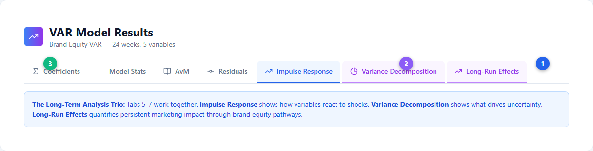
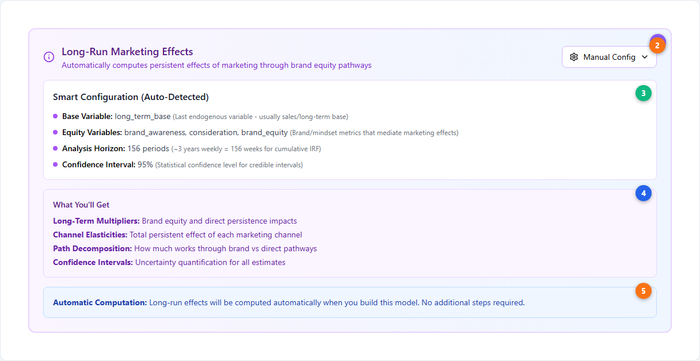
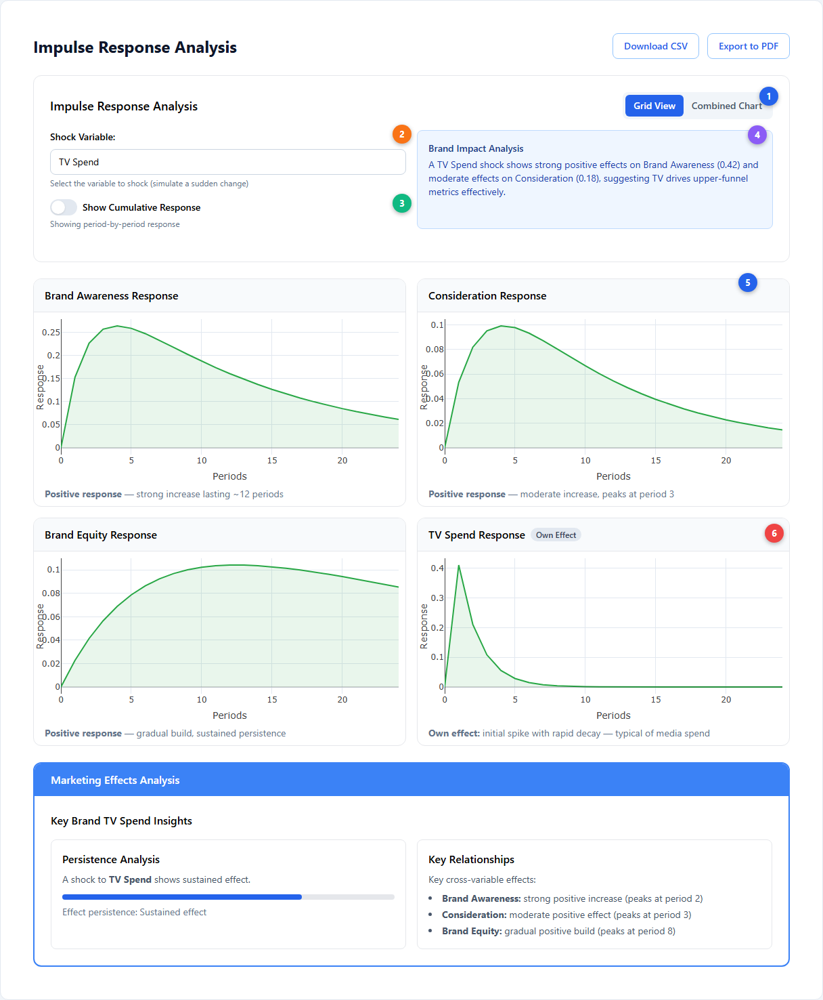
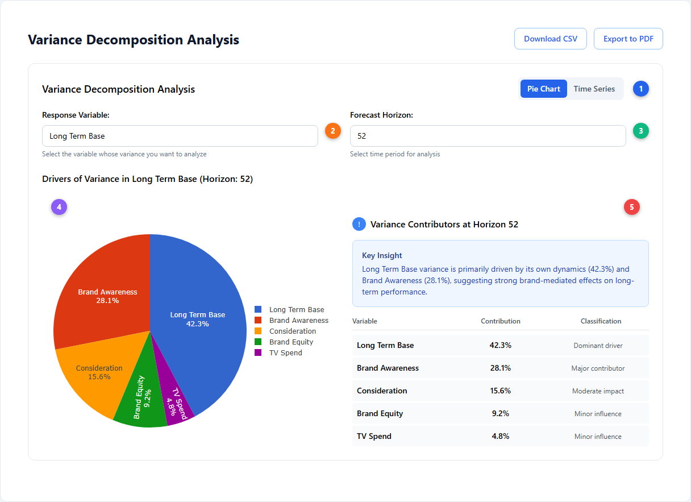
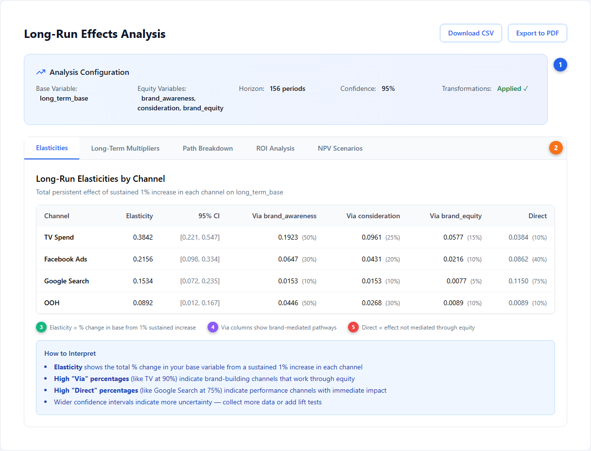
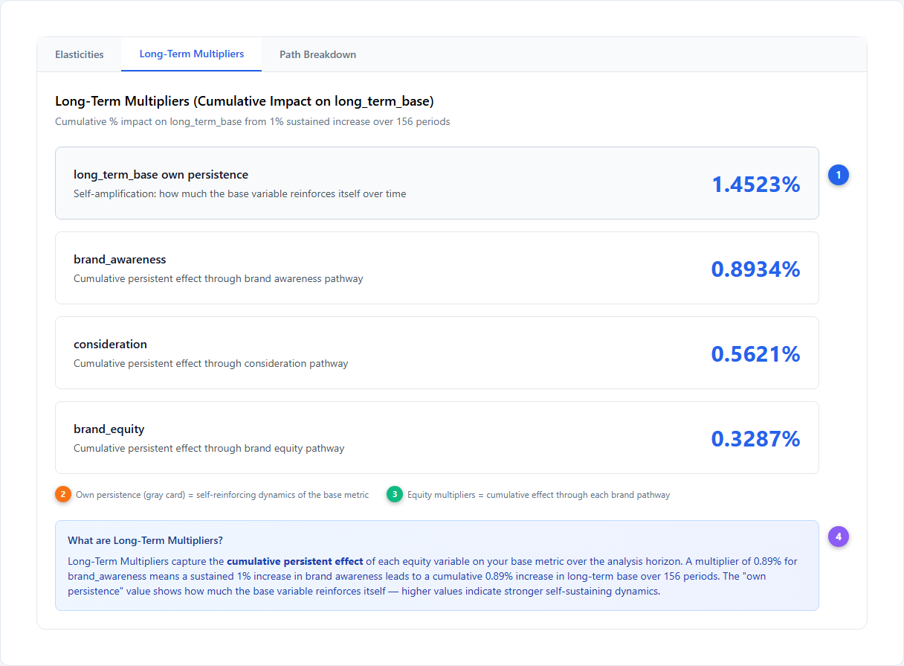
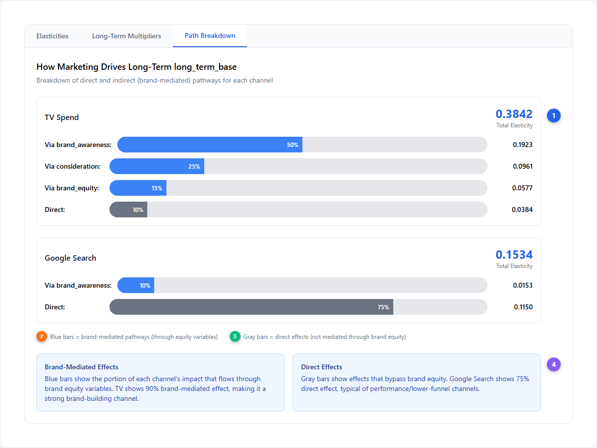
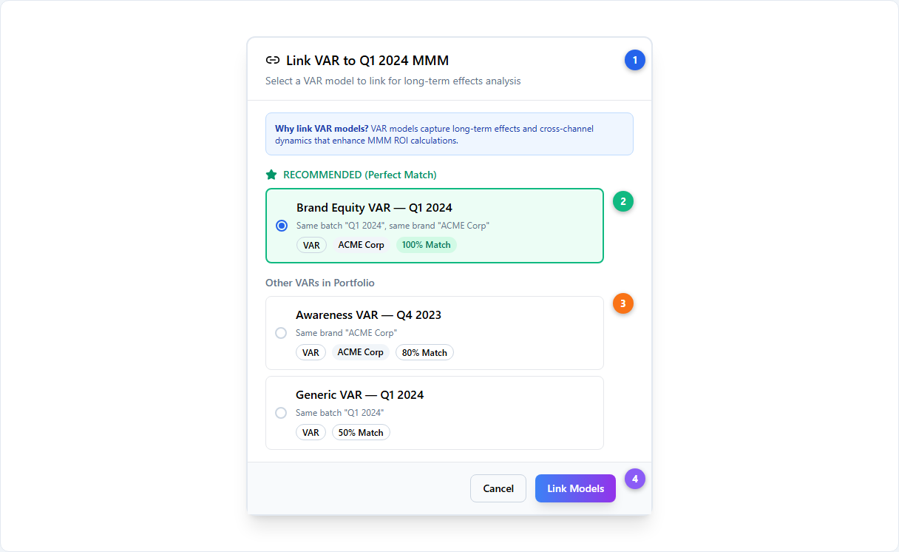

# Long-Term Effects --- Modeling Lasting Brand Impact

Standard Marketing Mix Models measure short-term media impact: the incremental revenue generated within a few weeks of [adstock decay](../core-concepts/adstock-effects.md). But some marketing activities --- brand campaigns, sponsorships, sustained awareness efforts --- produce effects that persist for months or longer. The Long-Term Effects module captures this extended impact using [Vector AutoRegression (VAR)](../core-concepts/var-modeling.md) to trace how marketing spend flows through brand-building variables (awareness, consideration, equity) to ultimately drive revenue, complementing the [saturation](../core-concepts/saturation-curves.md) and carryover modeling of your standard MMM.

---

## The VAR Analysis Trio

When you build a VAR model in Simba, the results page includes seven tabs. The last three --- **Impulse Response**, **Variance Decomposition**, and **Long-Run Effects** --- form a connected analysis workflow for understanding long-term marketing impact.

| # | Element | Description |
|---|---------|-------------|
| 1 | **Long-Run Effects tab** | Quantifies persistent marketing impact through brand equity pathways --- the primary output for budget decisions |
| 2 | **Variance Decomposition tab** | Shows what drives uncertainty in each variable --- which channels matter most at different time horizons |
| 3 | **Standard VAR tabs** | Coefficients, Model Stats, AvM, and Residuals --- standard model diagnostics |

These three tabs work together: IRF shows *how* variables respond to shocks, FEVD shows *what drives uncertainty*, and Long-Run Effects quantifies the *persistent cumulative impact* on your base metric.

---

## Configuring Long-Run Effects

Before building your VAR model, you configure the long-run effects analysis. This card appears in the [Model Creation Wizard](./model-creation-wizard.md) when your VAR model has at least 2 endogenous variables and 1 exogenous variable.

| # | Element | Description |
|---|---------|-------------|
| 1 | **Purple config card** | Appears automatically when prerequisites are met (≥2 endogenous + ≥1 exogenous variables) |
| 2 | **Manual Config toggle** | Switch between Smart Configuration (auto-detected defaults) and Manual Configuration for full control |
| 3 | **Smart Configuration** | Auto-detects: base variable (last endogenous, typically sales), equity variables (all other endogenous), horizon (156 periods = ~3 years weekly), confidence interval (95%) |
| 4 | **What You'll Get** | Preview of outputs: Long-Term Multipliers, Channel Elasticities, Path Decomposition, and Confidence Intervals |
| 5 | **Automatic Computation** | Long-run effects are computed automatically during model training --- no additional steps required |

### Configuration Defaults

| Setting | Default | Range | Description |
|---|---|---|---|
| Base variable | Last endogenous variable | Any endogenous | The ultimate target metric (usually sales or long-term base) |
| Equity variables | All other endogenous | Auto-derived | Brand/mindset metrics that mediate marketing effects |
| Horizon | 156 periods | 52--520 | ~3 years weekly for cumulative IRF |
| Confidence interval | 95% | 90%, 95%, 99% | Width of [Bayesian credible intervals](../core-concepts/bayesian-modeling.md) (HDI bounds) |

---

## Interpreting Impulse Response Functions

Impulse Response Functions (IRFs) show how each variable responds over time when another variable receives a sudden one-unit "shock". This is the foundation for understanding how marketing spend ripples through your brand metrics. Unlike standard MMM [priors](../core-concepts/priors-and-distributions.md) which capture short-term response shapes, IRFs reveal the full dynamic system of cross-variable effects.

| # | Element | Description |
|---|---------|-------------|
| 1 | **Grid / Combined toggle** | Grid View shows each response in its own chart; Combined Chart overlays all responses for comparison |
| 2 | **Shock Variable selector** | Choose which variable to "shock" --- typically a media spend channel --- to see how all other variables respond |
| 3 | **Cumulative toggle** | Off = period-by-period response; On = total accumulated effect over time. Cumulative mode shows the building long-run impact |
| 4 | **Brand Impact Analysis** | Auto-generated insight summarizing the key cross-variable effects of the selected shock |
| 5 | **Response chart grid** | 2-column responsive grid of Plotly charts (one chart per variable). Green (#28a745) = positive response, Red (#dc3545) = negative response. Fill shows direction clearly |
| 6 | **Own Effect badge** | Marks the chart showing how the shocked variable responds to itself --- typically a spike with rapid decay for media spend |

### Reading IRF Charts

- **Green (positive)** responses mean the variable increases after the shock --- e.g., TV spend increases brand awareness
- **Red (negative)** responses mean the variable decreases --- rare but possible (e.g., heavy discounting could hurt brand equity)
- **Persistence**: how long the effect lasts before returning to zero. Short-lived (<20% remaining after 5 periods) vs. long-lasting (>80%)
- **Own effect**: the shocked variable's response to itself. Media spend typically shows a sharp spike and rapid decay. Brand metrics may show self-reinforcing persistence
- **Cross effects**: how other variables respond. The magnitude, direction, and timing reveal the causal chain from spend to revenue

### Cumulative Mode

Toggle cumulative mode on to see the **total accumulated effect** over time. This is the most relevant view for budget decisions --- it shows how much total impact builds up rather than the period-by-period response. A channel whose cumulative curve keeps rising has strong persistent effects worth investing in.

---

## Interpreting Variance Decomposition

Forecast Error Variance Decomposition (FEVD) answers: "what proportion of the uncertainty in each variable is explained by shocks to each other variable?" This reveals which channels and metrics are the dominant drivers of your outcome variable.

| # | Element | Description |
|---|---------|-------------|
| 1 | **Pie / Time Series toggle** | Pie Chart = snapshot at one horizon; Time Series = stacked bar showing how contributions evolve over time |
| 2 | **Response Variable selector** | Choose which variable's variance to decompose (typically your base/revenue variable) |
| 3 | **Forecast Horizon selector** | How far into the future to measure variance contributions. Longer horizons reveal more about persistent effects |
| 4 | **Pie chart** | Color-coded breakdown using a 20-color palette. Labels show both variable name and percentage contribution |
| 5 | **Insights panel** | Auto-classified contributions: Dominant driver (≥60%), Major contributor (≥30%), Moderate impact (≥10%), Minor influence (<10%) |

### Reading FEVD Results

| Classification | Threshold | What it means |
|---|---|---|
| **Dominant driver** | ≥60% | This variable explains most of the uncertainty --- focus optimization here |
| **Major contributor** | ≥30% | Significant influence --- meaningful lever for improvement |
| **Moderate impact** | ≥10% | Worth monitoring but not the primary driver |
| **Minor influence** | <10% | Limited contribution to variance at this horizon |

**Pie vs Time Series**: Use Pie Chart for a quick snapshot at a specific horizon. Switch to Time Series (stacked bar) to see how contributions **evolve over time** --- variables whose share grows at longer horizons have increasing long-run importance.

> **Note**: FEVD is unavailable when Fast Mode is enabled during VAR training. Fast Mode uses a diagonal covariance matrix which skips the cross-variable covariance estimation needed for FEVD. To enable FEVD, rebuild the model with Fast Mode disabled.

---

## Long-Run Effects Results

When the VAR model finishes training with long-run effects configured, the Long-Run Effects tab shows up to five sub-tabs of results.

### Elasticities Tab (Default)

The primary results view showing each channel's total persistent effect on your base variable.

| # | Element | Description |
|---|---------|-------------|
| 1 | **Analysis Configuration summary** | Blue gradient card confirming: base variable, equity variables, horizon, confidence level, and whether transformations were applied |
| 2 | **Results sub-tabs** | Five tabs: Elasticities (always), Long-Term Multipliers (always), Path Breakdown (always), ROI Analysis (conditional), NPV Scenarios (conditional) |
| 3 | **Elasticity value** | Total % change in your base variable from a sustained 1% increase in each channel. Higher = stronger long-run effect |
| 4 | **Via columns** | Show how much of the total effect flows through each equity pathway (brand_awareness, consideration, brand_equity). Percentages reveal brand-mediated vs performance impact |
| 5 | **Direct column** | Effect that bypasses brand metrics entirely --- captures immediate/performance-oriented response |

**How to interpret elasticities:**

- **Brand builders** (like TV with 90% via equity): Most impact flows through brand metrics. These channels build long-term value that standard adstock decay misses. Consider increasing budget allocation beyond what short-term ROAS suggests
- **Performance channels** (like Google Search with 75% direct): Most impact is immediate and well-captured by the standard MMM. Long-run effects are smaller but still present
- **Wider confidence intervals**: Indicate more uncertainty in the estimate. Collect more data or integrate [lift tests](../core-concepts/incrementality.md) to narrow them
- **Elasticity magnitude**: 0.38 means a sustained 1% increase in that channel drives a cumulative 0.38% increase in your base variable over the full horizon
- **Comparing channels**: Sort by elasticity to rank channels by total long-run impact. A channel with a lower short-term ROAS but higher long-run elasticity may be undervalued

### Long-Term Multipliers Tab

Shows the cumulative persistent effect of each equity variable on your base metric.

| # | Element | Description |
|---|---------|-------------|
| 1 | **Multiplier cards** | One card per equity variable showing its cumulative persistent effect on the base variable |
| 2 | **Own persistence** (gray card) | Self-amplification: how much the base variable reinforces itself over time. Higher values indicate stronger self-sustaining dynamics |
| 3 | **Equity multiplier values** | A value of 0.89% means a sustained 1% increase in that equity variable leads to a cumulative 0.89% increase in the base over the analysis horizon |
| 4 | **What are Long-Term Multipliers?** | Explanation of long-term multipliers and how to interpret the cumulative persistence values |

**How to interpret Long-Term Multipliers:**

- **Own persistence > 1**: The base variable amplifies its own shocks --- positive momentum effects
- **High equity multipliers**: These brand metrics are strong mediators of long-term value. Invest in channels that drive these metrics (revealed by the Path Breakdown tab)
- **Low equity multipliers**: These metrics have limited persistent effect on revenue, even if they respond strongly to marketing in the IRF view

### Path Breakdown Tab

Shows *how* each channel creates long-term value --- through which equity pathways.

| # | Element | Description |
|---|---------|-------------|
| 1 | **Channel cards** | One card per media channel showing total elasticity and the breakdown across pathways |
| 2 | **Direct effect bar** (gray) | The portion of the channel's effect that bypasses brand metrics. Performance channels show dominant gray bars |
| 3 | **Performance channel pattern** | Google Search shows 75% direct effect --- typical of lower-funnel channels where most value is immediate |
| 4 | **Interpretation boxes** | Two info boxes explaining brand-mediated effects and direct effects (both use InfoBox variant="info") |

**How to interpret Path Breakdown:**

- **Blue bars** (Via equity) show brand-mediated pathways. TV's 50% via brand_awareness means half its long-run impact flows through awareness
- **Gray bars** (Direct) show unmediated impact. High direct % = performance channel
- **Multiple blue bars** indicate a channel influences revenue through several brand metrics simultaneously --- these are your most versatile brand-building channels
- Compare channels side-by-side to understand which drives awareness vs consideration vs equity

### ROI & NPV Tabs (Optional)

Two additional tabs appear when you provide annual spend and revenue data:

- **ROI Analysis**: Long-run ROI accounting for the full cumulative impact, not just short-term returns. Color-coded: >2x (emerald), >1x (blue), <1x (amber)
- **NPV Scenarios**: Present value of sustained marketing changes over a configurable time horizon with discounting

These tabs translate elasticities into financial metrics for stakeholder communication.

---

## Linking VAR to MMM Models

Long-term effects are most valuable when linked to your standard MMM model. The LinkVAR dialog uses smart matching to recommend the best VAR for each MMM.

| # | Element | Description |
|---|---------|-------------|
| 1 | **Dialog header** | Shows which MMM model you're linking a VAR to |
| 2 | **Recommended section** | Green border highlights the best match based on smart matching criteria |
| 3 | **Other VARs** | Alternative VARs in the portfolio with their match scores |
| 4 | **Link Models button** | Confirms the link. Once linked, the MMM results are augmented with long-run elasticities |

### Smart Matching Tiers

| Match | Criteria | Recommendation |
|---|---|---|
| **100%** | Same batch AND same brand | Perfect match --- use this VAR |
| **80%** | Same brand only | Strong match --- brand metrics align |
| **50%** | Same batch only | Moderate --- same time period but different brand |
| **0%** | Different batch and brand | Weak --- consider building a dedicated VAR |

For portfolios with many models, the **AutoLink** feature in the portfolio view can bulk-link VARs to MMMs based on smart matching.

---

## Implications for Budget Decisions

Long-term effects fundamentally change how you think about [budget optimization](./budget-optimization.md):

- **Brand-building channels** (high Via % in Path Breakdown) may warrant higher spend than short-term ROAS alone suggests, because their full return materializes over months through brand equity. Use the elasticities to quantify the gap between short-term and total return
- **Performance channels** (high Direct %) deliver most of their value immediately and are well-captured by standard MMM optimization with [saturation curves](../core-concepts/saturation-curves.md)
- **Cutting brand spend** saves money immediately but erodes the equity variables that support future revenue. The long-run elasticity quantifies exactly how much future revenue is at risk per % of spend reduction
- **NPV analysis** helps justify brand investment to stakeholders by translating long-run effects into financial terms with appropriate discounting
- **Channel mix decisions**: Compare Path Breakdown across channels to understand which drives awareness vs consideration vs equity, then align channel mix with your brand's weakest equity dimension
- **When linking VAR to MMM**: The linked long-run effects automatically enhance your MMM's [measurement](./measurement.md) results, showing total (short + long) channel contributions rather than short-term only

---

## Next Steps

**Platform guides:**

- [VAR Models](./var-models.md) --- Building and fitting VAR models in Simba
- [Budget Optimization](./budget-optimization.md) --- How long-term effects influence allocation decisions
- [Model Creation Wizard](./model-creation-wizard.md) --- Step-by-step model setup including VAR configuration
- [Measurement](./measurement.md) --- Channel attribution and results interpretation

**Core concepts:**

- [VAR Modeling](../core-concepts/var-modeling.md) --- Statistical foundation: Minnesota priors, IRF, FEVD, long-run multipliers
- [Bayesian Modeling](../core-concepts/bayesian-modeling.md) --- The Bayesian approach and credible intervals
- [Adstock Effects](../core-concepts/adstock-effects.md) --- Short-term carryover and decay (complementary to long-term effects)
- [Saturation Curves](../core-concepts/saturation-curves.md) --- Diminishing returns in media response
- [Incrementality](../core-concepts/incrementality.md) --- Causal attribution and lift test integration

---

## Further Reading

- Cain, P. (2022). Modelling short- and long-term marketing effects in the consumer purchase journey. *International Journal of Research in Marketing*, 39(1), 96--116. --- The foundational paper behind this approach: distinguishes short-term incremental sales response from long-term brand-building effects through the consumer purchase journey.
