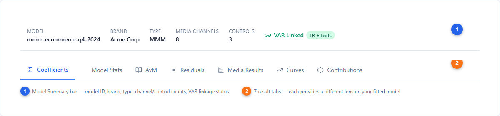
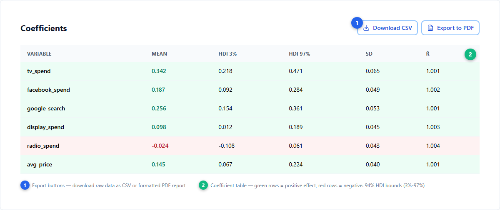
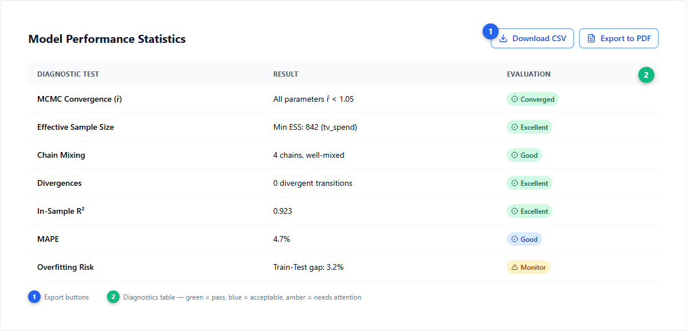
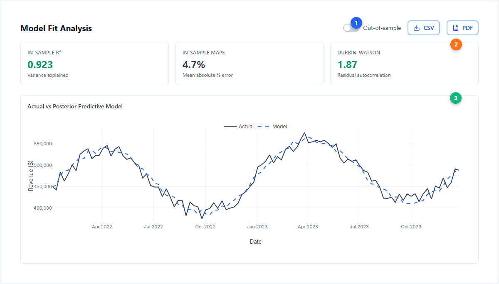
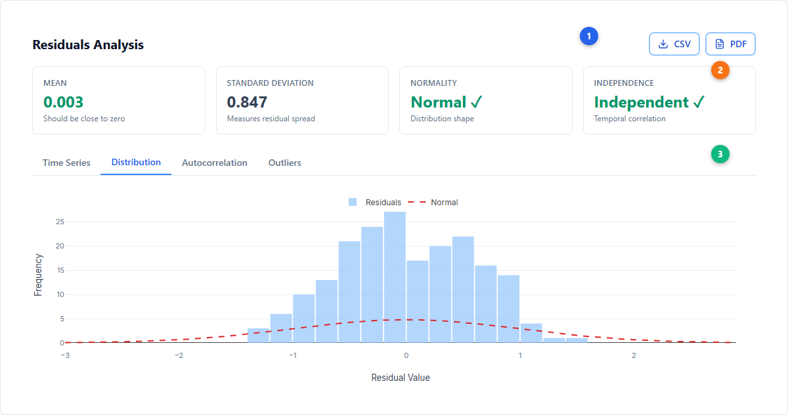
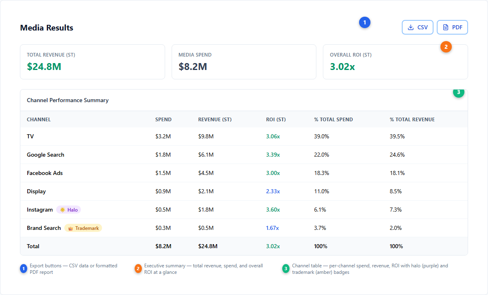
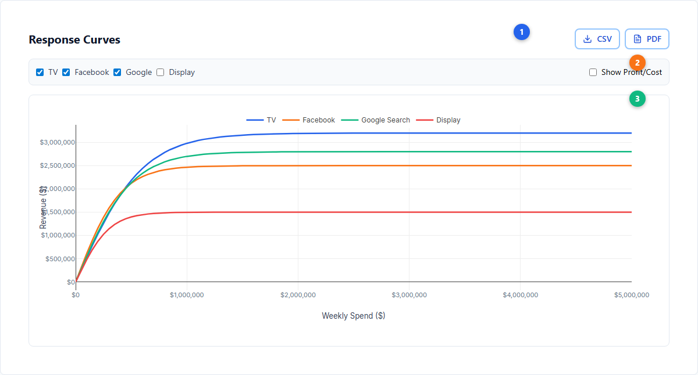
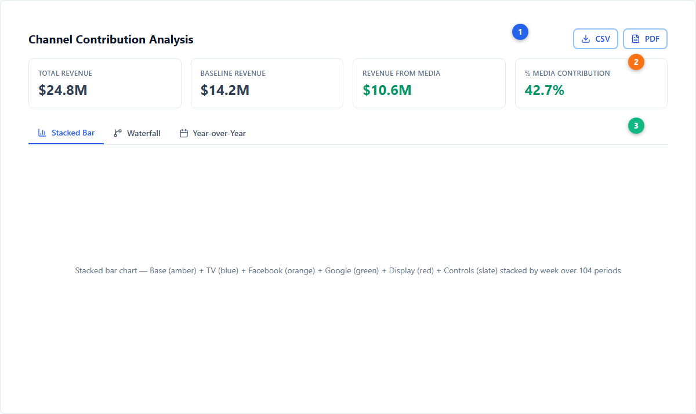
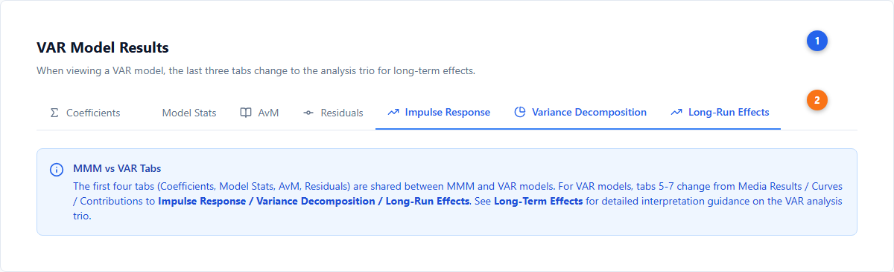

# Incremental Measurement --- Active Model Results

After fitting a model in the [Model Warehouse](./model-configuration.md), the **Active Model** page presents a comprehensive set of results tabs. This guide walks through every tab, explaining the metrics, charts, and controls available for both MMM and VAR models.

Simba determines what each marketing channel actually contributed to your target variable, separating true media impact from baseline demand, seasonality, and other non-media factors using [Bayesian causal inference](../core-concepts/bayesian-modeling.md).

---

## Page Layout

The Active Model page has three main areas:

1. **Model Summary Bar** --- A collapsible metadata panel at the top showing Model ID, Brand/Market, Model Type (MMM or VAR), Target Variable, Media Channels count, and Control Factors count. For MMM models linked to a VAR model, a green "LR Effects" badge appears.
2. **Tab Navigation** --- A horizontal row of sub-tabs. The tabs differ by model type:
   - **MMM models**: Coefficients, Model Stats, AvM, Residuals, Media Results, Curves, Contributions
   - **VAR models**: Coefficients, Model Stats, AvM, Residuals, Impulse Response, Variance Decomposition, Long-Run Effects
3. **Tab Content** --- The selected tab's analysis, charts, and data tables.

Every tab includes **Download CSV** and **Export to PDF** buttons for offline analysis and stakeholder reporting.

| # | Element | Description |
|---|---------|-------------|
| 1 | Model Summary Bar | Collapsible panel with Model ID, Brand/Market, Type, Target Variable, and channel counts |
| 2 | Tab Navigation | Horizontal sub-tabs; set changes based on model type (MMM vs VAR) |

---

## MMM Model Tabs

### Coefficients

The Coefficients tab displays posterior parameter estimates in a table with these columns:

| Column | Meaning |
|--------|---------|
| **Variable** | Parameter name (media channel, control, intercept, etc.) |
| **mean** | Posterior mean estimate |
| **hdi_3%** | Lower bound of 94% Highest Density Interval |
| **hdi_97%** | Upper bound of 94% Highest Density Interval |
| **sd** | Posterior standard deviation |
| **r_hat** | Convergence diagnostic (values near 1.0 indicate good convergence) |

Rows are color-coded: green background for positive coefficients, red background for negative. Clicking a row expands it to show either the full posterior sample detail or, for time-varying parameters (TVP), an interactive time series chart with [94% HDI](../core-concepts/bayesian-modeling.md) bands showing how the coefficient evolves over the model's date range.

| # | Element | Description |
|---|---------|-------------|
| 3 | Coefficient table | Posterior estimates with mean, 94% HDI (3%--97%), standard deviation, and R-hat |
| 4 | Export buttons | Download CSV or Export to PDF for offline analysis |

---

### Model Stats

The Model Stats tab presents a diagnostic summary table. Each row shows a test name, its computed value, and a color-coded assessment badge:

- **Green (Excellent/Converged/Normal)** --- The metric passes its quality threshold
- **Blue (Good/OK)** --- Acceptable but not ideal
- **Yellow (Warning/Overfitting)** --- Potential issue that warrants investigation

Common diagnostics include R-squared (in-sample fit), MAPE (prediction accuracy), R-hat (convergence), Durbin-Watson (residual autocorrelation), residual normality, and overfitting risk.

| # | Element | Description |
|---|---------|-------------|
| 5 | Diagnostic table | Test name, numeric value, and color-coded assessment for each diagnostic |
| 6 | Assessment badges | Green = excellent, Blue = good, Yellow = warning |

---

### AvM (Actual vs Model)

The AvM tab evaluates model fit quality. It shows:

**Metric Cards** --- A grid of summary statistics, split into In-Sample and Out-of-Sample (when available):

| Metric | What it measures | Good threshold |
|--------|-----------------|----------------|
| **R-squared** | Proportion of variance explained | > 0.7 (green) |
| **MAPE** | Mean Absolute Percentage Error | Lower is better |
| **Durbin-Watson** | Residual autocorrelation | 1.5--2.5 (green) |

Out-of-sample metrics (when the model reserved a test set) appear with a blue left border, letting you compare in-sample fit against held-out predictive accuracy. A toggle switch lets you show or hide the out-of-sample overlay on the chart.

**Actual vs Posterior Predictive Chart** --- A Plotly time series overlaying the actual target variable against the model's posterior predictive mean, with HDI confidence bands.

| # | Element | Description |
|---|---------|-------------|
| 7 | In-Sample metrics | R-squared, MAPE, and Durbin-Watson for the training period |
| 8 | Out-of-Sample metrics | Same statistics computed on the held-out test set (blue-bordered cards) |
| 9 | AvM chart | Time series of actual (blue) vs predicted (orange) with HDI confidence band |

---

### Residuals

The Residuals tab provides diagnostic tools for assessing whether model assumptions hold. It displays four summary statistics:

| Statistic | Ideal | Interpretation |
|-----------|-------|----------------|
| **Mean** | Close to 0 | Unbiased predictions (green when |mean| < 0.05) |
| **Standard Deviation** | Low | Measures overall residual spread |
| **Normality** | "Normal" | Shapiro-Wilk test for Gaussian residual distribution |
| **Independence** | "Independent" | No temporal autocorrelation in residuals |

Below the summary cards, four visualization sub-tabs are available:

1. **Time Series** --- Residuals plotted over time with a zero-line reference
2. **Distribution** --- Histogram of residual values for assessing normality
3. **Autocorrelation** --- ACF plot checking for serial correlation
4. **Outliers** --- Individual data points flagged as potential outliers

For VAR models, a variable selector dropdown lets you inspect residuals for each endogenous variable independently.

| # | Element | Description |
|---|---------|-------------|
| 10 | Residual KPI cards | Mean, Standard Deviation, Normality, and Independence statistics |
| 11 | Visualization sub-tabs | Time Series, Distribution, Autocorrelation, and Outliers views |
| 12 | Residual chart | Currently selected visualization (time series shown by default) |

---

### Media Results

The Media Results tab is the primary performance dashboard for channel-level analysis. It contains several sections:

**Executive Summary Cards** --- Three KPI cards showing Total Revenue, Media Spend, and Overall ROI (revenue / spend). When a linked [VAR model](../core-concepts/var-modeling.md) provides long-run elasticities, a "Long Run Effects" toggle transforms all metrics to include brand-building multipliers. These metrics feed directly into [budget optimization](../core-concepts/budget-optimization.md) recommendations.

**Channel Control Panel** --- A chip-based selector for toggling individual channels on and off. Deselecting a channel removes it from all charts and tables below.

**Channel Performance Summary Table** --- The core results table with columns for each channel:

| Column | Description |
|--------|-------------|
| Channel | Media channel name |
| Spend | Total spend over the model period |
| Revenue | Incremental revenue attributed to this channel |
| ROI | Return on investment (Revenue / Spend) |
| CPA | Cost per acquisition |
| Share of Spend | Channel's percentage of total media spend |
| Share of Revenue | Channel's percentage of total attributed revenue |

Additional analysis sections include:
- **ROI Analysis Panel** --- Year-over-year ROI comparison charts and spend trend analysis
- **Quarterly ROI Analysis** --- Per-channel ROI and cost-per-metric broken down by quarter
- **Spend vs Revenue** --- Scatter plot showing the relationship between spend and incremental revenue for each channel
- **Efficiency vs Effectiveness** --- Matrix chart positioning channels by ROI (efficiency) and total revenue contribution (effectiveness)
- **Time Series Analysis** --- Collapsible section with per-channel time series of contributions

| # | Element | Description |
|---|---------|-------------|
| 13 | Executive KPI cards | Total Revenue, Media Spend, Overall ROI |
| 14 | Channel Control Panel | Toggle channels on/off to filter all views |
| 15 | Performance table | Channel-level Spend, Revenue, ROI, CPA, and share metrics |
| 16 | Visualization charts | Spend vs Revenue scatter and Efficiency vs Effectiveness matrix |

---

### Curves

The Curves tab shows three types of response analysis:

**Revenue Curves** --- Nonlinear response curves showing predicted revenue as a function of spend for each channel. These curves reflect the [tanh saturation function](../core-concepts/saturation-curves.md) combined with [adstock carryover](../core-concepts/adstock-effects.md). Current actual spend is marked on each curve, making it easy to see whether a channel is operating on the steep (underspending) or flat (saturated) portion of its curve.

**Decay Curves** --- [Adstock](../core-concepts/adstock-effects.md) decay visualization showing how each channel's effect fades over time. Simba supports geometric and delayed adstock types --- there is no power law adstock.

**Marginal Revenue Curves** --- The derivative (slope) of the response curve, showing how much additional revenue each next dollar of spend generates. Profit is maximized where marginal revenue equals marginal cost ($1). The breakeven line is drawn on the chart.

A channel selector toolbar lets you choose which channels to display. A "Profit" overlay toggle shows where each channel crosses from profitable to unprofitable spend. If a VAR model is linked, a "Long Run Effects" toggle scales curves by long-run elasticity multipliers.

| # | Element | Description |
|---|---------|-------------|
| 17 | Channel toolbar | Multi-select channel filter and profit overlay toggle |
| 18 | Long Run Effects toggle | Scales curves by VAR-derived long-run multipliers (appears only when VAR linked) |
| 19 | Revenue curves | Tanh saturation curves with current spend markers per channel |
| 20 | Marginal revenue | Slope of response curves with MR = MC = $1 breakeven line |

---

### Contributions

The Contributions tab decomposes the target variable into its component drivers over time:

**Summary Cards** --- Four KPIs: Top Contributor (highest overall driver, typically Base), Top Media Channel, Media Contribution (% of total driven by media), and Base/Other Factors (non-media portion).

**Channel Color Customizer** --- Assign custom colors to individual channels for consistent visualization across all tabs and exports. [Halo channels](../core-concepts/halo-effects.md) and trademark channels are distinguished with purple and amber badges respectively.

**Driver Grouping** --- Create custom groups that aggregate channels for higher-level reporting. For example, group Facebook + Instagram + TikTok into "Paid Social". Groups and their colors persist across sessions and sync to the Optimizer and Scenario Planner.

**Chart Views** --- Three visualization sub-tabs:

1. **Stacked Bar** --- Time series showing how base demand and individual channel contributions stack to produce the total target variable over each period
2. **Waterfall** --- Factor-by-factor breakdown showing the additive contribution of each driver from base to total
3. **Year Comparison** --- Year-over-year contribution comparison highlighting changes in channel effectiveness

| # | Element | Description |
|---|---------|-------------|
| 21 | Summary KPI cards | Top Contributor, Top Media Channel, Media Contribution %, Base/Other % |
| 22 | Chart type tabs | Stacked Bar, Waterfall, and Year Comparison visualization modes |
| 23 | Contribution chart | Currently selected visualization with grouped or individual channel breakdown |

---

## VAR Model Tabs

When viewing a VAR model, the tab navigation replaces Media Results, Curves, and Contributions with three VAR-specific analysis tabs. The shared tabs (Coefficients, Model Stats, AvM, Residuals) remain, with some differences:

- **Coefficients** displays VAR matrix coefficient groups (lag coefficients, exogenous coefficients, noise covariance) expanded inline
- **AvM** shows a variable selector dropdown to inspect fit for each endogenous variable
- **Residuals** includes a variable selector to view residuals per endogenous variable

### Impulse Response

The Impulse Response tab analyzes how a one-standard-deviation shock to one variable propagates through the system over time. Controls include:

- **Variable selector** --- Choose which variable receives the shock
- **View mode** --- Grid (small multiples) or Combined (overlaid on one chart)
- **Cumulative toggle** --- Switch between instantaneous and cumulative impulse response
- **Marketing Effects panel** --- Highlights the key cross-variable relationships and persistence patterns

### Variance Decomposition

The Variance Decomposition (FEVD) tab shows what fraction of each variable's forecast error variance is explained by shocks to other variables, at different forecast horizons. Controls include:

- **Variable selector** --- Choose which variable's variance to decompose
- **Horizon selector** --- View decomposition at different forecast horizons (e.g., 1, 4, 12, 52 periods)
- **View mode** --- Pie chart or stacked bar visualization

### Long-Run Effects

The Long-Run Effects tab quantifies the persistent, brand-building impact of marketing. It requires VAR model configuration with base variable, equity variables, and horizon settings. See [Long-Term Effects](./long-term-effects.md) for full documentation.

The tab is organized into up to five sub-tabs:

1. **Elasticities** --- Total long-run elasticity per channel with confidence intervals and breakdown by pathway (via brand equity vs direct)
2. **Long-Term Multipliers** --- Cumulative percentage impact from sustained 1% increases, including own-persistence (self-amplification) effects
3. **Path Breakdown** --- Horizontal bar charts showing what fraction of each channel's long-run effect flows through brand equity vs direct pathways
4. **ROI Analysis** --- Net Present Value-based return on investment for sustained channel investment (appears when spend data is available)
5. **NPV Scenarios** --- Present value of base uplift from sustained marketing changes over configurable time horizons (appears when NPV configuration is provided)

An **Analysis Configuration** card at the top summarizes the base variable, equity variables, horizon, confidence level, and whether log transformations were applied.

| # | Element | Description |
|---|---------|-------------|
| 24 | VAR tab strip | Tab navigation for VAR models with three VAR-specific tabs |
| 25 | IRF analysis | Impulse Response grid/combined charts with variable and cumulative controls |
| 26 | FEVD analysis | Variance decomposition by variable and forecast horizon |
| 27 | Long-Run Effects | Elasticities, multipliers, path breakdown, ROI, and NPV sub-tabs |

---

## Incremental Measurement Concepts

### Base Sales vs Media Lift

Simba decomposes the target variable into components:

- **Base Sales** --- Value that would have occurred without any marketing activity, capturing organic demand, brand equity, [seasonal patterns](../core-concepts/seasonality.md), and macroeconomic factors. Base typically represents the largest share.
- **Media Lift** --- The incremental value attributable to marketing channels. Each channel's lift is estimated independently through [Bayesian regression](../core-concepts/bayesian-modeling.md) with [saturation](../core-concepts/saturation-curves.md) and [adstock](../core-concepts/adstock-effects.md) transformations.

### Causal Attribution

Attribution results are shown per channel with **94% Highest Density Intervals (HDI)** bounded at 3% and 97%, giving you not just a point estimate but a range of plausible values. Wider intervals indicate more uncertainty; narrower intervals indicate higher confidence.

The model controls for confounders --- seasonality, holidays, promotions, and other non-media variables --- so that channel attribution reflects true incremental impact rather than correlation.

### Lift Test Integration

If you have run controlled experiments (geo-lift tests, conversion lift studies, or holdout tests), Simba incorporates those results as **likelihood observations** that calibrate the model. Lift tests are configured in Model Details during model creation. Each lift test specifies the channel, baseline spend, spend change, observed revenue change, and measurement uncertainty.

Lift test results constrain the [posterior estimates](../core-concepts/priors-and-distributions.md) of channel effectiveness to be consistent with experimental evidence. This bridges observational modeling and experimental evidence for more trustworthy attribution. See [Incrementality](../core-concepts/incrementality.md) for the underlying methodology.

---

## Common Patterns and What They Mean

**Large base relative to media lift** --- Normal for established brands. Most revenue comes from existing demand rather than marketing. The media channels are still adding incremental value on top of a strong baseline.

**One channel dominates** --- Check whether this reflects reality or a data artifact. If the dominant channel has the most spend variation, the model has the most signal to work with. Channels with flat, consistent spend are harder to measure.

**Near-zero or negative channel estimate** --- Does not necessarily mean the channel is worthless. The model may not be able to detect its effect given available data. Consider whether there was enough spend variation, or whether a lift test could provide additional evidence.

**Seasonal patterns in base** --- Expected behavior. The model separates seasonal demand from media impact, so base rises and falls with natural demand cycles while media contributions reflect actual campaign performance.

---

## CSV Exports

Results can be downloaded as CSV files from every tab. Available exports include: coefficients, model stats, AvM, residuals, media results, parameters, curves, contributions, IRF, FEVD, and long-run effects.

---

## Model Lifecycle and Status

When you start a model fit, it progresses through these statuses:

| Status | Description |
|--------|-------------|
| **Pending** | Queued and waiting for compute resources |
| **Under Way** | Bayesian inference actively running with progress indicator |
| **Complete** | Model finished successfully; results available for review |
| **Failed** | Error during fitting --- check the error message for data issues, prior misconfiguration, or convergence problems |
| **Revoked** | Manually cancelled before completion |
| **Time Exceeded** | Exceeded maximum computation time; consider reducing complexity |

You can navigate away during model fitting and return when it completes. Model status is visible in the Warehouse and on the Dashboard.

### Recovering from Failed Models

If a model fails:

- Check data for issues flagged by the [Data Validator](./data-auditor.md)
- Adjust [priors](../core-concepts/priors-and-distributions.md) that may be too narrow or contradictory
- Reduce the number of channels or control variables
- Switch from daily to weekly data to reduce complexity

---

## Custom Contribution Groups

The Contributions tab includes a **Driver Grouping** interface for creating custom channel aggregations. For example:

- Facebook + Instagram + TikTok as "Paid Social"
- Google Search + Bing Search as "Paid Search"
- TV + Radio as "Traditional Media"

Groups are saved per model and persist across sessions. Colors assigned to groups sync across the Optimizer and Scenario Planner for consistent visualization.

---

## Next Steps

**Platform guides:**

- [Scenario Planning](./scenario-planning.md) --- Forecast different budget allocations
- [Budget Optimization](./budget-optimization.md) --- Algorithmic budget allocation
- [Long-Term Effects](./long-term-effects.md) --- VAR-based brand equity analysis
- [Model Configuration](./model-configuration.md) --- Adjust priors and model settings
- [Exports and Reporting](./exports-reporting.md) --- PDF reports and CSV downloads

**Core concepts:**

- [Bayesian Modeling](../core-concepts/bayesian-modeling.md) --- How Simba estimates effects
- [Saturation Curves](../core-concepts/saturation-curves.md) --- Diminishing returns modeling
- [Adstock Effects](../core-concepts/adstock-effects.md) --- Carryover effect estimation
- [Incrementality](../core-concepts/incrementality.md) --- Causal attribution methodology
- [Priors and Distributions](../core-concepts/priors-and-distributions.md) --- Prior specification
- [Seasonality](../core-concepts/seasonality.md) --- Fourier-based seasonal modeling
- [VAR Modeling](../core-concepts/var-modeling.md) --- Vector autoregression for long-run effects

---

For questions about interpreting model results, [open a GitHub issue](https://github.com/nialloulton/simba-mmm/issues) or email [info@pymc-labs.com](mailto:info@pymc-labs.com).
