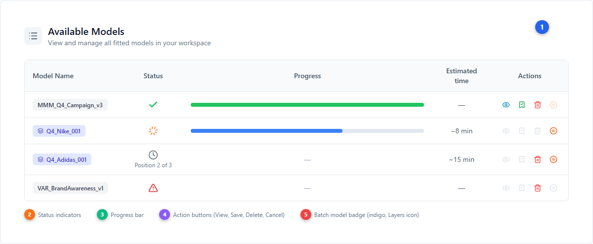
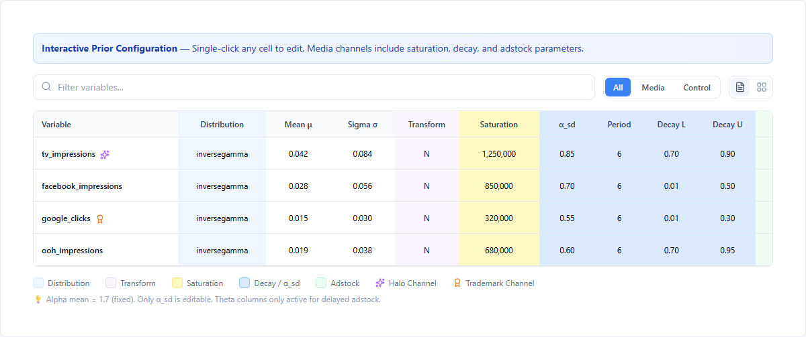
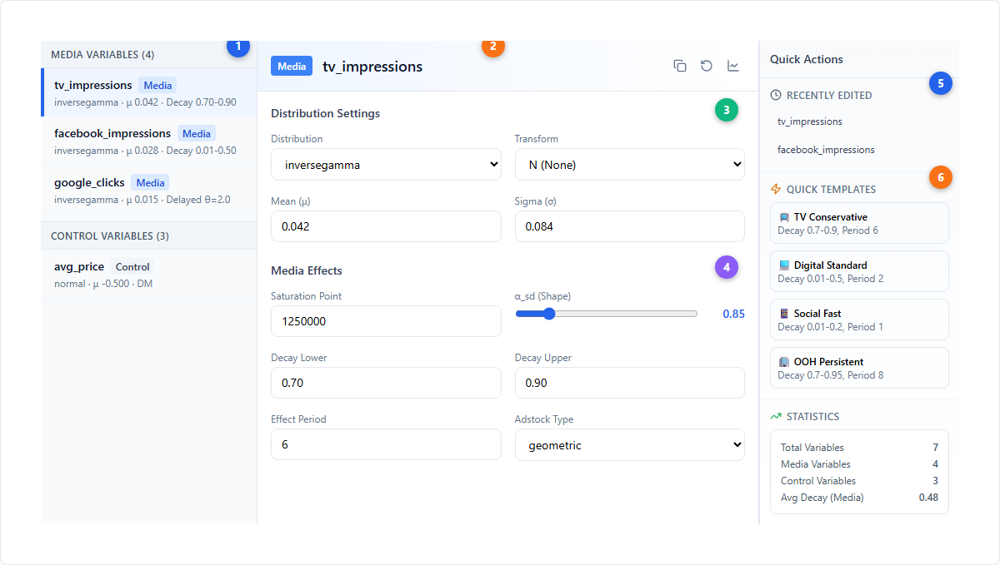
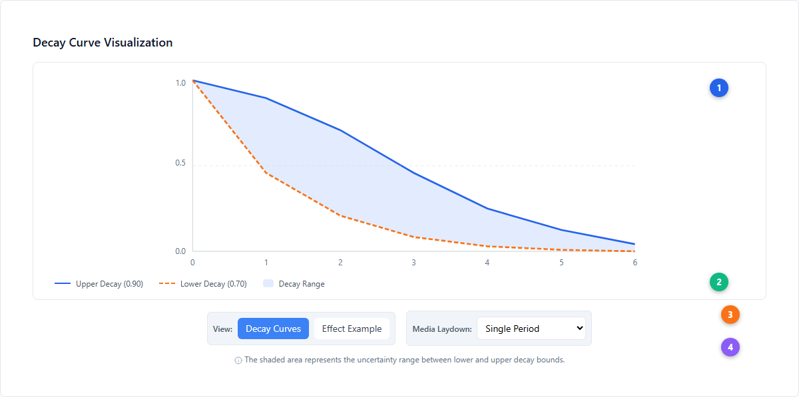
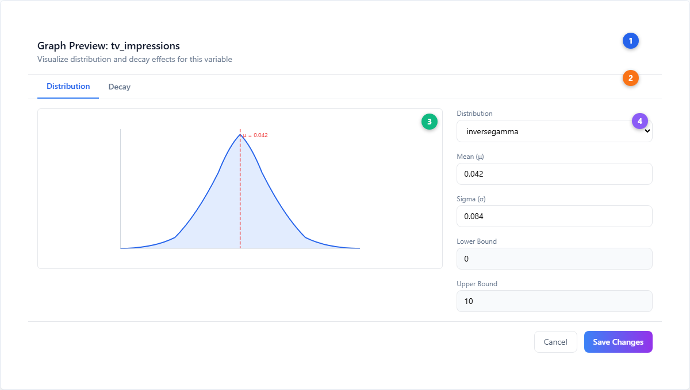
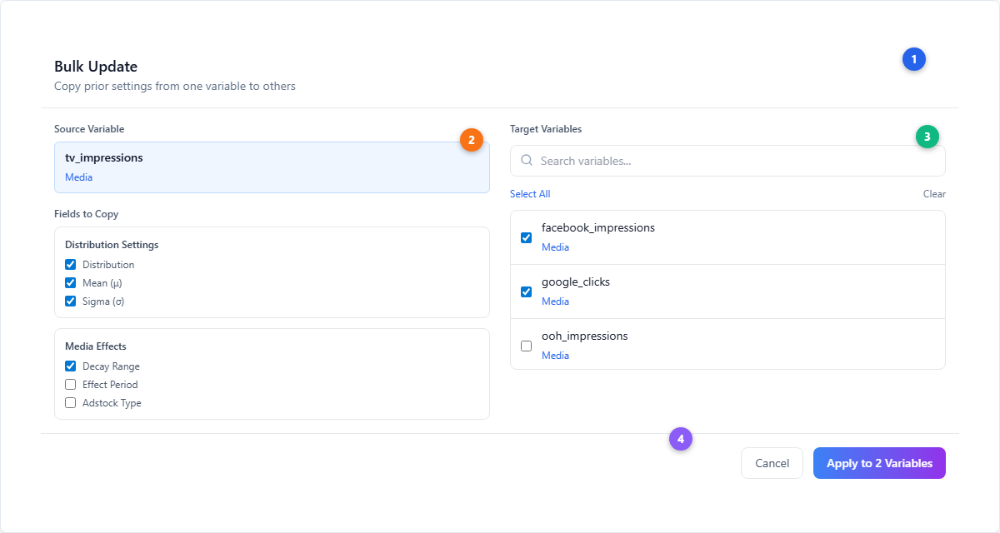
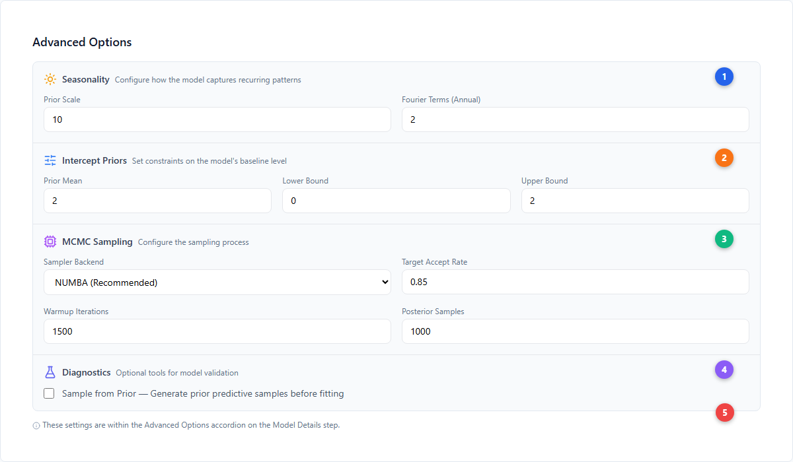
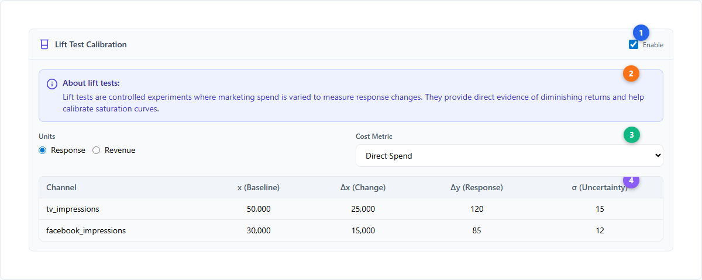
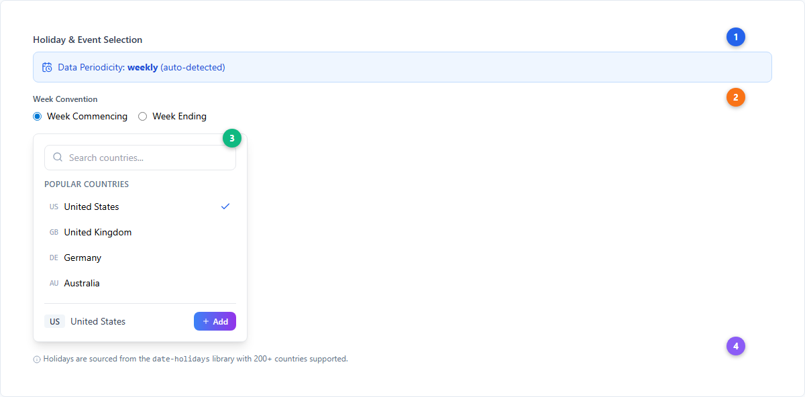
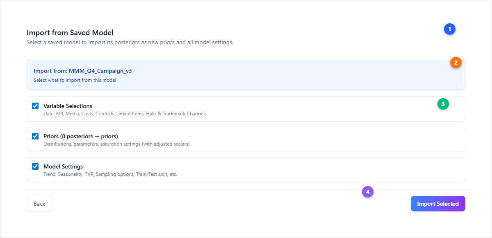

# Model Configuration — Deep Reference Guide

This guide provides a detailed reference for every configuration feature in Simba's model building workflow. For the step-by-step wizard overview, see the [Model Creation Wizard](./model-creation-wizard.md). For how [smart defaults](./smart-defaults.md) are calculated, see the Smart Defaults guide.

The configuration workflow uses a five-step wizard (Source → Model Setup → Variable Selection → Prior Builder → Model Details) to build [Bayesian](../core-concepts/bayesian-modeling.md) Marketing Mix Models or [VAR](../core-concepts/var-modeling.md) models. This page dives deep into each configuration feature.

---

## Managing Models

### Available Models

After building a model, it appears in the **Available Models** tab with real-time status tracking.

| # | Element | Description |
|---|---------|-------------|
| 1 | **Available Models header** | List icon with title and subtitle. Shows all fitted models in the current project. |
| 2 | **Status indicators** | COMPLETE (green check), UNDER_WAY (orange spinner), PENDING (gray clock with queue position), FAILED (red alert triangle) |
| 3 | **Progress bar** | Real-time progress for models currently fitting. Shows percentage complete. |
| 4 | **Action buttons** | Eye (view results, requires COMPLETE), BookmarkCheck (save to project), Trash2 (delete), PauseCircle (cancel running model) |
| 5 | **Batch model badge** | Indigo badge with Layers icon indicates models built from a hierarchy/panel data configuration |

#### Model statuses

| Status | Icon | Description |
|--------|------|-------------|
| **PENDING** | Clock (gray) | Queued for fitting. Shows position in queue and estimated wait. |
| **UNDER_WAY** | Loader (orange, spinning) | Currently fitting. Progress bar updates in real-time. |
| **COMPLETE** | Check (green) | Successfully fitted. View, save, and delete actions available. |
| **FAILED** | AlertTriangle (red) | Fitting failed. Click for error details. Delete available. |
| **TIME_EXCEEDED** | Clock (orange) | Fitting exceeded the time limit. Treated like a failure. |
| **REVOKED** | PauseCircle (blue) | User cancelled the fitting process. |
| **REVOKE_IN_PROGRESS** | MoreHorizontal (blue) | Cancellation in progress. |

### Saved Models & Projects

The **Saved Models** tab organizes completed models into projects. Two views are available:

- **My Models** — All models you own, whether shared or not
- **Shared Models** — Models shared with you by other users, or models you've shared out

Models can be moved between projects, duplicated, and connected (e.g., linking an MMM to a VAR model for [long-term effects](./long-term-effects.md) analysis).

---

## Prior Builder — Custom Mode Deep Dive

The Prior Builder is where you configure [prior distributions](../core-concepts/priors-and-distributions.md) that encode your beliefs about each channel's effect. Two modes are available: **Standard** (AI-driven, see [Smart Defaults](./smart-defaults.md)) and **Custom** (full manual control).

### AG Grid Configuration

Custom mode provides an interactive AG Grid table with single-click cell editing. Every parameter is directly editable.

The inline legend below the table explains the color coding:
- **Blue (#eff6ff)** — Distribution column
- **Purple (#faf5ff)** — Transform column
- **Yellow (#fef9c3)** — [Saturation](../core-concepts/saturation-curves.md) point
- **Light blue (#dbeafe)** — [Decay](../core-concepts/adstock-effects.md) parameters and α_sd
- **Green (#f0fdf4)** — Adstock type and theta parameters
- **Sparkles (purple)** — [Halo](../core-concepts/halo-effects.md) channel indicator
- **Award (orange)** — Trademark/portfolio channel indicator

#### Media variable columns

| Column | Width | Description |
|--------|-------|-------------|
| **Variable** | 200px | Channel name with halo/trademark badges. Pinned left. |
| **Distribution** | 140px | Prior distribution: `inversegamma` (default for media), `normal`, `truncatednormal`, or `tvp` |
| **Mean (μ)** | 100px | Expected coefficient value. Range: -5 to 5 |
| **Sigma (σ)** | 100px | Uncertainty (standard deviation). Default: 2× mean |
| **Transform** | 100px | Data transformation: `N` (None, for media), `DM` (Divide by Mean, for controls), `STA`, `DDM` |
| **Saturation** | 130px | Activity level where channel reaches 50% of maximum effect. Auto-populated with average non-zero activity. |
| **α_sd** | 100px | Shape uncertainty of the saturation curve. Alpha mean is fixed at 1.7; only α_sd is editable. Range: 0.1-5.0 |
| **Period** | 90px | Number of time periods the media effect persists. Default: 6 (weekly), 45 (daily). Range: 1-20 |
| **Decay L / U** | 100px each | Lower and upper adstock decay rate bounds. Range: 0.01-0.99 |
| **Adstock** | 120px | Type: `geometric` (instant peak, exponential decay) or `delayed` (peak at theta lag) |
| **θ Mean / SD** | 90px / 80px | For delayed adstock only: expected peak delay and uncertainty (Gamma prior). Disabled for geometric. |
| **Lower / Upper** | 90px each | Bounds for TruncatedNormal and TVP distributions. Media enforces Lower ≥ 0. |
| **Actions** | 80px | Copy (bulk update) and LineChart (graph preview) buttons |

Control variables share Distribution, Mean, Sigma, Transform, Lower/Upper, and Actions columns but omit all saturation, decay, and adstock columns. Control bounds can be negative.

### Master-Detail View

Toggle from compact (AG Grid) to Master-Detail view for a three-panel editing experience.

| # | Element | Description |
|---|---------|-------------|
| 1 | **Variable list** | Left panel with grouped sections (Media Variables, Control Variables). Sticky headers show group name and count. Selected item highlighted with blue left border. Quick summary shows distribution, mean, and decay range. |
| 2 | **Detail panel header** | Shows variable type badge (Media=blue, Control=gray), variable name, and action buttons (Copy, Reset, Graph Preview) |
| 3 | **Distribution Settings** | Editable fields for distribution type, transform, mean (μ), and sigma (σ) |
| 4 | **Media Effects** | Saturation point with auto-fill from data, α_sd slider, decay lower/upper inputs, effect period, and adstock type selector |
| 5 | **Recently Edited** | Clock icon section listing the last 5 variables you modified. Click to jump to that variable. |
| 6 | **Quick Templates** | Zap icon section with 5 pre-built channel configurations. Apply to selected variables. |

#### Quick Templates

| Template | Decay Range | Period | α_sd | Description |
|----------|-------------|--------|------|-------------|
| 📺 TV Conservative | 0.7–0.9 | 6 | 0.8 | Slow decay, low uncertainty |
| 📺 TV Aggressive | 0.3–0.6 | 4 | 1.0 | Medium decay, standard uncertainty |
| 💻 Digital Standard | 0.01–0.5 | 2 | 0.7 | Default digital decay range |
| 📱 Social Fast | 0.01–0.2 | 1 | 1.0 | Very quick decay |
| 🏢 OOH Persistent | 0.7–0.95 | 8 | 0.6 | Very slow decay |

### Decay Chart Visualization

The decay chart shows how media effects diminish over time based on your configured decay parameters.

| # | Element | Description |
|---|---------|-------------|
| 1 | **Decay curves** | SVG visualization showing upper decay curve (solid blue) and lower decay curve (dashed orange) with shaded area representing the uncertainty range |
| 2 | **Legend** | Explains the upper/lower curves and shaded decay range area |
| 3 | **View and spend controls** | Toggle between "Decay Curves" (default) and "Effect Example" views. Effect Example shows how spend patterns translate to effects over time with laydown options: Single Period, Continuous, Pulsed, Increasing, or Custom (drag bars). |
| 4 | **Help text** | Explains that the shaded area represents uncertainty between lower and upper decay bounds |

### Distribution Preview

Click the LineChart icon on any variable to open the Graph Preview modal.

| # | Element | Description |
|---|---------|-------------|
| 1 | **Modal header** | Shows "Graph Preview: [variable name]" with description text |
| 2 | **Distribution / Decay tabs** | Distribution tab (always available) shows prior density function. Decay tab (media only) shows decay curve with adjustable parameters. |
| 3 | **Density chart** | Probability density function with red dashed line at the mean value. Hover for exact values. |
| 4 | **Parameter controls** | Right panel with editable distribution, mean, sigma, and bounds. Changes update the chart in real-time. Save Changes commits edits. |

### Bulk Update

Copy prior settings from one variable to multiple others using the Bulk Update dialog.

| # | Element | Description |
|---|---------|-------------|
| 1 | **Dialog header** | "Bulk Update" with description. Opens from the Copy icon on any variable row. |
| 2 | **Source and field selection** | Left column shows the source variable (blue highlight) and checkboxes for which fields to copy: Distribution Settings (distribution, mean, sigma), Media Effects (decay range, period, adstock), and Metrics/Saturation. |
| 3 | **Target variable selection** | Right column with search, Select All/Clear, and checkboxes for each compatible target. Only same-type variables shown (media→media, control→control). |
| 4 | **Apply button** | Shows count of selected targets. Copies all checked fields from source to targets. |

---

## Model Details — Advanced Settings

### Advanced Options

The Advanced Options accordion on the Model Details step contains four configuration sections.

| # | Element | Description |
|---|---------|-------------|
| 1 | **[Seasonality](../core-concepts/seasonality.md) settings** | Prior Scale (default: 10) controls flexibility. Fourier Terms (default: 2, range 1-25) controls complexity of annual patterns. Weekly seasonality only available for daily data (default: 3 terms, range 1-7). |
| 2 | **Intercept Priors** | Prior Mean (default: 2), Lower Bound (default: 0), Upper Bound (default: 2). Controls the model's baseline level as a multiple of KPI mean. |
| 3 | **MCMC Sampling** | Sampler Backend (NUMBA recommended, Nutpie faster but no progress tracking), Target Accept Rate (0.85), Warmup Iterations (1500), Posterior Samples (1000). Quantile field only shown when Quantile likelihood is selected. |
| 4 | **Diagnostics** | Sample from Prior checkbox generates prior predictive samples before fitting for validation. |
| 5 | **Context note** | These settings are within the Advanced Options accordion, collapsed by default |

### Lift Test Calibration

Enable lift test calibration to integrate experimental results as **likelihood observations** (not priors) that constrain the model's [saturation](../core-concepts/saturation-curves.md) parameters with direct evidence of [diminishing returns](../core-concepts/incrementality.md).

| # | Element | Description |
|---|---------|-------------|
| 1 | **Enable toggle** | Beaker icon header with checkbox to enable/disable lift test calibration |
| 2 | **About lift tests** | InfoBox explaining that lift tests are controlled experiments providing direct evidence of diminishing returns |
| 3 | **Units and cost metric** | Units selector (Response or Revenue) and Cost Metric dropdown (Direct Spend, CPA, CPC, CPM, Custom) |
| 4 | **Entry table** | Each lift test entry requires: Channel, x (baseline spend), Δx (spend change), Δy (observed response change), σ (uncertainty). Import/Export JSON available. |

### Holidays and Events

When **Include Special Events** is enabled in Model Features, the holiday selector appears.

| # | Element | Description |
|---|---------|-------------|
| 1 | **Auto-detected periodicity** | InfoBox showing the detected data frequency (daily/weekly/monthly). Week convention selector (Commencing vs Ending) shown for weekly data. |
| 2 | **Week convention** | Radio buttons for "Week Commencing" or "Week Ending" — determines how holidays align to weeks |
| 3 | **Country selector** | Popover with search input and "Popular Countries" quick-select. 200+ countries supported via `date-holidays` library. Check icon shows selected country. Add button confirms selection. |
| 4 | **Library note** | Holidays sourced from the `date-holidays` library with comprehensive international coverage |

---

## Export, Import & Warm Start

### Download / Upload Config

The Model Details step includes export/import buttons:

- **Download Config** (Download icon) — Exports the complete model configuration as a JSON file, including all priors, variable assignments, and settings
- **Upload Config** (Upload icon) — Imports a previously saved configuration file, restoring all settings

This enables reproducible model building and configuration sharing between team members.

### Import from Saved Model

The **Import from Saved Model** dialog enables warm-starting a new model from a previously completed one.

| # | Element | Description |
|---|---------|-------------|
| 1 | **Dialog header** | "Import from Saved Model" with explanation that posteriors become new priors |
| 2 | **Selected model** | Blue highlight card showing the model being imported from |
| 3 | **Import options** | Three checkboxes: **Variable Selections** (Date, KPI, Media, Costs, Controls, Linked Items, Halo & Trademark), **Priors** (N posteriors → priors, with adjusted scalars), **Model Settings** (Trend, Seasonality, TVP, Sampling, Train/Test split) |
| 4 | **Import Selected** | Applies checked selections. If priors are imported, the Prior Builder automatically switches to Custom mode. |

**When to use warm start:**
- Iterating on a model with refined priors from posterior results
- Applying a proven configuration to new data (e.g., next quarter's data)
- Sharing configurations across brands in a portfolio

---

## Model Features (Custom Mode)

When in Custom build mode, the Model Details step shows a right column with toggleable features:

| Feature | Default | Description |
|---------|---------|-------------|
| **Include Dynamic Baseline** | Off | Adds smooth local linear trend (HSGP Matern52) to capture underlying trends |
| **Include Automatic Seasonality** | Off | Adds Fourier-based seasonal components |
| **Time-Varying Media Variables** | Off | Allows channel effects to change over time (TVP distribution) |
| **Include Special Events** | Off | Enables holiday/event selection with country-specific calendars |

When **Include Special Events** is enabled, the panel expands to show periodicity detection, week convention, holiday country selector, and manual date picker.

---

## Next Steps

**Platform guides:**

- [Model Creation Wizard](./model-creation-wizard.md) — Step-by-step wizard walkthrough
- [Smart Defaults](./smart-defaults.md) — How AI Media Priors are calculated
- [Budget Optimization](./budget-optimization.md) — Optimize spend allocation using your fitted model
- [Scenario Planning](./scenario-planning.md) — Explore what-if scenarios
- [Measurement](./measurement.md) — Understanding model results and diagnostics
- [Halo & Trademark Channels](./halo-trademark-channels.md) — Cross-brand effects in portfolio models
- [VAR Models](./var-models.md) — Vector Autoregression configuration and results
- [Long-Term Effects](./long-term-effects.md) — Brand effects beyond standard adstock

**Core concepts:**

- [Bayesian Modeling](../core-concepts/bayesian-modeling.md) — How Bayesian inference powers the MMM
- [Priors and Distributions](../core-concepts/priors-and-distributions.md) — Understanding prior distributions
- [Saturation Curves](../core-concepts/saturation-curves.md) — Diminishing returns modeling
- [Adstock Effects](../core-concepts/adstock-effects.md) — Geometric and delayed carryover
- [Seasonality](../core-concepts/seasonality.md) — Fourier-based seasonal modeling
- [Halo Effects](../core-concepts/halo-effects.md) — Cross-brand spillover effects
- [Incrementality](../core-concepts/incrementality.md) — Causal attribution and lift testing
