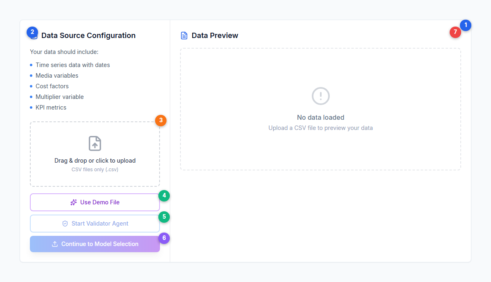
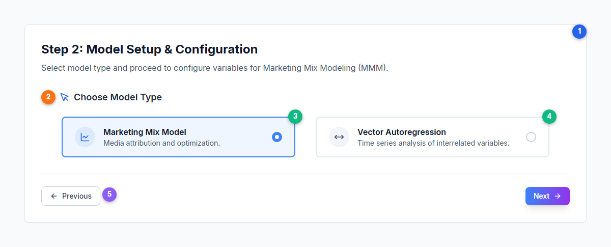
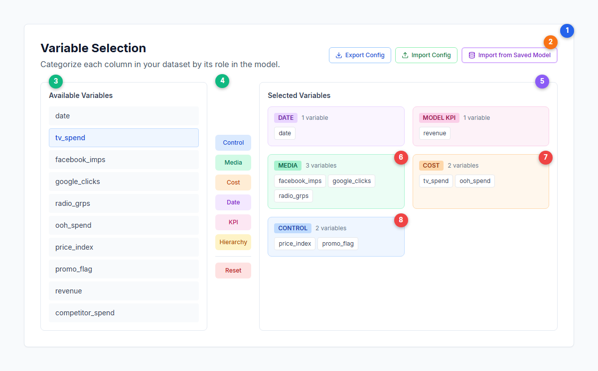
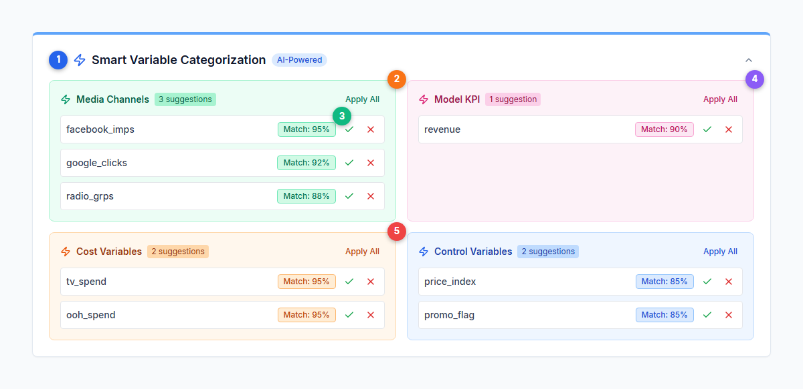
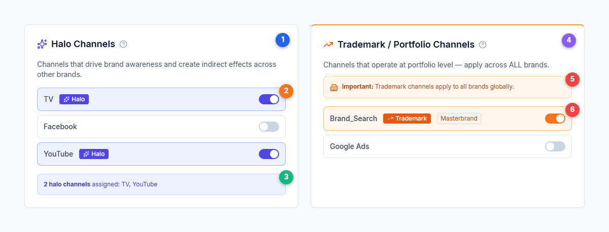
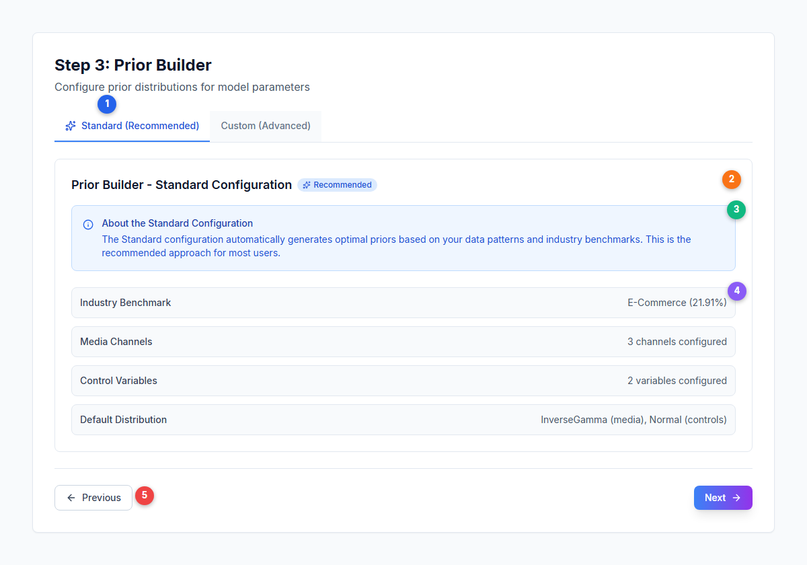
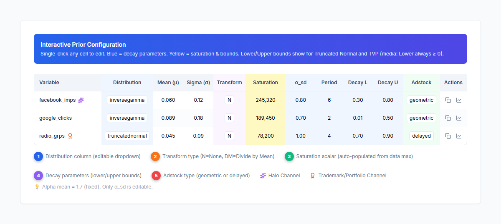
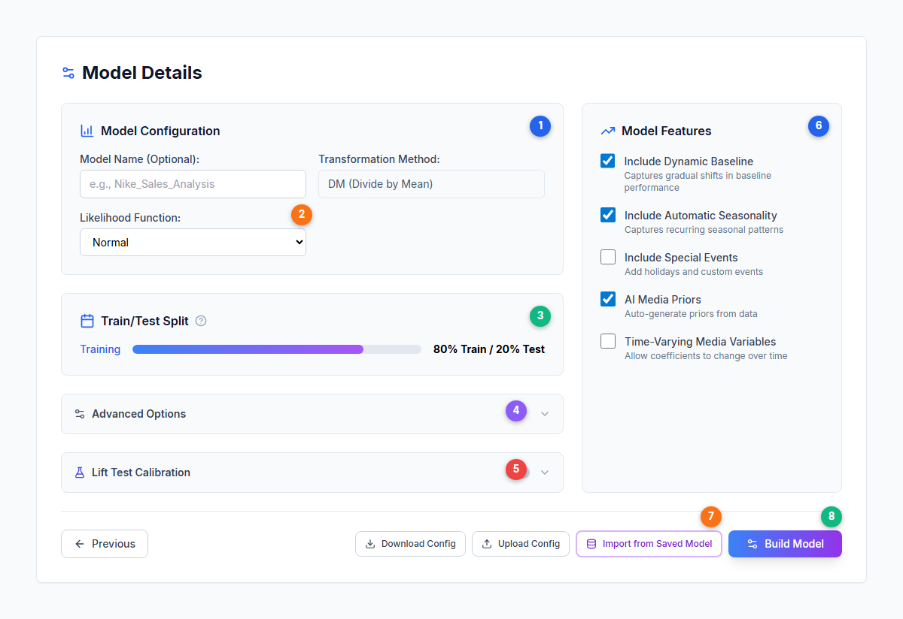
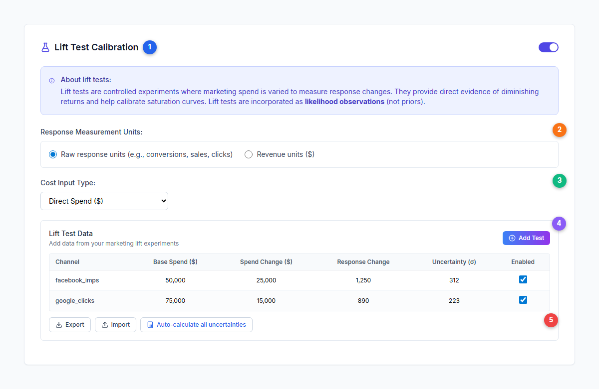

# Model Creation Wizard --- Step-by-Step Model Setup

The Model Warehouse configuration tab guides you through a five-step wizard to create and configure a new marketing mix model. Each step builds on the previous, from data upload through to model fitting.

---

## The Five-Step Wizard

The wizard follows this sequence:

1. **Source Configuration** --- Upload your CSV data and optionally validate it
2. **Model Setup** --- Choose between MMM and VAR model types
3. **Variable Selection** --- Categorize columns by role (media, cost, control, KPI, etc.)
4. **Prior Builder** --- Configure [Bayesian priors](../core-concepts/bayesian-modeling.md) for each variable
5. **Model Details** --- Set advanced options, lift tests, and start fitting

For MMM models, all five steps are used. For VAR models, the wizard flow differs --- the model is configured and built from Step 2 with additional VAR-specific settings.

---

## Step 1: Source Configuration

Upload your dataset and optionally run the [Data Validator](./data-auditor.md) to check data quality before proceeding.

| # | Element | Description |
|---|---------|-------------|
| 1 | **Page header** | Top-level section indicator for the wizard step |
| 2 | **Data Source Configuration panel** | Left column showing required data types: time series dates, media variables, cost factors, multiplier variable, and KPI metrics |
| 3 | **CSV upload area** | Drag & drop or click to upload. **CSV files only** (.csv), 50 MB maximum. Excel (.xlsx) is not supported |
| 4 | **Use Demo File** | Loads a sample 2-year marketing dataset for testing the platform without your own data |
| 5 | **Start Validator Agent** | Runs the Data Validator on your uploaded data using AI (disabled until a file is uploaded) |
| 6 | **Continue to Model Selection** | Proceeds to Step 2 (disabled until a file is uploaded) |
| 7 | **Data Preview panel** | Right column showing a preview table of your uploaded data with file name, size, column count, and sample rows |

### Data Transformations

After uploading, an optional collapsible section lets you apply transformations to columns before modeling:

- **Moving Average** (window size 2--30, default 3)
- **Adstock (Geometric Decay)** (decay rate 0.01--0.99, default 0.7)
- **Adstock (Delayed Peak)** (alpha/bell width 0.01--0.99, default 0.7)
- **Logarithmic**
- **Percentage Change**
- **Cumulative Sum**
- **Z-Score Normalization**

These are optional data preparation transforms, not the model's internal [adstock](../core-concepts/adstock-effects.md) or [saturation](../core-concepts/saturation-curves.md) functions.

---

## Step 2: Model Setup

Choose your model type and configure high-level settings.

| # | Element | Description |
|---|---------|-------------|
| 1 | **Step header** | "Step 2: Model Setup & Configuration" |
| 2 | **Choose Model Type** | Section for selecting between the two available model types |
| 3 | **Marketing Mix Model** (selected) | Standard MMM for channel attribution and optimization. Active state shown with blue border and background |
| 4 | **Vector Autoregression** | [VAR model](../core-concepts/var-modeling.md) for analyzing inter-channel dynamics and time series relationships |
| 5 | **Navigation buttons** | Previous returns to Step 1, Next proceeds to Step 3 (Variable Selection) |

### VAR Models

When VAR is selected, the wizard flow changes --- additional configuration panels appear directly in Step 2 (lags, forecast horizon, endogenous/exogenous variables, media transformations, prior distributions) and the model is built from this step without proceeding through Steps 3--5.

For full details on setting up a VAR model, including the importance of correctly matching spend and media exposure variables, see [VAR Models](./var-models.md). For the underlying methodology, see [VAR Modeling](../core-concepts/var-modeling.md).

---

## Step 3: Variable Selection

Categorize each column in your dataset by its role in the model using a three-panel layout. Correctly assigning variables is critical --- media channels need matching cost variables for ROI calculations, and control variables should capture non-media factors that influence your KPI. For guidance on preparing your data before this step, see [Data Requirements](../data/data-requirements.md).

| # | Element | Description |
|---|---------|-------------|
| 1 | **Section header** | "Variable Selection" with description |
| 2 | **Config buttons** | Export Config, Import Config, and Import from Saved Model --- save/load variable assignments |
| 3 | **Available Variables** (left panel) | All columns from your uploaded CSV. Click to select, then assign using the category buttons |
| 4 | **Category buttons** (middle panel) | Assign selected variables to: Control, Media, Cost, Date, Multiplier, Model KPI, or Hierarchy. Reset clears all |
| 5 | **Selected Variables** (right panel) | Shows assigned variables grouped by category with color-coded cards |
| 6 | **Media category** | Green card showing assigned media channel variables |
| 7 | **Cost category** | Orange card showing assigned cost/spend variables |
| 8 | **Control category** | Blue card showing assigned control variables (non-media factors) |

### Smart Variable Categorization

Simba uses AI-powered semantic matching to automatically suggest variable categorizations based on column names. The system recognizes 15 channel types (TV, Social, Search, Video, OOH, etc.) and 8 metric types (spend, impressions, GRPs, clicks, etc.).

| # | Element | Description |
|---|---------|-------------|
| 1 | **Smart Variable Categorization header** | AI-powered card with blue top border, appears automatically when suggestions are available |
| 2 | **Media Channel suggestions** | Suggested media variables with Apply All button to accept the entire category |
| 3 | **Confidence badge** | Match percentage (e.g., 95%) showing how confident the AI is. Accept (checkmark) or reject (X) each suggestion |
| 4 | **Model KPI suggestion** | Detected KPI variable (e.g., "revenue") with confidence score |
| 5 | **Cost Variable suggestions** | Detected cost/spend variables matched by semantic analysis |

### Halo and Trademark Channels

For multi-brand models, you can mark channels as [halo](../core-concepts/halo-effects.md) or trademark channels during variable selection.

| # | Element | Description |
|---|---------|-------------|
| 1 | **Halo Channels panel** | Mark channels that drive brand awareness and create indirect effects across brands. Indigo-themed with per-brand toggle switches |
| 2 | **Halo badge and toggle** | Active halo channels show a purple "Halo" badge. Toggle on/off per channel per brand |
| 3 | **Halo summary** | Shows count and list of assigned halo channels. At least one brand must have non-halo channels |
| 4 | **Trademark / Portfolio Channels panel** | Mark channels operating at portfolio level. Orange-themed |
| 5 | **Global application notice** | Trademark channels apply to ALL brands globally (not per-brand like halo) |
| 6 | **Trademark badge and type** | Active trademark channels show an orange "Trademark" badge plus a type indicator (Masterbrand, Portfolio, or Corporate) |

See [Halo and Trademark Channels](./halo-trademark-channels.md) for detailed configuration guidance.

---

## Step 4: Prior Builder

Configure [prior distributions](../core-concepts/priors-and-distributions.md) for each variable. The Prior Builder offers two modes.

### Standard Configuration (Recommended)

The Standard tab automatically generates optimal priors based on your data patterns and industry benchmarks (FMCG, Retail, TelCo, Financial Services, E-Commerce). For a deep dive into how these defaults are calculated, see [Smart Defaults](./smart-defaults.md).

| # | Element | Description |
|---|---------|-------------|
| 1 | **Tab selector** | "Standard (Recommended)" uses auto-generated priors. "Custom (Advanced)" enables manual editing |
| 2 | **Configuration summary card** | Shows the standard configuration with industry benchmark and channel counts |
| 3 | **Info box** | Explains that Standard mode automatically generates priors from data patterns |
| 4 | **Summary items** | Industry benchmark, media channel count, control variable count, and default distribution type |
| 5 | **Navigation** | Previous returns to Variable Selection, Next proceeds to Model Details |

### Custom Configuration

The Custom tab exposes a full AG Grid table for manual prior editing. Each row represents a variable with editable parameters. For detailed guidance on choosing distributions, setting decay bounds, and tuning saturation parameters, see [Model Configuration](./model-configuration.md).

| # | Element | Description |
|---|---------|-------------|
| 1 | **Distribution column** | Dropdown with four options: Normal, TruncatedNormal, InverseGamma, TVP (Time-Varying Parameter). InverseGamma is the default for media channels |
| 2 | **Transform column** | Data transform applied: N (None) for media, DM (Divide by Mean) for controls |
| 3 | **Saturation column** | Scalar value auto-populated from the maximum activity in your data. Controls the [saturation curve](../core-concepts/saturation-curves.md) scale |
| 4 | **Decay parameters** | Lower and upper bounds for the [adstock](../core-concepts/adstock-effects.md) decay rate (Beta distribution) |
| 5 | **Adstock type** | Geometric (immediate peak, exponential decay) or Delayed (peak after configurable lag) |
| ✦ | **Halo Channel** (purple sparkle icon) | Channels marked as halo get a fixed coefficient of 0.005 |
| ✦ | **Trademark Channel** (orange award icon) | Channels marked as trademark get 25% of their calculated prior |

**Additional Custom mode features:**

- **Bulk Update**: Copy settings from one variable to many using the Copy icon
- **Graph Preview**: Click the chart icon to see distribution shape and decay curves (uses Plotly.js for distributions)
- **Master-Detail View**: Alternative editing interface with keyboard navigation (J/K to navigate, Escape to close)
- **Alpha mean** is fixed at 1.7 (Gamma prior). Only alpha_sd is editable

---

## Step 5: Model Details

Final configuration before fitting your model. This step brings together model naming, train/test splitting, advanced tuning options, and optional lift test calibration.

| # | Element | Description |
|---|---------|-------------|
| 1 | **Model Configuration** | Set model name (optional), view transformation method (DM, fixed), and select likelihood function (Normal, LogNormal, StudentT, Quantile) |
| 2 | **Likelihood Function** | Dropdown controlling the statistical distribution for model fitting. Normal is the default |
| 3 | **Train/Test Split** | Slider from 50% to 100% training data. Default is 100% (no holdout test set) |
| 4 | **Advanced Options** | Collapsible accordion with [seasonality](../core-concepts/seasonality.md), intercept priors, MCMC sampling, and diagnostics settings |
| 5 | **Lift Test Calibration** | Collapsible section for adding experimental calibration data (toggle to enable) |
| 6 | **Model Features checkboxes** | Right column (Custom mode only): Include Dynamic Baseline, Include Automatic Seasonality, Include Special Events, AI Media Priors, Time-Varying Media Variables |
| 7 | **Config management buttons** | Download Config, Upload Config, Import from Saved Model --- save/load complete model configurations |
| 8 | **Build Model** | Submit the model for Bayesian inference. Enters the task queue |

### Train/Test Split

Adjust what percentage of your data is used for training vs. holdout testing. A higher training percentage gives the model more data to learn from but leaves less for out-of-sample validation.

### Advanced Options

The Advanced Options accordion contains four sections:

**Seasonality:**
- **Annual Fourier terms**: Default n=2 (range 1--25). Higher values capture more complex patterns
- **Prior scale**: Default 10, controls flexibility of the seasonality component
- **Weekly seasonality**: Only available for daily data, disabled by default, opt-in via checkbox (default n=3 terms)

**Intercept Priors:**
- Prior mean (default 2), lower bound (default 0), upper bound (default 2) --- expressed as multiples of KPI mean

**MCMC Sampling:**
- **Sampler**: NUMBA (default, with progress tracking) or Nutpie (faster, no progress display)
- **Target accept rate**: Default 0.85 (range 0.6--0.99)
- **Warmup iterations**: Default 1,500
- **Posterior samples**: Default 1,000

**Diagnostics:**
- **Sample from Prior**: Generate prior predictive samples before fitting (useful for validating assumptions)

### Lift Test Calibration

Add experimental results from geo-lift tests, conversion lift studies, or holdout tests to calibrate the model.

| # | Element | Description |
|---|---------|-------------|
| 1 | **Enable toggle** | Turn lift test calibration on/off with the checkbox next to the section header |
| 2 | **Response Measurement Units** | Choose between raw response units (conversions, sales) or revenue units ($) |
| 3 | **Cost Input Type** | How to input test costs: Direct Spend, Cost per Acquisition (CPA), Cost per Click (CPC), Cost per Thousand Impressions (CPM), or Custom Cost Metric |
| 4 | **Lift Test Data table** | AG Grid for entering test data: channel, base spend, spend change, response change, and uncertainty (sigma). Add new tests with the "Add Test" button |
| 5 | **Import/Export buttons** | Export lift test data as JSON for reuse, or import a previously saved configuration. Auto-calculate uncertainties button available |

**Important:** Lift tests are incorporated as **likelihood observations** (not priors). They provide direct experimental evidence that helps calibrate the model's [saturation curves](../core-concepts/saturation-curves.md) and channel attribution. See [Incrementality](../core-concepts/incrementality.md) for the underlying methodology.

### Holidays and Events

When "Include Special Events" is enabled in the Model Features checkboxes, a holiday selector appears:

- **Country selector**: Search 200+ countries, with popular shortcuts (US, GB, AU, CA, DE, FR, NL, IE, NZ, SG)
- **Manual date picker**: Add custom event dates
- **Week convention**: For weekly data, choose between "Week Commencing" (Monday) or "Week Ending" (Sunday)
- Holidays are automatically snapped to your data's period boundaries and deduplicated

### Import from Saved Model

The "Import from Saved Model" button opens a dialog to import posteriors and settings from a previously completed model:

- **Variable Selections**: Date, KPI, Media, Costs, Controls, Linked Items, Halo & Trademark Channels
- **Priors**: Posterior distributions converted to new priors (with adjusted scalars)
- **Model Settings**: Trend, Seasonality, TVP, Sampling options, Train/Test split

This is useful for warm-starting new models based on previous results.

---

## After the Wizard

Once submitted, the model progresses through these statuses:

| Status | Description |
|---|---|
| **Pending** | Queued, waiting for compute resources |
| **Under Way** | Bayesian inference is actively running with a progress indicator |
| **Complete** | Results are available for review |
| **Failed** | An error occurred. Check the error message for guidance |
| **Revoked** | Cancelled by the user before completion |
| **Time Exceeded** | Exceeded maximum computation time. Simplify the model and retry |

You can navigate away during fitting and return when it completes. Check status from the Warehouse or Dashboard.

Once your model completes, proceed to [Incremental Measurement](./measurement.md) to interpret channel contributions, response curves, and model diagnostics. To optimize your budget based on the results, see [Budget Optimization](./budget-optimization.md). For what-if forecasting, see [Scenario Planning](./scenario-planning.md).

---

## Next Steps

**Platform guides:**
- [Model Configuration](./model-configuration.md) --- Detailed prior and parameter tuning
- [Smart Defaults](./smart-defaults.md) --- How auto-generated priors work
- [Incremental Measurement](./measurement.md) --- Interpreting your model results
- [Budget Optimization](./budget-optimization.md) --- Optimize channel spend allocation
- [Scenario Planning](./scenario-planning.md) --- What-if forecasting and scenario analysis
- [VAR Models](./var-models.md) --- VAR-specific model creation and analysis
- [Halo and Trademark Channels](./halo-trademark-channels.md) --- Cross-brand channel configuration
- [Data Requirements](../data/data-requirements.md) --- Data preparation guidance

**Core concepts:**
- [Bayesian Modeling](../core-concepts/bayesian-modeling.md) --- Priors, posteriors, and the 94% HDI
- [Priors and Distributions](../core-concepts/priors-and-distributions.md) --- Distribution choices and their implications
- [Saturation Curves](../core-concepts/saturation-curves.md) --- Diminishing returns modeling
- [Adstock Effects](../core-concepts/adstock-effects.md) --- Carryover and decay mechanics
- [Seasonality](../core-concepts/seasonality.md) --- Fourier terms, trend, and holiday effects
- [Halo Effects](../core-concepts/halo-effects.md) --- Cross-channel and cross-brand spillover
- [Incrementality](../core-concepts/incrementality.md) --- Lift test methodology and causal attribution
