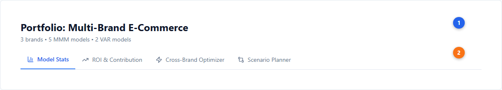
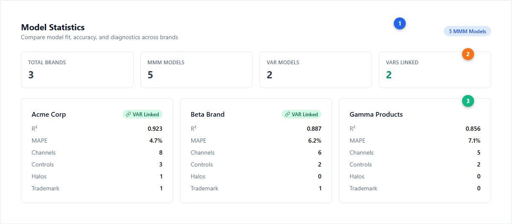
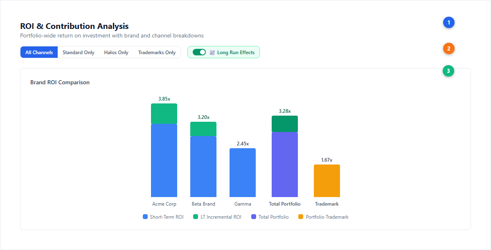
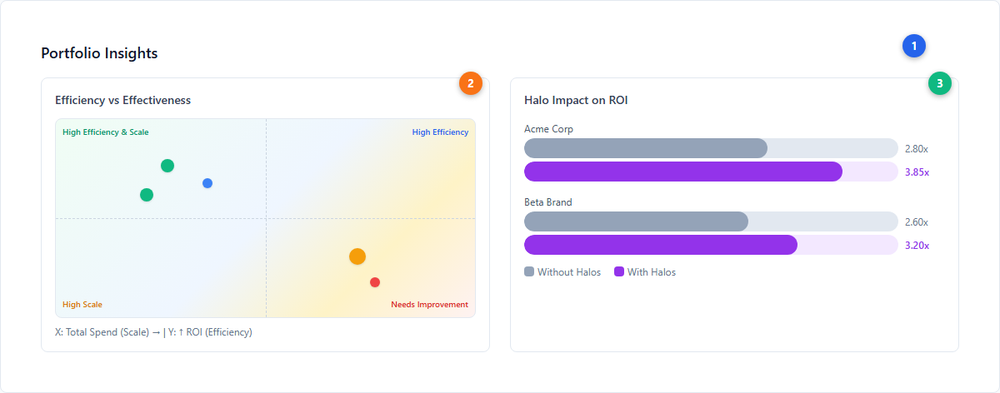
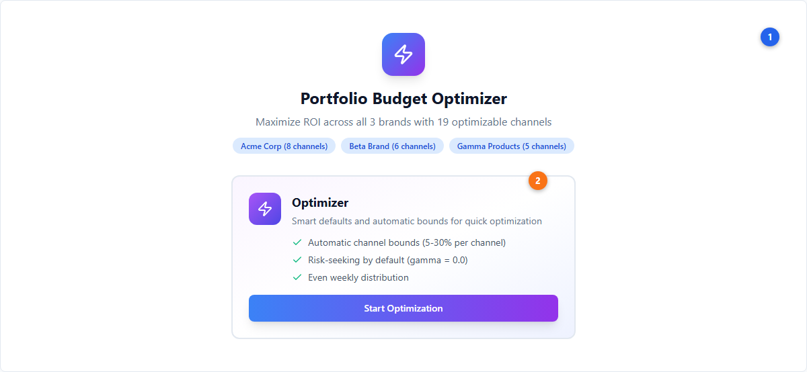
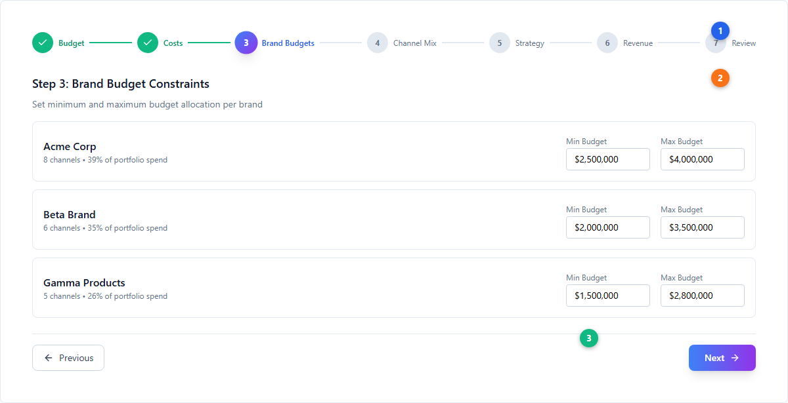
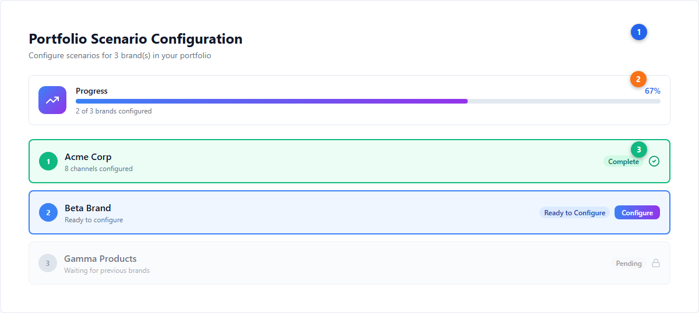
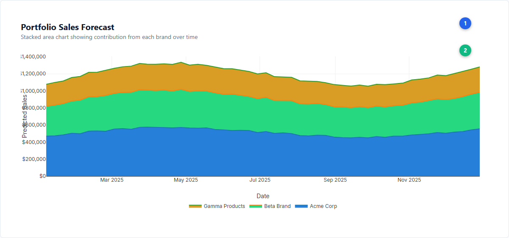

# Portfolio Analysis --- Cross-Brand Insights and Optimization

Portfolio Analysis enables cross-brand, cross-market, and cross-model comparison and optimization. Build individual [Bayesian MMM](../core-concepts/bayesian-modeling.md) models for each brand, link them into a portfolio, and analyze the combined picture to make portfolio-level budget decisions --- including how [halo and trademark channels](../core-concepts/halo-effects.md) impact the entire portfolio.

> **Availability**: Portfolios are available on Pro (1 portfolio) and Scale (2 portfolios) plans. Trial and Analyst plans do not include portfolio analysis.

---

## Creating a Portfolio

1. Navigate to **Warehouse > Portfolios** tab.
2. Click **Create Portfolio** and give it a descriptive name.
3. **Add models**: Select completed MMM and/or VAR models to include. Each model typically represents a different brand, market, or product line.
4. **Link VAR models**: Link VAR models to their corresponding MMM models to enable long-run effects analysis across the portfolio.

Portfolios can contain models with different time periods, channel sets, and configurations. The analysis tools handle alignment automatically.

---

## Portfolio Analysis Tabs

The portfolio analysis page has four active tabs, each providing a different lens on your cross-brand data.

| # | Element | Description |
|---|---------|-------------|
| 1 | **Portfolio header** | Portfolio name, brand count, model counts (MMM and VAR) |
| 2 | **Tab navigation** | Four analysis tabs: Model Stats, ROI & Contribution, Cross-Brand Optimizer, Scenario Planner |

---

## Model Statistics

Compare model fit, accuracy, and diagnostics across all brands in your portfolio at a glance.

| # | Element | Description |
|---|---------|-------------|
| 1 | **MMM Models badge** | Count of MMM models in the portfolio |
| 2 | **Aggregate stats** | Four summary cards: Total Brands, MMM Models, VAR Models, VARs Linked (emerald when linked) |
| 3 | **Brand model cards** | Per-brand cards showing R², MAPE, channel count, controls, [halo](../core-concepts/halo-effects.md) count, trademark count, and VAR linking status (green "VAR Linked" badge when a VAR model is connected) |

**How to interpret**: Use this tab to quickly identify models that may need attention --- low R² (< 0.7), high MAPE (> 10%), or missing VAR linkage. All brands should ideally have VAR models linked for long-run effects analysis.

---

## ROI & Contribution Analysis

Compare return on investment across brands and channels with optional long-run effects from linked [VAR models](../core-concepts/var-modeling.md).

### Brand ROI Comparison

| # | Element | Description |
|---|---------|-------------|
| 1 | **Section header** | Title and subtitle describing the portfolio-wide ROI analysis |
| 2 | **Channel filters and Long Run Effects toggle** | Filter by All Channels, Standard Only, Halos Only, or Trademarks Only. The emerald "Long Run Effects" toggle (only visible when VAR models are linked) applies VAR elasticity multipliers to show long-run ROI alongside short-term |
| 3 | **Brand ROI chart** | Stacked bar chart comparing ROI across brands. Blue = short-term ROI, Green = long-term incremental ROI, Indigo = Total Portfolio aggregate, Amber = Portfolio Trademark (costs allocated once, benefits all brands) |

**Portfolio Trademark**: Trademark channels (e.g., brand search) are shown as a separate "Portfolio Trademark" entity rather than split across individual brands. This reflects how trademark spend is typically allocated once at the portfolio level but generates revenue across all brands.

### Insights & Diagnostics

| # | Element | Description |
|---|---------|-------------|
| 1 | **Insights header** | Summary of portfolio-level diagnostic panels |
| 2 | **Efficiency vs Effectiveness scatter** | Quadrant chart positioning brands by ROI (efficiency, y-axis) and total spend (scale, x-axis). Green = high efficiency & scale, Blue = high efficiency but lower scale, Orange = high scale but lower efficiency, Red = needs improvement |
| 3 | **Halo Impact comparison** | Horizontal bars comparing per-brand ROI with and without [halo channel](../core-concepts/halo-effects.md) contributions. Gray = without halos, Purple = with halos. The lift shows how much cross-brand marketing adds to each brand's ROI |

### How to Interpret ROI Results

| Pattern | Meaning | Action |
|---|---|---|
| **High ROI + High Spend** | Strong performer | Maintain or grow cautiously (check [saturation](../core-concepts/saturation-curves.md)) |
| **High ROI + Low Spend** | Opportunity to scale | Increase budget --- high marginal returns available |
| **Low ROI + High Spend** | Candidate for reallocation | Shift budget to higher-ROI brands/channels |
| **High Halo Lift** | Cross-brand effects significant | Protect halo spend --- cutting it erodes other brands' ROI |
| **Portfolio Trademark ROI < 2x** | Trademark may be over-invested | Review trademark vs generic search allocation |

---

## Cross-Brand Optimizer

Optimize budget allocation across all brands and channels simultaneously, maximizing total portfolio revenue.

### Optimizer Landing

| # | Element | Description |
|---|---------|-------------|
| 1 | **Optimizer header** | Brand count, total optimizable channels across all brands |
| 2 | **Strategy card** | "Optimizer" with smart defaults: automatic channel bounds (5-30% per channel), risk-seeking by default (gamma = 0.0), even weekly distribution. Click "Start Optimization" to begin |

After clicking Start, choose the optimization period (1 week, 1 month/4 weeks, 3 months/12 weeks, or custom up to 52 weeks).

### The Optimization Wizard

| # | Element | Description |
|---|---------|-------------|
| 1 | **Progress stepper** | 7 steps (6 if single-week): Budget → Costs → Brand Budgets → Channel Mix → Strategy → Revenue Setup → Review. Green checkmarks for completed steps, active step highlighted with gradient |
| 2 | **Brand constraints** | Per-brand minimum and maximum budget allocation. Each brand shows channel count and current spend share |
| 3 | **Navigation** | Previous/Next buttons to move through the wizard |

**Key optimizer behaviors:**
- **[Halo channels](../core-concepts/halo-effects.md)** are excluded from optimization (their spend belongs to another brand)
- **Trademark channels** are allocated once at portfolio level, with benefits distributed across brands
- **Virtual channel mapping** handles deduplication when the same channel appears across multiple brands
- See [Budget Optimization](./budget-optimization.md) for single-brand optimization details and [optimization theory](../core-concepts/budget-optimization.md) for the mathematical framework

---

## Scenario Planner

Run portfolio-level scenarios to forecast revenue across all brands under different budget allocations.

### Brand Configuration Checklist

| # | Element | Description |
|---|---------|-------------|
| 1 | **Configuration header** | Title showing the number of brands to configure |
| 2 | **Progress tracker** | Gradient progress bar showing percentage of brands configured, with count |
| 3 | **Brand checklist** | Sequential brand cards: emerald border + CheckCircle = complete, blue border = ready to configure, slate border + Lock = pending (must complete previous brands first). A **Master Template** feature lets you copy channel configurations from one brand to all others for consistency |

When all brands are configured, a green "Ready to Run Portfolio Scenario" card appears.

### Portfolio Forecast

| # | Element | Description |
|---|---------|-------------|
| 1 | **Forecast header** | Title and description of the stacked area visualization |
| 2 | **Stacked area chart** | Plotly.js chart showing per-brand revenue contributions stacked over time. Each brand gets a distinct HSL color. Hover shows per-brand values at each date. Legend below the chart |

See [Scenario Planning](./scenario-planning.md) for single-brand scenario details.

---

## Portfolio Sharing

Portfolios can be shared with other users for collaborative analysis:

- Share a portfolio to grant access to the portfolio view and all linked models
- Manage share permissions independently of individual model shares

---

## Next Steps

**Platform guides:**
- [Budget Optimization](./budget-optimization.md) --- Single-brand optimization details
- [Scenario Planning](./scenario-planning.md) --- Single-brand forecasting
- [Halo & Trademark Channels](./halo-trademark-channels.md) --- Configure cross-brand channel effects
- [Long-Term Effects](./long-term-effects.md) --- VAR-based long-run analysis
- [Measurement](./measurement.md) --- Individual model results interpretation

**Core concepts:**
- [Halo Effects](../core-concepts/halo-effects.md) --- Cross-brand marketing impact theory
- [Saturation Curves](../core-concepts/saturation-curves.md) --- [Diminishing returns](../core-concepts/saturation-curves.md) across channels
- [Bayesian Modeling](../core-concepts/bayesian-modeling.md) --- The Bayesian approach to MMM
- [Budget Optimization](../core-concepts/budget-optimization.md) --- Risk-adjusted allocation theory
- [VAR Modeling](../core-concepts/var-modeling.md) --- Long-run effects methodology
