# Scenario Planning --- Forecasting and What-If Analysis

Scenario Planning lets you explore how different budget allocations and market conditions affect future revenue. Using the [Bayesian model](../core-concepts/bayesian-modeling.md) fitted during [Incremental Measurement](./measurement.md), you create custom spend plans and generate revenue predictions with uncertainty bands powered by the full posterior distribution.

---

## Choosing a Planning Mode

When you open the Scenario Planner, you are presented with two planning modes. Both produce the same prediction output --- the difference is how you build the input plan.

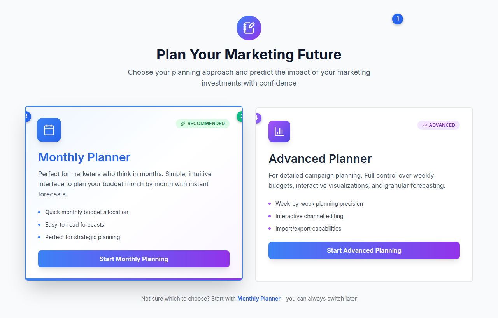
*The Scenario Planner landing page with Monthly Planner (recommended, left) and Advanced Planner (right).*

**① Header** --- The Scenario Planner opens with "Plan Your Marketing Future" and a brief description.

**② Monthly Planner card** --- Blue-themed card with a Calendar icon and green "RECOMMENDED" badge. Features a guided wizard flow for month-based planning.

**③ RECOMMENDED badge** --- Green badge with Sparkles icon indicating this is the suggested starting point.

**④ Advanced Planner card** --- Purple-themed card with a BarChart3 icon and "ADVANCED" badge. Provides full spreadsheet control over every period.

### Monthly Planner (Recommended)

A guided 6-step wizard designed for marketers who think in months. You set a total budget, configure channel costs, allocate by month, choose a within-month distribution strategy, optionally adjust non-media drivers, and set a revenue conversion multiplier.

**Best for:** Strategic planning, quick scenario exploration, users who prefer a structured flow.

### Advanced Planner

A full AG Grid spreadsheet editor where you control every value for every period (week or day). Media channels appear in white cells, control variables in yellow italic cells, and proxy channels in blue cells.

**Best for:** Detailed campaign planning, importing plans from Excel, users who need cell-level precision.

> Not sure which to choose? Start with **Monthly Planner** --- you can always switch to the Advanced Planner later, and the wizard output feeds directly into the advanced grid.

---

## Monthly Planner Wizard

The Monthly Planner is a 6-step wizard that converts high-level monthly budgets into period-level activity values for prediction.

### Step 1: Budget Configuration

Set your total marketing budget and review the planning period.

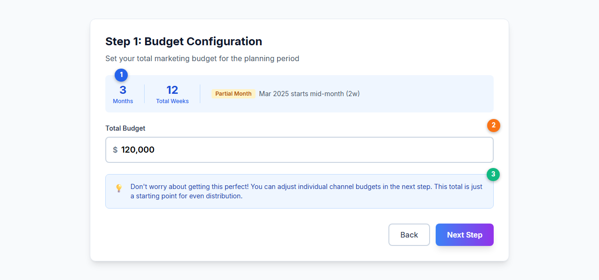
*Set the total budget and review the planning period summary.*

**① Planning period summary** --- Shows the number of months, total weeks, and flags any partial months with an amber badge. The planning period starts from the next period after your model's last data point.

**② Total budget input** --- Enter your total marketing budget. Default is $120,000 for a 3-month horizon. This total is distributed evenly across channels in the next step.

**③ Info box** --- Reassurance that the total budget is just a starting point --- you can adjust individual channel budgets in the next step.

### Step 2: Configure Channel Costs

Define how each channel's activity is measured and what it costs.

| Column | Description |
|---|---|
| **Channel** | Media channel name from your fitted model |
| **Metric Type** | How the channel is measured: Spend, Impressions, Clicks, GRP, or TRP |
| **Avg Cost** | Average CPM, CPP, or CPC. Editing this auto-fills all month columns |
| **Monthly columns** | Per-month cost overrides if costs vary seasonally |

Channels with metric type "Spend" do not require a cost column (spend is entered directly in Step 3).

Average costs are pre-filled from historical data when available. The system calculates cost-per-unit from your model's last year of data.

**Proxy channels** can be added at the bottom of this step. A proxy channel borrows the [response curve](../core-concepts/saturation-curves.md) of an existing reference channel, allowing you to model new channels (e.g., Podcasts) that were not in the original training data. Proxy channels appear with a blue highlight and a "Proxy" badge.

### Step 3: Enter Monthly Budgets

Allocate spend to each channel for each month using an editable AG Grid.

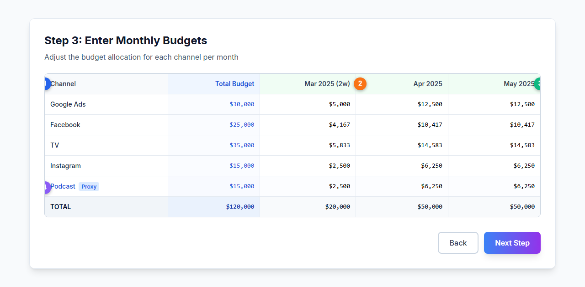
*The budget grid with channels as rows and months as columns. Proxy channels are highlighted with a blue "Proxy" badge.*

**① Channel column** (pinned left) --- Channel names with proxy channels marked by a blue badge.

**② Monthly columns** (green headers) --- Per-month budget for each channel. Partial months show the week count (e.g., "Mar 2025 (2w)"). Editing any month recalculates the channel total.

**③ Total Budget column** (pinned right, blue) --- Total budget for each channel across all months. Editing this auto-distributes evenly across months.

**④ Proxy channel row** --- Podcast shown with blue "Proxy" badge, using the response curve from its reference channel.

### Step 4: Choose Allocation Strategy

Select how each month's budget is distributed across the weeks (or days) within that month.

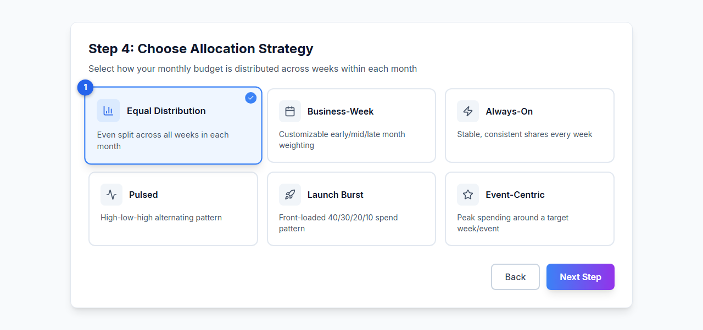
*Six allocation strategies control how monthly budgets are split into weekly (or daily) values. The selected strategy (Equal Distribution) is highlighted with a blue border.*

**① Selected strategy** --- Blue border and blue background indicate the active selection (Equal Distribution shown here).

| Strategy | Icon | Behavior |
|---|---|---|
| **Equal Distribution** | BarChart3 | Budget split evenly across all periods. Simple and balanced |
| **Business-Week** | Calendar | Customizable weights for early, mid, and late month (sliders from 0.5x to 1.5x) |
| **Always-On** | Zap | Stable, consistent shares throughout the month |
| **Pulsed** | Activity | High-low-high alternating pattern for variation |
| **Launch Burst** | Rocket | Front-loaded spending (40%, 30%, 20%, 10%) for product launches |
| **Event-Centric** | Star | Peak spending concentrated in a specific week, ideal for promotions |

### Step 5: Business Scenario Adjustments (Conditional)

This step appears only if your model includes control variables (non-media drivers like pricing, distribution, or promotions). It lets you run "what-if" scenarios by adjusting these factors relative to their historical baseline.

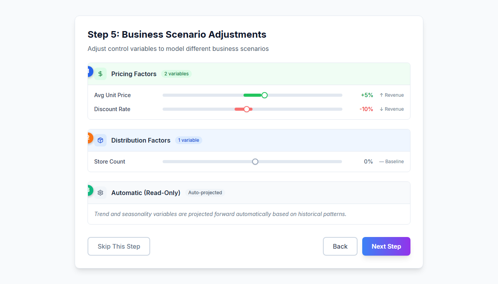
*Adjust non-media drivers by percentage. The KPI impact indicator shows whether each change helps or hurts predicted sales.*

**① Pricing Factors** --- Variables related to price, cost, or discount. Each has a slider and shows the impact direction (↑ Revenue or ↓ Revenue) based on the model's coefficient sign.

**② Distribution Factors** --- Variables like store count or availability. A 0% adjustment means using the baseline value.

**③ Automatic (Read-Only)** --- [Seasonality](../core-concepts/seasonality.md), trend, and intercept variables are projected forward automatically from historical patterns. These cannot be edited.

You can also **Skip** this step to use baseline (unadjusted) values for all controls.

### Step 6: Configure Revenue Conversion

Set a multiplier to convert the model's predicted target variable into revenue.

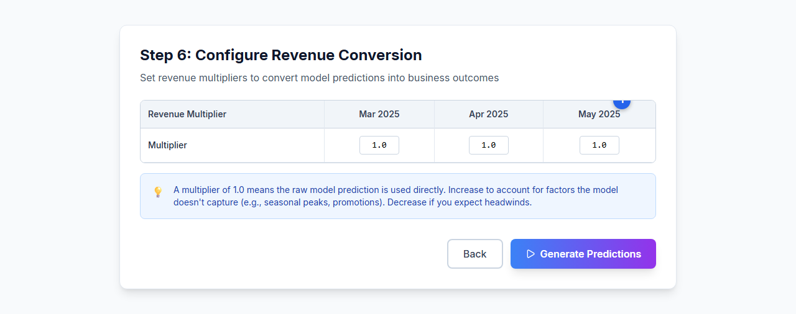
*Set monthly revenue multipliers. A value of 1.0 uses the raw model prediction directly.*

**① Multiplier inputs** --- One column per planning month. Default is 1.0 (no conversion). Adjust for seasonal pricing or to convert units to revenue.

| Model Type | Multiplier Represents | Example |
|---|---|---|
| Volume/Units | Average price per unit | $25.00 |
| Customer Acquisition | Customer lifetime value (LTV) | $500.00 |
| Revenue/Sales | No conversion needed | 1.00 |

After completing Step 6, the wizard converts your monthly budget plan into period-level rows (weekly or daily), merges control variables, and transitions to the prediction phase.

---

## Advanced Planner

The Advanced Planner presents a full AG Grid spreadsheet with one row per period (week or day) and columns for every variable in the model.

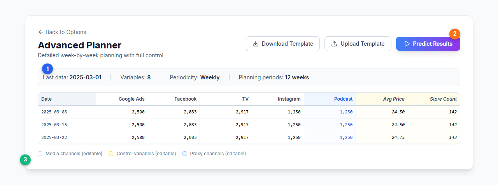
*The Advanced Planner grid with model info bar, download/upload buttons, and color-coded columns.*

**① Model info bar** --- Shows last data date, variable count, periodicity, and total planning periods.

**② Action buttons** --- Download Template (export as CSV), Upload Template (import from CSV/Excel), and Predict Results (submit for Bayesian prediction).

**③ Color-coded legend** --- Media channels (white, editable), control variables (yellow italic, editable), proxy channels (blue, editable).

The grid is pre-filled using one of these sources (in priority order):
1. **Wizard data** --- If you came from the Monthly Planner, the wizard output populates the grid
2. **Last year data** --- Historical activity from the same period one year ago
3. **Empty template** --- A blank grid with the correct dates and channel names

**Tips:**
- Copy and paste from Excel using Ctrl+C / Ctrl+V
- Click a cell, type a value, press Enter to save, press Tab to move right
- Control variables are automatically populated from the previous year's data. Edit them only if you expect changes in pricing, distribution, or other non-media factors

---

## Generating Predictions

Scenario planning does **not** update forecasts in real time as you edit. Instead:

1. Configure your scenario in either the Monthly Planner wizard or the Advanced Planner grid.
2. Click **Predict Results** to queue the forecast.
3. The prediction runs asynchronously on the server. The UI polls for results every 5 seconds.
4. When complete, the Scenario Results Dashboard appears with full visualizations.

Each prediction uses the full [Bayesian](../core-concepts/bayesian-modeling.md) posterior from your fitted model. The forecast applies the [adstock](../core-concepts/adstock-effects.md) and [saturation](../core-concepts/saturation-curves.md) transforms to your planned activity, then generates predictions with uncertainty bands from all posterior samples.

---

## Uncertainty Bands

Every forecast includes uncertainty bands showing the range of plausible outcomes:

- The **prediction line** shows the median forecast from the Bayesian posterior.
- The **shaded band** shows the 94% HDI (Highest Density Interval) --- the range containing 94% of the posterior probability mass. The UI displays this as "95% CI" for readability.

Wider bands indicate greater uncertainty. This typically happens when:

- The forecast horizon extends further into the future
- Budget levels fall outside the range observed in historical data
- A channel has limited historical data to inform its [response curve](../core-concepts/saturation-curves.md)

---

## Scenario Results Dashboard

When predictions complete, a comprehensive results dashboard appears with multiple views.

### Executive Summary

Three gradient hero cards show the top-level forecast metrics (out-of-sample periods only):

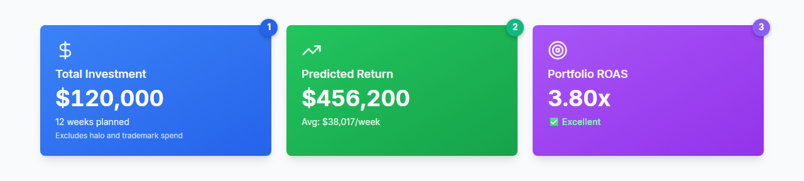
*Three gradient cards: Total Investment (blue), Predicted Return (green), and Portfolio ROAS (purple) with quality rating.*

**① Total Investment** (blue) --- Total media spend across all planned periods. Excludes [halo and trademark](../core-concepts/halo-effects.md) spend. Shows the number of weeks planned.

**② Predicted Return** (green) --- Total predicted revenue from all media channels. Shows the average per-week revenue.

**③ Portfolio ROAS** (purple) --- Return on ad spend across the full portfolio. Includes a quality rating: Excellent (≥ 4.0x), Good (≥ 2.5x), or Below Target (< 2.5x).

### Sales Forecast Chart

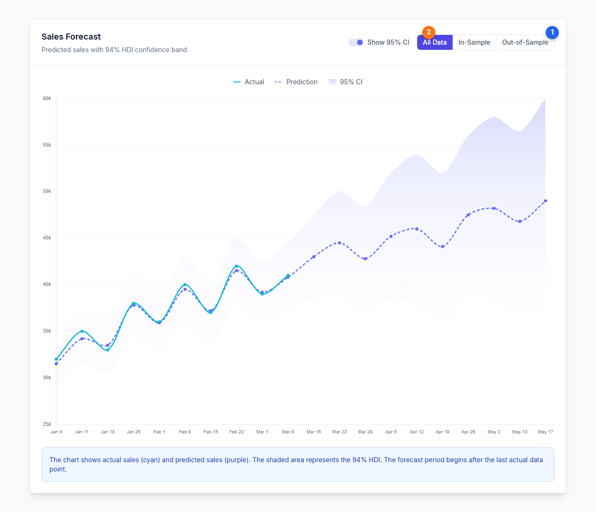
*Actual sales (cyan), predicted sales (indigo dashed), and the 94% HDI band (indigo gradient). The dashed vertical line marks the forecast boundary.*

**① Filter toggle** --- Switch between All Data, In-Sample, and Out-of-Sample views.

**② CI toggle** --- Show or hide the confidence interval band.

The chart uses a Recharts ComposedChart with:
- **Actual** values (cyan `#06b6d4` solid line) for in-sample periods
- **Prediction** values (indigo `#6366f1` dashed line) for both in-sample and out-of-sample periods
- **94% HDI band** (indigo gradient, from 30% to 5% opacity) that widens over the forecast horizon
- A "Forecast Start" reference line at the in-sample/out-of-sample boundary

### Channel ROAS Comparison

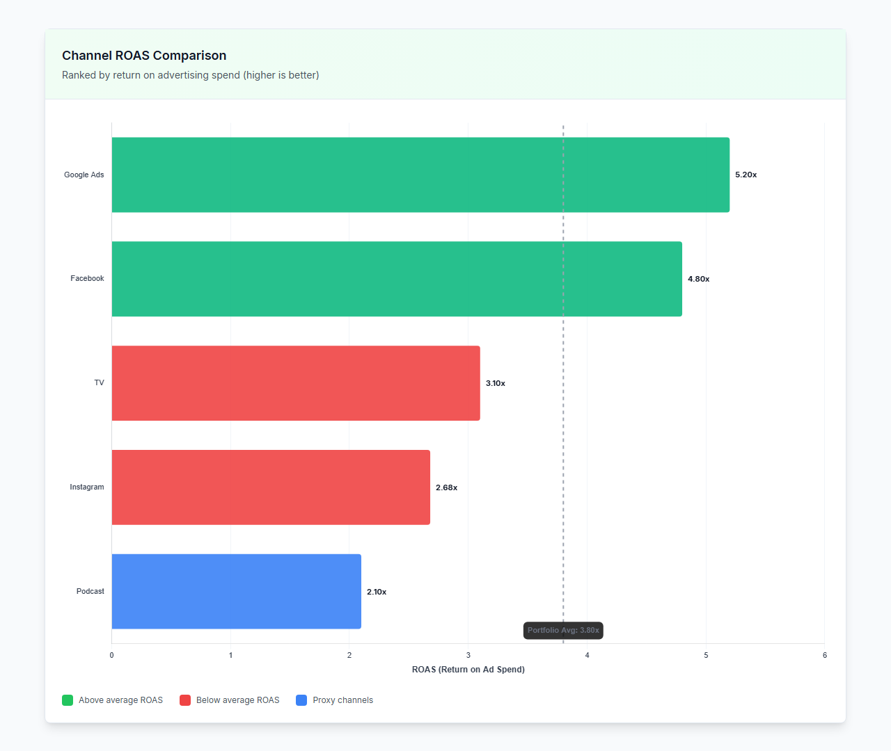
*Horizontal bar chart comparing ROAS across all media channels. Green = above portfolio average, red = below average, blue = proxy channels.*

Channels are ranked by ROAS (return on ad spend). The dashed vertical line shows the portfolio average ROAS. [Halo and trademark channels](../core-concepts/halo-effects.md) are excluded from this chart since their ROAS is misleading (they have no direct spend on the current brand).

### Revenue Breakdown (Waterfall)

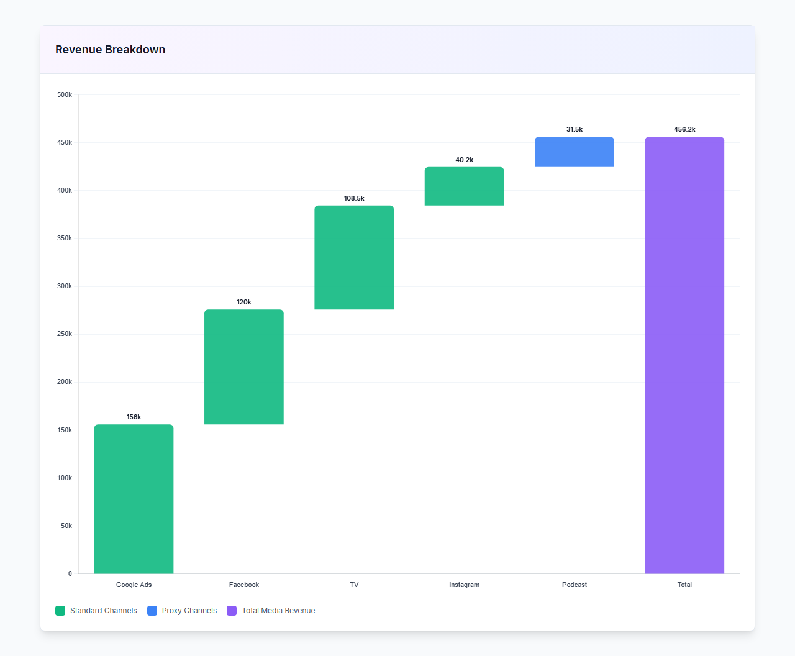
*Waterfall chart showing how each channel contributes to total media revenue. Green = standard channels, blue = proxy channels, purple = total.*

The waterfall shows cumulative revenue contributions from each channel, building up to the total media revenue. Each bar is labeled with its contribution value.

### Efficiency vs Effectiveness

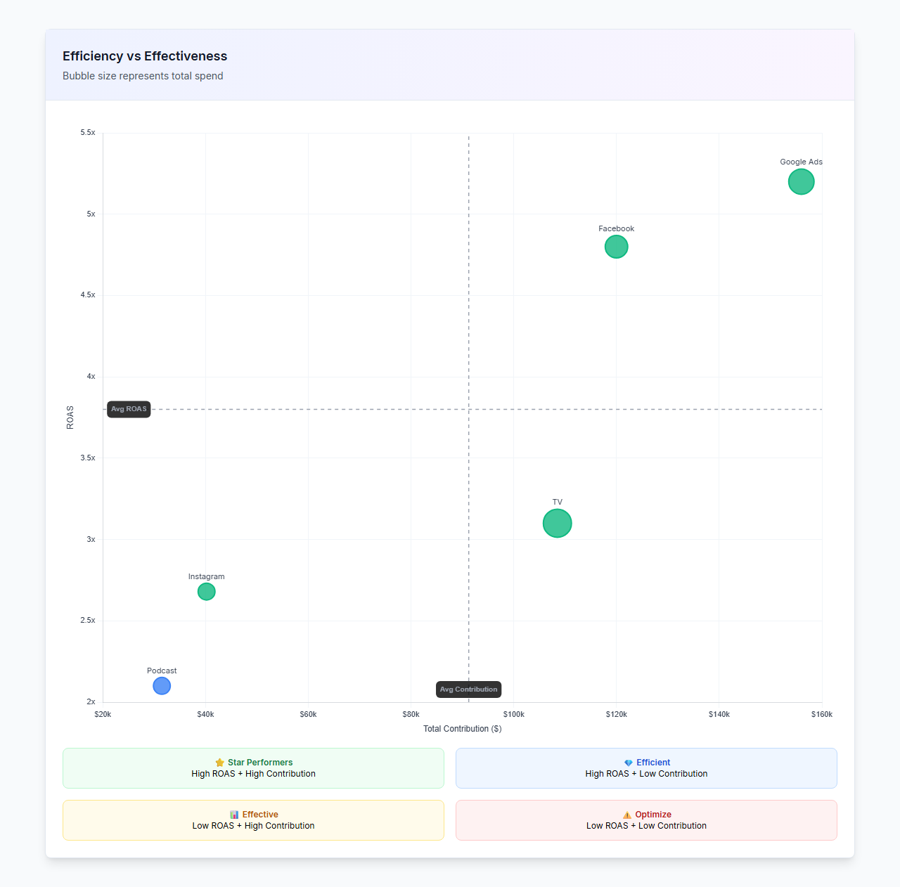
*Bubble chart plotting ROAS (Y-axis) against total contribution (X-axis). Bubble size represents spend. Channels are categorized into four quadrants.*

The scatter plot divides channels into four quadrants based on portfolio averages:

| Quadrant | Meaning |
|---|---|
| **⭐ Star Performers** | High ROAS + High Contribution --- your best channels |
| **💎 Efficient** | High ROAS + Low Contribution --- opportunity to scale up |
| **📊 Effective** | Low ROAS + High Contribution --- volume drivers with diminishing returns |
| **⚠️ Optimize** | Low ROAS + Low Contribution --- candidates for budget reallocation |

### Top Performers and Insights

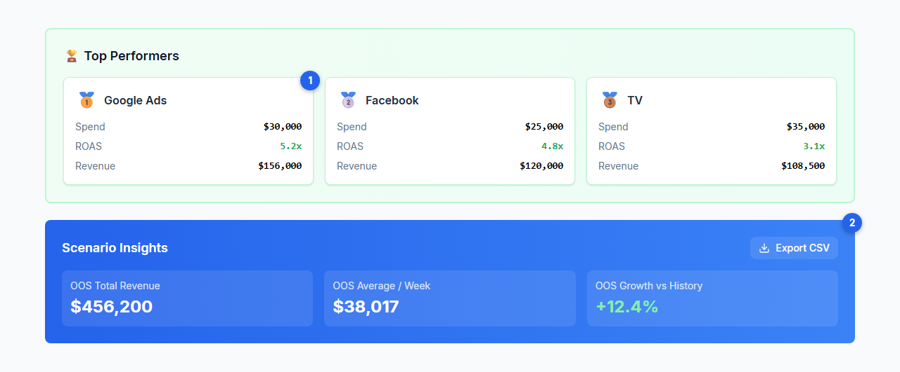
*Top 3 channels by ROAS with medal ranking, plus the Scenario Insights panel with OOS metrics.*

**① Top Performers** --- The three highest-ROAS channels with medal emojis (🥇🥈🥉), showing spend, ROAS, and revenue for each.

**② Scenario Insights** --- Blue gradient panel with OOS Total Revenue, OOS Average per Week, and OOS Growth vs History. Includes an Export CSV button.

### Channel Performance Table

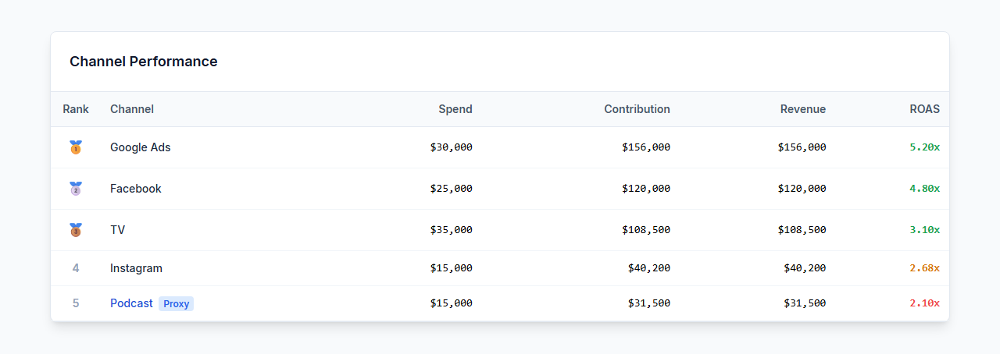
*Detailed per-channel metrics: rank, spend, contribution, revenue, and ROAS. Proxy channels are marked with a blue badge.*

The table shows all channels ranked by performance, with:
- Medal emojis (🥇🥈🥉) for the top 3 channels
- Proxy channels highlighted with a blue "Proxy" badge
- ROAS color-coded: green for above average, amber for moderate, red for below average

### Additional Analysis

| Component | Description |
|---|---|
| **Control Contributions Card** | Shows the impact of Step 5 adjustments (pricing, distribution, promotional changes) on predicted revenue |
| **Opportunities Card** | Identifies under-invested channels with strong ROAS and recommends budget reallocation |
| **Weekly Breakdown** | Best and worst performing periods, average weekly performance, and volatility (coefficient of variation) |
| **Export CSV** | Download the full prediction data (dates, actuals, predictions, confidence bounds, per-channel contributions) as a CSV file |

---

## Portfolio Scenario Planning

For portfolio models, scenario planning extends across multiple brands:

- Queue predictions for all brands in a portfolio simultaneously
- Each brand prediction uses its own fitted model
- The Monthly Planner supports portfolio mode with brand-level tabs in Step 3
- Revenue multipliers can be set per-brand in Step 6
- Results are aggregated at the portfolio level

See [Portfolio Analysis](./portfolio-analysis.md) for the full portfolio workflow.

---

## Using Scenarios for Budget Decisions

Scenarios are most useful when paired with a decision framework:

- **Marginal analysis**: Compare scenarios that differ by a single change (one channel budget increase) to isolate the expected [incremental](../core-concepts/incrementality.md) impact of that change
- **Risk assessment**: Use the width of uncertainty bands to gauge confidence. Narrow bands suggest reliable forecasts; wide bands suggest more risk
- **Control variable testing**: Use Step 5 adjustments to model how changes in pricing, distribution, or promotions interact with your media plan
- **Threshold testing**: Set a revenue target and test which budget configurations achieve it within the confidence bands
- **Strategy comparison**: Run the same budget through different allocation strategies (Equal vs. Launch Burst vs. Pulsed) to see how within-month timing affects outcomes

After identifying your preferred budget plan, proceed to [Budget Optimization](./budget-optimization.md) to generate algorithmically optimized per-channel allocation recommendations.

---

## Next Steps

**Platform guides:**

- [Budget Optimization](./budget-optimization.md) --- Algorithmic budget allocation
- [Incremental Measurement](./measurement.md) --- The model results that power scenario forecasts
- [Model Configuration](./model-configuration.md) --- Adjust the underlying model
- [Portfolio Analysis](./portfolio-analysis.md) --- Cross-brand scenario planning

**Core concepts:**

- [Bayesian Modeling](../core-concepts/bayesian-modeling.md) --- How the posterior distribution drives uncertainty bands
- [Saturation Curves](../core-concepts/saturation-curves.md) --- Diminishing returns in media response
- [Adstock Effects](../core-concepts/adstock-effects.md) --- Carryover effects from media spend
- [Priors and Distributions](../core-concepts/priors-and-distributions.md) --- How prior knowledge shapes predictions
- [Seasonality](../core-concepts/seasonality.md) --- Fourier terms and trend modeling
- [Halo Effects](../core-concepts/halo-effects.md) --- Cross-brand marketing effects
- [Incrementality](../core-concepts/incrementality.md) --- Measuring true incremental impact
