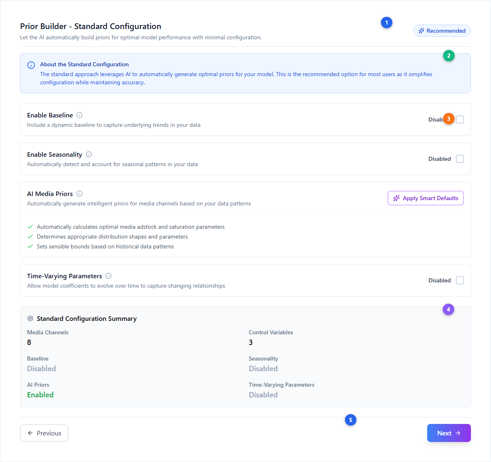
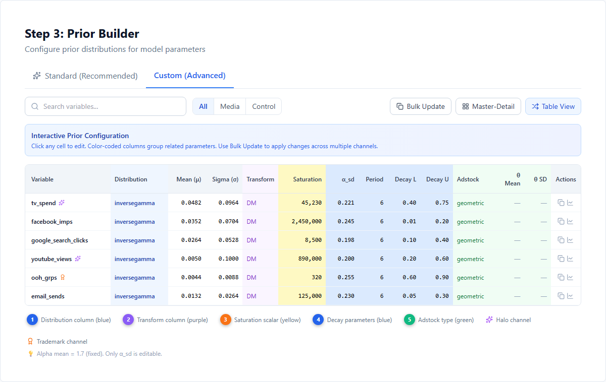
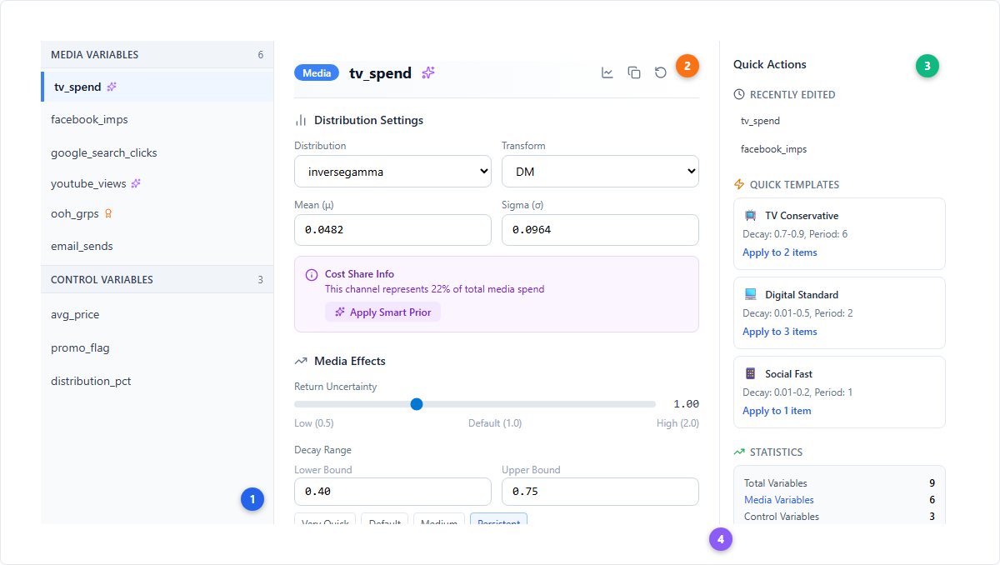
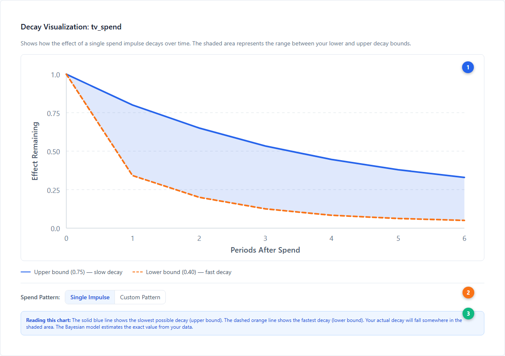
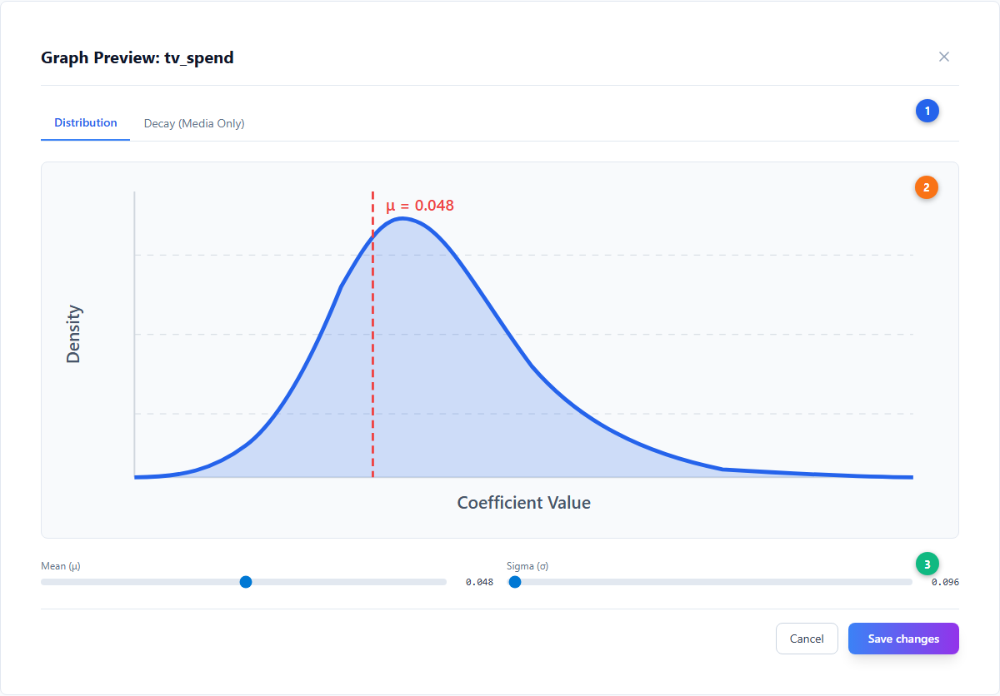
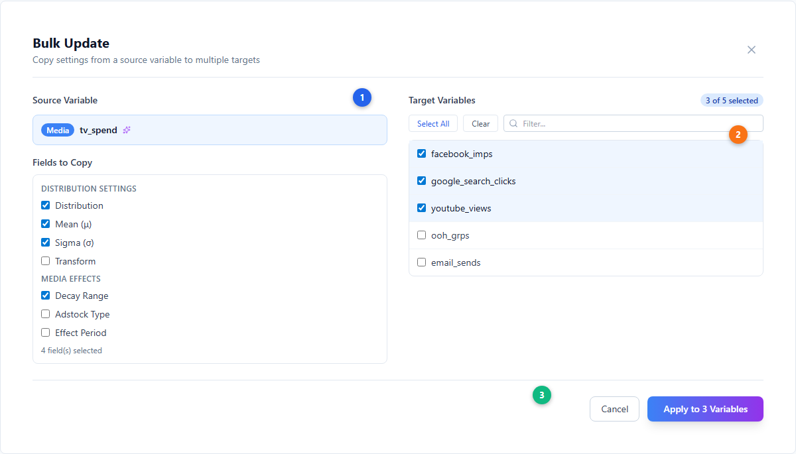

# Smart Defaults --- Auto-Generated Model Starting Points

Smart Defaults are Simba's automatically generated [prior](../core-concepts/priors-and-distributions.md) configurations for each channel in your model. They provide a data-informed starting point so you can run a [Bayesian](../core-concepts/bayesian-modeling.md) model without manually setting every parameter, while still producing reasonable results.

---

## What Smart Defaults Are

When you enter the [Model Creation Wizard](./model-creation-wizard.md) and reach Step 4 (Prior Builder), Simba can auto-generate a complete set of priors for every media and control variable: distribution type, coefficient mean and sigma, decay ranges, effect period, saturation scalar, and the saturation shape uncertainty (alpha_sd). These are the smart defaults.

They are not arbitrary starting values. Each default is computed from a combination of:

- **Your historical data**: Spend levels, cost shares, channel activation patterns, and average activity values specific to your dataset.
- **Industry benchmarks**: Research-based estimates of total media effect for your industry vertical (e.g., FMCG channels typically drive around 6% of total KPI, while E-Commerce channels can drive over 20%).
- **Semantic channel detection**: Automatic recognition of channel types from variable names to set appropriate [adstock](../core-concepts/adstock-effects.md) decay ranges.

Smart defaults aim to be close enough to the true values that the Bayesian model converges quickly and produces reliable results, while remaining broad enough that the data can pull the posterior away from the prior if the evidence is strong.

---

## How They Are Generated

The smart default computation runs when you click the smart defaults button in the Prior Builder on the [model configuration](./model-configuration.md) screen. The process involves several steps:

### 1. Cost Share Analysis

The system calculates each channel's share of total media spend. For example, if TV accounts for 40% of total spend and paid search for 15%, those cost shares drive how the total expected media effect is allocated across channels. Channels with higher spend shares receive proportionally larger prior coefficients.

### 2. Industry Benchmark Allocation

You select your industry from the benchmark selector (FMCG, Retail, TelCo, Financial Services, E-Commerce, or Other). Each industry has a calibrated estimate of total media effect --- the percentage of the dependent variable that all media channels collectively drive. This total effect is then distributed to individual channels proportional to their cost share. The sigma for each benchmark is set to **twice the mu value**, providing an informative but not overly restrictive prior.

| Industry | Expected Total Media Effect | Sigma |
|---|---|---|
| FMCG | ~6% | ~12% |
| Retail | ~9% | ~18% |
| TelCo | ~30% | ~60% |
| Financial Services | ~19% | ~38% |
| E-Commerce | ~22% | ~44% |
| Other | ~12% | ~24% |

### 3. Saturation Uncertainty Calculation

For each channel, the system computes **alpha_sd** --- the standard deviation of the [saturation](../core-concepts/saturation-curves.md) shape parameter's prior. This is distinct from the saturation shape itself (alpha), which has a fixed Gamma prior with **mu = 1.7** across all channels. What varies per channel is the **uncertainty** (alpha_sd) around that shape.

The calculation uses three inputs:

- **Spend deviation**: How the channel's cost share compares to the average across all channels, dampened by a factor of 0.5. Higher-share channels get slightly different saturation assumptions.
- **Spend variability**: The standard deviation of spend relative to total spend, also dampened by 0.5.
- **Activation frequency**: The proportion of time periods where the channel had non-zero spend. Channels that are "always on" get tighter saturation priors; intermittently active channels get a soft penalty that widens the uncertainty.

The formula:

1. `scale = 1.7 - (costShare - avgWeight) * 0.5 - stdDevAdjustment * 0.5` (floored at 0.3)
2. `alpha_sd = scale * 0.15 * activationMultiplier` (capped at `scale * 0.25`)
3. The activation multiplier is `1.0 + 0.1 * (1 - activationRate)^2` --- a very soft penalty

The coefficient is then adjusted for the saturation curve by dividing by the tanh value at the channel's average spend level: `coeffMu = impactValue / tanh(avg / (max * scale))`, with a safety floor of 0.01 to avoid division by near-zero.

### 4. Semantic Channel Detection

Simba parses variable names to detect channel types using a comprehensive ontology covering **15 channel categories**. Each channel type has calibrated decay bounds reflecting its typical [carryover](../core-concepts/adstock-effects.md) characteristics:

| Channel | Decay Lower | Decay Upper | Typical Carryover |
|---|---|---|---|
| Social | 0.01 | 0.20 | Very fast --- same-day effects |
| Mobile | 0.01 | 0.25 | Very fast |
| Email | 0.05 | 0.30 | Fast |
| Affiliate | 0.10 | 0.40 | Fast-medium |
| Search | 0.10 | 0.40 | Medium |
| Digital / Display | 0.10 | 0.50 | Medium |
| Video / Streaming | 0.20 | 0.60 | Medium |
| Influencer | 0.20 | 0.50 | Medium |
| Cinema | 0.30 | 0.60 | Medium |
| Direct Mail | 0.30 | 0.60 | Medium |
| TV | 0.40 | 0.75 | Medium-slow |
| Radio / Audio | 0.40 | 0.70 | Medium-slow |
| Print | 0.50 | 0.80 | Slow --- long-lasting |
| OOH / Outdoor | 0.60 | 0.90 | Slow --- brand building |
| Sponsorship | 0.50 | 0.80 | Slow --- brand building |

> **Note on effect period**: Regardless of channel type, the effect period is set uniformly --- **6 periods for weekly data** and **45 periods for daily data** (both approximately 6 weeks of carryover). The channel-specific decay bounds above control how fast the effect diminishes within that window.

Variable names are matched against keyword lists for each channel type. For example, a variable named `facebook_spend` matches the "Social" category via the keyword `facebook`. The system recognizes over 80 keywords across all categories.

### 5. Saturation Scalar Auto-Fill

Each channel's saturation scalar is set to the **average value** of that channel's data across all time periods, rounded to the nearest integer. This anchors the [saturation curve](../core-concepts/saturation-curves.md) at a realistic operating point. The scalar is only set when the average is positive (> 0).

### 6. Control Variable Detection

For control variables, Simba uses semantic matching to detect common types and apply appropriate priors:

- **Price variables**: Detected by keywords like "price", "pricing", or "discount". Assigned a **TruncatedNormal** distribution constrained to negative values (mean = -1, sigma = 1, bounds [-4, -0.25]) because price increases typically reduce sales.
- **Promotion variables**: Detected by keywords like "promo", "campaign", or "voucher". Assigned an **InverseGamma** distribution with positive mean (0.5) because promotions typically increase sales.
- **Distribution variables**: Detected by keywords like "distribution", "availability", or "coverage". Assigned an **InverseGamma** distribution with positive mean (0.8).

### 7. Special Channel Handling

- **[Halo](../core-concepts/halo-effects.md) channels**: Channels flagged as halo (brand awareness / cross-brand effects) receive a **fixed coefficient of 0.005** with **sigma = 0.1** (higher uncertainty) and **alpha_sd = 0.2**. These small, uncertain priors reflect that halo effects are real but difficult to measure precisely.
- **Trademark channels**: Channels flagged as trademark or portfolio-level campaigns receive **25% of the calculated coefficient and sigma**, reflecting that their effect is shared across brands rather than attributable to a single brand.

### 8. Distribution Selection

All media channels use the **InverseGamma** distribution by default, which naturally constrains coefficients to positive values (media should have a positive effect on the KPI). The four distributions available in the Prior Builder are:

| Distribution | Use Case |
|---|---|
| **InverseGamma** | Default for all media channels --- positive-only values |
| **Normal** | Default for control variables --- allows positive or negative effects |
| **TruncatedNormal** | For price variables --- constrained to a specific range |
| **TVP** | Time-varying parameters --- coefficients that change over time |

---

## The Prior Builder UI

The Prior Builder (Step 4 of the wizard) provides two modes for working with smart defaults:

### Standard Build (Recommended)

The Standard tab shows a summary of the auto-generated configuration without exposing individual parameters. This is the recommended starting point for most users.

| # | Element | Description |
|---|---------|-------------|
| 1 | **Recommended badge** | Blue badge with Sparkles icon --- indicates this is the suggested approach for most users |
| 2 | **About Standard Configuration** | InfoBox explaining that the standard approach uses AI to generate optimal priors |
| 3 | **Configuration toggle items** | Four items: Enable Baseline, Enable Seasonality, AI Media Priors, and Time-Varying Parameters. Each has a checkbox toggle (Enabled/Disabled) except AI Media Priors which has an "Apply Smart Defaults" button (purple outline with Sparkles icon) |
| 4 | **Configuration Summary** | Bottom panel (Settings icon) showing: Media Channels count, Control Variables count, and enabled/disabled status for each of the four configuration items |
| 5 | **Navigation buttons** | Previous (back to Variable Selection) and Next (proceed to Model Details) |

### Custom Build --- AG Grid

The Custom tab exposes every parameter in an interactive AG Grid table. Smart defaults populate all cells, and you can override any value by clicking on it. Columns are color-coded by parameter group.

| # | Element | Description |
|---|---------|-------------|
| 1 | **Distribution column** (blue `#eff6ff`) | Dropdown: normal, inversegamma, truncatednormal, tvp |
| 2 | **Transform column** (purple `#faf5ff`) | Data transformation: N (None), DM (Divide by Mean), STA (Standardize), DDM |
| 3 | **Saturation column** (yellow `#fef9c3`) | Auto-populated from average channel activity --- anchors the [saturation curve](../core-concepts/saturation-curves.md) |
| 4 | **Decay parameters** (blue `#dbeafe`) | alpha_sd, period, decay lower/upper bounds --- all from semantic channel detection |
| 5 | **Adstock columns** (green `#f0fdf4`) | Adstock type (geometric or delayed) and theta parameters (delayed only) |

The Sparkles icon (purple) marks [halo channels](../core-concepts/halo-effects.md) and the Award icon (orange) marks trademark channels. The note below the table reminds that **alpha mean = 1.7 (fixed) --- only alpha_sd is editable**.

### Master-Detail View

For detailed per-variable configuration, switch to Master-Detail view. This three-panel layout lets you edit every parameter with sliders, presets, and contextual help.

| # | Element | Description |
|---|---------|-------------|
| 1 | **Variables list** | Left panel (280px) --- groups variables by type (Media/Control) with sticky headers. Selected variable highlighted with blue left border |
| 2 | **Variable detail panel** | Center panel --- distribution settings, media effects (return uncertainty slider, decay range with presets), and saturation point with auto-fill button |
| 3 | **Quick Actions sidebar** | Right panel (288px) --- Recently Edited list, Quick Templates (TV Conservative, TV Aggressive, Digital Standard, Social Fast, OOH Persistent), and Statistics summary |
| 4 | **Cost Share Info** | Purple InfoBox showing the channel's share of total spend with an "Apply Smart Prior" button to recalculate |

### Decay Chart Visualization

The decay chart shows how the effect of a single spend impulse decays over time, bounded by your lower and upper decay parameters.

| # | Element | Description |
|---|---------|-------------|
| 1 | **Decay curve area** | Shaded region between upper bound (solid blue line --- slow decay) and lower bound (dashed orange line --- fast decay). The actual decay will fall within this range |
| 2 | **Spend pattern selector** | Toggle between "Single Impulse" (one-time spend) and "Custom Pattern" (user-defined spend sequence) |
| 3 | **Reading guide** | Explains how to interpret the chart --- the [Bayesian model](../core-concepts/bayesian-modeling.md) estimates the exact decay value from your data |

### Distribution Preview

Click the chart icon on any variable row to open the Graph Preview modal, which shows the shape of the [prior distribution](../core-concepts/priors-and-distributions.md).

| # | Element | Description |
|---|---------|-------------|
| 1 | **Distribution / Decay tabs** | Distribution tab shows the prior shape; Decay tab (media only) shows the adstock curve |
| 2 | **Distribution chart** | Interactive visualization of the prior distribution with mean line (red dashed). For InverseGamma, shows the right-skewed positive-only shape |
| 3 | **Parameter sliders** | Adjust mean and sigma interactively --- the chart updates in real time. Save changes to apply |

### Bulk Update

To apply the same settings across multiple channels, use the Bulk Update dialog.

| # | Element | Description |
|---|---------|-------------|
| 1 | **Source variable** | The variable whose settings you want to copy, with field selector checkboxes (Distribution Settings, Media Effects, Metrics/Saturation) |
| 2 | **Target variables** | Multi-select list with search filter, Select All / Clear buttons. Selected targets highlighted in blue |
| 3 | **Apply button** | Applies the selected fields from source to all checked targets |

---

## When to Use Defaults vs Custom Configuration

**Use defaults when:**

- You are running your first model and do not yet have strong priors from experiments or domain expertise.
- Your data has good coverage with meaningful spend variation across channels.
- You want to establish a baseline model quickly before iterating on configuration.
- The channel mix is standard (common digital and traditional channels) and likely to match the semantic channel detection well.

**Switch to custom configuration when:**

- You have lift test results or experimental evidence that should inform specific channels. Add lift test results in the Model Details step (Step 5) --- they are integrated as likelihood observations, not as prior adjustments. See [Incrementality](../core-concepts/incrementality.md) for more on lift tests.
- A channel is new or unusual and does not match standard benchmarks (for example, a podcast sponsorship, influencer partnership, or niche platform).
- The model's posterior distributions are very close to the priors, suggesting the data is not strong enough to update the defaults. In this case, the defaults are effectively becoming your answer, so they need to be set with care.
- You are modeling a market or category with dynamics that differ significantly from typical benchmarks (for example, luxury goods with very long purchase cycles, or fast-moving consumer goods with extremely short cycles).

---

## Fine-Tuning with Domain Expertise

Smart defaults and domain expertise are complementary. The recommended approach is:

1. **Start with defaults.** Run the model and review the results.
2. **Identify channels where results conflict with your knowledge.** If the model attributes very high lift to a channel you believe is ineffective (or vice versa), check whether the prior is too loose or too tight for that channel.
3. **Adjust selectively.** Override only the channels where you have strong reason to believe the default is wrong. Leave the rest at their default values.
4. **Re-run and compare.** After adjusting, re-run the model and compare the new results to the baseline. If the adjusted model produces better fit diagnostics and more plausible attribution, keep the changes. If not, revert.

Avoid the temptation to override every channel simultaneously. Each change interacts with the others, and making many changes at once makes it difficult to understand what improved (or worsened) the results.

---

## Auto-Generate Workflow

The end-to-end workflow for using smart defaults:

1. **Upload data** and optionally run the [Data Validator](./data-auditor.md) to check quality.
2. **Enter the model configuration screen.** Open the Prior Builder (Step 4).
3. **Select your industry** from the benchmark selector to set the expected total media effect.
4. **Click the smart defaults button.** Priors are computed and populated in the configuration grid.
5. **Review the defaults.** Check that the distribution types, means, decay ranges, and saturation scalars look reasonable given what you know about your channels.
6. **Build the model.** The model uses the defaults as priors and updates them with your data to produce posterior estimates.
7. **Evaluate results.** Review [Measurement](./measurement.md) outputs. If results are plausible and model fit is good, proceed to [Scenario Planning](./scenario-planning.md) and [Budget Optimization](./budget-optimization.md).
8. **Iterate if needed.** If results are implausible or fit is poor, return to configuration, adjust specific channels, and re-run.

Smart defaults are designed to make step 5 fast and step 8 rare. For most datasets with adequate coverage, the defaults produce a credible first model without manual intervention.

---

## Next Steps

**Platform guides:**
- [Model Creation Wizard](./model-creation-wizard.md) --- Step-by-step model setup
- [Measurement](./measurement.md) --- Interpreting model results
- [Budget Optimization](./budget-optimization.md) --- Risk-adjusted spend allocation
- [Scenario Planning](./scenario-planning.md) --- Forecasting and what-if analysis

**Core concepts:**
- [Priors & Distributions](../core-concepts/priors-and-distributions.md) --- Understanding Bayesian priors
- [Saturation Curves](../core-concepts/saturation-curves.md) --- Diminishing returns and the tanh function
- [Adstock Effects](../core-concepts/adstock-effects.md) --- Carryover, decay, and lag effects
- [Bayesian Modeling](../core-concepts/bayesian-modeling.md) --- The Bayesian approach explained
- [Halo Effects](../core-concepts/halo-effects.md) --- Cross-brand and brand awareness effects
