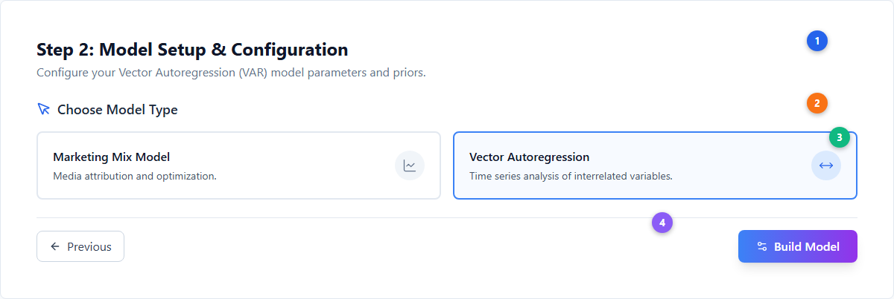
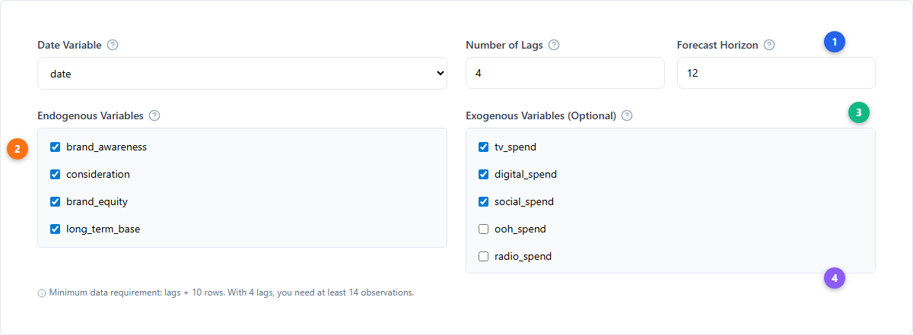
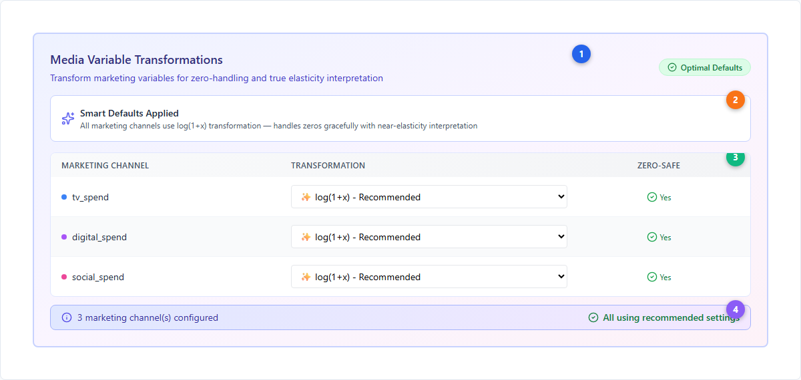
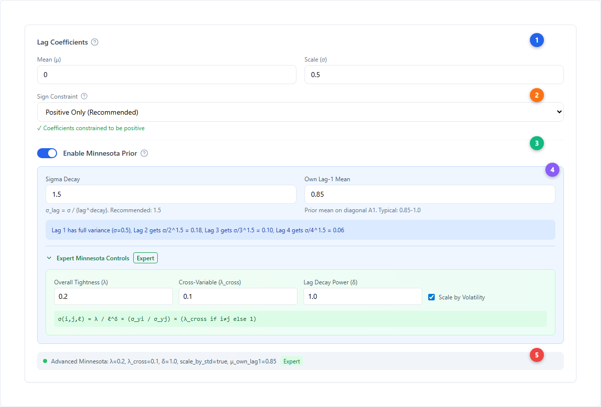
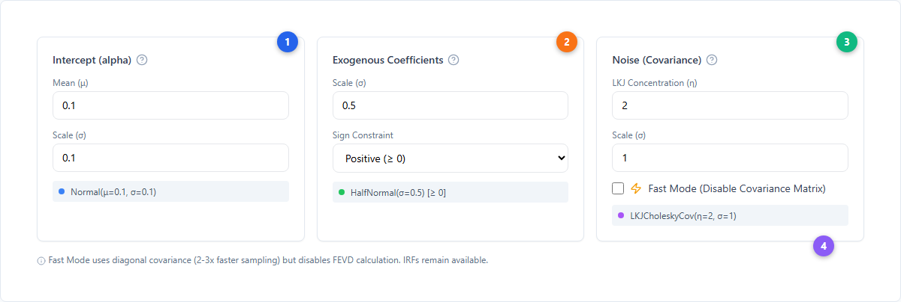
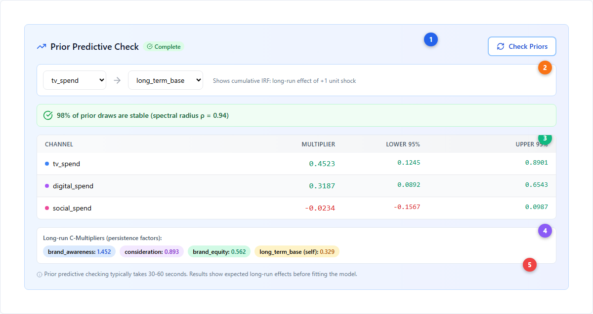
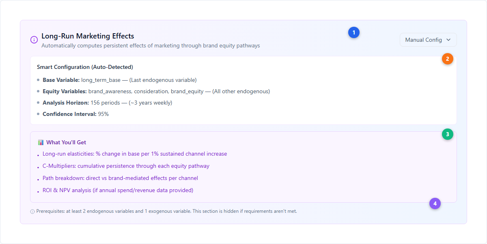
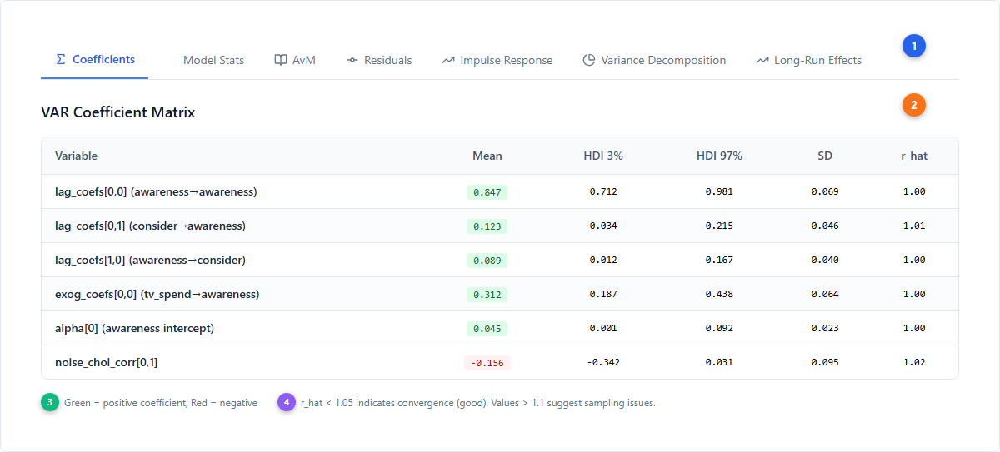

# VAR Models — Building and Interpreting Vector Autoregression

This guide walks you through creating, fitting, and interpreting [Bayesian VAR](../core-concepts/var-modeling.md) models in Simba. VAR models capture how multiple time series variables influence each other over time, enabling you to trace how marketing spend flows through brand metrics (awareness, consideration, equity) to ultimately drive revenue.

For the detailed analysis of IRF, FEVD, and long-run effects results, see the [Long-Term Effects](./long-term-effects.md) guide.

> **Availability**: VAR models are available on Trial, Pro, and Scale plans. The Analyst plan does not include VAR.

---

## Building a VAR Model

### Selecting VAR Model Type

VAR models are configured in **Step 2: Model Setup** of the [wizard](./model-creation-wizard.md). Unlike MMM models which proceed through all five wizard steps, VAR models build directly from Step 2 — skipping Variable Selection and Prior Builder.

| # | Element | Description |
|---|---------|-------------|
| 1 | **Step header** | "Step 2: Model Setup & Configuration" with VAR-specific subtitle |
| 2 | **Choose Model Type** | Two cards: Marketing Mix Model (LineChart icon) and Vector Autoregression (MoveHorizontal icon) |
| 3 | **VAR card (active)** | Selected state shows blue border and light blue background (`border-primary bg-primary/10`) |
| 4 | **Build Model button** | VAR shows "Build Model" (Settings2 icon) instead of "Next" — builds directly from this step |

### Assigning Variables

VAR requires you to assign variables into two groups and configure time parameters.

| # | Element | Description |
|---|---------|-------------|
| 1 | **Date Variable & Time Parameters** | Select date column, set Number of Lags (how many past periods to include) and Forecast Horizon (how far ahead to predict) |
| 2 | **Endogenous Variables** | The core system variables that influence each other (e.g., brand_awareness, consideration, equity, long_term_base). These are what the VAR models jointly. |
| 3 | **Exogenous Variables (Optional)** | External drivers that affect the system but aren't affected by it (e.g., media spend channels). These act as control inputs. |
| 4 | **Data requirement** | Minimum observations = lags + 10. With 4 lags, you need at least 14 rows. |

**Endogenous vs Exogenous — when to use which:**

| Variable Type | Use For | Example |
|---|---|---|
| **Endogenous** | Brand metrics that form a feedback system | brand_awareness, consideration, brand_equity, long_term_base |
| **Exogenous** | Marketing inputs you want to measure the effect of | tv_spend, digital_spend, social_spend |

The long-run effects analysis requires **at least 2 endogenous** and **1 exogenous** variable.

### Media Transformations

When exogenous (media) variables are assigned, the Media Variable Transformations card appears with smart defaults.

| # | Element | Description |
|---|---------|-------------|
| 1 | **Transformation card header** | Indigo gradient card. "Optimal Defaults" badge appears when all channels use the recommended setting. |
| 2 | **Smart Defaults Applied** | All channels default to log(1+x) transformation — handles zeros gracefully with near-elasticity interpretation |
| 3 | **Transformation table** | Per-channel dropdown with zero-safety indicator. Select from 6 options per channel. |
| 4 | **Configuration summary** | Shows count of configured channels and whether all use recommended settings |

#### Available transformations

| Transform | Formula | Handles Zeros | Description |
|---|---|---|---|
| **log(1+x)** | `log(1+x)` | Yes | **Recommended.** Near-elasticity interpretation, graceful zero handling |
| **asinh(x)** | `sinh⁻¹(x)` | Yes | Alternative to log, handles zeros and negatives |
| **log(x)** | `log(x)` | No | True elasticity, but fails on zeros |
| **Raw Levels** | `x` | Yes | No transformation, absolute units |
| **Z-Score** | `(x-μ)/σ` | Yes | Standardized, per-SD interpretation |
| **Per 1000** | `x/1000` | Yes | Divide by 1000, common for large numbers |

---

## Configuring [Priors](../core-concepts/priors-and-distributions.md)

VAR models use four prior configuration cards that control the [Bayesian](../core-concepts/bayesian-modeling.md) structure of the model.

### Lag Coefficients & Minnesota Prior

The lag coefficient prior controls how previous time periods influence current values. The **Minnesota prior** is the recommended approach — it shrinks higher lags toward zero while keeping own-lag-1 close to 1.0 (persistence).

| # | Element | Description |
|---|---------|-------------|
| 1 | **Lag Coefficients header** | Mean (μ) and Scale (σ) inputs for the base prior distribution |
| 2 | **Sign Constraint** | Dropdown: "Positive Only (Recommended)", "No Constraint", or "Negative Only". Positive ensures coefficients are non-negative. |
| 3 | **Minnesota Prior toggle** | Switch to enable Minnesota shrinkage. Recommended for most use cases. |
| 4 | **Minnesota parameters** | Sigma Decay (how fast higher lags shrink) and Own Lag-1 Mean (persistence strength). Advanced mode reveals λ, λ_cross, δ, and volatility scaling. |
| 5 | **Status badge** | Shows the active prior formula with all parameter values |

#### Minnesota prior parameters

| Parameter | Default | Description |
|---|---|---|
| **Overall Tightness (λ)** | 0.2 | How tightly lag coefficients cluster around zero. Lower = more shrinkage. |
| **Cross-Variable Penalty (λ_cross)** | 0.1 | Extra shrinkage for cross-variable effects (j ≠ i). 50% tighter than own-lag. |
| **Lag Decay Power (δ)** | 1.0 | How quickly sigma decays with lag distance. σ(i,j,ℓ) = λ / ℓ^δ |
| **Own Lag-1 Mean (μ₁)** | 0.9 | Prior mean on diagonal A₁. Higher values imply more persistence. Typical: 0.85-1.0 |
| **Scale by Volatility** | Yes | Normalize coefficients by variable standard deviations to prevent scale-dependent priors |

The full Minnesota formula: `σ(i,j,ℓ) = λ / ℓ^δ × (σ_yi / σ_yj) × (λ_cross if i≠j else 1)`

### Intercept, Exogenous & Noise Priors

Three additional prior cards configure the remaining model components.

| # | Element | Description |
|---|---------|-------------|
| 1 | **Intercept (alpha)** | Baseline value when all predictors are zero. Normal(μ=0.1, σ=0.1) by default. Optional truncation bounds. |
| 2 | **Exogenous Coefficients** | Effects of media spend on the system. Sign constraint "Positive (≥ 0)" recommended — marketing should have non-negative effects. Uses HalfNormal(σ). |
| 3 | **Noise (Covariance)** | LKJ Cholesky covariance structure (η=2, σ=1). Controls how variables co-vary in the error term. **Fast Mode** checkbox disables the full covariance matrix. |
| 4 | **Fast Mode note** | When enabled: diagonal covariance (2-3x faster sampling), but FEVD calculation is skipped. IRFs remain available. |

---

## Prior Predictive Checking

Before fitting the full model, you can validate your priors by running a **prior predictive check**. This samples from the prior distribution to show expected long-run effects without seeing the data.

| # | Element | Description |
|---|---------|-------------|
| 1 | **Check Priors button** | Runs prior predictive sampling (typically 30-60 seconds). "Complete" badge shows when finished. |
| 2 | **IRF direction config** | Select shock variable (media channel) and response variable (base metric) to analyze. Shows cumulative IRF direction. |
| 3 | **Results table** | Per-channel multipliers with credible intervals. Green = positive effect, Red = negative. |
| 4 | **C-Multipliers summary** | Persistence factors for each equity variable — how much a sustained shock accumulates over time |
| 5 | **Stability diagnostics** | Spectral radius check: what percentage of prior draws produce a stable VAR system (ρ < 1.0) |

#### Interpreting stability results

| Stability | Assessment | Action |
|---|---|---|
| **≥ 95% stable** | Good | Priors are well-configured |
| **80-95% stable** | Marginal | Consider reducing σ slightly |
| **50-80% stable** | Problematic | Reduce σ to 0.2-0.3 or enable Minnesota Prior |
| **< 50% stable** | Unstable | σ is too wide. Set σ ≤ 0.3 and enable Minnesota Prior |

---

## Long-Run Effects Configuration

When you have ≥ 2 endogenous variables and ≥ 1 exogenous variable, the Long-Run Marketing Effects configuration card appears.

| # | Element | Description |
|---|---------|-------------|
| 1 | **Configuration header** | Purple gradient card with "Manual Config" toggle for overriding auto-detected settings |
| 2 | **Smart Configuration** | Auto-detected defaults: Base Variable (last endogenous), Equity Variables (all others), Horizon (156 periods ≈ 3 years weekly), CI (95%) |
| 3 | **What You'll Get** | Summary of outputs: long-run elasticities, C-Multipliers, path breakdown, and optional ROI/NPV analysis |
| 4 | **Prerequisites note** | Component is hidden if requirements aren't met (< 2 endogenous or 0 exogenous) |

For detailed interpretation of long-run effects results, see [Long-Term Effects — Long-Run Effects Results](./long-term-effects.md).

---

## Interpreting VAR Results

After fitting, the Active Model page shows 7 tabs for VAR models.

| # | Element | Description |
|---|---------|-------------|
| 1 | **7 result tabs** | Coefficients (Sigma), Model Stats (SquareGantt), AvM (BookOpen), Residuals (GitCommitHorizontal), Impulse Response (TrendingUp), Variance Decomposition (PieChart), Long-Run Effects (TrendingUp) |
| 2 | **Coefficient matrix** | Table showing all VAR coefficients: lag_coefs (variable interactions), exog_coefs (media effects), alpha (intercepts), noise_chol (covariance structure) |
| 3 | **Color coding** | Green background = positive coefficient, Red background = negative coefficient |
| 4 | **Convergence indicator** | r_hat < 1.05 indicates good convergence. Values > 1.1 suggest sampling issues that may require more warmup iterations or simpler priors. |

### Coefficients Tab

The coefficient matrix shows how each variable influences every other variable at each lag. Key patterns to look for:

- **Own-lag coefficients** (e.g., awareness→awareness): Should be positive and < 1.0 for stability. Values near 0.9 indicate strong persistence.
- **Cross-lag coefficients** (e.g., awareness→consideration): Show spillover effects between variables. Positive values mean one variable drives another.
- **Exogenous coefficients** (e.g., tv_spend→awareness): Direct media effects on each brand metric. These feed into the long-run elasticity calculation.

### Model Stats & AvM

The **AvM (Actual vs Modeled)** tab shows how well the fitted model tracks the actual data for each endogenous variable. Key metrics:

| Metric | Good Value | What It Means |
|---|---|---|
| **R²** | > 0.7 | Proportion of variance explained by the model |
| **MAPE** | < 10% | Mean Absolute Percentage Error |
| **Durbin-Watson** | 1.5–2.5 | Tests for autocorrelation in residuals. Values near 2.0 indicate no autocorrelation. |

### Residuals

The Residuals tab provides 4 diagnostic metrics for each variable:

| Diagnostic | What to Check |
|---|---|
| **Mean** | Should be close to zero (~0). Non-zero mean suggests systematic bias. |
| **Standard Deviation** | Measures residual spread. Lower is better. |
| **Normality** | "Normal ✓" means residuals follow a normal distribution (Shapiro-Wilk test). |
| **Independence** | "Independent ✓" means no autocorrelation remains (residuals are white noise). |

If residuals show non-normality or dependence, consider adding more lags, adjusting priors, or reviewing your variable selection.

### Analysis Trio: IRF, FEVD, Long-Run Effects

The last three tabs — **Impulse Response**, **Variance Decomposition**, and **Long-Run Effects** — form the core analytical output of the VAR model. These are covered in detail in the **[Long-Term Effects](./long-term-effects.md)** guide, which includes:

- How to read IRF charts (green = positive, red = negative, cumulative mode)
- How to interpret FEVD (dominant driver ≥ 60%, major ≥ 30%, moderate ≥ 10%)
- Long-run elasticities, C-Multipliers, and Path Breakdown tabs
- Optional ROI & NPV analysis

> **Note**: FEVD is not available when Fast Mode is enabled (diagonal covariance skips the full covariance estimation required for variance decomposition).

---

## Panel Data (Multi-Brand VAR)

VAR supports hierarchy/brand columns for building separate models per brand or segment. When a hierarchy column is selected:

- A **Batch Name** is required (e.g., `UK_Q4_2024`)
- Models are named `{BatchName}_VAR_{BrandValue}_{hash}`
- Each unique value in the hierarchy column gets its own VAR model
- Maximum 50 unique values per batch

See [Model Creation Wizard](./model-creation-wizard.md) for the panel data configuration UI.

---

## Linking VAR to Standard MMM

VAR models can be linked to standard MMM models to incorporate long-term brand effects into [budget optimization](./budget-optimization.md). When linked, the optimizer considers both short-term [adstock](../core-concepts/adstock-effects.md) effects (from MMM) and long-term equity-mediated effects (from VAR).

Smart matching assigns confidence tiers: **100%** (same batch + brand), **80%** (same brand), **50%** (same batch), **0%** (different). See [Long-Term Effects — Linking VAR to MMM Models](./long-term-effects.md) for the full linking workflow and UI.

---

## Sampling Defaults

| Parameter | Default | Description |
|---|---|---|
| **Draws** | 2,000 | Posterior samples per chain |
| **Tune** | 1,000 | Warmup iterations (discarded) |
| **Target Accept** | 0.9 | NUTS sampler acceptance probability |
| **Chains** | 4 | Independent sampling chains |
| **Compilation** | NUMBA | JIT compilation for faster sampling |

---

## Next Steps

**Platform guides:**

- [Long-Term Effects](./long-term-effects.md) — IRF, FEVD, and long-run effects analysis (the detailed results guide)
- [Model Configuration](./model-configuration.md) — Deep reference for all configuration features
- [Measurement](./measurement.md) — Understanding model results and diagnostics
- [Budget Optimization](./budget-optimization.md) — How long-term effects inform spend allocation

**Core concepts:**

- [VAR Modeling](../core-concepts/var-modeling.md) — Statistical foundation: Minnesota priors, IRF, FEVD theory
- [Bayesian Modeling](../core-concepts/bayesian-modeling.md) — The Bayesian approach to inference
- [Adstock Effects](../core-concepts/adstock-effects.md) — Short-term carryover (MMM comparison)
- [Incrementality](../core-concepts/incrementality.md) — Causal attribution and lift testing
- [Saturation Curves](../core-concepts/saturation-curves.md) — Diminishing returns in MMM
