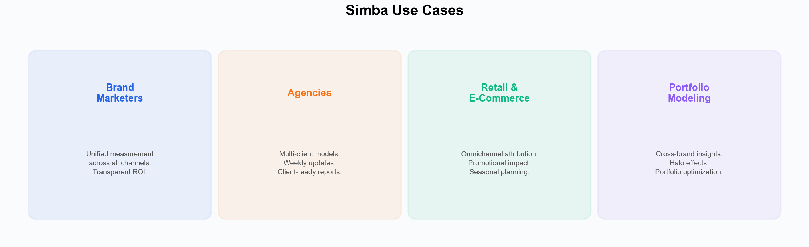

# Use Cases

Simba serves a range of marketing teams and organizations. Explore how different roles and industries use Bayesian marketing mix modeling to drive better decisions.

---

## By Role

### [Brand Marketers](./brand-marketers.md)
In-house marketing teams measuring and optimizing ROI across channels. Unified measurement, transparent results, and data-driven budget planning.

### [Agencies](./agencies.md)
Media and marketing agencies managing multiple clients with portfolio modeling. Includes the **Growth Dynamics case study** --- how an agency moved from quarterly reports to weekly strategic guidance for a high-end retail client.

---

## By Use Case

### [Portfolio Modeling](./portfolio-modeling.md)
Cross-brand and cross-client analysis for multi-brand organizations and agencies. Halo effects, trademark channels, and portfolio-level budget optimization.

### [Retail & E-Commerce](./retail-and-ecommerce.md)
Online, offline, and omnichannel retail measurement. Promotional impact separation, seasonal planning, and high-frequency optimization.

---

## Featured: Growth Dynamics Case Study

> *"SIMBA has been an excellent solution for our team, offering the flexibility to utilise sophisticated models without the burden of internal maintenance."*
>
> --- **Charlie de Thibault**, Head of Analytics at Growth Dynamics

Growth Dynamics used Simba to deliver weekly, transparent model updates to a high-end jeweler client --- replacing quarterly reporting with agile, omnichannel insights across digital and physical channels. [Read the full case study](./agencies.md#case-study-growth-dynamics-x-high-end-jeweler).

→ [View all case studies](../../sales/case-studies/) — including representative examples of CPG budget optimization and D2C attribution transformation.

---

*See also: [What is Simba?](../getting-started/what-is-simba.md) | [Pricing](../pricing/README.md)*
