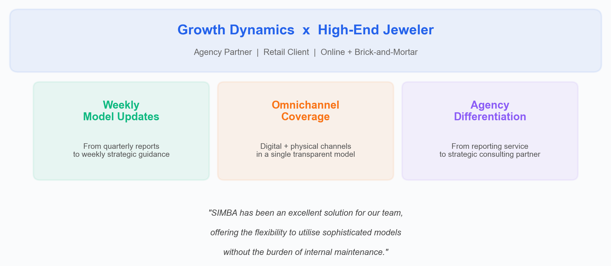

# Agencies --- Multi-Client Management and Portfolio Modeling

## The Challenge

Marketing and media agencies face unique complexities in marketing measurement:

- **Multiple clients** with different KPIs, channels, and data structures
- **Consistency pressure** --- clients expect comparable methodologies across their portfolios
- **Scale requirements** --- manually building models for each client doesn't scale
- **Transparency demands** --- clients increasingly want to understand the methodology, not just the results
- **Speed expectations** --- quarterly reporting cycles are too slow for clients that need to react to market trends week by week
- **Competitive differentiation** --- agencies need to offer something beyond basic reporting

---

## Case Study: Growth Dynamics x High-End Jeweler

**Growth Dynamics**, an agency partner, needed to elevate their service for a high-end jeweler --- a high-growth retailer with significant brick-and-mortar presence. The standard quarterly reporting cycle was not fast enough for a client that needed to react to market trends week by week.

### The Challenge

The client required agile insights across both digital and physical channels to make confident, data-driven budget decisions without waiting for lagging reports from traditional agency models.

### The Solution

Using Simba, Growth Dynamics brought advanced MMM capabilities in-house. They now deliver **weekly, transparent model updates** to their client, enabling agile budget shifts across digital and physical channels without waiting for quarterly reports.

Simba's automated Bayesian pipeline unified data ingestion, modeling, and predictive forecasting in a single interface. The built-in validation and diagnostics ensured every weekly update was robust, reliable, and explainable --- giving the client confidence to act on insights immediately.

### The Outcomes

- **12x faster reporting** --- Reduced the reporting cycle from quarterly to weekly, enabling the client to react to market trends in days rather than months.
- **Omnichannel visibility** --- For the first time, a single model captured both online revenue and brick-and-mortar sales across all marketing channels, replacing fragmented platform-specific reports.
- **Agency differentiation** --- Growth Dynamics elevated their positioning from analytics vendor to strategic advisor, powered by Simba's transparent, enterprise-grade MMM capabilities.

> *"SIMBA has been an excellent solution for our team, offering the flexibility to utilise sophisticated models without the burden of internal maintenance. Its ability to quickly ingest our data into a highly customisable framework has significantly reduced our technical overhead and saved valuable time. The built-in safeguards and robust support have made SIMBA a reliable, efficient tool, perfectly suited for analytics teams focused on actionable outcomes rather than infrastructure management. We consider SIMBA a strong, dependable partner in our analytics workflow."*
>
> --- **Charlie de Thibault**, Head of Analytics at Growth Dynamics

---

## How Simba Helps Agencies

### Manage Multiple Clients in One Platform

Simba supports agencies with multi-project environments where each client has isolated data storage. Cross-client optimizations and portfolio modeling let you compare and optimize across brands.

### Consistent Methodology, Client-Specific Results

Every client model uses the same rigorous [Bayesian framework](../core-concepts/bayesian-modeling.md), ensuring methodological consistency. But each model is independently configured with client-specific [priors](../core-concepts/priors-and-distributions.md), channels, and data --- so results reflect each client's unique marketing dynamics.

### Portfolio Modeling

For agencies managing multiple brands or multi-market clients, [portfolio models](./portfolio-modeling.md) provide cross-brand insights:

- Compare channel effectiveness across brands
- Identify portfolio-level optimization opportunities with [halo and trademark effects](../core-concepts/halo-effects.md)
- Deliver cross-brand reporting with consistent metrics

### Move from Quarterly to Weekly

With Simba's automated pipeline, agencies can deliver weekly model refreshes to clients --- as Growth Dynamics demonstrated. The [Data Validator](../data/data-validation.md) ensures each data refresh is clean, and the model fitting process takes minutes, not days.

### Fully Transparent Client Trust

When clients ask "how does this work?", you can show them. Every [prior is visible](../core-concepts/priors-and-distributions.md), every [saturation curve is interpretable](../core-concepts/saturation-curves.md), and every result comes with [94% HDI uncertainty intervals](../core-concepts/bayesian-modeling.md). This transparency differentiates your agency from competitors using black-box tools.

---

## Typical Agency Workflow

1. **Onboard client data** --- Upload each client's media and outcome data as a CSV per client project.
2. **Validate** --- Run the Data Validator to check for quality issues before modeling.
3. **Configure per-client models** --- Set channel-specific priors, adstock, and saturation parameters. Use smart defaults as a starting point.
4. **Run measurement** --- Fit the model and generate incremental attribution by channel.
5. **Build scenarios** --- Create budget scenarios for client strategy sessions using the Scenario Planner.
6. **Optimize** --- Run the Budget Optimizer to find the allocation that maximizes each client's return.
7. **Report** --- Use Simba's contribution charts, response curves, and waterfall visualizations for client presentations.
8. **Refresh weekly** --- Update the data and refit to keep insights current.

---

## Recommended Plans

- **Enterprise** --- Full platform with multi-project support, team collaboration, and dedicated support.
- **Managed** --- Full model development and strategy audits by PhD statisticians. Ideal for agencies that want expert backup.

> [View Plans](../pricing/README.md) | [Book a Call](https://calendly.com/niall-oulton)

---

*See also: [Brand Marketers](./brand-marketers.md) | [Portfolio Modeling](./portfolio-modeling.md) | [Retail & E-Commerce](./retail-and-ecommerce.md)*
