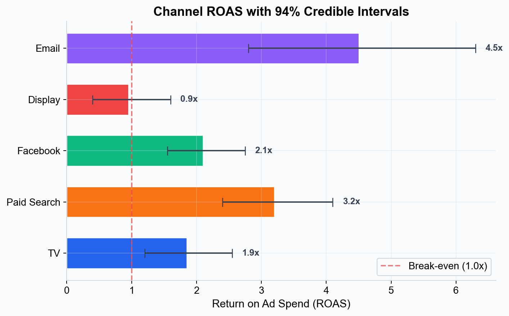

# Brand Marketers — In-House Marketing Teams

## The Challenge

In-house marketing teams face a constant pressure: prove that marketing spend is driving real business results, not just vanity metrics. Traditional approaches — last-click attribution, platform-reported ROAS, or periodic econometric studies — leave gaps in understanding and create blind spots.

Common pain points:
- **Attribution silos** — Each platform claims credit for the same conversion
- **Budget justification** — Difficulty proving incremental impact to leadership
- **Planning uncertainty** — No reliable way to forecast the impact of budget changes
- **Optimization paralysis** — Too many channels, not enough clarity on where the next dollar should go

*Simba provides ROAS estimates for every channel with 94% credible intervals — showing not just the best estimate, but the range of plausible values. This lets you make budget decisions with known uncertainty rather than false precision.*

## How Simba Helps

### Unified Measurement Across All Channels

Simba models all your marketing channels in a single Bayesian framework, providing consistent and comparable measurement across TV, digital, social, OOH, and every other channel in your media mix.

### Transparent, Defensible Results

Unlike black-box tools, Simba lets you inspect every model parameter, prior, and assumption. When your CFO asks "why should I trust these numbers?", you can show them the actual model — not just a dashboard.

### Data-Driven Budget Planning

Use scenario planning to test budget reallocation before committing spend. Compare aggressive, base case, and conservative forecasts with uncertainty bands so you understand both the opportunity and the risk.

### Continuous Optimization

Don't wait for quarterly reviews. Simba's budget optimizer provides ongoing recommendations for where to increase, decrease, or maintain spend — accounting for saturation, carryover, and diminishing returns.

## Typical Workflow

1. **Upload** your weekly media and sales data. See [Data Requirements](../data/data-requirements.md) for format details.
2. **Audit** — Simba's Data Validator validates your data quality
3. **Model** — Configure your Bayesian model (or use smart defaults)
4. **Measure** — See the true incremental impact of each channel
5. **Plan** — Run scenarios to test budget changes
6. **Optimize** — Get risk-adjusted recommendations for budget allocation
7. **Repeat** — Update your model as new data comes in

## Recommended Plans

- **Enterprise** — Full platform with dedicated support for marketing teams
- **Managed** — Expert-driven modeling for teams without in-house data science

→ [View Plans](../pricing/README.md) | [Get Started](../getting-started/quick-start-guide.md)

---

*See also: [Agencies](agencies.md) | [What is Simba?](../getting-started/what-is-simba.md)*
