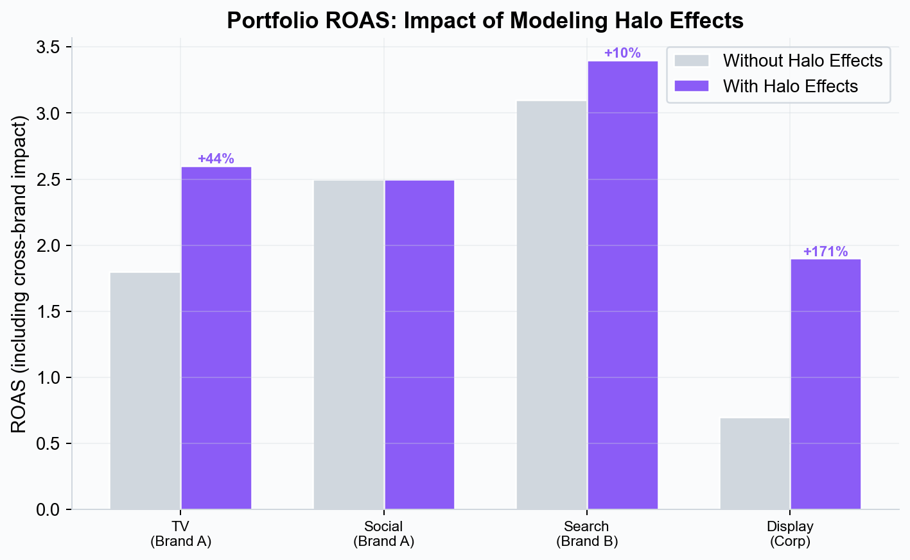

# Portfolio Modeling — Cross-Brand and Cross-Client Analysis

## What is Portfolio Modeling?

Portfolio modeling extends marketing mix modeling beyond a single brand or market. Instead of analyzing each brand in isolation, portfolio models let you compare, benchmark, and optimize across multiple brands, markets, or clients within a unified framework.

## Who Needs Portfolio Modeling?

- **Multi-brand organizations** — CPG companies, holding groups, and conglomerates managing multiple brands
- **Multi-market teams** — Global brands running campaigns across different geographies
- **Agencies** — Firms managing portfolios of clients that benefit from cross-client insights

*Modeling halo effects reveals the true portfolio-wide impact of each channel. Without halo modeling, cross-brand campaigns like corporate TV or masterbrand display appear under-performing — leading to budget cuts on some of the most effective channels.*

## Key Capabilities

### Cross-Brand Comparison

Compare marketing effectiveness across brands using consistent metrics:

- Which brand gets the highest return from TV spend?
- Where is social media most effective relative to other channels?
- Which brands have the most headroom for optimization?

### Portfolio-Level Optimization

Optimize budget allocation not just within a single brand, but across your entire portfolio:

- Identify which brands are over-investing and under-investing by channel
- Find portfolio-level efficiency gains that single-brand models miss
- Balance risk across brands and channels

### Consistent Benchmarking

Because all models use the same Bayesian methodology and Simba platform, comparisons are meaningful — you're comparing apples to apples, not outputs from different tools or consultancies.

## How It Works in Simba

1. **Build individual models** for each brand or market
2. **Link models** into a portfolio using Simba's portfolio modeling feature
3. **Run cross-brand analyses** to compare channel effectiveness
4. **Optimize at portfolio level** to allocate budget across brands and channels

Portfolio models are available on paid plans. See [Pricing](../pricing/README.md) or [getsimba.ai](https://getsimba.ai) for current plans.

## Use Cases

### Agency Portfolio Management

An agency managing 5 retail clients builds an individual MMM for each client using their respective data (each client needs their own CSV with media spend, KPI, and controls). Once all models are fitted, the agency links them into a single portfolio. This enables:

- **Cross-client benchmarking**: Compare ROAS for Facebook across all 5 clients to identify which verticals respond best to social spend
- **Portfolio-level optimization**: Allocate a shared media budget across clients to maximize total portfolio ROI, rather than optimizing each client in isolation
- **Consistent methodology**: All clients are modeled with the same Bayesian framework, making comparisons meaningful

### Global Brand Multi-Market Analysis

A global CPG brand running in 8 markets builds one model per market (e.g., US, UK, Germany, France, etc.). Each model uses local media spend and local revenue data. When linked into a portfolio:

- **Cross-market TV comparison**: Identify which markets have the steepest TV saturation curves (meaning TV is most efficient there)
- **Halo effect analysis**: Configure [halo channels](../core-concepts/halo-effects.md) where a global brand campaign (e.g., Super Bowl ad) spills over into non-US markets
- **Trademark channel optimization**: [Trademark channels](../core-concepts/halo-effects.md) (masterbrand campaigns) are optimized against total portfolio revenue, not attributed to any single market
- **Budget reallocation**: Shift budget from saturated markets to markets with more headroom, guided by the cross-brand optimizer

→ [Agencies Use Case](agencies.md) | [Pricing](../pricing/README.md)

---

*See also: [Budget Optimization](../platform-guide/budget-optimization.md) | [Pricing](../pricing/README.md)*
